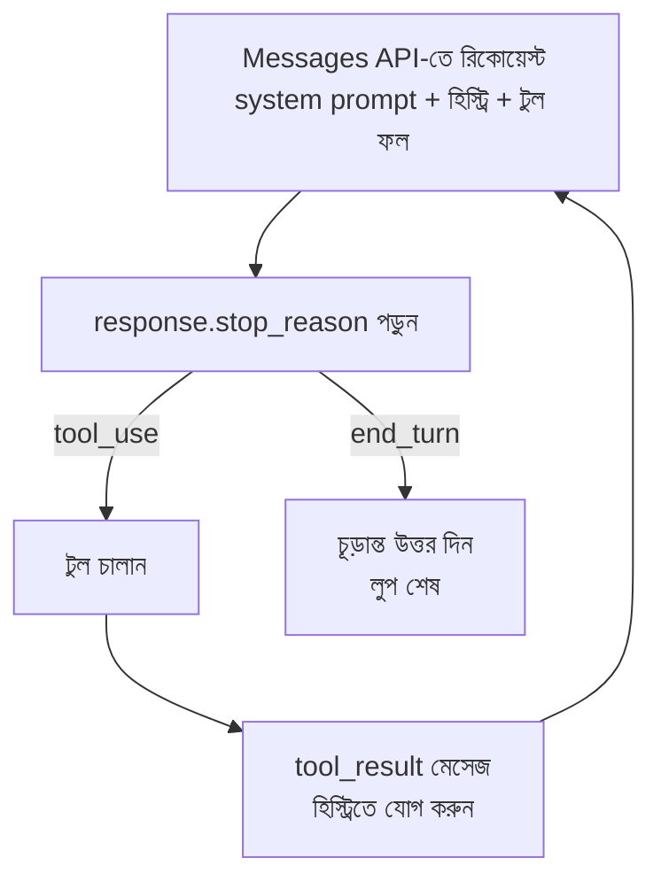

import ReadingProgress from '../../../../components/progress/ReadingProgress.astro';
import MarkComplete from '../../../../components/progress/MarkComplete.astro';
import KeywordTable from '../../../../components/content/KeywordTable.astro';
import ExamTrap from '../../../../components/content/ExamTrap.astro';
import BuildExercise from '../../../../components/content/BuildExercise.astro';
import Attribution from '../../../../components/content/Attribution.astro';

<ReadingProgress />

	Domain 1
	Task 1.1 · ওয়েট ২৭%
	মূল ইংরেজি: Agentic Loops

## এই লেসনে যা জানতে হবে

এজেন্টিক লুপ হলো Claude-ভিত্তিক প্রতিটি এজেন্টের মূল এক্সিকিউশন সাইকেল। এটি প্রম্পটের কৌশল নয়, রিট্রাই লুপ নয়, চ্যাটবটের টার্নও নয় — এটি কোডে লেখা ডিটারমিনিস্টিক কন্ট্রোল ফ্লো। এই লাইফসাইকেল ঠিকভাবে বুঝলে Domain 1-এর বড় অংশ আপনাআপনি বসে যায়; ভুল বুঝলে প্রোডাকশনে এজেন্ট কাজের মাঝপথে থেমে যাবে।

## এজেন্টিক লুপের লাইফসাইকেল

কাজ শেষ না হওয়া পর্যন্ত চারটি ধাপ ঘুরতে থাকে:

1. **Messages API-তে রিকোয়েস্ট পাঠান।** এর সাথে কনভারসেশন হিস্ট্রি যাবে — system prompt, আগের মেসেজ, আর আগের ইটারেশনের টুল ফল।
2. **রেসপন্সের `stop_reason` ফিল্ড পড়ুন।** এই ফিল্ডটাই ঠিক করে দেয় পরের ধাপ কী। এজেন্টিক লুপে প্রাসঙ্গিক মান দুটি:
   - `"tool_use"` — Claude এক বা একাধিক টুল কল করতে চায়। লুপ চলবে।
   - `"end_turn"` — Claude কাজ শেষ করেছে। লুপ থামবে।
3. **`stop_reason` যদি `"tool_use"` হয়:** টুল চালান, ফলটি নতুন মেসেজ হিসেবে কনভারসেশন হিস্ট্রিতে যোগ করুন, তারপর হালনাগাদ হিস্ট্রি নিয়ে Claude-এর কাছে আবার পাঠান।
4. **`stop_reason` যদি `"end_turn"` হয়:** এজেন্ট শেষ। চূড়ান্ত উত্তর ব্যবহারকারীকে দেখান।

### ধাপ ৩-এ লুপ ভাঙে

টুল ফল অবশ্যই কনভারসেশন হিস্ট্রিতে যোগ করতে হবে। এটা বাদ দিলে Claude পরের ইটারেশনে নতুন তথ্য নিয়ে ভাবতেই পারবে না — টুল কী ফেরত দিল, সেটাই সে দেখে না, তাই নতুন কিছু নিয়ে কাজ করার মতো কিছু তার হাতে থাকে না।

## মূল ধারণা

`stop_reason` ফিল্ডই লুপ কন্ট্রোলের একমাত্র নির্ভরযোগ্য সংকেত। এটি ডিটারমিনিস্টিক ও দ্ব্যর্থতাহীন। প্রাকৃতিক ভাষার লেখা parse করা, টেক্সট কনটেন্ট দেখে সিদ্ধান্ত নেওয়া, বা ইচ্ছেমতো ইটারেশন ক্যাপ বসানো — কোনোটিকেই লুপ থামানোর মূল প্রক্রিয়া বানাবেন না।

## পরীক্ষার বাইরে: লাইভ API-র আরও মান

পরীক্ষার সিলেবাস (v1.0) কেবল `tool_use` আর `end_turn` ধরে, কারণ সাধারণ লুপ এই দুটোতেই ব্রাঞ্চ করে। কিন্তু লাইভ Messages API আরও কিছু মান ফেরত দেয়, যা প্রোডাকশন লুপে handle করতেই হয়:

- `pause_turn` — দীর্ঘ চলমান server-tool টার্ন চালিয়ে যেতে হবে।
- `max_tokens` — আউটপুট সীমায় পৌঁছেছে, রেসপন্স কাটা।
- `stop_sequence` — নির্ধারিত stop sequence পাওয়ায় থেমেছে।
- `refusal` — চলতি মডেলগুলো (যেমন Fable 5) সাধারণ 200 রেসপন্সেই কাজ করতে অস্বীকার করতে পারে।
- `model_context_window_exceeded` — রেসপন্স মডেলের কনটেক্সট উইন্ডো ভরিয়ে দিয়েছে; `max_tokens` ট্রাঙ্কেশনের মতোই ধরুন।

নিয়ম: `end_turn` ছাড়া যেকোনো মান মানে "কাজ শেষ হয়নি — কারণ খুঁজুন", আর অগত্যা `tool_use` ধরে নেওয়া নয়। (জুলাই ২০২৬-এ Messages API ডকুমেন্টেশনের সাথে মিলিয়ে দেখা।)

## মডেল-ড্রিভেন সিদ্ধান্ত গ্রহণ

এজেন্টিক লুপে Claude বর্তমান কনটেক্সট দেখে ঠিক করে কোন টুল কল করবে — এটাই মডেল-ড্রিভেন সিদ্ধান্ত গ্রহণ। মডেল কাজটা পড়ে, হাতের টুলগুলো ভাবে, তারপর একটা বাছে। এর বিপরীতে আছে আগেই ঠিক করা decision tree বা fixed tool sequence, যেখানে ডেভেলপার হার্ডকোড করে দেন কখন কী চলবে।

পরীক্ষায় মডেল-ড্রিভেন পদ্ধতিকে প্রাধান্য দেওয়া হয়, কারণ এটা নমনীয়। ডেভেলপার যেসব পরিস্থিতি আগে থেকে ভাবেননি, মডেল সেগুলোও সামলায়, edge case handle করে, এমন ক্রমে টুল চালায় যা কেউ পরিকল্পনা করেনি। তবে একটি ব্যতিক্রম মুখস্থ রাখুন: ব্যবসার যুক্তি ডিটারমিনিস্টিক কমপ্লায়েন্স দাবি করলে — আর্থিক লেনদেন, নিরাপত্তা যাচাই, নিয়ন্ত্রক শর্ত — তখন প্রোগ্রাম্যাটিক এনফোর্সমেন্ট এই নমনীয়তার চেয়ে উপরে। বিস্তারিত Task Statement 1.4-এ।

## তিনটি অ্যান্টি-প্যাটার্ন

লুপ থামানো নিয়ে তিনটি অ্যান্টি-প্যাটার্ন বারবার আসে। তিনটিই চিনতে শিখুন।

### অ্যান্টি-প্যাটার্ন ১: প্রাকৃতিক ভাষার সংকেত parse করা

Claude "I'm done" বা "task complete" বলল কি না, তা দেখে লুপ থামানো। ভুল, কারণ প্রাকৃতিক ভাষা স্বভাবতই দ্ব্যর্থক। Claude বলতে পারে "I've finished analysing the first file" — অথচ তার ইচ্ছা আরও ফাইল নিয়ে কাজ চালিয়ে যাওয়া। এই দ্ব্যর্থতা দূর করতেই `stop_reason` ফিল্ডটির জন্ম।

### অ্যান্টি-প্যাটার্ন ২: ইচ্ছেমতো ইটারেশন ক্যাপকে মূল স্টপিং সিস্টেম বানানো

"১০ লুপের পরে থামাও" — এটাকে এজেন্ট থামানোর মূল উপায় বানানো। ভুল, কারণ এতে হয় দরকারি কাজ কেটে যায় (কাজটি সত্যিই ১২ ইটারেশন চায়), নয় অপ্রয়োজনীয় ইটারেশন চলে (কাজ ৩ ইটারেশনেই শেষ হতে পারত)। কাজ শেষ হওয়ার সংকেত মডেলই দেয় `stop_reason` দিয়ে — সেই সংকেত ব্যবহার করুন। ক্যাপ safety net হিসেবে ঠিক আছে (runaway এজেন্ট ঠেকাতে সর্বোচ্চ সীমা), কিন্তু কখনোই মূল কন্ট্রোল মেকানিজম নয়।

### অ্যান্টি-প্যাটার্ন ৩: assistant-এর টেক্সট কনটেন্ট দেখে শেষ ধরে নেওয়া

`response.content[0].type == "text"` দেখে লুপ শেষ ধরে নেওয়া। ভুল, কারণ Claude `tool_use` ব্লকের পাশাপাশি টেক্সটও ফেরত দিতে পারে। একটা রেসপন্সে ব্যাখ্যামূলক লেখা ("I'll now search for the customer's order history") থাকতেই পারে, ঠিক তার পরপরই টুল কল। টেক্সট আছে কি না, তা দিয়ে এজেন্ট শেষ হয়েছে কি না জানা যায় না।

<ExamTrap label="পরীক্ষায় সাধারণ ডিস্ট্র্যাক্টর">
	

		অকালে থেমে যাওয়া ঠেকাতে পরীক্ষায় প্রায়ই <strong>iteration cap</strong> বসানোর উত্তর দেয়। এই উত্তরগুলো প্রত্যাখ্যান করুন। ক্যাপ দমন করে runaway লুপ, অকালে থামা নয়। অকালে থামার একমাত্র সমাধান — <code>stop_reason</code> সঠিকভাবে চেক করা।
	

</ExamTrap>

## বাস্তব উদাহরণ: অকালে থেমে যাওয়ার বাগ

একজন ডেভেলপার কাস্টমার সাপোর্ট এজেন্ট বানালেন। সহজ প্রশ্নে সব ঠিক, কিন্তু জটিল প্রশ্নে মাঝপথে থেমে যায়। কোডটা শেষ হয়েছে কি না বোঝে এভাবে — `response.content[0].type == "text"`।

**বাগ:** Claude একটা ব্যাখ্যামূলক লেখা ("Let me look up your order") ফেরত দিল, তার পাশে `tool_use` ব্লক যেখানে `lookup_order` টুল চাওয়া হয়েছে। কোড [0] নম্বর পজিশনে টেক্সট দেখেই ধরে নিল এজেন্ট শেষ, আর ব্যবহারকারীকে অসম্পূর্ণ উত্তর দিয়ে দিল।

**সমাধান:** content-type চেক সরিয়ে `stop_reason` চেক বসান। `stop_reason == "tool_use"` হলে লুপ চালিয়ে যান, `stop_reason == "end_turn"` হলে থামুন। রেসপন্সে কোন ধরনের কনটেন্ট এল, তাতে কিছু যায় আসে না।

## পরীক্ষার ফাঁদ

<ExamTrap>
	

		<strong>`response.content[0].type == 'text'` দিয়ে লুপ শেষ নির্ধারণ</strong> — Claude একই রেসপন্সে টেক্সট আর `tool_use` দুটোই দিতে পারে। টেক্সট থাকা মানে কাজ শেষ নয়। একমাত্র নির্ভরযোগ্য সংকেত `stop_reason`।
	

</ExamTrap>

<ExamTrap>
	

		<strong>ইচ্ছেমতো ইটারেশন ক্যাপকে (যেমন "১০ লুপ পরেই থামাও") মূল স্টপিং সিস্টেম বানানো</strong> — ক্যাপ হয় দরকারি কাজ কেটে দেয়, নয় অপ্রয়োজনীয় ইটারেশন চালায়। safety net ঠিক আছে, মূল কন্ট্রোল নয়।
	

</ExamTrap>

<ExamTrap>
	

		<strong>"I'm done" / "task complete" টাইপ বাক্য parse করে লুপ থামানো</strong> — প্রাকৃতিক ভাষা দ্ব্যর্থক ও অনির্ভরযোগ্য; `stop_reason` ডিটারমিনিস্টিক সংকেত দেয়।
	

</ExamTrap>

<ExamTrap>
	

		<strong>টেক্সট ফেরত আটকাতে `tool_choice` জোর করে 'any' করা</strong> — এতে এজেন্ট আসলেই শেষ হয়ে গেলেও টুল চালাতে বাধ্য হয়, ফলে infinite loop তৈরি হয়। মডেলকে স্বাভাবিকভাবে `stop_reason` দিয়ে শেষ হতে দিন।
	

</ExamTrap>

<KeywordTable keywords={frontmatter.keywords} />

## প্র্যাকটিস সিনারিও (নিজে উত্তর ভাবুন, তারপর খুলুন)

> একজন ডেভেলপারের এজেন্ট মাঝে মাঝে অকালে থেমে যায়, যখন Claude টুল কলের সাথে টেক্সটও ফেরত দেয়। লুপটি `response.content[0].type == 'text'` দেখে ধরে নেয় এজেন্ট শেষ। ব্যবহারকারীরা জটিল প্রশ্নে অসম্পূর্ণ উত্তর পাচ্ছেন। ডেভেলপারের কী বদলানো উচিত?

	
উত্তর দেখুন

	**সঠিক উত্তর:** content type-এর বদলে `stop_reason` চেক করুন — `tool_use` হলে লুপ চালিয়ে যান, `end_turn` হলে থামান।

	**কেন বাকিগুলো ভুল:**

	- *১৫ লুপের iteration cap বসানো* — ক্যাপ দমন করে runaway লুপ, অকালে থামা নয়। সমস্যা থেকে যায়।
	- *`tool_choice` 'any' করা* — মডেল আসল শেষে পৌঁছালেও টুল চালাতে বাধ্য হবে, infinite loop।
	- *assistant টেক্সটে "I have finished" খোঁজা* — প্রাকৃতিক ভাষা দ্ব্যর্থক; এটাই অ্যান্টি-প্যাটার্ন ১।

<BuildExercise
	title="বহু-টুল এজেন্ট লুপ বানান"
	difficulty="Intermediate"
	time="45 মিনিট"
	objectives={[
		'Messages API দিয়ে এজেন্টিক লুপের লাইফসাইকেল কীভাবে কাজ করে',
		'কেন stop_reason-ই লুপ কন্ট্রোলের নির্ভরযোগ্য সংকেত',
		'tool_use ও end_turn মান দুটি সঠিকভাবে হ্যান্ডল করা',
		'বহু-টার্ন এক্সিকিউশনের জন্য টুল ফল হিস্ট্রিতে যোগ করা',
		'কোথায় safety iteration cap ঠিক, আর কোথায় ভুল',
	]}
	steps={[
		{
			title:
				'Claude API ক্লায়েন্ট সেট করুন, তাতে দুটি টুল রাখুন: calculator (expression নেয়, ফল দেয়) আর web search stub (query নেয়, mock ফল দেয়)।',
			why: 'বহু-টুল সেটআপ মডেল-ড্রাইভ সিদ্ধান্ত দেখায় — কনটেক্সট পড়ে Claude ঠিক টুলটি বাছতে হয়, যা এজেন্টিক আর্কিটেকচারের মূল কথা।',
			expect:
				'সঠিক JSON Schema input_schema সহ দুটি টুল রেজিস্টার্ড; প্রতিটিতে name, description ও parameters আছে।',
		},
		{
			title: 'এজেন্টিক লুপ লেখুন, যা রিকোয়েস্ট পাঠায় এবং প্রতি রেসপন্সের পরে stop_reason দেখে।',
			why: 'এটাই মূল এক্সিকিউশন প্যাটার্ন — পরীক্ষা দেখে আপনি stop_reason ব্যবহার করছেন কি না, নাকি content-type বা ভাষা দেখছেন।',
			expect: 'while লুপ, প্রতিটি ইটারেশনে response.stop_reason চেক।',
		},
		{
			title:
				'tool_use পেলে টুল চালান, tool result মেসেজ বানান, আর তা কনভারসেশন হিস্ট্রিতে যোগ করুন।',
			why: 'এটাই লুপের সবচেয়ে গুরুত্বপূর্ণ হ্যান্ডঅফ — পরীক্ষা দেখে আপনি ঠিকভাবে টুল কল বের করেন কি না এবং সঠিক মেসেজ ফরম্যাটে ফল ফেরত দেন কি না।',
			expect:
				'Claude টুল চাইলে কোডটি tool_use ব্লক বের করে, সংশ্লিষ্ট ফাংশন চালায়, এবং assistant রেসপন্সসহ tool_result-যুক্ত user মেসেজ হিস্ট্রিতে যোগ করে।',
		},
		{
			title: 'end_turn পেলে চূড়ান্ত উত্তর বের করে রিটার্ন করুন।',
			why: 'end_turn মানে Claude টাস্ক শেষ করেছে — ঠিকভাবে ফাইনাল টেক্সট বের করলেই লুপ বন্ধ হয় এবং ফল ব্যবহারকারীর কাছে যায়।',
			expect: 'stop_reason end_turn হলে লুপ শেষ, ফাইনাল রেসপন্সের টেক্সট কনটেন্ট রিটার্ন।',
		},
		{
			title:
				'এমন প্রম্পট দিয়ে টেস্ট করুন যাতে পরপর কয়েকটি টুল কল লাগে (যেমন: আগে একটি মান খুঁজুন, তারপর তা দিয়ে হিসাব করুন) এবং সব ইটারেশনে লুপ ঠিকভাবে চলছে কি না দেখুন।',
			why: 'ক্রমিক টুল কল পুরো লাইফসাইকেল যাচাই করে — একটি টুল শেষ করে ফল পেয়ে সিদ্ধান্ত নিয়ে পরের টুলে যেতে হয়।',
			expect:
				'end_turn-এর আগে অন্তত দুটি টুল কল ইটারেশন। এজেন্ট আগে সার্চ করবে, ফল হিসাবে ব্যবহার করবে, শেষে সম্মিলিত উত্তর দেবে।',
		},
		{
			title:
				'সর্বোচ্চ সীমা হিসেবে safety iteration cap ২০ যোগ করুন (প্রধান স্টপিং মেকানিজম নয়) এবং ক্যাপ ছুঁলে warning লগ দিন।',
			why: 'পরীক্ষা safety cap (fallback) আর ক্যাপকে মূল স্টপিং বানানো — এই দুটোর পার্থক্য দেখে। স্বাভাবিক কাজে ক্যাপ কখনো ছোঁয়া উচিত নয়।',
			expect:
				'MAX_ITERATIONS কনস্ট্যান্ট, প্রতি লুপে কাউন্টার, ক্যাপ ছুঁলে warning লগ। সাধারণ প্রশ্নে stop_reason দিয়েই ২০-এ পৌঁছানোর আগে লুপ শেষ হবে।',
		},
	]}
/>

## সূত্র

<ul>
	{frontmatter.sources.map((source) => (
		<li>
			<a href={source.href} target="_blank" rel="noopener noreferrer">
				{source.label}
			</a>
			{source.note ? ` — ${source.note}` : ''}
		</li>
	))}
</ul>

<Attribution sourceUrl={frontmatter.sourceUrl} updated={frontmatter.updated} />

<MarkComplete lessonId="1-1" />
