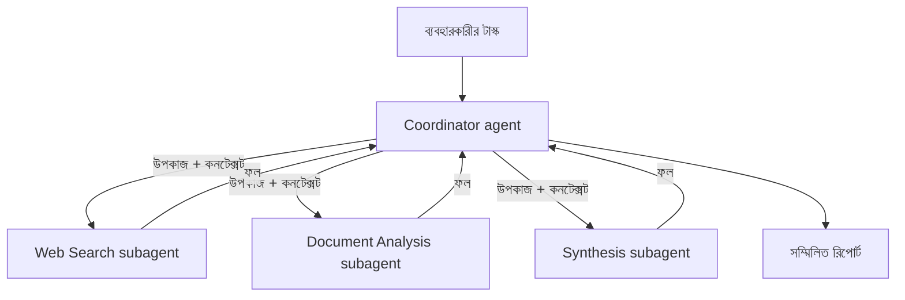

import ReadingProgress from '../../../../components/progress/ReadingProgress.astro';
import MarkComplete from '../../../../components/progress/MarkComplete.astro';
import KeywordTable from '../../../../components/content/KeywordTable.astro';
import ExamTrap from '../../../../components/content/ExamTrap.astro';
import BuildExercise from '../../../../components/content/BuildExercise.astro';
import Attribution from '../../../../components/content/Attribution.astro';

<ReadingProgress />

	Domain 1
	Task 1.2 · ওয়েট ২৭%
	মূল ইংরেজি: Multi-Agent Orchestration

## এই লেসনে যা জানতে হবে

এক জটিল কাজ এক এজেন্ট দিয়ে করানো কঠিন হলে একাধিক Claude এজেন্ট একসাথে লাগানো যায় — সেটাই মাল্টি-এজেন্ট অর্কেস্ট্রেশন। পরীক্ষা এখানে উদার নয়: এটি একটাই প্যাটার্ন চায়, **hub-and-spoke**, যার কেন্দ্রে থাকে একজন **coordinator**।

বাকি সব প্রশ্ন এই দুই থিমের চারপাশে ঘোরে — কেন্দ্র কীভাবে সব যোগাযোগ নিয়ন্ত্রণ করে, আর কেন subagent-রা একে অপরের কিছুই জানে না।

## Hub-and-Spoke আর্কিটেকচার

এই আর্কিটেকচারে দুই ধরনের ভূমিকা:

- **Coordinator agent** — কেন্দ্রে বসে। প্রাথমিক টাস্ক নেয়, ভেঙে দেয়, কোন subagent ডাকবে ঠিক করে, তাদের কনটেক্সট পাঠায়, ফলগুলো জোড়া লাগায়, এরর সামলায়, আর নিজের ভেতর দিয়েই তথ্য এক প্রান্ত থেকে আরেক প্রান্তে পাঠায়।
- **Subagent** — spokes। প্রতিটি একটি বিশেষায়িত কাজ করে (web search, document analysis, synthesis, report generation)। নির্দেশ পায় coordinator-এর কাছ থেকে, ফল ফেরত দেয় coordinator-কে।

মূল নিয়ম: **সব যোগাযোগ coordinator-এর ভেতর দিয়েই যায়।** Subagent-রা কখনো সরাসরি একে অন্যের সাথে কথা বলে না — দক্ষতার জন্য নয়, সুবিধার জন্য নয়, কোনো কারণেই নয়। দুই subagent-এর মাঝখানে যে-ই তথ্য যাক, তা coordinator হয়ে যায়।

### বর্তমান অবস্থা

পরীক্ষায় এই কঠোর hub-and-spoke মডেলই আসে। বাস্তব Claude Code-এ একটি sub-agent নিজেই আরও sub-agent spawn করতে পারে (nested parent-child delegation), তাই "কোনো কারণেই নয়" কথাটি পরীক্ষার সরলীকরণ — শক্ত প্রোডাক্ট-সীমা নয়। পরীক্ষার খাতায় অবশ্য সরাসরি subagent-to-subagent যোগাযোগ মানেই ভুল উত্তর।

### কেন্দ্রীভূত করার তিনটি লাভ

- **Observability** — প্রতিটি মেসেজ এক জায়গায় লগ ও মনিটর করা যায়।
- **Consistent error handling** — coordinator একই রকম এরর-রিকভারি নীতি সব জায়গায় খাটায়।
- **Controlled information flow** — কোন subagent কোন কনটেক্সট পাবে, তা coordinator ঠিক করে।

<ExamTrap label="মূল ধারণা">
	

		subagent-দের মধ্যে যত যোগাযোগ, সব coordinator হয়ে যাবে। এটিই hub-and-spoke-এর ভিত্তিগত আর্কিটেকচারাল শর্ত।
	

</ExamTrap>

## সবচেয়ে বেশি ভুল বোঝা নীতি: Isolation

এটাই মাল্টি-এজেন্ট সিস্টেমের সবচেয়ে ভুল বোঝা ধারণা, আর পরীক্ষা ঠিক এই বিভ্রান্তির উপরেই চাপ দেয়।

Subagent coordinator-এর conversation history **স্বয়ংক্রিয়ভাবে উত্তরাধিকার পায় না**। Coordinator যখন subagent spawn করে, সে শুরু করে শুধু সেটুকু নিয়ে যা coordinator তার prompt-এ স্পষ্ট লিখে দিয়েছে। তার হাতে থাকে না:

- Coordinator-এর system prompt (স্পষ্টভাবে দেওয়া ছাড়া)
- Coordinator-এর আগের মেসেজগুলো
- অন্য subagent-দের ফলাফল (coordinator পাঠালে তবেই পায়)
- কোনো "shared memory" বা global state

Subagent-রা invocation-এর মধ্যেও memory শেয়ার করে না। Coordinator যদি web search subagent-কে দুবার ডাকে, দ্বিতীয়বার প্রথমবারের কিছুই জানে না। প্রতিটি invocation সম্পূর্ণ স্বাধীন।

তাই কনটেক্সট নিয়ে coordinator-কে সচেতন হতে হয়। Subagent-এর যা-কিছু লাগবে, সব তার prompt-এ explicitly যাবে। Synthesis এজেন্টের web search ফল দরকার হলে coordinator সেটি পাঠাবে — synthesis এজেন্ট কোনো shared store থেকে "তুলে নিতে" পারবে না। Shared store বলে কিছুই নেই।

## Coordinator-এর চারটি দায়িত্ব

১. **Dynamic subagent selection।** Coordinator query-র চাহিদা দেখে ঠিক করে কোন subagent ডাকবে। সবসময় পুরো pipeline চালায় না। সাদাসিধা factual প্রশ্নে শুধু web search subagent লাগতে পারে — পুরো research-analysis-synthesis শিকল নয়। প্রতিটি query-কে সব subagent দিয়ে পাঠানো মানে সময় ও রিসোর্সের অপচয়।

২. **Research scope partitioning।** একাধিক subagent-কে পাঠানোর সময় coordinator গবেষণার পরিসর ভাগ করে দেয় যাতে কাজ দ্বিগুণ না হয়। আলাদা উপবিষয় বা আলাদা সোর্স-ধরন বণ্টন করে। যেমন — একজন academic paper খুঁজবে, আরেকজন news article; দুজনেই একই সোর্স খুঁজবে না।

৩. **Iterative refinement loops।** Coordinator synthesis-এর ফল পড়ে ফাঁক খোঁজে। অসম্পূর্ণ হলে নির্দিষ্ট প্রশ্ন দিয়ে search ও analysis subagent-কে আবার পাঠায়, তারপর কভারেজ যথেষ্ট না হওয়া পর্যন্ত synthesis আবার ডাকে। এটি একবারের কাজ নয় — চক্র।

৪. **Centralised communication routing।** সব subagent-যোগাযোগ coordinator-এর ভেতর দিয়ে যায় — observability, একরকম এরর হ্যান্ডলিং আর নিয়ন্ত্রিত তথ্যপ্রবাহের জন্য।

<ExamTrap>
	

		<strong>Coordinator-এর conversation history, system prompt বা memory subagent-রা উত্তরাধিকার পাবে ধরে নেওয়া</strong> — subagent-এর কনটেক্সট সম্পূর্ণ বিচ্ছিন্ন। সব তথ্য তার prompt-এ স্পষ্টভাবে পাঠাতে হবে।
	

</ExamTrap>

## Narrow Decomposition ব্যর্থতা

এটি একটি নির্দিষ্ট পরীক্ষা-প্যাটার্ন, চিনে রাখা জরুরি। Exam guide-এর sample set-এ (Question 7) coordinator "impact of AI on creative industries" ভেঙেছে শুধু visual arts উপবিষয়ে, ফলে music, writing ও film পুরোপুরি বাদ পড়েছে।

**মূল কারণ coordinator-এর task decomposition** — কোন নিচের এজেন্টের নয়। Web search এজেন্ট তার পাওয়া দায়িত্ব ভালোভাবেই খুঁজেছে; synthesis এজেন্ট যা পেয়েছে তা-ই ঠিকভাবে জুড়েছে। কিন্তু coordinator শুধু visual arts-এর উপবিষয় বিলি করেছে, তাই music, writing ও film কখনোই খোঁজা হয়নি।

দ্বিতীয় ক্লাসিক উদাহরণ: "renewable energy technologies" রিপোর্টে solar ও wind নিয়ে বিস্তারিত থাকে, কিন্তু geothermal, tidal, biomass, fusion নিয়ে এক লাইনও নেই। Coverage gap-এর কারণ খারাপ সার্চ বা দুর্বল synthesis নয় — coordinator ওই উপবিষয়গুলো কখনো assign করেনি। Fix-ও তেমন: ভালো সার্চ query নয়, বেশি ক্ষমতার synthesis এজেন্ট নয়, আরও subagent নয় — ভালো coordinator decomposition, যা পুরো টপিকের বিস্তার ধরে।

<ExamTrap>
	

		<strong>Coverage gap-এর দোষ নিচের subagent-এর ঘাড়ে চাপানো</strong> — subagent তো অ্যাসাইনমেন্টটুকুই করে। Coordinator শুধু solar আর wind দিলে কোনো subagent geothermal বা tidal আনতে পারে না। ব্যর্থতা তার উৎস পর্যন্ত ট্রেস করুন — coordinator-এর decomposition।
	

</ExamTrap>

<ExamTrap>
	

		<strong>Decomposition সমস্যা মেটাতে আরও subagent যোগ করা</strong> — যদি ভাগাভাগিই খুব সংকীর্ণ হয়, নতুন subagent-রাও সেই সংকীর্ণ দায়িত্বই পাবে। সমাধান coordinator-এর decomposition logic ঠিক করা।
	

</ExamTrap>

<ExamTrap>
	

		<strong>দক্ষতা বাড়াতে subagent-to-subagent সরাসরি যোগাযোগের প্রস্তাব</strong> — এতে observability, একরকম এরর হ্যান্ডলিং ও নিয়ন্ত্রিত তথ্যপ্রবাহ — তিনটিই ভাঙে। যত "দক্ষ"ই মনে হোক, সব যোগাযোগ coordinator দিয়েই যাবে।
	

</ExamTrap>

<KeywordTable keywords={frontmatter.keywords} />

## প্র্যাকটিস সিনারিও (নিজে উত্তর ভাবুন, তারপর খুলুন)

> একটি মাল্টি-এজেন্ট গবেষণা সিস্টেম "renewable energy technologies" নিয়ে রিপোর্ট বানাল, যেখানে কেবল solar ও wind আছে। প্রতিটি subagent তার পাওয়া উপবিষয়ে গভীর ও সোর্সসহ কভারেজ দিয়েছে; web search subagent প্রতিটি query-তে প্রাসঙ্গিক ফল দিয়েছে; synthesis subagent যা পেয়েছে তা-ই নিখুঁতভাবে জুড়েছে। Coverage gap-এর সবচেয়ে সম্ভাব্য মূল কারণ কী?

	
উত্তর দেখুন

	**সঠিক উত্তর:** Coordinator টপিকটি ভেঙেছে শুধু solar ও wind উপবিষয়ে, geothermal, tidal, biomass বা fusion কোনো subagent-কেই কখনো assign করেনি।

	**কেন বাকিগুলো ভুল:**

	- *Document analysis subagent বাকি ক্যাটাগরির সোর্স পায়নি* — সে তো নিজের অ্যাসাইনমেন্টই পায়নি; দোষ তার উপরে চাপানো মানে ভুল উৎস খোঁজা।
	- *Synthesis subagent ফাঁক চিনতে পারেনি* — কভারেজ মূল্যায়ন coordinator-এর দায়িত্ব, synthesis এজেন্টের নয়; তাছাড়া যা দেওয়া হয়েছিল তা-ই সে ঠিকভাবে জুড়েছে।
	- *Web search subagent খুব সংকীর্ণ query ব্যবহার করেছে* — সে প্রতিটি পাওয়া query-তে ভালো ফল দিয়েছে; ভুল প্রশ্ন পাওয়াটাই আসল সমস্যা।

<BuildExercise
	title="Hub-and-Spoke রিসার্চ Coordinator বানান"
	difficulty="Advanced"
	time="৬০ মিনিট"
	objectives={[
		'Hub-and-spoke আর্কিটেকচারে সব যোগাযোগ কেন্দ্র হয়ে যায়',
		'Subagent isolation মানে প্রতিটি কনটেক্সট explicitly পাঠাতে হয়',
		'Narrow decomposition ফাঁদ এড়ানো',
		'Iterative refinement দিয়ে coverage gap ধরা ও ভরা',
		'ব্যর্থতা কেন coordinator-এর decomposition-এ ট্রেস করে',
	]}
	steps={[
		{
			title:
				'এমন coordinator ফাংশন বানান যা ইনপুটে একটি বিস্তৃত গবেষণা টপিক নেয় এবং স্ট্রাকচার্ড রিসার্চ রিপোর্ট ফেরত দেয়; system prompt-এ তার ভূমিকা অর্কেস্ট্রেটিং hub হিসেবে লিখুন।',
			why: 'Coordinator-ই hub — task decomposition, subagent selection ও result aggregation তার হাতেই, subagent-এর নয়।',
			expect: 'একটি coordinator ফাংশন, টপিক স্ট্রিং নেয়, স্ট্রাকচার্ড রিপোর্ট দেয়।',
		},
		{
			title:
				'Task decomposition logic লিখুন, যা টপিককে অন্তত ৫টি আলাদা উপবিষয়ে ভাগ করে এবং পুরো বিস্তৃতি ধরে।',
			why: 'Narrow decomposition একটি নির্দিষ্ট পরীক্ষা-ব্যর্থতার প্যাটার্ন; renewable energy-তে solar আর wind দিলে পুরো শ্রেণি বাদ পড়ে।',
			expect:
				'৫+ উপবিষয় দেয়; renewable energy-তে solar, wind, geothermal, tidal, biomass, fusion — সবই ধরে।',
		},
		{
			title:
				'দুটি subagent (web search ও document analysis) spawn করুন, প্রতিটির prompt-এ প্রাসঙ্গিক কনটেক্সট স্পষ্টভাবে দিয়ে।',
			why: 'Subagent isolation মানে shared memory নেই, উত্তরাধিকারও নেই — খারাপ ফলের কারণ প্রায়ই অপর্যাপ্ত কনটেক্সট।',
			expect:
				'প্রতিটি invocation-এ বরাদ্দকৃত উপবিষয়, গবেষণার লক্ষ্য ও আগের এজেন্টের প্রাসঙ্গিক কনটেক্সট prompt-এ লেখা।',
		},
		{
			title:
				'দুই subagent-এর ফল জুড়ে কভারেজ সম্পূর্ণতা মূল্যায়ন করুন।',
			why: 'মূল্যায়নই iterative refinement-এর সূচনা — এখানে ধরা পড়া ফাঁকই re-delegation ঘটায়।',
			expect:
				'একটি aggregation ফাংশন, যা কোন উপবিষয় ভালো কভার হয়েছে, আংশিক হয়েছে বা বাদ পড়েছে তা তালিকা করে।',
		},
		{
			title:
				'Iterative refinement loop বসান: কভারেজ ফাঁক পেলে লক্ষ্যযুক্ত query দিয়ে subagent-দের আবার ডাকুন, কভারেজ যথেষ্ট না হওয়া বা সর্বোচ্চ ইটারেশনে পৌঁছানো পর্যন্ত।',
			why: 'একবার পাঠিয়ে ছেড়ে দিলে সেটা dispatcher; coordinator-এর কাজ চক্র চালানো।',
			expect:
				'Loop: কভারেজ যাচাই → ফাঁকের তালিকা → লক্ষ্যযুক্ত ফলো-আপ → আবার যাচাই, থ্রেশহোল্ড বা max iteration পর্যন্ত।',
		},
		{
			title:
				'"renewable energy technologies" দিয়ে টেস্ট করুন এবং ফাইনাল আউটপুটে ছয়টি ক্যাটাগরিই আছে কি না যাচাই করুন।',
			why: 'এই টেস্ট-কেসটিই narrow decomposition ফাঁদের সাথে মেলে; solar আর wind-এ থেমে গেলে দোষ coordinator-এর।',
			expect:
				'solar, wind, geothermal, tidal, biomass, fusion — সব ক্যাটাগরিতে মাংসল অংশ; coverage মূল্যায়নে সম্পূর্ণতা ১০০%।',
		},
	]}
/>

## সূত্র

<ul>
	{frontmatter.sources.map((source) => (
		<li>
			<a href={source.href} target="_blank" rel="noopener noreferrer">
				{source.label}
			</a>
			{source.note ? ` — ${source.note}` : ''}
		</li>
	))}
</ul>

<Attribution sourceUrl={frontmatter.sourceUrl} updated={frontmatter.updated} />

<MarkComplete lessonId="1-2" />
