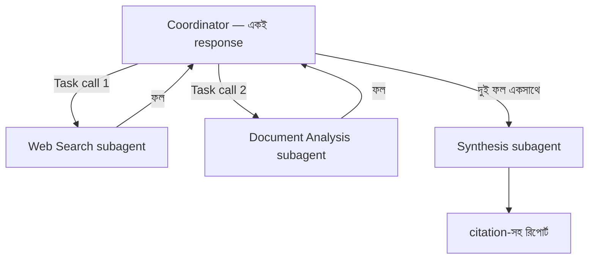

import ReadingProgress from '../../../../components/progress/ReadingProgress.astro';
import MarkComplete from '../../../../components/progress/MarkComplete.astro';
import KeywordTable from '../../../../components/content/KeywordTable.astro';
import ExamTrap from '../../../../components/content/ExamTrap.astro';
import BuildExercise from '../../../../components/content/BuildExercise.astro';
import Attribution from '../../../../components/content/Attribution.astro';

<ReadingProgress />

<div class="lesson-meta">
	<span class="lesson-badge">Domain 1</span>
	<span class="lesson-task">Task 1.3 · ওয়েট ২৭%</span>
	<span class="lesson-source">মূল ইংরেজি: Subagent Invocation and Context Passing</span>
</div>

## এই লেসনে যা জানতে হবে

Task Statement 1.3 হলো যন্ত্রাংশের প্রশ্ন — coordinator আসলে কীভাবে subagent ডাকে আর তাদের মধ্যে তথ্য পাঠায়। 1.2 যদি আর্কিটেকচার শেখায়, 1.3 শেখায় ওয়্যারিং।

## Task tool

Coordinator subagent spawn করে **Task tool** দিয়ে (পরীক্ষার গাইড v0.2-এ এই নাম)। এটি Claude Agent SDK-তে মাল্টি-এজেন্ট অর্কেস্ট্রেশন কাজ করানোর আসল API মেকানিজম — শুধু নামের রীতি নয়।

বর্তমান Claude Code-এ (v2.1.63, ফেব্রুয়ারি ২০২৬) এটির নাম **Agent**; `Task` এখনো alias হিসেবে চলে, আর Agent SDK tool-use ব্লকে `Agent` লেখে। পরীক্ষায় উত্তর দিন "Task tool", কোডে `Agent` দেখতে প্রস্তুত থাকুন।

এখানে একটি কঠিন কনফিগারেশন-শর্ত আছে: coordinator-এর `allowedTools`-এ অবশ্যই `Task` (বা বর্তমান নাম `Agent`) থাকতে হবে। না থাকলে coordinator সত্যিই কোনো subagent spawn করতে পারে না। এটি binary gate — নরম পছন্দ নয়। `Task`/`Agent` কোনোটিই `allowedTools`-এ না থাকলে subagent ডাকার কোনো উপায়ই নেই।

### বর্তমান অবস্থা

পরীক্ষার গাইড (v1.0) উপরের নিয়মটাই বলে, আর সেটিই keyed answer। বর্তমান Agent SDK ডকুমেন্টেশন (সেপ্টেম্বর ২০২৬) `allowedTools`-কে auto-approve তালিকা হিসেবে বর্ণনা করে — `Agent` বাদ দিলে টুলটা মুছে যায় না, বরং প্রতিটি spawn permission callback-এ যায়, যা unattended run-এ denial খায়। পরীক্ষায় ফলাফল একই, প্রোডাকশনে মেকানিজম আলাদা।

প্রতিটি subagent একটি **`AgentDefinition`** দিয়ে সংজ্ঞায়িত হয়, যেখানে তিনটি জিনিস থাকে:

- **Description** — subagent কী করে (coordinator এটাই দেখে ঠিক করে কখন ডাকবে)।
- **System prompt** — subagent যে নির্দেশনা মেনে চলে।
- **Tool restrictions** — subagent কোন টুল ব্যবহার করতে পারবে (তার ভূমিকা পর্যন্ত সীমিত)।

<ExamTrap label="মূল ধারণা">
	<p>
		subagent spawn করতে coordinator-এর <code>allowedTools</code>-এ <code>Task</code> (বা বর্তমান নাম <code>Agent</code>) থাকতেই হবে। এটি কঠিন শর্ত — না থাকলে subagent যেভাবেই সংজ্ঞায়িত হোক, ডাকা যাবে না।
	</p>
</ExamTrap>

## কনটেক্সট পাসিং: সফলতা-ব্যর্থতার আসল জায়গা

বেশিরভাগ মাল্টি-এজেন্ট সিস্টেম এখানেই হোঁচট খায়। 1.2-এর নীতিটি অপরিবর্তিত: subagent-এর কনটেক্সট বিচ্ছিন্ন। Coordinator তার prompt-এ যা লেখে, শুধু সেটুকুই পায়। এর বেশি কিছু নয়।

কার্যকর কনটেক্সট পাসিংয়ের তিনটি নিয়ম:

**নিয়ম ১ — আগের এজেন্টের পূর্ণ ফলাফল দিতে হবে।** Synthesis subagent-এর web search ফল আর document analysis আউটপুট দুটোই দরকার হলে coordinator দুটোই — পুরোপুরি — synthesis subagent-এর prompt-এ পাঠাবে। ধরে নেবেন না যে synthesis এজেন্ট আগের ফল "খুঁজে নিতে" পারবে। পারে না।

**নিয়ম ২ — কনটেন্ট আর metadata আলাদা রেখে structured data format ব্যবহার করুন।** এজেন্ট থেকে এজেন্টে গবেষণার ফল পাঠানোর সময় ডেটাতে থাকতে হবে দুই জিনিস — কনটেন্ট (দাবি, তথ্য, বিশ্লেষণ) আর metadata (source URL, document name, page number)। Metadata ছাড়া কনটেন্ট পাঠালে নিচের এজেন্ট দাবিগুলো সোর্সের সাথে জুড়তে পারে না।

এটি একটি নির্দিষ্ট পরীক্ষা-প্যাটার্ন: synthesis এজেন্ট এমন রিপোর্ট দেয় যেখানে দাবিগুলোর সোর্স নেই। Web search আর document analysis subagent ঠিকঠাক কাজ করছে। মূল কারণ — coordinator structured metadata ছাড়া কনটেন্ট পাঠিয়েছে; synthesis এজেন্টের হাতে সোর্স-তথ্যই ছিল না।

**নিয়ম ৩ — coordinator prompt-এ লক্ষ্য লিখুন, পদ্ধতি নয়।** Subagent-কে বলুন কী অর্জন করতে হবে ও কী গুণমানের শর্ত মানতে হবে — কীভাবে করতে হবে তার ধাপে-ধাপে নির্দেশ নয়। লক্ষ্যভিত্তিক prompt subagent-কে পরিস্থিতি বুঝে পথ বদলানোর স্বাধীনতা দেয়; পদ্ধতিগত নির্দেশ তাকে আটকে রাখে, অপ্রত্যাশিত পরিস্থিতিতে নিজের পদ্ধতি বদলাতে পারে না।

### Structured metadata-র রূপ

এজেন্ট-থেকে-এজেন্ট কনটেক্সটে কনটেন্ট আর metadata পরিষ্কারভাবে আলাদা থাকবে। একটি বাস্তব ফরম্যাট:

```json
{
  "findings": [
    {
      "claim": "Solar panel efficiency has increased 25% in the last decade",
      "source_url": "https://example.com/solar-report",
      "document_name": "Annual Solar Industry Report 2024",
      "page_number": 14,
      "confidence": "high",
      "retrieved_by": "web_search_agent"
    }
  ]
}
```

প্রতিটি finding-এর সাথে তার সোর্স-attribution metadata হিসেবে যায়। Synthesis এজেন্ট এই কাঠামো পেলে সঠিক citation-সহ রিপোর্ট বানাতে তার যা-কিছু লাগে, সবই পায়।

<ExamTrap>
	<p>
		<strong>Synthesis এজেন্টের prompt দোষ দেওয়া বা তাকে সরাসরি টুল দিতে চাওয়া</strong> — দাবিগুলো সোর্সহীন এলে আসল কারণ coordinator-এর কনটেক্সট পাসিং, নির্দিষ্ট করে বললে structured metadata-র অভাব। Synthesis এজেন্ট যা পায়নি, তা cite করতে পারে না।
	</p>
</ExamTrap>

## Parallel Spawning

Coordinator-কে স্বাধীন কাজে একাধিক subagent ডাকতে হলে আলাদা আলাদা turn-এ এক-এক করে না ডেকে **একই response-এ একাধিক Task tool call** দেবে।

Sequential spawning — প্রতি coordinator turn-এ একটি subagent — অকারণ latency যোগ করে। Web search এজেন্ট আর document analysis এজেন্ট যদি স্বাধীনভাবে কাজ করে, একজনকে অন্যের জন্য অপেক্ষা করানোর কোনো কারণ নেই।

পরীক্ষা latency-সচেতনতা যাচাই করে। স্বাধীন subagent-কাজ দেখলেই সঠিক উত্তর parallel spawning। উত্তর-বিকল্পে "in a single response" বা "simultaneously" শব্দ থাকলে সেটি parallel প্যাটার্নের সংকেত।



## fork_session

`fork_session` শেয়ার্ড বিশ্লেষণ-বেসলাইন থেকে স্বাধীন শাখা তৈরি করে। Coordinator একটি প্রাথমিক বিশ্লেষণ শেষ করার পর (কোডবেস পড়া, সমস্যা বোঝা) সেশন fork করে ভিন্ন পথ ঘুরে দেখতে পারে।

উদাহরণ: কোডবেস বিশ্লেষণের পর coordinator fork করে দুই testing strategy তুলনা করে। শাখার পর প্রতিটি fork স্বাধীন — তারা একে অন্যের ফল দেখে না, একটির পরিবর্তন অন্যটিকে ছোঁয় না।

দুটোই Claude Code-এর session control। `--resume` একটি CLI flag, Agent SDK-তে তার সমতুল্য `resume` option; `fork_session` SDK-র option (`forkSession` in TypeScript), CLI-তে `--resume`-এর পাশে `--fork-session`।

`fork_session` আর `--resume` এক নয়। Resume একটি নির্দিষ্ট নামযুক্ত সেশন চালিয়ে যায়। Fork নতুন স্বাধীন শাখা বানায়। পরীক্ষা এই পার্থক্যটিই ধরে। শেয়ার্ড সূচনা-বিন্দু থেকে ভিন্ন পথ ঘুরতে fork; একই তদন্তের ধারা চালু রাখতে resume।

### বর্তমান অবস্থা

পরীক্ষার গাইড v1.0 `--resume` আর `fork_session`-কে দুটি session control হিসেবে দেখায়, পরীক্ষায়ও সেই কাঠামোই। Agent SDK-তে (sessions guide, সেপ্টেম্বর ২০২৬ মিলিয়ে দেখা) fork হল resume-এর উপর বসানো modifier, বিকল্প নয়। দুটোই একসাথে দিতে হয়: `ClaudeAgentOptions(resume=session_id, fork_session=True)`। `resume` বলে কোন সেশন থেকে শুরু, আর `fork_session` বলে সেটির উপর append না করে শাখা বানাও। `fork_session` না দিলে একই call আসল সেশনে যোগ হয়। CLI-তেও জোড়া একই: `--fork-session` কেবল `--resume` বা `--continue`-এর সাথে কাজ করে। তাই পরীক্ষা যাচাই করে append বনাম branch — দুটো আলাদা কমান্ড নয়। পরীক্ষায় গাইডের ভাষাতেই উত্তর দিন: continue করতে resume, branch করতে fork।

<ExamTrap>
	<p>
		<strong>Subagent-রা coordinator-এর conversation history বা অন্য subagent-এর ফল নিজে থেকে পাবে ধরে নেওয়া</strong> — কনটেক্সট সম্পূর্ণ বিচ্ছিন্ন; প্রতিটি তথ্য coordinator-কে prompt-এ explicitly দিতে হয়।
	</p>
</ExamTrap>

<ExamTrap>
	<p>
		<strong>স্বাধীন কাজ sequential ডাকা</strong> — শুধু latency বাড়ে। একই response-এ একাধিক Task tool call দিয়ে parallel-এ spawn করুন।
	</p>
</ExamTrap>

## বাস্তব উদাহরণ: Attribution ব্যর্থতা

একটি সিস্টেমে তিনটি এজেন্ট — web search, document analysis, synthesis। Web search এজেন্ট URL-সহ সোর্সযুক্ত ফল দেয়; document analysis এজেন্ট page reference-সহ বিশ্লেষণ দেয়।

Coordinator দুই এজেন্টের কনটেন্ট synthesis এজেন্টকে পাঠায় কিন্তু **metadata ঝেড়ে ফেলে** — দাবি ও বিশ্লেষণের লেখা যায়, কিন্তু source URL, document name, page number যায় না। Synthesis এজেন্ট তাই চমৎকার সারাংশ দেয়, অথচ কোনো সোর্স-attribution ছাড়া।

Fix synthesis এজেন্টের prompt বদলানো নয় (যা পায়নি তা cite করতে পারে না)। Fix — coordinator প্রতিটি finding-এর সাথে source URL, document name ও page number-সহ structured metadata পাঠাতে বাধ্য হবে।

<KeywordTable keywords={frontmatter.keywords} />

## প্র্যাকটিস সিনারিও (নিজে উত্তর ভাবুন, তারপর খুলুন)

> একটি synthesis এজেন্টের রিপোর্টে অনেক দাবি সোর্স-attribution ছাড়া। Web search subagent ঠিকভাবে URL, title ও snippet দেয়; document analysis subagent ঠিকভাবে page reference-সহ বিশ্লেষণ দেয়। দুই subagent-ই পরীক্ষিতভাবে ঠিক কাজ করছে। সবচেয়ে সম্ভাব্য মূল কারণ কী?

<details>
	<summary>উত্তর দেখুন</summary>

	**সঠিক উত্তর:** Coordinator synthesis এজেন্টকে structured metadata ছাড়া কনটেন্ট পাঠায় — source URL, document name ও page number যুক্ত নয়।

	**কেন বাকিগুলো ভুল:**

	- *Synthesis এজেন্টকে সরাসরি web search টুল দেওয়া* — তার হাতে টুল থাকলেও সমস্যা মেটে না; আসল সমস্যা upstream কনটেক্সট পাসিং, আর এতে আর্কিটেকচারও ভাঙে।
	- *Synthesis এজেন্টের system prompt-এ citation-নির্দেশ যোগ করা* — যে সোর্স-তথ্যই দেওয়া হয়নি, নির্দেশ দিয়ে সেটি আনানো যায় না।
	- *Web search subagent-এর ফল parse করা যাচ্ছে না* — দুটো subagent-ই সঠিক ও সোর্সযুক্ত; সমস্যা coordinator-এর পাঠানো ডেটার কাঠামোয়।

</details>

<BuildExercise
	title="Structured Metadata দিয়ে কনটেক্সট পাসিং বানান"
	difficulty="Advanced"
	time="৫০ মিনিট"
	objectives={[
		'allowedTools-এ Task/Agent থাকা কেন spawn-এর কঠিন শর্ত',
		'কনটেন্ট ও সোর্স-attribution আলাদা করা structured metadata ডিজাইন',
		'কনটেক্সট পাসিং ব্যর্থ হলে নিচের এজেন্টে attribution ভাঙে কেন',
		'স্বাধীন subagent parallel-এ চালিয়ে latency কমানো',
		'fork_session আর parallel Task call-এর পার্থক্য',
	]}
	steps={[
		{
			title:
				'Coordinator এজেন্ট বানান যার allowedTools-এ Agent (বা Task) স্পষ্টভাবে আছে, আর options.agents-এ subagent-সংজ্ঞা আছে।',
			why: 'Task/Agent ছাড়া coordinator কোনো subagent spawn করতে পারে না — পরীক্ষা এটি binary শর্ত হিসেবে ধরে।',
			expect: 'query() call-এ allowedTools-এ Agent (বা Task) থাকে; subagent সংজ্ঞা options.agents-এ।',
		},
		{
			title:
				'দুটি subagent সংজ্ঞায়িত করুন — web search agent (source URL ও title-সহ ফল) আর document analysis agent (page reference-সহ বিশ্লেষণ)।',
			why: 'প্রতিটি subagent-এর টুল অ্যাক্সেস তার ভূমিকা অনুযায়ী সীমিত হতে হবে; AgentDefinition-এর তিনটি ফিল্ডই লাগে।',
			expect:
				'দুটি AgentDefinition — প্রতিটিতে description, system prompt ও সীমিত টুল তালিকা; search এজেন্ট শুধু search টুল, analysis এজেন্ট শুধু file-reading টুল পায়।',
		},
		{
			title:
				'কনটেন্ট আর metadata আলাদা করা একটি structured output format ডিজাইন করুন: claim, source_url, document_name, page_number, confidence।',
			why: 'পরীক্ষা এই attribution-ব্যর্থতার প্যাটার্নটিই ধরে — metadata ছাড়া কনটেন্ট পাঠানোই মূল কারণ।',
			expect: 'Finding টাইপের TypeScript interface/JSON schema, যাতে content ও metadata ফিল্ড আলাদা।',
		},
		{
			title:
				'দুই subagent-এর পূর্ণ structured ফল metadata অটুট রেখে synthesis subagent-কে পাঠান।',
			why: 'এখানেই পরীক্ষার মূল লক্ষ্য — metadata ঝেড়ে ফেলা বা সারসংক্ষেপ করে ফেলা মানেই citation হারানো।',
			expect: 'Coordinator সম্পূর্ণ findings array metadata-সহ synthesis prompt-এ পাঠায়; কোনো ফিল্ড বাদ পড়ে না।',
		},
		{
			title: 'যাচাই করুন synthesis এজেন্টের প্রতিটি দাবি URL ও page number-সহ সোর্সে জুড়তে পারছে কি না।',
			why: 'এই ধাপ কনটেক্সট পাসিংয়ের সফলতা প্রমাণ করে; attribution নেই মানে metadata আসেনি — synthesis prompt দোষ দেবেন না।',
			expect: 'প্রতিটি factual দাবির সাথে citation (URL ও page number); কোনো অনাথ দাবি নেই।',
		},
		{
			title:
				'Coordinator একই response-এ একাধিক Task tool call দিয়ে দুই research subagent parallel-এ spawn করবে, নিচে গিয়ে refactor করুন।',
			why: 'পরীক্ষা latency-সচেতনতা দেখে — স্বাধীন কাজ sequential চালানো অকারণ অপেক্ষা।',
			expect: 'Web search ও document analysis একসাথে চালু; synthesis শুরু হয় দুইটি শেষ হওয়ার পরে।',
		},
	]}
/>

## সূত্র

<ul>
	{frontmatter.sources.map((source) => (
		<li>
			<a href={source.href} target="_blank" rel="noopener noreferrer">
				{source.label}
			</a>
			{source.note ? ` — ${source.note}` : ''}
		</li>
	))}
</ul>

<Attribution sourceUrl={frontmatter.sourceUrl} updated={frontmatter.updated} />

<MarkComplete lessonId="1-3" />
