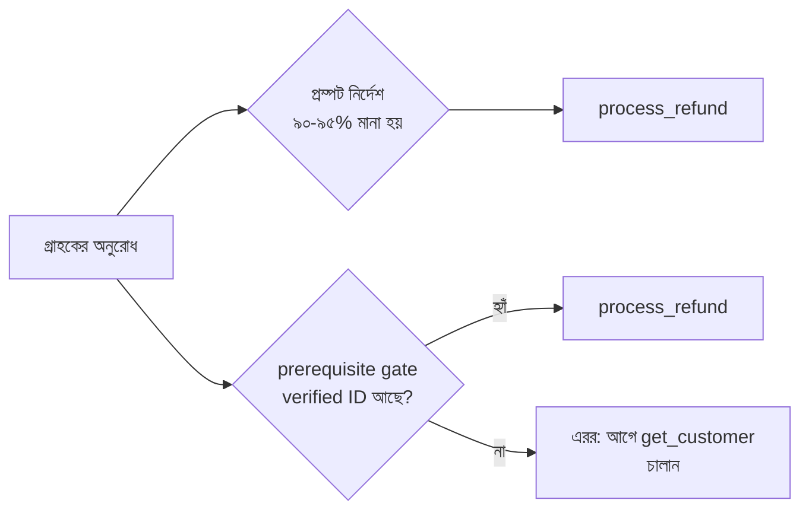

import ReadingProgress from '../../../../components/progress/ReadingProgress.astro';
import MarkComplete from '../../../../components/progress/MarkComplete.astro';
import KeywordTable from '../../../../components/content/KeywordTable.astro';
import ExamTrap from '../../../../components/content/ExamTrap.astro';
import BuildExercise from '../../../../components/content/BuildExercise.astro';
import Attribution from '../../../../components/content/Attribution.astro';

<ReadingProgress />

	Domain 1
	Task 1.4 · ওয়েট ২৭%
	মূল ইংরেজি: Workflow Enforcement and Handoff

## এই লেসনে যা জানতে হবে

Task Statement 1.4 এজেন্টের আচরণ নিয়ন্ত্রণের দুই পথের মধ্যে স্পষ্ট দাগ টানে — **prompt-based guidance** আর **programmatic enforcement**। পরীক্ষা এই পার্থক্যটি বারবার ধরে, আর high-stakes পরিস্থিতিতে ভুল করলে নম্বর যায়।

## Enforcement Spectrum

এজেন্টিক সিস্টেমে ওয়ার্কফ্লো-ক্রম মানানোর দুই আলাদা উপায়:

**Prompt-based guidance** মানে system prompt-এ নির্দেশ লেখা। যেমন: "Always verify the customer's identity before processing a refund." বেশিরভাগ সময় — ধরুন ৯০-৯৫% ক্ষেত্রে — কাজ করে। কিন্তু ব্যর্থতার হার শূন্য নয়। মডেল সম্ভাব্যতাভিত্তিক; কখনো ধাপ বাদ দেয়, ক্রম বদলায়, বা নির্দেশ আলগাভাবে পড়ে। কম-ঝুঁকির কাজে এই ব্যর্থতা গ্রহণযোগ্য।

**Programmatic enforcement** মানে hook, prerequisite gate বা কোড-লেভেল চেক বসানো, যা আগের শর্ত পূরণ না হওয়া পর্যন্ত নিচের টুল শারীরিকভাবে আটকে রাখে। যেমন: `get_customer` verified customer ID না ফেরানো পর্যন্ত `process_refund` চলবে না। এটি প্রতিবার কাজ করে — ডিটারমিনিস্টিক, সম্ভাব্যতাভিত্তিক নয়। মডেল যা-ই সিদ্ধান্ত নিক, gate ভুল ক্রমে চলতে দেয় না।

<ExamTrap label="মূল ধারণা">
	

		Prompt-based guidance সম্ভাব্যতাভিত্তিক — বেশিরভাগ সময় কাজ করে। Programmatic enforcement ডিটারমিনিস্টিক — প্রতিবার কাজ করে। সিদ্ধান্তের নিয়ম: এক ব্যর্থতাও আর্থিক ক্ষতি, নিরাপত্তা লঙ্ঘন বা কমপ্লায়েন্স ভঙ্গ করলে programmatic enforcement।
	

</ExamTrap>

## পরীক্ষার সিদ্ধান্তের নিয়ম

পরীক্ষা একই নিয়ম সব পরিস্থিতিতে খাটায়:

- **আর্থিক কাজ** (refund, transfer, payment): programmatic enforcement। ভুল অ্যাকাউন্টে একটিবার unverified refund মানেই টাকার ক্ষতি।
- **নিরাপত্তা** (identity verification, access control): programmatic enforcement। একবার identity যাচাই bypass মানেই নিরাপত্তা লঙ্ঘন।
- **কমপ্লায়েন্স** (AML check, নিয়ন্ত্রক শর্ত): programmatic enforcement। একবার কমপ্লায়েন্স চেক বাদ পড়লে আইনি জরিমানা।
- **কম-ঝুঁকির কাজ** (formatting preference, style guideline, output ordering): prompt-based guidance চলবে। ফরম্যাটে হেরফের ব্যবসার ঝুঁকি নয়।

পরীক্ষা high-stakes পরিস্থিতিতে prompt-ভিত্তিক সমাধানকে উত্তর-বিকল্প হিসেবে দেবে। সেগুলো প্রত্যাখ্যান করুন। উন্নত system prompt, few-shot উদাহরণ, জোরালো নির্দেশ — সবই accuracy বাড়ায়, কিন্তু কোনোটিই ডিটারমিনিস্টিক গ্যারান্টি দেয় না। পরিস্থিতিতে টাকা, নিরাপত্তা বা কমপ্লায়েন্স থাকলে উত্তর সবসময় programmatic enforcement।

<ExamTrap label="পরীক্ষায় সাধারণ ডিস্ট্র্যাক্টর">
	

		High-stakes পরিস্থিতিতে "system prompt-এ আরও জোরালো নির্দেশ যোগ করুন" বা "সঠিক ওয়ার্কফ্লো দেখানো few-shot উদাহরণ দিন" — এগুলো বারবার ডিস্ট্র্যাক্টর হিসেবে আসে। এতে সম্ভাবনা বাড়ে, ব্যর্থতার হার শূন্য হয় না।
	

</ExamTrap>

## বাস্তবে Prerequisite Gate

Prerequisite gate হলো একটি programmatic চেক, যা আগের শর্ত পূরণ না হওয়া পর্যন্ত টুল চলতে দেয় না। গ্রাহক-সাপোর্ট এজেন্টে:

- এজেন্টের হাতে `get_customer`, `lookup_order` ও `process_refund` টুল আছে।
- Gate চেক করে: এই সেশনে `get_customer` একটি verified customer ID ফেরত দিয়েছে কি না?
- হ্যাঁ হলে `process_refund` স্বাভাবিকভাবে চলে।
- না হলে `process_refund` এরর ফেরায়: "Cannot process refund — customer identity not verified. Please call get_customer first."

Gate হলো কোড, prompt-নির্দেশ নয়। ধাপ বাদ দেওয়ার সিদ্ধান্ত নিয়ে মডেল এটি bypass করতে পারে না। মডেল সরাসরি `process_refund` ডাকতে চাইলেও gate কল আটকে এরর দেয়, যা মডেলকে আগে identity যাচাইয়ে ফিরিয়ে আনে।

### গাইডের বাইরে: Subagent life-cycle hook

Task Statement 1.4 programmatic enforcement, prerequisite gate ও structured handoff ধরে; গাইডের appendix-এ Agent SDK hook সীমিত `PostToolUse` ও tool-call interception পর্যন্ত। নিচের subagent lifecycle event-গুলো পরীক্ষার উপকরণ নয় — প্রেক্ষাপট।

Claude Agent SDK subagent ব্যবস্থাপনার জন্য আলাদা hook event দেয়। এগুলো Task Statement 1.5-এর `PreToolUse` আর `PostToolUse`-র পরিপূরক।

`SubagentStart` চলে যখন Task tool (বর্তমান Claude Code-এ Agent) দিয়ে subagent spawn হয়। এটি **observational** — hook subagent-এর type ও id পায়, spawn লগ করতে পারে। এর ডকুমেন্টেড output ফিল্ড `systemMessage` ও `terminalSequence`, তাই এটি invocation block করতে পারে না, subagent-এর run-এ কনটেক্সটও ঢোকাতে পারে না। Spawn-এর উপরই নিয়ম চাপাতে — rate limit, বা coordinator প্রয়োজনীয় কনটেক্সট পাঠিয়েছে কি না যাচাই — Agent টুলে `PreToolUse` hook বসান; সেটি subagent শুরুর আগেই invocation deny বা rewrite করতে পারে।

`SubagentStop` চলে যখন subagent কাজ শেষ করে coordinator-কে ফল ফেরত দেয়। Hook subagent-এর id ও final message পায়, তাই output যাচাই ও performance monitoring-এর জন্য completion লগ করা যায়। যাচাই ব্যর্থ হলে — ধরুন output প্রত্যাশিত schema মানে না — hook exit code 2 দেয়, যা subagent-কে থামতে দেয় না, আবার কাজে ফেরত পাঠায়। Exit code 2-ই ডকুমেন্টেড blocking মেকানিজম; এই event-এ কোনো decision ফিল্ড নেই। `SubagentStop` ফেরত যাওয়া output রূপান্তর করে না — কোনো event-এ tool result জায়গায় বদলে দেওয়ার ফিল্ড ডকুমেন্টেড নেই, তাই output reshape করা coordinator-এর পরে করার কাজ।

**Subagent-scoped hook:** Subagent নিজের frontmatter-এ hook লিখতে পারে। সব hook event সেখানে সমর্থিত, `PreToolUse` ও `PostToolUse` সহ, আর সেগুলো সেই কম্পোনেন্টের lifetime পর্যন্ত সীমিত — কেবল সেই subagent-এর টুল কল ধরে, coordinator বা অন্য subagent-এর নয়। এতে per-subagent policy এনফোর্স করা যায়; যেমন billing subagent-এর `PreToolUse` hook threshold-এর উপরে refund আটকায়, আর technical support subagent-এ সেই নিষেধ নেই।

**Stop hook auto-conversion:** Subagent-এর frontmatter-এ `Stop` hook থাকলে তা স্বয়ংক্রিয়ভাবে `SubagentStop` event-এ বদলে যায়, কারণ subagent শেষ হওয়ার সময় সেই event-ই চলে। তাই cleanup বা validation logic subagent-এর নিজের কনফিগে লিখে রেখে completion-এ চালানোর ভরসা করা যায়।

## Multi-Concern Request Handling

গ্রাহকরা প্রায়ই একাধিক সমস্যা একসাথে নিয়ে আসে: "I want to return my order, update my shipping address, and ask about my loyalty points." পরীক্ষা এই যৌগিক অনুরোধ কীভাবে হ্যান্ডল হবে তা ধরে।

সঠিক পদ্ধতি:

- অনুরোধকে আলাদা আইটেমে ভাগ করুন (return, address update, loyalty inquiry)।
- শেয়ার্ড কনটেক্সট ব্যবহার করে প্রতিটি **parallel-এ** তদন্ত করুন (গ্রাহকের account information তিনটিতেই প্রাসঙ্গিক)।
- একটি সম্মিলিত সমাধান সাজান, যা এক উত্তরেই সব আইটেম মেটায়।

ভুল পদ্ধতি — আলাদা আলাদা কথোপকথনে একের পর এক সারানো, বা শুধু প্রথম আইটেমটি মিটিয়ে বাকি ভুলে যাওয়া।

## Structured Handoff Protocol

এজেন্ট সমস্যা মেটাতে না পারলে মানুষের কাছে escalate করবে, আর সেই হ্যান্ডঅফ একটি কাঠামোবদ্ধ প্রোটোকল মানবে। কঠিন শর্ত: **মানুষের এজেন্টের হাতে conversation transcript থাকে না।** সে চ্যাট হিস্ট্রি স্ক্রল করে বুঝতে পারে না কী হয়েছে।

সঠিক হ্যান্ডঅফ সামারি স্বয়ংসম্পূর্ণ হতে হবে ও থাকতে হবে:

- **Customer ID** — যাতে মানুষ গ্রাহকের অ্যাকাউন্ট খুলতে পারে।
- **Conversation summary** — গ্রাহক কী চেয়েছে, কী কী চেষ্টা হয়েছে।
- **Root cause analysis** — এজেন্টের মতে মূল সমস্যা কী।
- **Refund amount** (প্রযোজ্য হলে) — নির্দিষ্ট অঙ্ক, ধোঁয়াশে ইঙ্গিত নয়।
- **Recommended action** — এজেন্টের মতে মানুষ কী করবে।

এই সামারিই মানুষের হাতে যাওয়া একমাত্র তথ্য। অসম্পূর্ণ হলে মানুষকে গ্রাহককে সব কিছু আবার বলতে হবে — খারাপ অভিজ্ঞতা।

## বাস্তব উদাহরণ: ৮% ব্যর্থতার হার

প্রোডাকশন ডেটা বলছে একটি সাপোর্ট এজেন্ট ৮% ক্ষেত্রে অ্যাকাউন্টের মালিকানা যাচাই না করেই refund প্রসেস করে। System prompt স্পষ্ট বলছে: "Always verify the customer's identity before processing any refund." প্রম্পট ৯২% সময় কাজ করে, ৮% সময় ব্যর্থ হয়।

এই ৮% ব্যর্থতায় ইতিমধ্যে ভুল অ্যাকাউন্টে refund হয়েছে। এটি আর্থিক কাজ, ফলে টাকার সরাসরি পরিণতি আছে।

Fix হলো programmatic prerequisite gate। `process_refund` চলার আগে সিস্টেম যাচাই করবে `get_customer` এই সেশনে verified customer ID ফেরত দিয়েছে কি না। এতে ৮% ব্যর্থতা পুরোপুরি মুছে যায় — প্রম্পট উন্নত করে নয়, ভুল এক্সিকিউশন-ক্রম শারীরিকভাবে আটকে দিয়ে।

<ExamTrap>
	

		<strong>High-stakes কমপ্লায়েন্স ব্যর্থতার সমাধান হিসেবে আরও জোরালো system prompt</strong> — বর্তমান prompt ইতিমধ্যে ঠিক ওয়ার্কফ্লো বলে, তবু ৮% ব্যর্থ হয়। জোরালো prompt ব্যর্থতা ৩-৪%-এ নামাতে পারে, শূন্য করবে না।
	

</ExamTrap>

<ExamTrap>
	

		<strong>Guaranteed compliance-এর জন্য few-shot উদাহরণ যথেষ্ট ভাবা</strong> — few-shot মডেলের আচরণ বদলায়, কিন্তু সম্ভাব্যতাভিত্তিকই থাকে। আর্থিক ও কমপ্লায়েন্স কাজে programmatic prerequisite gate-ই দরকার।
	

</ExamTrap>

<ExamTrap>
	

		<strong>Per-agent কমপ্লায়েন্স সমস্যা মেটাতে routing classifier</strong> — classifier ঠিক করে কোন এজেন্ট অনুরোধ নেবে; ব্যর্থতা ঘটে এজেন্টের এক্সিকিউশন-ক্রমে, routing-এ নয়।
	

</ExamTrap>

<ExamTrap>
	

		<strong>Handoff সামারিতে customer ID বা recommended action বাদ দেওয়া</strong> — মানুষের কাছে transcript নেই; সামারিই সব। পাঁচটি ফিল্ড অপরিহার্য।
	

</ExamTrap>

<KeywordTable keywords={frontmatter.keywords} />

## প্র্যাকটিস সিনারিও (নিজে উত্তর ভাবুন, তারপর খুলুন)

> প্রোডাকশন ডেটা দিচ্ছে, ৮% ক্ষেত্রে একটি সাপোর্ট এজেন্ট ownership যাচাই ছাড়াই refund প্রসেস করে, মাঝে মাঝে ভুল অ্যাকাউন্টে। System prompt স্পষ্ট বলছে "always verify customer identity before processing refunds." সবচেয়ে উপযুক্ত সমাধান কী?

	
উত্তর দেখুন

	**সঠিক উত্তর:** একটি programmatic prerequisite gate বসানো, যা `get_customer` verified customer ID না ফেরানো পর্যন্ত `process_refund` আটকে রাখে।

	**কেন বাকিগুলো ভুল:**

	- *Few-shot উদাহরণ যোগ করা* — সম্ভাবনা বাড়ায়, ১০০% গ্যারান্টি দেয় না; আর্থিক কাজে তা যথেষ্ট নয়।
	- *System prompt-এ আরও জোরালো নির্দেশ* — একই কারণ; প্রম্পট probabilistic, ব্যর্থতার হার শূন্য হয় না।
	- *Routing classifier* — সমস্যা per-agent execution-এ, routing স্তরে নয়; classifier এটা ধরতেই পারে না।

<BuildExercise
	title="আর্থিক কাজের জন্য Prerequisite Gate বানান"
	difficulty="Advanced"
	time="৬০ মিনিট"
	objectives={[
		'আর্থিক কাজে prompt-based guidance কেন যথেষ্ট নয়',
		'Prerequisite gate কীভাবে ক্রম শারীরিকভাবে আটকায়',
		'Deterministic enforcement-এর গ্যারান্টি',
		'Structured handoff সামারির অপরিহার্য ফিল্ড',
		'Multi-concern অনুরোধ parallel-এ ভাগ করে সম্মিলিত উত্তর দেওয়া',
	]}
	steps={[
		{
			title:
				'একটি সাপোর্ট এজেন্ট বানান যার টুল: get_customer (verified customer ID দেয়) এবং process_refund (refund চালায়)।',
			why: 'এই দুই টুলের উপরই গেটের শর্ত দাঁড়ায়; পরীক্ষা ঠিক এই ক্রমটিই দেখে।',
			expect: 'দুটি টুল রেজিস্টার্ড; প্রতিটির ইনপুট-আউটপুট স্পষ্ট।',
		},
		{
			title:
				'System prompt-এ "always verify identity before refund" লিখে প্রথমে শুধু prompt দিয়ে চালান এবং ব্যর্থতা মাপুন।',
			why: 'Prompt-এর সীমা নিজে দেখলে high-stakes-এ কেন ডিটারমিনিস্টিক গেট লাগে তা স্পষ্ট হয়।',
			expect: 'প্রায় সব ক্ষেত্রে ক্রম ঠিক, কিন্তু মাঝে মাঝে যাচাই বাদ পড়ে — অশূন্য ব্যর্থতার হার।',
		},
		{
			title:
				'এবার একটি prerequisite gate বসান: verified customer ID ছাড়া process_refund কল করলে এরর ফেরায়।',
			why: 'পরীক্ষার মূল উত্তর — আর্থিক কাজে কোড-লেভেল গেটই একমাত্র নির্ভরযোগ্য এনফোর্সমেন্ট।',
			expect:
				'process_refund সরাসরি ডাকলেও "Cannot process refund — customer identity not verified" এরর; যাচাইয়ের পর স্বাভাবিক।',
		},
		{
			title:
				'মডেল ইচ্ছে করে যাচাই এড়িয়ে সরাসরি refund চালাতে চেষ্টা করলে ফ্লো কী করে তা লগ করে দেখুন।',
			why: 'গেটের আসল শক্তি দেখায় মডেলের সিদ্ধান্ত নির্বিশেষে ক্রম অটুট থাকা।',
			expect: 'এরর ফেরার পর এজেন্ট আগে get_customer ডাকে, তারপর refund-এ ফেরে; ব্যর্থতার হার শূন্য।',
		},
		{
			title:
				'একটি structured handoff সামারি জেনারেট করুন যাতে customer ID, conversation summary, root cause, refund amount ও recommended action থাকে।',
			why: 'মানুষের কাছে transcript যায় না — এই পাঁচটি ফিল্ডের কোনোটিই বাদ দেওয়া যায় না।',
			expect: 'প্রতিটি handoff-এ পাঁচটি ফিল্ডই পূরণ; অসম্পূর্ণ হলে escalating আটকে যায়।',
		},
		{
			title:
				'একটি multi-concern অনুরোধ (ফেরত + ঠিকানা বদল + loyalty প্রশ্ন) ভাগ করে parallel-এ তদন্ত করুন এবং এক উত্তরে সম্মিলিত সমাধান দিন।',
			why: 'পরীক্ষা ধরে যৌগিক অনুরোধ sequential বা আংশিকভাবে নয়, parallel-এ এক উত্তরে মিটতে হয়।',
			expect: 'তিনটি আইটেমই একটি রেসপন্সে সমাধান; কোনো আইটেম বাদ পড়ে না।',
		},
	]}
/>

## সূত্র

<ul>
	{frontmatter.sources.map((source) => (
		<li>
			<a href={source.href} target="_blank" rel="noopener noreferrer">
				{source.label}
			</a>
			{source.note ? ` — ${source.note}` : ''}
		</li>
	))}
</ul>

<Attribution sourceUrl={frontmatter.sourceUrl} updated={frontmatter.updated} />

<MarkComplete lessonId="1-4" />
