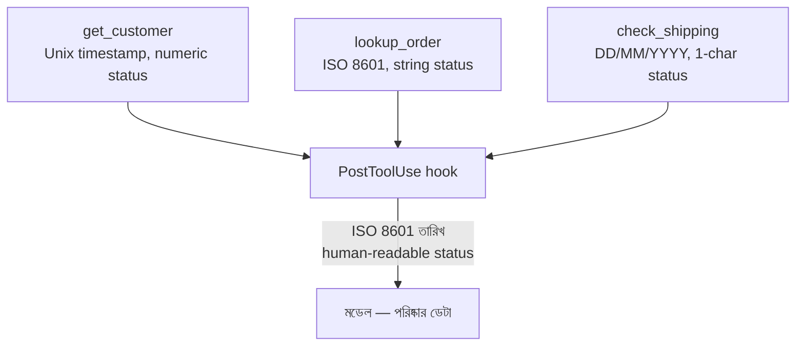

import ReadingProgress from '../../../../components/progress/ReadingProgress.astro';
import MarkComplete from '../../../../components/progress/MarkComplete.astro';
import KeywordTable from '../../../../components/content/KeywordTable.astro';
import ExamTrap from '../../../../components/content/ExamTrap.astro';
import BuildExercise from '../../../../components/content/BuildExercise.astro';
import Attribution from '../../../../components/content/Attribution.astro';

<ReadingProgress />

	Domain 1
	Task 1.5 · ওয়েট ২৭%
	মূল ইংরেজি: Agent SDK Hooks

## এই লেসনে যা জানতে হবে

Agent SDK hook এক সম্ভাব্যতাভিত্তিক সিস্টেমে ডিটারমিনিস্টিক আচরণ ঢোকায়। এরা মডেলের সিদ্ধান্ত আর বাস্তব জগতের ঠিক সীমানায় বসে, টুল কল ও ফল আটকে নিয়ে ব্যবসার নিয়ম খাটায় আর ডেটা নরমালাইজ করে। 1.4-এর enforcement spectrum মনে আছে? Hook-ই তার programmatic দিকটির বাস্তব রূপ।

## দুই ধরনের Hook

Agent SDK টুল এক্সিকিউশন লাইফসাইকেলের দুই বিন্দুতে hook দেয়:

**`PostToolUse`** টুল চলার পরে, কিন্তু মডেল ফল প্রসেস করার আগে চলে। এটি টুলের ফল আটকে নিয়ে মডেল দেখার আগেই রূপান্তর করে। ফলে কোন টুল ডেটা বানাল, তাতে কিছু যায় আসে না — মডেল সবসময় পরিষ্কার, normalized ডেটা পায়।

**`PreToolUse`** টুল চলার আগে চলে (একে tool-call interception-ও বলা হয়)। বাইরে যাওয়া টুল কল আটকে নিয়ে সেটি block, modify বা বিকল্প ওয়ার্কফ্লোতে redirect করতে পারে। Hook block করার সিদ্ধান্ত নিলে টুল আর চলে না।

### প্রতিটি hook কী ফেরত দেয়

Agent SDK-তে `PreToolUse` hook `permissionDecision` দিয়ে উত্তর দেয় — `allow`, `deny`, `ask` বা `defer` — আর ঐচ্ছিক `updatedInput`, যা টুল চলার আগে তার argument বদলে দেয়। `PostToolUse` hook `updatedToolOutput` সেট করে মডেল কী দেখবে তা বদলে দিতে পারে, built-in ও MCP টুল দুটোতেই। পুরনো `updatedMCPToolOutput` কেবল MCP টুলের জন্য ছিল, এখন deprecated।

একটি কথা কোনোটিই বদলায় না: `PostToolUse` চলার সময় টুল ইতিমধ্যে চলেই গেছে, তাই সেখানে block করলে লুপ থামে ঠিকই, কিন্তু side effect মুছে যায় না। (Agent SDK hooks guide, সেপ্টেম্বর ২০২৬-এ মিলিয়ে দেখা।)

<ExamTrap label="মূল ধারণা">
	

		<code>PostToolUse</code> এক্সিকিউশনের পরে ডেটা রূপান্তর করে। <code>PreToolUse</code> এক্সিকিউশনের আগে নীতি খাটায়। কোন hook কোন দিকে কাজ করে, তা গুলিয়ে ফেলবেন না — পরীক্ষা এই পার্থক্যটিই ধরে।
	

</ExamTrap>

## PostToolUse: ডেটা নরমালাইজেশন

ভিন্ন MCP টুল ভিন্ন ফরম্যাটে ডেটা দেয়। গ্রাহক-ডেটাবেস Unix timestamp (`1710489600`) দিতে পারে; order management সিস্টেম ISO 8601 তারিখ (`"2024-03-15T12:00:00Z"`); এক status API numeric code (`200`, `404`, `500`) আর আরেকটি string (`"active"`, `"cancelled"`, `"pending"`)।

নরমালাইজেশন ছাড়া মডেলকে প্রতিটি ইটারেশনে এই মিশ্র ফরম্যাট ব্যাখ্যা করতে হয়। তাতে অনিশ্চয়তা ঢোকে — একবার Unix timestamp ঠিকভাবে parse করে, পরেরবার ভুল পড়ে।

`PostToolUse` hook মডেল প্রসেস করার আগেই সব ফরম্যাট normalize করে সমস্যা মেটায়:

- Unix timestamp → ISO 8601 তারিখ
- numeric status code → মানুষের পড়ার মতো string
- currency value → currency code-সহ একরকম decimal ফরম্যাট
- নানা আঞ্চলিক ফরম্যাটের তারিখ-string → একটি আদর্শ ফরম্যাট

ফলে কোন টুল বা ব্যাকএন্ড ডেটা বানাল, তা নির্বিশেষে মডেল প্রতিবার পরিষ্কার, একরকম ডেটা পায়।

## PreToolUse: নীতি এনফোর্সমেন্ট

`PreToolUse` hook হলো 1.4-এ বর্ণিত prerequisite gate-এর বাস্তবায়ন-মেকানিজম। এটি বাইরে যাওয়া টুল কল আটকে নিয়ে ব্যবসার নিয়ম খাটায়:

**Refund threshold এনফোর্সমেন্ট।** Hook `process_refund`-এর সব কল আটকায়। Refund amount $500 ছাড়ালে hook কল block করে human escalation ওয়ার্কফ্লোতে পাঠায়। `process_refund` টুল আর চলে না — hook আগেই আটকে দেয়।

**কমপ্লায়েন্স prerequisite gate।** Hook `transfer_funds`-এর কল আটকায়। এই সেশনে দরকারি anti-money laundering (AML) check শেষ না হলে hook কল block করে এমন এরর দেয়, যা এজেন্টকে আগে AML check শেষ করতে পাঠায়।

**Manager approval ওয়ার্কফ্লো।** Hook ২০% ছাড়ের বেশি `approve_discount` কল আটকায়। Hook এক্সিকিউশন থামিয়ে অনুরোধ manager approval queue-তে পাঠায়। Manager অনুমোদনের পরেই টুল চলে।

<ExamTrap>
	

		<strong>নীতি-ভাঙা কাজ আটকাতে <code>PostToolUse</code> hook প্রস্তাব করা</strong> — ভুল। <code>PostToolUse</code> এক্সিকিউশনের পরে চলে; যে সময়ে তা fires, ততক্ষণে অনিয়মিত কাজটি হয়ে গেছে। আগে আটকাতে <code>PreToolUse</code> (pre-execution) hook ব্যবহার করুন।
	

</ExamTrap>

## সিদ্ধান্তের ফ্রেমওয়ার্ক

পরীক্ষার মূল মানসিক মডেল এই টেবিলটি:

| প্রয়োজন | মেকানিজম | গ্যারান্টি |
| --- | --- | --- |
| ১০০% সময় মানতেই হবে | Hook | ডিটারমিনিস্টিক |
| বেশিরভাগ সময় মানলেই চলে | Prompt | সম্ভাব্যতাভিত্তিক |

- এক ব্যর্থতায় ব্যবসার টাকা গেলে → hook।
- এক ব্যর্থতায় আইনি ঝুঁকি থাকলে → hook।
- ফরম্যাটিং পছন্দ বা style guideline হলে → prompt-based guidance ঠিক আছে।

পরীক্ষা যেখানে deterministic enforcement দরকার, সেখানে prompt-ভিত্তিক সমাধান বারবার ডিস্ট্র্যাক্টর হিসেবে দেয়। প্রশ্নটা "prompt কি যথেষ্ট ভালো?" নয় — প্রশ্নটা হলো, একবার ব্যর্থতার পরিণতি ডিটারমিনিস্টিক গ্যারান্টি দাবি করে কি না।

### Hook বনাম Prompt: পাশাপাশি

**পরিস্থিতি: আন্তর্জাতিক transfer-এর আগে AML check বাধ্যতামূলক।**

- Prompt পথ: "Always complete AML verification before processing international transfers." ৯৫% সময় কাজ করে। ৫% ব্যর্থতা মানে কিছু transfer AML check বাদ দিয়ে চলে যায় — নিয়ন্ত্রক লঙ্ঘন।
- Hook পথ: `PreToolUse` hook `aml_check` pass না ফেরানো পর্যন্ত `transfer_funds` আটকায়। ১০০% সময় কাজ করে। AML যাচাই ছাড়া কোনো transfer চলে না।

**পরিস্থিতি: উত্তর markdown-এ ফরম্যাট হবে।**

- Hook পথ: অকারণ ওভারহেড। ফরম্যাটিং পছন্দের জন্য deterministic enforcement লাগে না।

**পরিস্থিতি: $500-এর বেশি refund-এ মানুষের অনুমোদন লাগবে।**

- Prompt পথ: বেশিরভাগ সময় কাজ করে, কিন্তু এক ব্যর্থতায় বড় refund অনুমোদন ছাড়াই চলে যায়।
- Hook পথ: `process_refund` আটকে amount দেখে $500 ছাড়ালে block করে human escalation-এ পাঠায়। ১০০% সময় কাজ করে।

## বাস্তব উদাহরণ: ডেটা ফরম্যাটের বিশৃঙ্খলা

একটি সাপোর্ট এজেন্ট তিনটি MCP টুল ব্যবহার করে:

- `get_customer` তারিখ দেয় Unix timestamp-এ, status দেয় numeric code-এ।
- `lookup_order` তারিখ দেয় ISO 8601 string-এ, status দেয় ইংরেজি string-এ।
- `check_shipping` তারিখ দেয় "DD/MM/YYYY"-এ, status দেয় এক-অক্ষরের code-এ ("S" = shipped, "P" = pending)।

`PostToolUse` hook ছাড়া মডেলকে প্রতিটি ইটারেশনে তিন ফরম্যাটের তারিখ আর তিন রকম status ব্যাখ্যা করতে হয়। কখনো Unix timestamp ঠিকভাবে বদলায়, কখনো "DD/MM/YYYY"-এর দিন/মাস ক্রম গুলিয়ে ফেলে, কখনো "P"-কে "pending" না বুঝে "processed" ধরে নেয়।

`PostToolUse` hook থাকলে মডেল দেখার আগেই সব ফল normalize হয়ে যায়:

- সব তারিখ → ISO 8601 (`"2024-03-15T12:00:00Z"`)
- সব status code → পড়ার মতো string ("shipped", "pending", "delivered")

মডেল সবসময় একরকম ডেটা পায়, ফলে ব্যাখ্যার ভুল পুরোপুরি মুছে যায়।

<ExamTrap>
	

		<strong>১০০% কমপ্লায়েন্স দরকারে আরও জোরালো prompt নির্দেশ</strong> — prompt probabilistic compliance দেয়। আর্থিক কাজ, নিয়ন্ত্রক কমপ্লায়েন্স, নিরাপত্তা যাচাই — এসবে deterministic গ্যারান্টি কেবল hook দেয়।
	

</ExamTrap>

<ExamTrap>
	

		<strong>নরমালাইজেশনের জন্য <code>PostToolUse</code> hook-এর বদলে মডেলের উপর ছেড়ে দেওয়া</strong> — মডেলকে ভিন্ন ফরম্যাট ব্যাখ্যার দায়িত্ব দিলে অসামঞ্জস্য ঢোকে। Hook প্রতিবার পরিষ্কার ডেটা নিশ্চিত করে।
	

</ExamTrap>

<ExamTrap>
	

		<strong>Hook-এর দিক গুলিয়ে ফেলা</strong> — <code>PostToolUse</code> টুল চলার পরে result রূপান্তর করে, <code>PreToolUse</code> টুল চলার আগে call block বা modify করে। উল্টো hook ব্যবহার করলে হয় প্রতিরোধের সুযোগ হাতছাড়া হয়, নয় হয়ে যাওয়া কাজ অকারণে আটকায়।
	

</ExamTrap>

<KeywordTable keywords={frontmatter.keywords} />

## প্র্যাকটিস সিনারিও (নিজে উত্তর ভাবুন, তারপর খুলুন)

> একটি এজেন্ট মাঝে মাঝে AML check ছাড়াই আন্তর্জাতিক transfer চালায়। কমপ্লায়েন্স দল প্রতিটি আন্তর্জাতিক transfer-এর আগে ১০০% AML enforcement দাবি করে। বর্তমান prompt প্রায় ৯৫% সময় কাজ করে। সঠিক পথ কী?

	
উত্তর দেখুন

	**সঠিক উত্তর:** একটি `PreToolUse` hook, যা `aml_check` verified pass ফেরানো পর্যন্ত `transfer_funds` টুল আটকায়।

	**কেন বাকিগুলো ভুল:**

	- *System prompt-এ বিস্তারিত AML নির্দেশ ও জরিমানার সতর্কতা* — probabilistic; ১০০% গ্যারান্টি দিতে পারে না।
	- *`PostToolUse` hook দিয়ে সম্পন্ন transfer flag করে manual review-তে পাঠানো* — transfer ইতিমধ্যে হয়ে গেছে; নিয়ন্ত্রক লঙ্ঘন ঠেকানো হয়নি।
	- *Few-shot উদাহরণ দিয়ে training* — সম্ভাবনা বাড়ায়, তবে deterministic গ্যারান্টি নয়।

<BuildExercise
	title="নরমালাইজেশন ও নীতি এনফোর্সমেন্টে Agent SDK Hook"
	difficulty="Advanced"
	time="৬০ মিনিট"
	objectives={[
		'PostToolUse (নরমালাইজেশন) আর PreToolUse (নীতি) এর কাজের দিক আলাদা করা',
		'PreToolUse দিয়ে prerequisite gate বাস্তবায়ন',
		'PostToolUse দিয়ে ভিন্ন ফরম্যাটের ডেটা এক করা',
		'কখন hook, কখন prompt — সিদ্ধান্তের ফ্রেমওয়ার্ক খাটানো',
	]}
	steps={[
		{
			title:
				'তিনটি MCP-স্টাইল টুল বানান, যেগুলো একই তথ্য তিন রকম ফরম্যাটে দেয় (Unix timestamp, ISO 8601, DD/MM/YYYY; numeric ও string status)।',
			why: 'ফরম্যাট-বৈচিত্র্যই দেখায় মডেলের উপর ছাড়লে অনিশ্চয়তা কেন ঢোকে।',
			expect: 'তিনটি টুল, প্রতিটি আলাদা ফরম্যাটে result দেয় — hook ছাড়া মডেলকে মিশ্র ডেটা পড়তে হয়।',
		},
		{
			title:
				'একটি PostToolUse hook লিখুন, যা সব তারিখ ISO 8601-এ আর সব status code human-readable string-এ বদলে দেয়।',
			why: 'পরীক্ষা ধরে PostToolUse-এর কাজ result রূপান্তর, আর model-side transformation ভুল উত্তর।',
			expect: 'Hook-এর পর মডেল সবসময় এক ফরম্যাটের তারিখ ও status পায়, কোন টুল ডেটা দিক না কেন।',
		},
		{
			title:
				'process_refund-এর জন্য একটি PreToolUse hook বসান, যা $500-এর বেশি refund আটকে human escalation-এ পাঠায়।',
			why: 'এখানেই deterministic enforcement — টুল চলে না, তাই অননুমোদিত refund-এর সুযোগই নেই।',
			expect: 'বড় refund কল deny/permissionDecision-এ আটকায়; escalation ওয়ার্কফ্লো চালু হয়।',
		},
		{
			title:
				'AML prerequisite gate বানান: aml_check pass না হলে transfer_funds আটকে যায় এবং এরর মেসেজে আগে AML চালানোর নির্দেশ থাকে।',
			why: 'পরীক্ষা এই প্যাটার্নটিই ধরে — block + দিকনির্দেশক এরর, যাতে এজেন্ট সঠিক ধাপে ফেরে।',
			expect: 'AML ছাড়া transfer কখনো চলে না; আটকালে এরর এজেন্টকে aml_check-এ পাঠায়।',
		},
		{
			title:
				'শেষে এমন একটি ক্ষেত্রে হুক না দিয়ে prompt-ভিত্তিক নির্দেশ রাখুন, যেটি কম-ঝুঁকির।',
			why: 'ফ্রেমওয়ার্ক অভ্যাস করতে — সব জায়গায় hook মানে অকারণ ওভারহেড; ফরম্যাটিং পছন্দে prompt-ই যথেষ্ট।',
			expect: 'কম-ঝুঁকির নিয়ম prompt-এ, high-stakes নিয়ম hook-এ — এবং কেন তা স্পষ্ট।',
		},
	]}
/>

## সূত্র

<ul>
	{frontmatter.sources.map((source) => (
		<li>
			<a href={source.href} target="_blank" rel="noopener noreferrer">
				{source.label}
			</a>
			{source.note ? ` — ${source.note}` : ''}
		</li>
	))}
</ul>

<Attribution sourceUrl={frontmatter.sourceUrl} updated={frontmatter.updated} />

<MarkComplete lessonId="1-5" />
