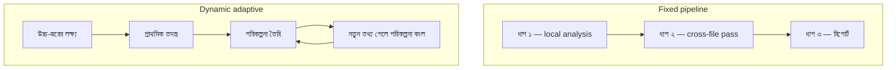

import ReadingProgress from '../../../../components/progress/ReadingProgress.astro';
import MarkComplete from '../../../../components/progress/MarkComplete.astro';
import KeywordTable from '../../../../components/content/KeywordTable.astro';
import ExamTrap from '../../../../components/content/ExamTrap.astro';
import BuildExercise from '../../../../components/content/BuildExercise.astro';
import Attribution from '../../../../components/content/Attribution.astro';

<ReadingProgress />

	Domain 1
	Task 1.6 · ওয়েট ২৭%
	মূল ইংরেজি: Task Decomposition Strategies

## এই লেসনে যা জানতে হবে

কাজ ভাঙা মানে জটিল কাজকে এমন টুকরো করা, যা এজেন্টিক সিস্টেম সত্যিই সামলাতে পারে। পরীক্ষা দুইটি প্যাটার্ন ধরে এবং সামনের কাজটি দেখে সঠিকটি বাছতে বলে। ভুল বাছলে কাজ পূর্বানুমেয় ভঙ্গিতে ক্ষতিগ্রস্ত হয়। সাথে আরেকটি নির্দিষ্ট ব্যর্থতার ধরনও পরীক্ষা হয় — **attention dilution** — যা decomposition খুব অগভীর হলে দেখা দেয়।

## প্যাটার্ন ১: Fixed Sequential Pipeline (Prompt Chaining)

Fixed sequential pipeline কাজকে আগেই ঠিক করা ধাপে ভাগ করে, যা ক্রমানুসারে চলে। প্রতিটি ধাপ আগের ধাপের output ইনপুট হিসেবে নেয়।

**কীভাবে কাজ করে:** ওয়ার্কফ্লো আগেই নির্ধারিত। ধাপ ১ চলে, তার output ধাপ ২-এ যায়, ধাপ ২-এর output ধাপ ৩-এ — এই ক্রম মাঝের ফল দেখে বদলায় না।

**উদাহরণ — কোড রিভিউ pipeline:**

- প্রতিটি ফাইলে একটি করে local analysis pass (style, bug, complexity)।
- সব local pass শেষে একটি cross-file integration pass (data flow, API consistency, import chain)।
- ফলগুলো একটি সম্মিলিত রিভিউ রিপোর্টে সাজানো।

**কোথায় ভালো:** পূর্বানুমেয়, স্ট্রাকচার্ড কাজে যেখানে ধাপগুলো আগেই জানা। কোড রিভিউ, document processing, data extraction pipeline, compliance check — সব এই প্যাটার্নে ফিট করে।

**সুবিধা:** সামঞ্জস্যপূর্ণ ও নির্ভরযোগ্য। একই ইনপুট সবসময় একই পথে চলে। ডিবাগ করা সহজ — কোন ধাপ কোন output দিল তা জানা যায়। মনিটর করাও সহজ — প্রতি ধাপের output লগ করা যায়।

**সীমাবদ্ধতা:** অপ্রত্যাশিত ফলের সাথে খাপ খায় না। ধাপ ২ যদি এমন কিছু পায় যা ধাপ ৩-এর পথ বদলানো উচিত, pipeline তা করতে পারে না। পথে যা-ই মিলুক, ধাপগুলো স্থির।

## প্যাটার্ন ২: Dynamic Adaptive Decomposition

Dynamic adaptive decomposition প্রতিটি ধাপে যা আবিষ্কৃত হয় তার ভিত্তিতে উপকাজ বানায়। এজেন্ট সমস্যা যত বেশি বোঝে, পরিকল্পনা তত বদলায়।

**কীভাবে কাজ করে:** এজেন্ট একটি উচ্চ-স্তরের লক্ষ্য নিয়ে শুরু করে, প্রাথমিক তদন্ত চালায়, তারপর যা পায় তার উপর ভিত্তি করে পরিকল্পনা বানায়। পরিকল্পনা চালাতে গিয়ে নতুন তথ্য মেলে, যা বাকি ধাপ বদলে দিতে পারে। এজেন্ট তখন পরিকল্পনা বদলায়।

**উদাহরণ — পুরনো codebase-এ টেস্ট যোগ করা:**

- Codebase গঠন মানচিত্রায়ন (directory, module, dependency)।
- উচ্চ-প্রভাব এলাকা চিহ্নিত করা (বেশি ব্যবহৃত module, বেশি bug-এর module, untested critical path)।
- মানচিত্র থেকে অগ্রাধিকারভিত্তিক test plan তৈরি।
- টেস্ট লেখা শুরু। ধরা পড়ল Module A নির্ভর করে Module B-এর উপর, যার কোনো টেস্ট নেই।
- অগ্রাধিকার বদল: আগে Module B-এর টেস্ট, যাতে Module A-র টেস্ট ভরসা করতে পারে।
- নতুন dependency ও সমস্যা যত আসে, তত খাপ খাওয়ানো চালু রাখা।

**কোথায় ভালো:** open-ended investigation যেখানে শুরুতে পুরো পরিসর জানা নেই। Legacy system exploration, security audit, research project, অপরিচিত codebase ডিবাগ — সবখানে এই প্যাটার্ন উপকারী।

**সুবিধা:** সমস্যার সাথে খাপ খায়। অপ্রত্যাশিত জটিলতা খুঁজে পেয়ে সাড়া দিতে পারে। Open-ended কাজে বেশি পূর্ণাঙ্গ ফল দেয়, কারণ আগেই ঠিক করা পরিকল্পনায় চাপিয়ে দেওয়া হয় না।

**সীমাবদ্ধতা:** কম পূর্বানুমেয়। যা মেলে তার উপর নির্ভর করে সময় বদলায়। শেষ হতে কত লাগবে বা কত রিসোর্স লাগবে, তা অনুমান করা কঠিন। গোলযোগ হলে ডিবাগও কঠিন।

<ExamTrap label="মূল ধারণা">
	

		Fixed sequential pipeline (prompt chaining) পূর্বানুমেয়, স্ট্রাকচার্ড কাজে সেরা — সামঞ্জস্য ও নির্ভরযোগ্যতা দেয়, কিন্তু এক্সিকিউশনের মাঝে অপ্রত্যাশিত ফলের সাথে খাপ খেতে পারে না।
	

</ExamTrap>

## সঠিক প্যাটার্ন বাছা

পরীক্ষা কাজের বৈশিষ্ট্যের সাথে প্যাটার্ন মেলানোর দক্ষতা দেখে:

| কাজের বৈশিষ্ট্য | প্যাটার্ন | কারণ |
| --- | --- | --- |
| ধাপ আগেই জানা, ইনপুট স্ট্রাকচার্ড | Fixed pipeline | সামঞ্জস্য ও নির্ভরযোগ্যতাই বড় কথা |
| Open-ended, পরিসর অজানা | Dynamic decomposition | সমস্যা পুরো সংজ্ঞায়িত না হলে খাপ খাওয়ানো অপরিহার্য |
| Multi-file code review | Fixed pipeline | Per-file analysis + cross-file integration পূর্বানুমেয় |
| Legacy codebase exploration | Dynamic decomposition | তদন্তের সময়ই dependency ও সমস্যা ফুটে ওঠে |
| Document extraction | Fixed pipeline | ফিল্ড ও ফরম্যাট আগেই ঠিক |
| অপরিচিত সিস্টেম ডিবাগ | Dynamic decomposition | মূল কারণ অজানা; তদন্তকে বদলাতে হয় |

<ExamTrap>
	

		<strong>Open-ended investigation-এ fixed pipeline বা স্ট্রাকচার্ড processing-এ dynamic decomposition চালিয়ে দেওয়া</strong> — কাজের বৈশিষ্ট্য দেখে প্যাটার্ন বাছুন, "যেটি বেশি আধুনিক শোনায়" তা নয়।
	

</ExamTrap>

## Attention Dilution সমস্যা

Attention dilution একটি নির্দিষ্ট ব্যর্থতার ধরন, যা ঘটে যখন এজেন্ট এক pass-এ অনেক আইটেম প্রসেস করে। ফলে গভীরতা অসমান হয় — কিছু আইটেমে গভীর বিশ্লেষণ, অন্যত্র চোখে-পড়া সমস্যাও বাদ।

লক্ষণগুলো:

- প্রথম কয়েকটি ফাইলে বিস্তারিত মন্তব্য, পরে ক্রমশ উপরিতলের বিশ্লেষণ।
- একটি ফাইলের প্যাটার্নে সমস্যা ধরা, অথচ অন্য ফাইলে হুবহু একই কোড অনুমোদিত।
- কিছু ফাইলে স্পষ্ট bug বাদ পড়ে, আর অন্য ফাইলে ছোট style সমস্যা ধরা পড়ে।

**কেন হয়:** মডেল কনটেক্সটের সব আইটেমে মনোযোগ ভাগ করে। আইটেম বেশি হলে প্রতি আইটেমে মনোযোগ কমে। শুরুর আইটেম বেশি মনোযোগ পায়, শেষের আইটেমগুলো উপরিতলে পড়া হয়।

**সমাধান — multi-pass architecture।** কাজ দুই স্তরে ভাগ করুন:

- **Per-item local analysis pass:** প্রতিটি ফাইল (বা ডকুমেন্ট, বা module) আলাদা pass-এ বিশ্লেষণ করুন। প্রতি pass-এ পুরো মনোযোগ-বাজেট একটিমাত্র আইটেমে থাকে।
- **Cross-item integration pass:** সব local pass শেষে আলাদা একটি pass চালান, যা সব আইটেম মিলিয়ে আইটেম-ছাড়ানো বিষয় (data flow সমস্যা, অসামঞ্জস্যপূর্ণ প্যাটার্ন, cross-file dependency) খোঁজে।

Per-item pass-গুলো প্রতিটি আইটেমে সমান মনোযোগ দেয়, তাই local সমস্যা নিয়মিত ধরা পড়ে। Integration pass আইটেম-মধ্যবর্তী সম্পর্কে মনোযোগ দেয়, কারণ সবকিছু একসাথে করতে চেষ্টা করে না।

## বাস্তব উদাহরণ: ১৪ ফাইলের কোড রিভিউ

একটি কোড রিভিউ এজেন্ট এক pass-এ ১৪টি ফাইল প্রসেস করল। ফল:

- ফাইল ১-৫: নির্দিষ্ট line reference, bug চিহ্নিতকরণ আর উন্নতির সুপারিশসহ বিস্তারিত মন্তব্য।
- ফাইল ৬-৯: কিছু সমস্যা ধরা পড়ল, কিন্তু বিশ্লেষণ কম গভীর।
- ফাইল ১০-১৪: উপরিতলের মন্তব্য — স্পষ্ট null pointer bug আর SQL injection ঝুঁকিও বাদ পড়ল।
- ফাইল ৩-এ একটি `forEach` loop অদক্ষ বলে চিহ্নিত, অথচ ফাইল ১১-এর হুবহু একই কোডে কোনো মন্তব্য নেই।

এটাই attention dilution। সমাধান আরও শক্তিশালী মডেল নয়, বড় context window নয়, আরও বিস্তারিত prompt নয়। সমাধান কাঠামোগত: ১৪টি আলাদা per-file analysis pass (প্রতিটি একটি ফাইলে মনোযোগী) এবং একটি cross-file integration pass (সব ফাইলে data flow ও pattern consistency যাচাই)।

Multi-pass পদ্ধতি ফাইল ১০-১৪-এর null pointer bug ধরবে (প্রতিটি ফাইল নিজের pass পায়) এবং অসামঞ্জস্যপূর্ণ `forEach` মূল্যায়নও চিহ্নিত করবে (integration pass বিশেষভাবে cross-file pattern consistency দেখে)।

<ExamTrap>
	

		<strong>Attention dilution-এর সমাধান হিসেবে আরও শক্তিশালী মডেল বা বড় context window</strong> — এটি আর্কিটেকচারাল সমস্যা, মডেল-সামর্থ্যের নয়। এক pass-এ বেশি আইটেম দিলে গভীরতা অসমান হবে, মডেল যতই শক্তিশালী হোক।
	

</ExamTrap>

<ExamTrap>
	

		<strong>ভালো prompt দিয়ে single-pass রিভিউকে multi-pass-এর সমান ভাবা</strong> — ভালো prompt গড় মান বাড়ায়, কিন্তু মনোযোগ-বণ্টনের মূল সমস্যা মেটায় না। প্রতিটি আইটেমে নিবেদিত মনোযোগ কেবল multi-pass-ই নিশ্চিত করে।
	

</ExamTrap>

<ExamTrap>
	

		<strong>ফাইলগুলো batch-এ ভাগ করে cross-file integration pass না দেওয়া</strong> — Batch ভাগ করলে batch-এর ভেতরের চাপ কমে, কিন্তু cross-batch সমস্যা থেকে যায়।
	

</ExamTrap>

<KeywordTable keywords={frontmatter.keywords} />

## প্র্যাকটিস সিনারিও (নিজে উত্তর ভাবুন, তারপর খুলুন)

> একটি কোড রিভিউ এজেন্ট ১৪টি ফাইল প্রসেস করে প্রথম ৫টিতে বিস্তারিত মন্তব্য দেয়, কিন্তু ফাইল ১০-১৪-এর স্পষ্ট bug বাদ দেয়। আবার এক ফাইলের `forEach` loop অদক্ষ বলে চিহ্নিত করে, অথচ অন্য ফাইলে হুবহু একই কোড অনুমোদন করে। মূল কারণ ও সবচেয়ে উপযুক্ত সমাধান কী?

	
উত্তর দেখুন

	**সঠিক উত্তর:** কারণ attention dilution; সমাধান multi-pass আর্কিটেকচার — প্রতি ফাইলে আলাদা local analysis pass, তারপর একটি cross-file integration pass।

	**কেন বাকিগুলো ভুল:**

	- *প্রতি batch-এ ৫টি ফাইল করে ভাগ করা* — Batch ভাগ করলে cross-batch সমস্যা (যেমন ফাইল ৩ বনাম ১১-এর অসামঞ্জস্য) ধরা পড়বে না, কারণ integration pass নেই।
	- *বড় context window-র মডেলে আপগ্রেড* — মনোযোগ-বণ্টনের সমস্যা কনটেক্সট সাইজ দিয়ে মেটে না।
	- *সব ফাইল সমান গভীরে দেখতে জোরালো system prompt* — গড় মান কিছু বাড়তে পারে, কিন্তু নিবেদিত মনোযোগের গ্যারান্টি দেয় না।

<BuildExercise
	title="দুই decomposition প্যাটার্ন ও Multi-Pass রিভিউ"
	difficulty="Advanced"
	time="৬০ মিনিট"
	objectives={[
		'কাজের বৈশিষ্ট্য দেখে fixed ও dynamic প্যাটার্ন বাছা',
		'Attention dilution-এর লক্ষণ চেনা',
		'Per-item local pass + cross-item integration pass সাজানো',
		'ভুল সমাধান (বড় মডেল, বড় কনটেক্সট, জোরালো prompt) চিনে বাদ দেওয়া',
	]}
	steps={[
		{
			title:
				'একটি fixed sequential pipeline বানান: প্রতি ফাইলে local analysis pass, তারপর একটি cross-file integration pass, শেষে সম্মিলিত রিপোর্ট।',
			why: 'পূর্বানুমেয় কাজে এই ক্রমই নির্ভরযোগ্য — ডিবাগ ও মনিটর করা সহজ।',
			expect: 'ক্রম আগেই নির্ধারিত; প্রতি ধাপের output পরের ধাপে যায়, মাঝের ফল দেখে ক্রম বদলায় না।',
		},
		{
			title:
				'একটি open-ended কাজ (যেমন অপরিচিত codebase-এ টেস্ট যোগ) dynamic adaptive decomposition দিয়ে সাজান।',
			why: 'শুরুতে পুরো পরিসর অজানা থাকলে পরিকল্পনা চলতে চলতে বদলাতে হয়।',
			expect: 'প্রাথমিক তদন্ত → পরিকল্পনা → নতুন তথ্যে অগ্রাধিকার বদল, এই চক্র স্পষ্ট।',
		},
		{
			title:
				'১৪টি ফাইল এক pass-এ দিয়ে attention dilution তৈরি করুন এবং লক্ষণগুলো লগে দেখুন।',
			why: 'লক্ষণ নিজে দেখলে বোঝা যায় সমস্যাটি মডেল-সামর্থ্যের নয়, আর্কিটেকচারের।',
			expect: 'শুরুর ফাইলে গভীর, শেষের ফাইলে উপরিতল বিশ্লেষণ; একই কোড একবার সমস্যা, একবার অনুমোদিত।',
		},
		{
			title:
				'এবার ১৪টি আলাদা per-file pass আর একটি cross-file integration pass দিয়ে রিভিউ স্ক্রিপ্ট ভাগ করুন।',
			why: 'প্রতিটি আইটেম নিজের মনোযোগ-বাজেট পেলে গভীরতা সমান হয়; integration pass cross-file সমস্যা ধরে।',
			expect: 'বাকি ফাইলগুলোর bug ধরা পড়ে; ফাইল ৩ ও ১১-এর অসামঞ্জস্যও integration pass চিহ্নিত করে।',
		},
		{
			title:
				'পর্যায়ে দুই প্যাটার্নের ফল তুলনা করে একটি ছোট সিদ্ধান্ত-নোট লিখুন — কোন কাজে কোনটি, কেন।',
			why: 'পরীক্ষা প্যাটার্ন-বাছাই সরাসরি ধরে; নিয়মটি নিজের ভাষায় লিখলে স্থায়ী হয়।',
			expect: 'স্ট্রাকচার্ড কাজ → fixed pipeline; open-ended → dynamic — দুই কারণসহ লেখা।',
		},
	]}
/>

## সূত্র

<ul>
	{frontmatter.sources.map((source) => (
		<li>
			<a href={source.href} target="_blank" rel="noopener noreferrer">
				{source.label}
			</a>
			{source.note ? ` — ${source.note}` : ''}
		</li>
	))}
</ul>

<Attribution sourceUrl={frontmatter.sourceUrl} updated={frontmatter.updated} />

<MarkComplete lessonId="1-6" />
