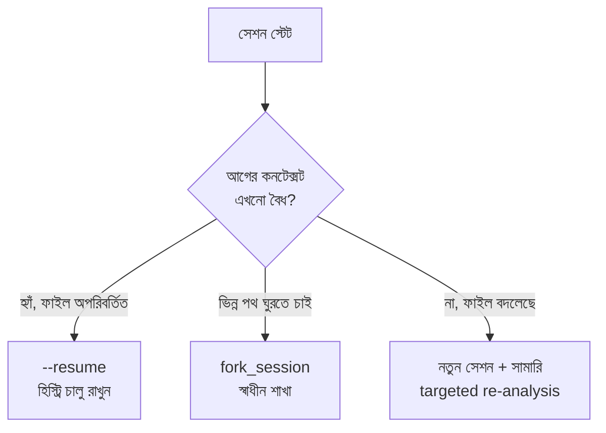

import ReadingProgress from '../../../../components/progress/ReadingProgress.astro';
import MarkComplete from '../../../../components/progress/MarkComplete.astro';
import KeywordTable from '../../../../components/content/KeywordTable.astro';
import ExamTrap from '../../../../components/content/ExamTrap.astro';
import BuildExercise from '../../../../components/content/BuildExercise.astro';
import Attribution from '../../../../components/content/Attribution.astro';

<ReadingProgress />

	Domain 1
	Task 1.7 · ওয়েট ২৭%
	মূল ইংরেজি: Session State and Resumption

## এই লেসনে যা জানতে হবে

সেশন ম্যানেজমেন্ট ঠিক করে একটি এজেন্ট কাজ-সেশন থেকে সেশনান্তরে ধারাবাহিকতা কীভাবে রাখবে। দীর্ঘ কাজে — জটিল সিস্টেম ডিবাগ, বড় codebase রিভিউ, কয়েক দিনের গবেষণা — এজেন্টের কনটেক্সটে tool result, ফাইল-বিশ্লেষণ আর reasoning chain জমতে থাকে। Task Statement 1.7 ধরে এই সঞ্চিত অবস্থা কীভাবে সামলাবেন: কখন চালু রাখবেন, কখন শাখা বানাবেন, কখন নতুন শুরু করবেন।

## সেশন ম্যানেজমেন্টের তিনটি পথ

Agent SDK ও Claude Code তিনটি পথ দেয়। প্রতিটি আলাদা কাজ করে, আর পরীক্ষা সামনের পরিস্থিতি দেখে সঠিকটি বাছতে বলে।

### পথ ১: `--resume <session-name>`

Resume একটি নির্দিষ্ট নামযুক্ত সেশন যেখানে ছিল সেখান থেকেই চালায়। পুরো conversation history ফিরে আসে — সব tool result, বিশ্লেষণ আর reasoning সহ।

**কখন ব্যবহার করবেন:** আগের কনটেক্সট বেশিরভাগই এখনো বৈধ। শেষ সেশনের পর ফাইলগুলো তেমন বদলায়নি। যেখানে থেমেছিলেন ঠিক সেখান থেকেই ধরতে চান।

**কখন ব্যবহার করবেন না:** শেষ সেশনের পর ফাইল বদলেছে। হিস্ট্রির tool result আর codebase-এর বর্তমান অবস্থা মেলে না। ফলে নিচের stale context সমস্যা দেখা দেয়।

**বর্তমান অবস্থা — সেশনের নাম কোথা থেকে আসে:** `--resume` কেবল আগেই-থাকা সেশনেই চলে — এটি session ID বা নাম নেয়, বা interactive picker খোলে, কিন্তু নতুন সেশন বানায় না। বর্তমান CLI-তে সেশন শুরু করার সময় নাম দিতে হয় `--name` / `-n` (বা চলার মধ্যে `/rename`) দিয়ে, পরে সেটি চালু রাখতে হয় `claude --resume <name>`. এছাড়া আছে `-c` / `--continue`, যা নাম ছাড়াই বর্তমান ডিরেক্টরির সবচেয়ে সাম্প্রতিক কথোপকথন চালু করে। (Claude Code CLI reference, জুলাই ২০২৬-এ মিলিয়ে দেখা।)

### পথ ২: `fork_session`

Fork শেয়ার্ড বিশ্লেষণ-বেসলাইন থেকে স্বাধীন শাখা বানায়। Fork-এর পর প্রতিটি শাখা স্বাধীনভাবে চলে — একটির পরিবর্তন অন্যটিকে ছোঁয় না, শাখারা একে অন্যের ফল দেখে না।

SDK-তে এটি resume-এর বদলে নয়, পাশে সেট করতে হয়: `resume` সেশন বাছে, আর `fork_session: true` সেই হিস্ট্রির কপি থেকে নতুন সেশন শুরু করে, যোগ করে না। CLI-তে `--fork-session` একইভাবে `--resume`-এর সাথে জোড়া লাগে। (Agent SDK sessions guide, সেপ্টেম্বর ২০২৬-এ মিলিয়ে দেখা; বিস্তারিত নোট Lesson 1.3-এ।)

**কখন ব্যবহার করবেন:** প্রাথমিক বিশ্লেষণ শেষ, এখন সেই একই সূচনা-বিন্দু থেকে ভিন্ন পথ ঘুরে দেখতে চান। যেমন codebase বিশ্লেষণের পর দুই refactoring strategy তুলনা করতে fork।

**কখন ব্যবহার করবেন না:** একই তদন্তের ধারা চালু রাখতে চাইলে। Fork ভিন্নতার জন্য, ধারাবাহিকতার জন্য নয়। বিকল্প তুলনা করছেন না মানে resume।

### পথ ৩: সামারি ইনজেক্ট করে নতুন শুরু

একেবারে নতুন সেশন শুরু করুন, কিন্তু আগের সেশনের ফলাফলের একটি স্ট্রাকচার্ড সামারি প্রাথমিক কনটেক্সটে ঢুকিয়ে দিন। নতুন সেশনে কোনো বাসি tool result নেই — শুধু আপনি দেওয়া curated সামারি।

**কখন ব্যবহার করবেন:** আগের সেশনের tool result বাসি (ফাইল বদলেছে, API আপডেট হয়েছে, dependency সরে গেছে)। দীর্ঘ সেশনে কনটেক্সট ডিগ্রেড হয়েছে (প্রয়োজনহীন tool result-এ হিস্ট্রি ভরে গেছে)। জ্ঞান ধরে রেখে পরিষ্কার বেসলাইন দরকার।

**কখন ব্যবহার করবেন না:** আগের কনটেক্সট এখনো বৈধ আর পুরো conversation history রাখতে চান। সেক্ষেত্রে resume বেশি দক্ষ।

<ExamTrap label="মূল ধারণা">
	

		তিনটি পথ, তিনটি উদ্দেশ্য: চালিয়ে যেতে <code>resume</code>, ভিন্ন পথ ঘুরতে <code>fork</code>, আর আগের tool result বাসি হলে সামারি-ইনজেক্ট করা নতুন শুরু।
	

</ExamTrap>

## Stale Context সমস্যা

এই task statement-এর কেন্দ্রীয় ধারণা। সেশন resume করার পর এজেন্ট যখন ফাইল-পরিবর্তনের পরেও পুরনো tool result থেকে যুক্তি আঁকে, যা বর্তমান অবস্থা প্রতিফলিত করে না — সেটাই stale context সমস্যা।

**কীভাবে ফুটে ওঠে:** এক ডেভেলপার Claude Code দিয়ে codebase বিশ্লেষণ করেন। এরপর ৩টি ফাইল বদলে সেশন resume করেন। Claude ওই ৩ ফাইল নিয়ে পরস্পরবিরোধী পরামর্শ দেন — এমন পরিবর্তনের সুপারিশ করেন যা ইতিমধ্যে হয়ে গেছে, বা এমন কোডের কথা বলেন যা আর নেই — কারণ তিনি হিস্ট্রিতে থাকা পুরনো tool ফল দেখে ভাবছেন।

**কেন হয়:** সেশন resume করলে পুরো conversation history ফিরে আসে, আগের সেশনের প্রতিটি tool result সহ। আগে কোনো ফাইল পড়া হলে আর তারপর তা বদলালে, পুরনো ফাইল-বিষয়বস্তু tool result হিসেবে কথোপকথনে রয়ে যায়। মডেল সেই বাসি ডেটার পাশে নতুন ডেটাও দেখে যুক্তি করে, ফলে পরস্পরবিরোধ আসে।

**সহজ fix যা যথেষ্ট নয়:** সেশন resume করে এজেন্টকে শুধু বদলানো ফাইলগুলো আবার পড়তে বলা। কিছু না করার চেয়ে ভালো, কিন্তু বাসি tool result হিস্ট্রিতে রয়ে যায়। মডেল তখনো কনটেক্সটের পুরনো তথ্য ধরে যুক্তি করতে পারে, বিশেষত এমন সিদ্ধান্তে যা বদলানো ফাইলের সাথে সরাসরি জড়িত নয়।

**সঠিক fix:** আগের ফলাফলের স্ট্রাকচার্ড সামারি নিয়ে নতুন সেশন শুরু করুন। কোন ফাইলগুলো বদলেছে তা বলে দিন, যাতে এজেন্ট ওই ফাইলগুলোতে targeted re-analysis করতে পারে। নতুন সেশনে বাসি tool result নেই, আর ইনজেক্ট করা সামারি বাসি ডেটা ছাড়াই আগের জ্ঞান ধরে রাখে।

<ExamTrap>
	

		<strong>ফাইল বদলের পর resume করার পর শুধু "আবার পড়ে নাও" বলা</strong> — পরীক্ষায় এটাই সবচেয়ে ভালো উত্তর নয়। বাসি ফল হিস্ট্রিতে থেকে যুক্তিকে প্রভাবিত করে; সামারি-ইনজেক্ট করা নতুন শুরু বেশি নির্ভরযোগ্য।
	

</ExamTrap>

## Targeted Re-Analysis বনাম Full Re-Exploration

ফাইল বদলালে এজেন্টকে পুরো codebase আবার বিশ্লেষণ করাতে হয় না — সেটা অপচয়। ৩টি ফাইল বদলানোর জন্য ৫০টি আবার পড়া মানে সময়ের অপচয়।

সঠিক পথ targeted re-analysis: কোন ফাইলগুলো বদলেছে তা বলে দিন, এজেন্ট শুধু সেগুলো আবার বিশ্লেষণ করবে। আগের সেশনের সামারি বাকি সব কিছু ঢেকে রাখে।

বাস্তবে targeted re-analysis এমন দেখায়:

- নতুন সেশন শুরু করুন।
- স্ট্রাকচার্ড সামারি ইনজেক্ট করুন: "Prior analysis found X, Y, and Z across the codebase. The following 3 files have been modified since: auth.ts, database.ts, and api-routes.ts."
- এজেন্ট কেবল ৩টি বদলানো ফাইল আবার পড়ে ও বিশ্লেষণ করে।
- বদলানো ফাইলের টাটকা বিশ্লেষণ আর অপরিবর্তিত ফাইলের সংরক্ষিত সামারি একসাথে মেলায়।

এটি পুরো re-exploration-এর চেয়ে দ্রুত, আর বাসি কনটেক্সট নিয়ে resume করার চেয়ে নির্ভরযোগ্য।

### কখন কোনটি: সিদ্ধান্তের ম্যাট্রিক্স

| পরিস্থিতি | সেরা পথ | কারণ |
| --- | --- | --- |
| গতকালের কাজ চালু রাখা, ফাইল বদলায়নি | `--resume` | আগের কনটেক্সট বৈধ, পুরো হিস্ট্রি কাজে লাগে |
| দুই refactoring পদ্ধতি তুলনা | `fork_session` | শেয়ার্ড বেসলাইন থেকে ভিন্ন পথ |
| ৫০ ফাইলের ৩টি বদলে গেছে | নতুন শুরু + সামারি | বদলানো ফাইলের বাসি ফল পরস্পরবিরোধ ঘটায় |
| দীর্ঘ সেশন, হিস্ট্রি ভরা | নতুন শুরু + সামারি | ডিগ্রেড কনটেক্সটে পরিষ্কার বেসলাইন ভালো |
| testing বনাম documentation strategy ঘুরে দেখা | `fork_session` | একই বিশ্লেষণ থেকে দুই স্বাধীন পথ |
| dependency আপডেটের পর ফেরা | নতুন শুরু + সামারি | পরোক্ষভাবে অনেক ফাইল বদলাতে পারে |

## বাস্তব উদাহরণ: পরস্পরবিরোধী পরামর্শের বাগ

এক ডেভেলপার দুই দিন ধরে Claude Code দিয়ে ৫০ ফাইলের codebase বিশ্লেষণ করেন। দিন ১-এ authentication module বিশ্লেষণ করে তিনটি সমস্যা পান। রাতের মধ্যে তিনটি সমস্যাই `auth.ts`, `session.ts` ও `middleware.ts` বদলে ঠিক করে ফেলেন।

দিন ২-এ তিনি সেশন resume করেন। Claude সেই তিনটি ইতিমধ্যে-ঠিক-করা সমস্যা ঠিক করার সুপারিশ করেন — কারণ unfixed কোড দেখানো পুরনো tool result তখনো হিস্ট্রিতে আছে। আরও খারাপ, `auth.ts`-এর বর্তমান অবস্থা জিজ্ঞাসা করলে Claude পরস্পরবিরোধী উত্তর দেন — কখনো পুরনো কোড (বাসি tool result থেকে), কখনো নতুন কোড (টাটকা পড়া থেকে)।

**সমাধান:** সামারি নিয়ে নতুন সেশন শুরু। "Prior analysis identified three authentication issues in auth.ts, session.ts, and middleware.ts. All three have been fixed. Please re-analyse these three files to verify the fixes and check for any new issues introduced by the changes."

নতুন সেশনে বাসি tool result নেই। এজেন্ট বর্তমান ফাইল পড়ে fix যাচাই করে, আর প্রকৃত বর্তমান অবস্থার ভিত্তিতে সামঞ্জস্যপূর্ণ পরামর্শ দেয়।

<ExamTrap>
	

		<strong>কেবল ৩টি ফাইল বদলালে ৫০ ফাইলের পুরো re-exploration সুপারিশ করা</strong> — অপচয়। কোন ৩টি ফাইল বদলেছে তা জানিয়ে targeted re-analysis করান; বাকি সব আগের সামারি ঢেকে রাখে।
	

</ExamTrap>

<ExamTrap>
	

		<strong>ফাইল বদলের পর <code>--resume</code> সুপারিশ করা</strong> — resume বাসি tool result হিস্ট্রিতে রেখে দেয়; এজেন্ট পুরনো কোড দেখে ভাবতে পারে। সামারি-ইনজেক্ট করা নতুন শুরু এই ফাঁদ এড়ায়।
	

</ExamTrap>

<ExamTrap>
	

		<strong>Stale context মেটাতে <code>fork_session</code> ব্যবহার</strong> — fork তো বিদ্যমান সেশন থেকেই শাখা বানায়, সেই বাসি tool result উত্তরাধিকার হিসেবে পায়। বাসি ডেটার সঠিক সমাধান নতুন শুরু + সামারি।
	

</ExamTrap>

<KeywordTable keywords={frontmatter.keywords} />

## প্র্যাকটিস সিনারিও (নিজে উত্তর ভাবুন, তারপর খুলুন)

> এক ডেভেলপার ৫০ ফাইলের codebase-এ ৩টি ফাইল বদলে Claude Code সেশন resume করেন। এজেন্ট বদলানো ফাইল নিয়ে পরস্পরবিরোধী পরামর্শ দেন — ইতিমধ্যে করা পরিবর্তনের সুপারিশ করেন, আর নেই এমন কোডের কথা বলেন। সবচেয়ে উপযুক্ত পদ্ধতি কী?

	
উত্তর দেখুন

	**সঠিক উত্তর:** আগের ফলাফলের সামারি ইনজেক্ট করে নতুন সেশন শুরু করা এবং কোন ৩টি ফাইল বদলেছে তা জানিয়ে targeted re-analysis করানো।

	**কেন বাকিগুলো ভুল:**

	- *সেশন resume রেখে শুধু বদলানো ফাইল আবার পড়তে বলা* — বাসি tool result হিস্ট্রিতে থেকে যায়; মডেল তবুও পুরনো তথ্য ধরে যুক্তি করতে পারে। এটাই ক্লাসিক ভুল।
	- *একেবারে নতুন সেশন, পুরো ৫০ ফাইল আবার বিশ্লেষণ* — নির্ভরযোগ্য, কিন্তু অপচয়; আগের সামারি তো হারিয়ে গেল, যা অকারণ পুনরাবৃত্তি ডাকে।
	- *`fork_session` দিয়ে শাখা বানানো* — fork বিদ্যমান সেশন থেকে উত্তরাধিকার নেয়, তাই বাসি context তারও থাকে।

<BuildExercise
	title="সেশন ম্যানেজমেন্ট স্ট্র্যাটেজি বাস্তবায়ন"
	difficulty="Intermediate"
	time="৪৫ মিনিট"
	objectives={[
		'resume, fork_session ও summary injection — তিন পথের আলাদা কাজ',
		'ফাইল বদলের পর resume করলে stale context কেন হয়',
		'Targeted re-analysis দিয়ে দ্রুত ও নির্ভরযোগ্য ফেরা',
		'পরিস্থিতি দেখে সঠিক পথ বাছা',
	]}
	steps={[
		{
			title:
				'একটি কাজের সেশন চালান, সেশনটির নাম দিন (-n) বা নাম বদলান (/rename), তারপর কয়েকটি ফাইল বিশ্লেষণ করান।',
			why: 'resume কেবল নামযুক্ত আগের সেশনেই চলে — নাম না থাকলে ফেরার নির্দিষ্ট ঠিকানাই থাকে না।',
			expect: 'সেশন নাম পায়; পরের ধাপে সেই নাম দিয়েই ফেরা যাবে।',
		},
		{
			title:
				'ফাইল বদলান, তারপর সেশন resume করে দেখুন এজেন্ট পুরনো কোড ধরে পরস্পরবিরোধী পরামর্শ দেয় কি না।',
			why: 'Stale context সমস্যাটি নিজের চোখে দেখলে বিশ্বাস করা সহজ হয়।',
			expect: 'হিস্ট্রির বাসি tool result থেকে যাওয়া তথ্য উল্লেখ করে এজেন্ট দ্বিধান্বিত বা অসামঞ্জস্যপূর্ণ উত্তর দেয়।',
		},
		{
			title:
				'নতুন সেশন শুরু করে স্ট্রাকচার্ড সামারি ইনজেক্ট করুন — কোথায় কী ফেরে, কোন ফাইলগুলো বদলেছে।',
			why: 'এটিই বাসি tool result ছাড়া জ্ঞান ধরে রাখার সঠিক উপায়।',
			expect: 'নতুন সেশনে আগের হিস্ট্রি নেই, তবু সামারি থেকে সমস্যার প্রেক্ষাপট পুরোপুরি স্পষ্ট।',
		},
		{
			title: 'শুধু বদলানো ফাইলগুলোর targeted re-analysis করান এবং ফল আগের সামারির সাথে মেলান।',
			why: 'পরীক্ষা বোঝে আপনি অপচয় এড়িয়ে বদলানো ফাইলে মনোযোগ দিচ্ছেন কি না।',
			expect: 'কেবল বদলানো ফাইল পড়া হয়; পরিবর্তন যাচাই হয়, বাকি বিশ্লেষণ অটুট থাকে।',
		},
		{
			title:
				'একটি ভিন্ন পরিস্থিতি নিন — ফাইল বদলায়নি, বরং দুই পদ্ধতি তুলনা করতে চান — এবং সেখানে fork_session বেছে নিন।',
			why: 'Fork ভিন্নতার জন্য, ধারাবাহিকতার জন্য নয়; পথ-বাছাইয়ের নিয়মটি পরীক্ষায় আসে।',
			expect: 'দুটি স্বাধীন শাখা একই বেসলাইন থেকে চলে, একটির ফল অন্যটিতে যায় না।',
		},
	]}
/>

## সূত্র

<ul>
	{frontmatter.sources.map((source) => (
		<li>
			<a href={source.href} target="_blank" rel="noopener noreferrer">
				{source.label}
			</a>
			{source.note ? ` — ${source.note}` : ''}
		</li>
	))}
</ul>

<Attribution sourceUrl={frontmatter.sourceUrl} updated={frontmatter.updated} />

<MarkComplete lessonId="1-7" />
