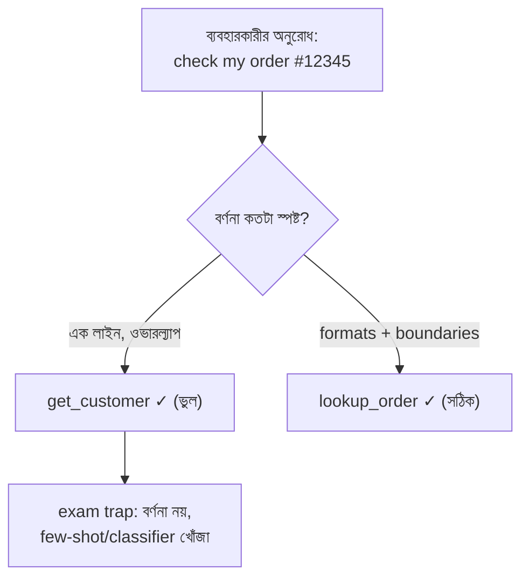

import ReadingProgress from '../../../../components/progress/ReadingProgress.astro';
import MarkComplete from '../../../../components/progress/MarkComplete.astro';
import KeywordTable from '../../../../components/content/KeywordTable.astro';
import ExamTrap from '../../../../components/content/ExamTrap.astro';
import BuildExercise from '../../../../components/content/BuildExercise.astro';
import Attribution from '../../../../components/content/Attribution.astro';

<ReadingProgress />

<div class="lesson-meta">
	<span class="lesson-badge">Domain 2</span>
	<span class="lesson-task">Task 2.1 · ওয়েট ১৮%</span>
	<span class="lesson-source">মূল ইংরেজি: Tool Interface Design</span>
</div>

## এই লেসনে যা জানতে হবে

Domain 2-এর প্রথম টাস্ক একটি সরল, কঠিন নিয়ম দিয়ে শুরু হয়: **টুল বর্ণনা (tool description) মডেলের টুল বাছাইয়ের প্রাথমিক প্রক্রিয়া।** এটা বাড়তি metadata নয়, পরে যোগ করা ভাবনা নয় — এটাই মূল প্রক্রিয়া। মডেল টুলের সেট হাতে পেলে বর্ণনা পড়েই ঠিক করে কোনটি ডাকবে। বর্ণনা যদি এক লাইনের হয় — যেমন `"Retrieves customer information"` — তবে একই রকম কাজের দুই টুলের পার্থক্য বোঝার কোনো উপায় তার হাতে থাকে না।

পরীক্ষা এখান থেকে দুটি জিনিস চায়: production-grade বর্ণনা কেমন দেখতে হয়, আর খারাপ বর্ণনা থেকে জন্মানো misrouting-এর সঠিক ও প্রথম fix কী।

## ভালো টুল বর্ণনার পাঁচ উপাদান

একটি production-grade বর্ণনায় পাঁচটি জিনিস থাকে:

- **টুলটি কী করে** — মূল উদ্দেশ্য, দ্ব্যর্থতাহীনভাবে লেখা।
- **কী ইনপুট চায়** — ডেটা টাইপ, ফরম্যাট, সীমা, কোন ফিল্ড বাধ্যতামূলক আর কোনটি ঐচ্ছিক।
- **কোন উদাহরণ অনুরোধ ভালো সামলায়** — নির্দিষ্ট ব্যবহার, যা মডেলের বোঝাপড়া আঁকড়ে ধরে।
- **Edge case ও সীমাবদ্ধতা** — টুলটি কী করে না, আর ইনপুট প্রত্যাশিত সীমার বাইরে গেলে কী হয়।
- **স্পষ্ট সীমানা** — একই টুলকিটের কোন কাছাকাছি টুলের বদলে এই টুলটি কখন ব্যবহার করবেন।

Minimal আর production-grade বর্ণনার পার্থক্য দেখুন:

```text
# Minimal — misrouting ঘটায়
get_customer: "Retrieves customer information"
lookup_order: "Retrieves order details"

# Production-grade — নির্ভরযোগ্য সিলেকশন
get_customer: "Looks up a customer account by email address,
phone number, or customer ID. Returns customer profile
(name, contact details, account status, loyalty tier).
Use this when you need to verify who the customer is.
Do NOT use for order-specific queries — use lookup_order
for those."

lookup_order: "Retrieves order details by order number
(format: #NNNNN) or tracking ID. Returns order status,
items, shipping details, and refund eligibility.
Use this when a customer asks about a specific order.
Do NOT use for customer identity verification —
use get_customer for that."
```

দ্বিতীয় সংস্করণ মডেলকে স্পষ্ট disambiguation দেয়। কোন টুল কোন identifier নেয়, কী ফেরত দেয়, আর সবচেয়ে গুরুত্বপূর্ণ — কোন টুলটি **কখন ব্যবহার করবেন না**, তা পরিষ্কার হয়।



## Misrouting সমস্যা

দুটি টুলের বর্ণনা ওভারল্যাপ করলে বা প্রায় একই রকম হলে সিলেকশনে বিভ্রান্তি আসে। পরীক্ষার নমুনা প্রশ্ন ২ ঠিক এই দৃশ্যটিই দেয়: `get_customer` আর `lookup_order`, দুটোরই minimal বর্ণনা, ফলে এজেন্ট "check my order #12345" ভুল টুলে পাঠায়।

পরীক্ষা দেখে তোমরা মূল কারণ ধরতে পারো কি না। চারটি সম্ভাব্য উত্তর, তিনটি ভুল:

- **বর্ণনা বিস্তারিত করা** — সঠিক। কম পরিশ্রম, বেশি লাভ, সরাসরি মূল কারণ ঠিক করে।
- **Few-shot উদাহরণ** — ভুল। Token খরচ বাড়ায়, কিন্তু মডেল কেন বিভ্রান্ত তা ঠিক করে না। লক্ষণ সারায়, রোগ নয়।
- **Routing classifier** — ভুল। প্রথম ধাপ হিসেবে over-engineered। মডেলের স্বাভাবিক ভাষা-বোঝা bypass করে, আলাদা সাবস্ট্রাকচার যোগ করে।
- **Tool consolidation** — প্রথম ধাপ হিসেবে ভুল। দীর্ঘমেয়াদে বৈধ architectural সিদ্ধান্ত, কিন্তু বর্ণনা বিস্তারিত করার চেয়ে অনেক বেশি পরিশ্রম দাবি করে।

নিয়মটি মুখস্থ রাখুন: পরীক্ষা **কম পরিশ্রম, বেশি লাভের** fix পছন্দ করে। Routing classifier-এর আগে ভালো বর্ণনা। Full access-এর আগে scoped access। Custom build-এর আগে community server।

<ExamTrap label="পরীক্ষায় সাধারণ ডিস্ট্র্যাক্টর">
	<p>
		Minimal বর্ণনায় ভোগা misrouting ঠিক করতে "৫-৮টি few-shot উদাহরণ যোগ করুন", "routing classifier বসান" বা "টুল দুটি এক করে ফেলুন" — তিনটিই বারবার ভুল উত্তর হিসেবে আসে। ছোট, সরাসরি fix হলো বর্ণনা বিস্তারিত করা।
	</p>
</ExamTrap>

## Tool Splitting

বড় দায়িত্বের জেনেরিক টুল দ্ব্যর্থতা তৈরি করে। সমাধান: কাজ আলাদা করে purpose-specific টুলে ভাগ করা, প্রতিটির স্পষ্ট input/output contract দিয়ে।

```text
# ভাগ করার আগে
analyze_document: "Analyses a document and returns results"

# ভাগ করার পরে
extract_data_points: "Extracts structured data fields
(dates, amounts, names) from a document"
summarize_content: "Produces a concise summary of a
document's key arguments and conclusions"
verify_claim_against_source: "Checks whether a specific
claim is supported by the source document, returning
supporting/contradicting evidence"
```

প্রতিটি টুল এখন একটি সংকীর্ণ, স্পষ্টভাবে বর্ণিত কাজ করে। ব্যবহারকারীর আসল প্রয়োজন দেখে মডেল সঠিকটি বেছে নিতে পারে।

## Tool Renaming

দুটি টুলের নাম বিভ্রান্তিকরভাবে কাছাকাছি হলে নাম বদলানোই ইন্টারফেস স্তরে ওভারল্যাপ মেটায়। `analyze_content`-কে `extract_web_results` করে দিন, web-specific বর্ণনা দিন — implementation ছুঁতেও হবে না, তবু টুলের উদ্দেশ্য দ্ব্যর্থতাহীন হয়ে যায়।

## System Prompt-এর সাথে দ্বন্দ্ব

System prompt-এর keyword-sensitive নির্দেশ unintended টুল association তৈরি করে ভালো লেখা বর্ণনাকেও override করতে পারে। System prompt-এ যদি লেখা থাকে "always check customer details before proceeding", তবে বর্ণনায় যা-ই লেখা থাকুক, মডেল যেকোনো গ্রাহক-সংক্রান্ত প্রশ্ন `get_customer`-এ পাঠাতে পারে।

তাই বর্ণনা আপডেট করার পর system prompt আবার পড়ুন — দ্বন্দ্ব খুঁজুন। এটি একটি সূক্ষ্ম failure mode, এবং পরীক্ষা এটিও ধরে।

<ExamTrap label="পরীক্ষার ফাঁদ: বর্ণনার পরের ধাপ">
	<p>
		লক্ষণ ঠিক করা শেষ নয়। System prompt-এর "always …" জাতীয় শব্দ নতুন করে ভুল association বানাতে পারে, আর ভালো বর্ণনাকে নিষ্ক্রিয় করে দিতে পারে। `<em>Tool description</em>` শুধু তখনই প্রথম fix, যখন হাতে যুক্তিসঙ্গত সংখ্যক টুল আছে আর মডেল দুটির পার্থক্য ধরতে পারছে না।
	</p>
</ExamTrap>

## গাইডের বাইরে: কখন বর্ণনা fix নয়

বর্ণনা প্রথম fix — তবে শর্ত আছে, আর পরীক্ষা দুই দিকই ধরে। এজেন্টের হাতে যুক্তিসঙ্গত সংখ্যক টুল থাকলে এবং মডেল কেবল দুই টুল আলাদা করতে না পারলে বর্ণনা ঠিক করাই কাজ। কিন্তু সমস্যা টুলকিটের আকারে হলে সেটা আলাদা ব্যাপার: প্রতি এজেন্টে মোটামুটি ৪-৫টির বেশি টুল থাকলে শুধু সিদ্ধান্তের জটিলতাতেই সিলেকশন খারাপ হতে শুরু করে, আর তখন ২২টি বর্ণনা নতুন করে লিখেও কিছু বদলায় না। সমাধান খুঁজতে যাওয়ার আগে শনাক্ত করুন — কোন সমস্যার দিকে তাকিয়ে আছেন? Overload threshold আর কী করতে হবে, তা Task Statement 2.3-এ আছে।

<KeywordTable keywords={frontmatter.keywords} />

<ExamTrap label="অনুশীলন: কোন fix আগে?">
	<p>
		Production log দেখাচ্ছে, ব্যবহারকারী "check my order #12345" লিখলে এজেন্ট বারবার `get_customer` ডাকে, `lookup_order` নয়। দুটি টুলেরই বর্ণনা এক লাইন, identifier format-ও মিলিয়ে যায়। সবচেয়ে কার্যকর প্রথম ধাপ কোনটি?
	</p>
	<details>
		<summary>উত্তর দেখুন</summary>

		**সঠিক উত্তর:** প্রতিটি টুলের বর্ণনা বাড়িয়ে input format, example query, edge case ও সীমানা লেখা — কোন টুলের বদলে কোনটি ব্যবহার করবেন সেটিসহ।

		**কেন বাকিগুলো ভুল:**

		- *Few-shot উদাহরণ যোগ করা* — token খরচ বাড়ে, মূল কারণ (বর্ণনার অভাব) থেকে যায়।
		- *একটি `lookup_entity` টুলে এক করে দেওয়া* — দীর্ঘমেয়াদে বৈধ, কিন্তু প্রথম ধাপ হিসেবে খরচ বেশি।
		- *Routing layer দিয়ে keyword দেখে টুল বেছে দেওয়া* — over-engineered; মডেলের ভাষা-বোঝার ক্ষমতা কাজে লাগায় না।

	</details>
</ExamTrap>

## প্র্যাকটিস সিনারিও (নিজে উত্তর ভাবুন, তারপর খুলুন)

> প্রোডাকশন লগে দেখা যাচ্ছে, গ্রাহক অর্ডার নিয়ে জিজ্ঞেস করলে এজেন্ট প্রায়ই `lookup_order`-এর বদলে `get_customer` কল করছে। দুটি টুলের বর্ণনাই ন্যূনতম ("Retrieves customer information" / "Retrieves order details"), আর দুটোই একই রকম identifier ফরম্যাট নেয়। টুল নির্বাচনের নির্ভরযোগ্যতা বাড়ানোর সবচেয়ে কার্যকর প্রথম ধাপ কোনটি?

<details>
	<summary>উত্তর দেখুন</summary>

	**সঠিক উত্তর:** প্রতিটি টুলের বর্ণনা বাড়িয়ে তাতে ইনপুট ফরম্যাট, উদাহরণ কোয়েরি, edge case, আর কখন কোনটি ব্যবহার করবেন সেই সীমানা যোগ করা।

	**কেন বাকিগুলো ভুল:**

	- *System prompt-এ ৫-৮টি few-shot উদাহরণ যোগ করা* — misrouting-এর মূল কারণ বর্ণনার ঘাটতি। উদাহরণ দিয়ে লক্ষণটি ঢাকা পড়ে, কারণ থেকে যায়; পরীক্ষায় এটিই প্রথম ডিস্ট্র্যাক্টর।
	- *দুটি টুল জোড়া লাগিয়ে একটি `lookup_entity` বানানো* — consolidation দীর্ঘমেয়াদে বৈধ, কিন্তু বর্ণনা ঠিক করার চেয়ে অনেক বেশি খরচের কাজ, তাই প্রথম ধাপ নয়।
	- *Keyword দেখে টুল বেছে নেওয়া routing layer বসানো* — প্রথম ধাপ হিসেবে over-engineered; পরীক্ষা এটিকেও ডিস্ট্র্যাক্টর করে।

</details>

<BuildExercise
	title="Misrouting শেষ করা টুল বর্ণনা লেখা"
	difficulty="Intermediate"
	time="৩০ মিনিট"
	objectives={[
		'টুল বর্ণনাই টুল সিলেকশনের প্রাথমিক প্রক্রিয়া — এটি প্রমাণ করা',
		'উদ্দেশ্য, ইনপুট, উদাহরণ, edge case ও সীমানা সহ পূর্ণ বর্ণনা লেখা',
		'দ্ব্যর্থ বর্ণনা থেকে জন্মানো misrouting চিহ্নিত করা',
		'ভালো বর্ণনাকেও override করা system prompt দ্বন্দ্ব ধরা',
	]}
	steps={[
		{
			title:
				'দুটি MCP টুল বানান যাদের বর্ণনা ইচ্ছাকৃতভাবে অস্পষ্ট — যেমন get_customer: "Retrieves customer information" আর lookup_order: "Retrieves order details"।',
			why: 'Misrouting নিজে তৈরি করে দেখলে minimal বর্ণনা কেন ব্যর্থ হয়, তার অন্তর্দৃষ্টি তৈরি হয়।',
			expect: 'দুটি টুল রেজিস্টার্ড; প্রতিটির বর্ণনা এক বাক্যের, input format বা সীমানা উল্লেখ নেই।',
		},
		{
			title: '১০টি ভিন্ন উদ্দেশ্যের প্রশ্ন দিয়ে পরীক্ষা করুন এবং মডেল কোন টুল বেছে নিল তা লগ করুন।',
			why: 'বর্ণনা বদলানোর আগে-পরে সংখ্যায় মাপা গেলে প্রমাণ মেলে।',
			expect: 'অন্তত ২-৩টি ভুল রাউট — অর্ডার-সংক্রান্ত প্রশ্নে get_customer বা উল্টোটি।',
		},
		{
			title:
				'দুটি বর্ণনা নতুন করে লিখুন — উদ্দেশ্য, প্রত্যাশিত ইনপুট ও ফরম্যাট, উদাহরণ, edge case এবং অন্য টুলের বিপরীতে সীমানা সহ।',
			why: 'এটিই এই টাস্কের মূল দক্ষতা — সবচেয়ে কম পরিশ্রমে সবচেয়ে বড় fix।',
			expect:
				'প্রতিটি বর্ণনা ৩-৫ বাক্যের; accepted identifier format, example query, আর "Do NOT use for order-specific queries — use lookup_order for those" জাতীয় boundary statement আছে।',
		},
		{
			title: 'একই ১০টি প্রশ্ন আবার চালিয়ে আগের ফলের সাথে তুলনা করুন।',
			why: 'উন্নতি মাপলেই প্রমাণ হয়, বর্ণনার গুণই মূল কারণ ছিল — architectural পরিবর্তনের দরকার নেই।',
			expect: 'সিলেকশন accuracy ৯/১০ বা ১০/১০; আগের ভুল প্রশ্নগুলো এখন সঠিক টুলে।',
		},
		{
			title:
				'System prompt পড়ে দেখুন, এমন keyword-sensitive নির্দেশ আছে কি না যা উন্নত বর্ণনাকে override করতে পারে।',
			why: 'System prompt দ্বন্দ্ব একটি সুক্ষ্ম failure mode — পরীক্ষা এটি ধরে।',
			expect:
				'ভুল টুল association ঘটাতে পারে এমন বাক্যের তালিকা, সাথে দ্বন্দ্বমুক্ত নতুন সংস্করণ।',
		},
	]}
/>

## সূত্র

<ul>
	{frontmatter.sources.map((source) => (
		<li>
			<a href={source.href} target="_blank" rel="noopener noreferrer">
				{source.label}
			</a>
			{source.note ? ` — ${source.note}` : ''}
		</li>
	))}
</ul>

<Attribution sourceUrl={frontmatter.sourceUrl} updated={frontmatter.updated} />

<MarkComplete lessonId="2-1" />
