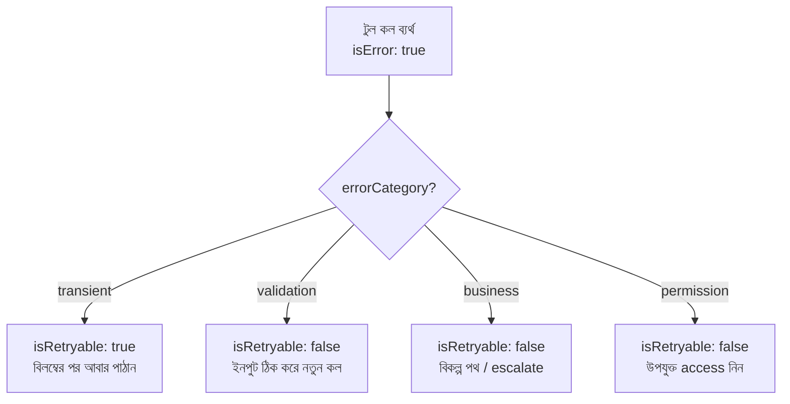
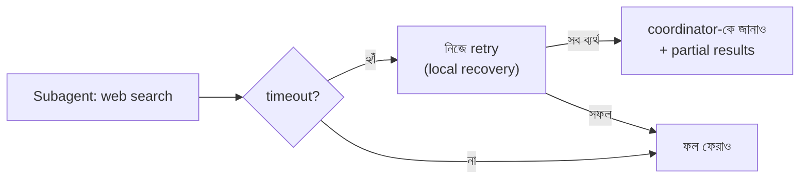

import ReadingProgress from '../../../../components/progress/ReadingProgress.astro';
import MarkComplete from '../../../../components/progress/MarkComplete.astro';
import KeywordTable from '../../../../components/content/KeywordTable.astro';
import ExamTrap from '../../../../components/content/ExamTrap.astro';
import BuildExercise from '../../../../components/content/BuildExercise.astro';
import Attribution from '../../../../components/content/Attribution.astro';

<ReadingProgress />

<div class="lesson-meta">
	<span class="lesson-badge">Domain 2</span>
	<span class="lesson-task">Task 2.2 · ওয়েট ১৮%</span>
	<span class="lesson-source">মূল ইংরেজি: Structured Error Responses</span>
</div>

## এই লেসনে যা জানতে হবে

MCP টুল ব্যর্থ হলে যে এরর রেসপন্স ফেরে, সেটাই ঠিক করে এজেন্ট বুদ্ধিমানের মতো recover করবে, নাকি অন্ধভাবে ঘুরবে। "Operation failed" জাতীয় জেনেরিক বার্তা LLM-এর কাছে অকেজো: কিছুই বোঝা যায় না — কী ভুল হয়েছিল, আবার চেষ্টা করা উচিত কি না, বদলে কী করা যায়।

MCP প্রোটোকল টুল ব্যর্থতা জানানোর জন্য `isError` ফ্ল্যাগ দেয়। এটা সেট করলে মডেল জানে execution ব্যর্থ — এররের লেখাটিকে সফল ফলের মতো পড়ে ভাবার দরকার নেই।

## চারটি এরর ক্যাটাগরি

প্রতিটি টুল ব্যর্থতা এই চারটির একটিতে পড়ে। প্রত্যেকের recovery কৌশল আলাদা, আর মডেলকে আলাদা করতে structured metadata দরকার।

বাঁকা পথে একটু দাঁড়ান: `errorCategory`, `isRetryable`, `description` — এগুলো অ্যাপ্লিকেশন-স্তরের convention, MCP envelope-এর অংশ নয়। প্রোটোকলের `CallToolResult`-এ কেবল `content`, `structuredContent` আর `isError` আছে। Structured data যেখানে থাকার কথা, সেখানে — অর্থাৎ `structuredContent`-এ — নিচের metadata রাখা হয়। পরীক্ষার গাইড চার ক্যাটাগরির নাম আর `isRetryable` boolean ধরে, তাই নাম ধরে জানুন; কেবল MCP specification-এ এগুলো খুঁজতে যাবেন না।

### ১. Transient error

Timeout, সার্ভিস অনুপলব্ধতা, rate limit। ভিত্তিস্থ সিস্টেম সাময়িকভাবে পৌঁছানোর বাইরে, কিন্তু অনুরোধটি নিজে বৈধ। Recovery: সামান্য বিলম্বের পর আবার চেষ্টা।

```json
{
  "isError": true,
  "content": [{ "type": "text", "text": "Service temporarily unavailable" }],
  "structuredContent": {
    "errorCategory": "transient",
    "isRetryable": true,
    "description": "The order database is experiencing high load. The request is valid and should succeed on retry."
  }
}
```

### ২. Validation error

ভুল ইনপুট ফরম্যাট, বাধ্যতামূলক ফিল্ড নেই, মান সীমার বাইরে। অনুরোধটি নিজেই বিকৃত। Recovery: ইনপুট ঠিক করে সংশোধিত কল পাঠান।

```json
{
  "isError": true,
  "content": [{ "type": "text", "text": "Invalid order ID format" }],
  "structuredContent": {
    "errorCategory": "validation",
    "isRetryable": false,
    "description": "Order ID must be in format #NNNNN (e.g. #12345). Received: 'order-abc'. Reformat the ID and call again."
  }
}
```

এখানে `isRetryable: false` মানে "হার মেনে নাও" নয়। মানে — ঠিক এই কলটি আবার পাঠানো অর্থহীন, কারণ `order-abc` প্রতিবার একই ফরম্যাট-চেকেই ব্যর্থ হবে। এজেন্ট তবুও recover করে, কেবল আগে ইনপুট সংশোধন করে; আর `description` ঠিক কী করতে হবে তা বলে দেয়। Boolean বলে **আবার পাঠাব কি না**, আর `errorCategory` বলে **তার বদলে কী করব**।

### ৩. Business error

নীতি লঙ্ঘন, সীমা অতিক্রম, ব্যবসার নিয়মের সংঘাত। অনুরোধ কারিগরি দিক থেকে বৈধ, কিন্তু ব্যবসায়িক শর্ত ভাঙে। Recovery: **retry করবেন না** — একই অনুরোধ চিরকাল একইভাবে ব্যর্থ হবে। এজেন্টের বিকল্প ওয়ার্কফ্লো দরকার।

```json
{
  "isError": true,
  "content": [{ "type": "text", "text": "Refund exceeds policy limit" }],
  "structuredContent": {
    "errorCategory": "business",
    "isRetryable": false,
    "description": "Refund amount of £750 exceeds the £500 automatic refund limit. This requires manager approval. Please escalate to a human agent with the refund details."
  }
}
```

### ৪. Permission error

Access denied, অপর্যাপ্ত credential, authorisation ব্যর্থতা। কলারের প্রয়োজনীয় অনুমতি নেই, তাই টুল চলতে পারে না। Recovery: escalate করুন বা ভিন্ন credential ব্যবহার করুন।

```json
{
  "isError": true,
  "content": [{ "type": "text", "text": "Access denied" }],
  "structuredContent": {
    "errorCategory": "permission",
    "isRetryable": false,
    "description": "The current service account does not have permission to access financial records. Escalate to a senior agent with financial system access."
  }
}
```

## isRetryable আসলে কী সংকেত দেয়

`isRetryable` একটি সংকীর্ণ প্রশ্নের উত্তর দেয়: **ঠিক এই অনুরোধটি আবার পাঠালে কাজ হবে কি?** কেবল transient-এ `true` — কলটি বৈধ ছিল, সিস্টেমটাই ছিল কিছুক্ষণ অক্ষম। বাকি সব `false`, কারণ আগে কিছু একটা বদলাতে হবে: ইনপুট (validation), অনুরোধ নিজে (business), বা কলার (permission)।

| Category | isRetryable | Recovery |
| --- | --- | --- |
| transient | true | বিলম্বের পর একই কল আবার পাঠান |
| validation | false | ইনপুট সংশোধন করে নতুন কল পাঠান |
| business | false | বিকল্প পথ নিন বা escalate করুন |
| permission | false | সঠিক access-যুক্ত principal হিসেবে retry করুন |

সবচেয়ে জরুরি পার্থক্য তিনটি `false` সারির মধ্যে। Validation এজেন্ট একাই সারাতে পারে। Business আর permission পারে না — নীতির সীমা অনুরোধ যেভাবেই লেখা হোক খাটে, আর permission-এর জন্য দরকার ভিন্ন অ্যাকাউন্ট, ভালো কল নয়। `false` মানে "এই কলটি আবার নয়", "থেমে যাও" নয়।



## Access failure বনাম Valid empty result

Domain 2-এর মধ্যে এটিই সবচেয়ে নখদর্পণে ধরার মতো পার্থক্য। পরীক্ষা সরাসরি এটি ধরে।

- **Access failure:** টুল ডেটাসোর্স পর্যন্ত পৌঁছাতে পারেনি। Timeout, authentication ব্যর্থ, বা সার্ভিস ডাউন। ডেটা থাকতে পারে, কিন্তু টুল দেখতে পারেনি। এজেন্টকে ভাবতে হয়, retry করবে কি না।
- **Valid empty result:** টুল সফলভাবে ডেটাসোর্স query করেছে এবং কোনো মিল পায়নি। Query ঠিকভাবে চলেছে — শুধু শর্ত মেলে এমন ডেটা নেই। এজেন্টের retry **করা উচিত নয়**। উত্তর: "কিছু পাওয়া যায়নি"।

দুটো গুলিয়ে ফেললে পুরো recovery logic ভেঙে পড়ে। বাস্তবে কেমন দেখায়: গ্রাহক-lookup-এর পর একটি টুল খালি array ফেরৎ দিল। এজেন্ট ৩ বার retry করল, তারপর মানুষকে escalate করল। বিশ্লেষণে বেরোল — গ্রাহকের অ্যাকাউন্টই নেই।

টুল সফল হয়েছিল। Database query করে কোনো মিল না পেয়ে সঠিকভাবেই খালি ফল দিয়েছিল। কিন্তু রেসপন্স "ডেটাবেসে পৌঁছাতে পারিনি" আর "পৌঁছেছি, কিছু পাইনি"-এর পার্থক্য না করায় এজেন্ট দুটোকেই এক ভাবছে — retry করার মতো ব্যর্থতা হিসেবে।

Fix: টুল রেসপন্স এমনভাবে সাজান যেন সফল কিন্তু খালি query আর ব্যর্থ query দেখতে সম্পূর্ণ আলাদা হয়।

```json
// Valid empty result — এরর নয়
{
  "isError": false,
  "content": [{ "type": "text", "text": "No customer found matching email 'john@example.com'. The query executed successfully but returned no matches." }],
  "structuredContent": { "resultCount": 0 }
}

// Access failure — এরর
{
  "isError": true,
  "content": [{ "type": "text", "text": "Could not reach customer database" }],
  "structuredContent": {
    "errorCategory": "transient",
    "isRetryable": true,
    "description": "Connection to the customer database timed out after 5 seconds. The query did not execute."
  }
}
```

## Multi-agent সিস্টেমে এরর প্রোপাগেশন

মাল্টি-এজেন্ট আর্কিটেকচারে এরর হ্যান্ডলিং একটি নীতি মানে: **local recovery with selective propagation**।

- Transient ব্যর্থতার জন্য subagent নিজে locally recover করে। Web search timeout হলে, coordinator-কে বিরক্ত করার আগেই search subagent নিজে retry করে।
- কেবল যে এরর স্থানীয়ভাবে মেটানো গেল না, সেটিই উপরে পাঠানো হয়। সব retry ব্যর্থ হলে subagent ব্যর্থতা coordinator-কে জানায়।
- Partial result আর কী চেষ্টা করা হয়েছে, সেটিও সাথে পাঠান। Coordinator-এর কনটেক্সট দরকার: "৫টির মধ্যে ৩টি source সফলভাবে search করেছি। ৪ ও ৫ নম্বর timeout করেছে। সফল ৩টির আংশিক ফল এই যে।"

এটি দুটি anti-pattern আটকায়: **চুপচাপ এরর চাপা দেওয়া** (খালি ফলকে সফল বলে ফেরানো) আর **একটি ব্যর্থতায় গোটা ওয়ার্কফ্লো থামিয়ে দেওয়া**। দুটোই coordinator-কে অন্ধ করে সিদ্ধান্ত নিতে বাধ্য করে।



<ExamTrap label="পরীক্ষার ফাঁদ: খালি ফল মানেই ব্যর্থ নয়">
	<p>
		সফল query থেকে আসা খালি ফল মানে "আপনার শর্তে কিছু মেলেনি"। আবার চেষ্টা করলে একই খালি ফলই আসবে। এজেন্টের উচিত ফলটি মেনে নিয়ে সেই অনুযায়ী উত্তর দেওয়া।
	</p>
</ExamTrap>

<ExamTrap label="পরীক্ষার ফাঁদ: চারটি বারবার আসা ভুল">
	<p>
		(১) "Operation failed"-জাতীয় জেনেরিক বার্তা — metadata ছাড়া মডেল transient আর business আলাদা করতে পারে না। (২) Business error-কে retryable ভাবা — নীতির লঙ্ঘন retry-তে সারবে না। (৩) Validation error-কে <code>isRetryable: true</code> বলা — boolean বলে ঠিক এই কলটি কাজ করবে কি না, আর বিকৃত order ID প্রতিবার একই চেকে ব্যর্থ হয়। (৪) Subagent-এর এরর চুপচাপ খালি ফলে চাপা দেওয়া — coordinator "কিছু পাইনি" আর "খুঁজতেই পারিনি"-র পার্থক্য করতে পারে না।
	</p>
</ExamTrap>

<KeywordTable keywords={frontmatter.keywords} />

<ExamTrap label="অনুশীলন: অপচয়ের মূল কারণ">
	<p>
		একটি টুল গ্রাহক-lookup-এর পর খালি array ফেরায়। এজেন্ট ৩ বার retry করে, তারপর মানুষকে escalate করে। বিশ্লেষণে দেখা যায় গ্রাহকের অ্যাকাউন্টই নেই। এই অপচয়ের মূল কারণ কী?
	</p>
	<details>
		<summary>উত্তর দেখুন</summary>

		**সঠিক উত্তর:** টুল access failure আর valid empty result-এর পার্থক্য করে না, তাই এজেন্ট "মিল নেই"-কে retry করার মতো ব্যর্থতা ভাবে।

		**কেন বাকিগুলো ভুল:**

		- *Retry limit বাড়ানো* — খালি ফলই আবার আসবে; সমস্যা retry-সংখ্যায় নয়, রেসপন্সের গঠনে।
		- *Customer lookup কখনো retry না করার নির্দেশ* — আসল access failure-ও তখন escalate হবে, অথচ retry করলে সেটি মিটত।
		- *Escalation threshold আরও ধৈর্যশীল করা* — অপচয় বাড়ে, কিন্তু মূল কারণ ঠিক হয় না।

	</details>
</ExamTrap>

<BuildExercise
	title="চার ক্যাটাগরির জন্য স্ট্রাকচার্ড এরর রেসপন্স বানান"
	difficulty="Advanced"
	time="৪৫ মিনিট"
	objectives={[
		'errorCategory, isRetryable ও description metadata সহ এরর রেসপন্স লেখা',
		'access failure (isError: true) আর valid empty result (isError: false) আলাদা করা',
		'ব্যর্থতাকে transient / validation / business / permission-এ ভাগ করা',
		'Error metadata পড়ে আলাদা পদক্ষেপ নেওয়া recovery logic লেখা',
	]}
	steps={[
		{
			title:
				'একটি MCP server-এ customer_lookup টুল বানান, যেটি customer identifier আর একটি failure_mode parameter নিয়ে ডিমান্ডে নির্দিষ্ট এরর ঘটায়।',
			why: 'নিয়ন্ত্রিত পরিবেশে failure mode নকল করলে এরর-গঠনহীন আচরণ নিজে চোখে দেখা যায়।',
			expect: 'MCP server চলছে; identifier আর failure_mode দিয়ে নির্দিষ্ট শর্তে এরর ট্রিগার করা যায়।',
		},
		{
			title:
				'চার ধরনের এরর রেসপন্স বানান: transient (timeout), validation (ভুল ইনপুট ফরম্যাট), business (refund নীতির সীমা ছাড়াল), permission (access denied)।',
			why: 'প্রতিটি ক্যাটাগরি আলাদা recovery দাবি করে; পরীক্ষা ঠিক এই শ্রেণীবিভাগ ধরে।',
			expect:
				'চারটি আলাদা রেসপন্স — প্রতিটিতে isError: true, নির্দিষ্ট errorCategory, সঠিক isRetryable, আর কী করতে হবে বোঝানো description।',
		},
		{
			title:
				'প্রতিটি এররে structured metadata যোগ করুন: errorCategory, isRetryable boolean আর মানুষের পড়ার মতো description।',
			why: 'এই metadata-ই বুদ্ধিমান recovery চালু করে; এগুলো ছাড়া timeout আর policy violation আলাদা হয় না।',
			expect:
				'প্রতিটি এরর ঠিক তিনটি ফিল্ডে parse হয়: errorCategory (transient/validation/business/permission), isRetryable (boolean), description।',
		},
		{
			title:
				'একটি valid empty result রেসপন্স (isError: false, resultCount: 0) বানান, যা access failure থেকে স্পষ্ট আলাদা।',
			why: 'Domain 2-এর সবচেয়ে জরুরি পার্থক্যগুলোর একটি; সফল খালি query-তে retry করাই ক্যানোনিক্যাল anti-pattern।',
			expect:
				'দুটি ভিন্ন গঠন — সফল খালি ফলে isError: false ও resultCount: 0; access failure-এ isError: true, errorCategory: transient, isRetryable: true।',
		},
		{
			title:
				'এমন একটি agent loop লিখুন যা metadata পড়ে পদক্ষেপ নেয়: transient-এ retry, validation-এ ইনপুট সংশোধন, business-এ escalate, permission-এ credential চাওয়া।',
			why: 'এই loop-ই দেখায় metadata কতটা কাজে লাগে; প্রতিটি ক্যাটাগরির নিজস্ব শাখা আছে কি না, সেটিই পরীক্ষা চায়।',
			expect:
				'Backoff সহ transient ৩ বার retry; validation-এ input reformat; business-এ human escalation; permission-এ elevated credential অনুরোধ।',
		},
	]}
/>

## সূত্র

<ul>
	{frontmatter.sources.map((source) => (
		<li>
			<a href={source.href} target="_blank" rel="noopener noreferrer">
				{source.label}
			</a>
			{source.note ? ` — ${source.note}` : ''}
		</li>
	))}
</ul>

<Attribution sourceUrl={frontmatter.sourceUrl} updated={frontmatter.updated} />

<MarkComplete lessonId="2-2" />
