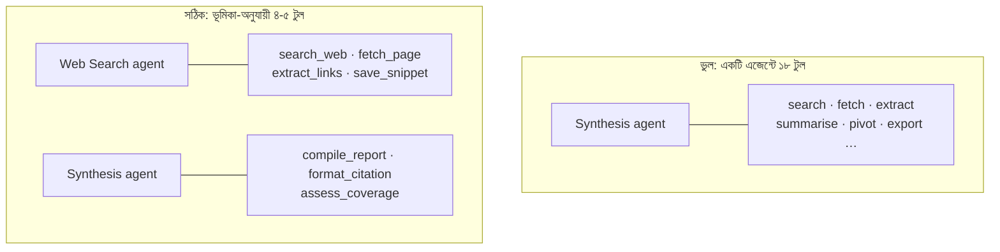

import ReadingProgress from '../../../../components/progress/ReadingProgress.astro';
import MarkComplete from '../../../../components/progress/MarkComplete.astro';
import KeywordTable from '../../../../components/content/KeywordTable.astro';
import ExamTrap from '../../../../components/content/ExamTrap.astro';
import BuildExercise from '../../../../components/content/BuildExercise.astro';
import Attribution from '../../../../components/content/Attribution.astro';

<ReadingProgress />

<div class="lesson-meta">
	<span class="lesson-badge">Domain 2</span>
	<span class="lesson-task">Task 2.3 · ওয়েট ১৮%</span>
	<span class="lesson-source">মূল ইংরেজি: Tool Distribution & Tool Choice</span>
</div>

## এই লেসনে যা জানতে হবে

এক এজেন্টকে কতগুলো টুল দিচ্ছেন, সেটা সরাসরি ঠিক করে সে কত নির্ভরযোগ্যভাবে সঠিক টুল বাছবে। এটা implementation detail মনে হলেও নয় — এটা architectural সিদ্ধান্ত, যা ঠিক করে মাল্টি-এজেন্ট সিস্টেম প্রোডাকশনে কাজ করবে কি না।

## Tool Overload সমস্যা

এক এজেন্টকে ১৮টি টুল দিলে সিলেকশন-নির্ভরযোগ্যতা পড়ে যায়। প্রতিটি বাড়তি টুল decision complexity বাড়ায়, আর টুলকিট বড় হওয়ার সাথে এররের হার ওঠে। **সর্বোত্তম পরিসর — প্রতি এজেন্টে ৪-৫টি টুল**, সেই এজেন্টের নির্দিষ্ট ভূমিকা অনুযায়ী সীমিত।

সংখ্যাই পুরো কথা নয় — প্রাসঙ্গিকতাও ঠিক ততটাই জরুরি। Synthesis এজেন্টের হাতে web search টুল **থাকা উচিত নয়**। Web search এজেন্টের হাতে document analysis টুল **থাকা উচিত নয়**। নিজের বিশেষায়িত ক্ষেত্রের বাইরের টুল পেলে এজেন্ট সেটি ভুলভাবে ব্যবহার করে: web_search-সহ synthesis এজেন্ট হাতে দেওয়া ফল ব্যবহার না করে নিজেই search চালাতে পারে — কাজ দ্বিগুণ, কনটেক্সট নষ্ট।

নীতি: **প্রতিটি এজেন্ট তার নির্ধারিত ভূমিকার জন্য যে টুল দরকার, কেবল সেটিই পায়। এর বেশি নয়।**



## কাছাকাছি টুল Consolidation

ভূমিকা অনুযায়ী ভাগ করা টুল overload-এর স্পষ্ট উত্তর — কিন্তু সব টুল একই ধরনের কাজ করলে সেটিই ভুল উত্তর।

ধরুন, একটি data platform server-এ ২২টি টুল: তিনটি query টুল (প্রতি source-এ একটি) আর ১৯টি transformation — `pivot_table`, `calculate_percentile`, `normalise_currency`, এইভাবে। ভূমিকা অনুযায়ী ভাগ করলে transformation এজেন্টের হাতে ১৯টি টুল চলে যায় — সমস্যাটা এক স্তর নিচে সরানো হলো মাত্র। এজেন্ট তবুও নির্ভরযোগ্যভাবে বাছতে পারে না।

এই ১৯টি জোড়া লাগে, কারণ সবগুলোর আকার একই। ডেটা ভিতরে, একটা operation, ডেটা বাইরে:

```json
{
  "name": "transform_data",
  "description": "Apply a transformation to a dataset. Use transform_type to select the operation.",
  "input_schema": {
    "type": "object",
    "properties": {
      "dataset": { "type": "string" },
      "transform_type": {
        "type": "string",
        "enum": ["pivot", "percentile", "normalise_currency", "..."]
      },
      "options": { "type": "object" }
    },
    "required": ["dataset", "transform_type"]
  }
}
```

২২টি টুল চারটি হয়ে গেল। কিছুই হারায়নি: প্রতিটি transformation এখনও পৌঁছানোর মতো, কেবল এক কলের ভেতরে enum মান হিসেবে মডেল বেছে নেয় — ১৯টি প্রায় একই বর্ণনার টুলের ভিড়ে খোঁজার দরকার নেই। সিলেকশন accuracy বাড়ে, কারণ কঠিন পছন্দটা ছোট হয়েছে — ক্ষমতা বাড়েনি।

## কোন fix কখন?

| টুলগুলো… | Fix |
| --- | --- |
| হাতে সামলানোর মতো কম, কিন্তু দুটি দেখতে একই রকম | বর্ণনা শান দেওয়া (Task Statement 2.1) |
| আলাদা কাজ (query, transform, export) | ভূমিকা অনুযায়ী ভাগ, প্রতি এজেন্টে ৪-৫টি |
| একই কাজের variation, একই আকারের | parameterised একটি টুলে consolidate |
| এজেন্টের করার কথা নয় এমন কিছু | constrain করা |

প্রথম সারিতেই প্রার্থীরা হোঁচট খায়। Task Statement 2.1 শেখায় বর্ণনাই misrouting-এর fix — আর টুলকিট যত ছোট যে চিন্তা করা যায়, ততক্ষণ সেটি ঠিক। পাঁচটি টুলের দল থেকে `get_customer` না `lookup_order` — এটি বর্ণনার সমস্যা। ২২টি টুলের দল থেকে একই লক্ষণ আর বর্ণনার সমস্যা নয়: এজেন্ট সেই বিন্দু পেরিয়ে গেছে যেখানে কোনো বর্ণনার গুণ সিলেকশন বাঁচায়, আর ২২টি বর্ণনা নতুন করে লিখলেও decision complexity ঠিক যেখানে ছিল সেখানেই থাকে। একই লক্ষণ, ভিন্ন রোগ। সমাধান বাছার আগে টুল গুনুন।

তৃতীয় সারির দিকে খেয়াল রাখুন — এটি উল্টো টানে, আর পরীক্ষা এই টান পছন্দ করে। Consolidation কমায় এজেন্ট কতগুলোর মধ্যে বাছবে; constraining কমায় যেকোনো একটি টুল কতটা নাগাল পাবে। ১৯টি transformation `transform_data`-এ জোড়া লাগালে এজেন্ট নতুন ক্ষমতা পায় না, তাই least privilege ভাঙে না। উল্টোদিকে `fetch_url`-এর বদলে `load_document` বসানো ভিন্ন কাজ, আর দুটোই একই সিস্টেমে ঠিক হতে পারে।

একটি fix যা fix নয়: টুলগুলোকে দ্বিতীয় MCP server-এ সরানো। Server-এর সীমানা মডেল দেখতেই পায় না। ক্লায়েন্ট প্রতিটি সংযুক্ত server-এর প্রতিটি টুল এক সমতল তালিকা হিসেবে হাতে দেয়, তাই দুই server-এ ভাগ করা ২২-টুলও আসলে ২২-টুলই থাকে।

## tool_choice কনফিগারেশন

`tool_choice` প্যারামিটার নিয়ন্ত্রণ করে মডেল হাতের টুলের সাথে কেমন ব্যবহার করবে। তিনটি সেটিং, তিনটি আলাদা কাজ।

### `"auto"` (ডিফল্ট)

মডেল নিজে ঠিক করে টুল ডাকবে, নাকি টেক্সট ফেরাবে। সাধারণ পরিচালনায় ব্যবহার করুন, যেখানে টুল কল না-করার মতো অবস্থায় কথোপকথনমূলক উত্তর দিতে মডেলের নমনীয়তা দরকার।

```json
{ "tool_choice": { "type": "auto" } }
```

### `"any"`

মডেল **অবশ্যই** একটি টুল ডাকবে, কিন্তু কোনটি তা নিজে বাছবে। একাধিক schema থেকে নিশ্চিত structured output দরকার হলে ব্যবহার করুন — মডেল সর্বদা একটি টুল কল দেবে, কখনো সাধারণ টেক্সট নয়।

```json
{ "tool_choice": { "type": "any" } }
```

Extraction pipeline-এ এটিই কাজে লাগে। একাধিক extraction schema থাকলে (invoice, receipt, contract) আর ডকুমেন্টের ধরন অজানা হলে, `"any"` নিশ্চিত করে মডেল একটি বেছে structured output দেয় — কথোপকথনমূলক উত্তরে ফিরে যায় না।

### Forced selection

মডেল **অবশ্যই** একটি নির্দিষ্ট নাম-ধরা টুল ডাকবে। বাধ্যতামূলক প্রথম ধাপ এনফোর্স করতে ব্যবহার করুন — মডেল প্রয়োজনীয় কাজ skip বা পুনর্বিন্যাস করতে পারে না।

```json
{ "tool_choice": { "type": "tool", "name": "extract_metadata" } }
```

Workflow ordering এনফোর্সের টুল এটিই। Enrichment টুল চলার আগে metadata extraction হতেই হবে — forced selection তা গ্যারান্টি করে। মডেল `extract_metadata` বাদ দিয়ে সোজা enrichment-এ ঝাঁপ দিতে পারে না। জোরপূর্বক কল শেষ হলে পরের টার্নগুলোতে বাকি ধাপের জন্য `"auto"` ব্যবহার করা যায়।

## Scoped Cross-Role Tool

কখনো এমন হয়, একটি এজেন্টের মাঝেমধ্যে অন্য ভূমিকার একটি সামর্থ্য দরকার। সহজ পথটি হলো প্রতিটি অনুরোধ coordinator হয়ে পাঠানো। সমস্যা: প্রতি অনুরোধে এটি **২-৩টি বাড়তি round trip** যোগ করে আর latency **৪০% বা তার বেশি** বাড়াতে পারে।

সমাধান — **scoped cross-role tool**: সামর্থ্যটির সীমিত সংস্করণ, সরাসরি যে এজেন্টের দরকার তাকেই দেওয়া।

ধরুন, synthesis এজেন্ট রিপোর্ট বানানোর সময় বারবার সরল fact verify করে। সহজ ডিজাইনে প্রতিটি verification coordinator-এ ফেরে, coordinator search এজেন্টকে দেয়, ফলের অপেক্ষা করে, তারপর ফেরায়। ৮৫% verification — milliseconds-এ হওয়া সরল lookup — এর জন্য এই round trip নিছক অপচয়।

Fix: synthesis এজেন্টকে একটি scoped `verify_fact` টুল দিন, যা সরল lookup নিজেই সামলায়। জটিল verification (একাধিক source, cross-reference বা সত্যিকারের বিচার লাগে) তখনও coordinator হয়ে যায়। ৮৫% সরল কেস locally, ১৫% জটিল কেস পূর্ণ pipeline-এ।

## জেনেরিক টুলের বদলে Constrained Alternative

একটি subagent-কে `fetch_url` দেওয়ার বদলে (যা যেকোনো জায়গা থেকে যেকোনো কিছু আনতে পারে) দিন `load_document`, যা কেবল document URL যাচাই করে। Constrained টুল:

- ভুল ব্যবহার আটকায় — এজেন্ট ইচ্ছেমতো যেকোনো URL আনতে পারে না।
- টুলের উদ্দেশ্য স্পষ্ট করে — বর্ণনা জেনেরিক নয়, নির্দিষ্ট।
- অনাকাঙ্ক্ষিত side effect-এর ঝুঁকি কমায় — document নয় এমন কিছু fetch হয় না।

এটি টুল ডিজাইনে Least privilege প্রয়োগ। প্রতিটি টুল ঠিক ততটুকুই করে যতটুকু দরকার — তার বেশি নয়।

## ভূমিকা-ভিত্তিক Tool Scoping বাস্তবে

একটি সু-ডিজাইন করা multi-agent research সিস্টেমে টুল ডিস্ট্রিবিউশন দেখতে এমন:

| Agent | Tools (প্রতিটিতে ৪-৫টি) |
| --- | --- |
| Web Search | `search_web`, `fetch_page`, `extract_links`, `save_snippet` |
| Document Analysis | `extract_metadata`, `extract_data_points`, `summarize_content`, `verify_claim` |
| Synthesis | `compile_report`, `verify_fact` (scoped), `format_citation`, `assess_coverage` |
| Coordinator | `Agent` (পূর্বে Task; subagent spawn করে), `review_output`, `request_revision` |

প্রতিটি এজেন্টের হাতে ঠিক দরকারি টুল। Synthesis এজেন্টের কাছে সরল lookup-এর জন্য scoped `verify_fact` আছে। Coordinator নিজে কোনো domain-specific টুল ধরে না — সে ওয়ার্কফ্লো চালায়।

<ExamTrap label="পরীক্ষার ফাঁদ: চারটি বারবার আসা ভুল">
	<p>
		(১) ৮৫% সরল lookup হওয়া সত্ত্বেও সব verification coordinator দিয়ে পাঠানো — প্রতি অনুরোধে ২-৩টি বাড়তি hop; scoped <code>verify_fact</code> latency ৪০% পর্যন্ত কমায়। (২) Structured output দরকার থেকেও <code>"auto"</code> ব্যবহার — মডেল তখন কথোপকথনমূলক টেক্সট ফেরাতে পারে। (৩) এজেন্টকে ১৮টি টুল দিয়ে নির্ভরযোগ্য সিলেকশনের আশা করা। (৪) <code>load_document</code> যথেষ্ট হলে জেনেরিক <code>fetch_url</code> দেওয়া — least privilege ভাঙে।
	</p>
</ExamTrap>

<KeywordTable keywords={frontmatter.keywords} />

<ExamTrap label="অনুশীলন: latency কমানোর সঠিক পথ">
	<p>
		Synthesis এজেন্ট সরল fact verification-এর জন্য বারবার coordinator-এর কাছে ফিরে যায়; প্রতি টাস্কে ২-৩টি round trip আর ৪০% latency বাড়ে। বিশ্লেষণে দেখা যায় ৮৫% verification সরল lookup। সবচেয়ে কার্যকর সমাধান কোনটি?
	</p>
	<details>
		<summary>উত্তর দেখুন</summary>

		**সঠিক উত্তর:** synthesis এজেন্টকে সরল lookup-এর জন্য একটি scoped `verify_fact` টুল দেওয়া, আর কেবল জটিল verification coordinator দিয়ে পাঠানো।

		**কেন বাকিগুলো ভুল:**

		- *Verification ধাপ সম্পূর্ণ বাদ দেওয়া* — latency বাঁচে, কিন্তু নির্ভুলতা ও নিরাপত্তা বিসর্জন হয়।
		- *Coordinator-এ সব ফল cache করা* — প্রথম lookup-এর round trip তখনও থাকে; নতুন lookup-এ কোনো লাভ নেই।
		- *Coordinator parallelism বাড়ানো* — queueing কমাতে পারে, কিন্তু বাড়তি ২-৩ hop থেকে যায়।

	</details>
</ExamTrap>

## প্র্যাকটিস সিনারিও (নিজে উত্তর ভাবুন, তারপর খুলুন)

> একটি synthesis এজেন্ট সাধারণ তথ্য যাচাইয়ের জন্য বারবার coordinator-এর কাছে ফিরে যায় — প্রতি টাস্কে ২-৩টি বাড়তি round trip, ৪০% latency। বিশ্লেষণে দেখা গেল যাচাইয়ের ৮৫%ই সাধারণ lookup। সবচেয়ে কার্যকর সমাধান কোনটি?

<details>
	<summary>উত্তর দেখুন</summary>

	**সঠিক উত্তর:** সাধারণ lookup-এর জন্য synthesis এজেন্টকে একটি scoped cross-role টুল দেওয়া, আর কেবল জটিল যাচাই coordinator হয়ে পাঠানো।

	**কেন বাকিগুলো ভুল:**

	- *যাচাইয়ের ধাপ একেবারে বাদ দেওয়া* — যাচাই ছাড়া আউটপুটে ভুল ঢোকে; latency বাঁচিয়ে নির্ভরযোগ্যতা হারানো লাভজনক নয়।
	- *Coordinator স্তরে সব যাচাই ফল cache করা* — প্রথম কলের round trip তো থেকেই যায়। এতে কেবল পুনরাবৃত্তি বাঁচে, ৮৫%-এর মূল খরচ নয়।
	- *Coordinator-এর parallelism বাড়ানো* — সমান্তরাল চালান queueing কমায়, কিন্তু প্রতি টাস্কের বাড়তি ২-৩টি round trip রয়ে যায়।

</details>

<BuildExercise
	title="মাল্টি-এজেন্ট সিস্টেমে টুল ডিস্ট্রিবিউশন কনফিগার করুন"
	difficulty="Advanced"
	time="৪৫ মিনিট"
	objectives={[
		'প্রতি এজেন্টে ৪-৫ টুলের guideline মানা',
		'Scoped cross-role tool দিয়ে coordinator round-trip কমানো',
		'tool_choice-এর auto, any ও forced মোড সঠিক কাজে বসানো',
		'Least privilege মেনে constrained টুল ডিজাইন করা',
	]}
	steps={[
		{
			title:
				'তিনটি ভূমিকা (web search, document analysis, synthesis) ঠিক করে প্রতিটির জন্য ৪-৫টি টুল নির্ধারণ করুন, ভূমিকা অনুযায়ী সীমিত।',
			why: 'টুল overload সিলেকশন-নির্ভরযোগ্যতা নষ্ট করে; পরীক্ষা ৪-৫ টুলের নীতিটি ধরে।',
			expect: 'তিনটি এজেন্ট, প্রতিটির ঠিক ৪-৫টি টুল; কোনো টুল একাধিক ভূমিকায় নয়।',
		},
		{
			title: 'Synthesis এজেন্টে সরল lookup সামলানোর জন্য একটি scoped verify_fact টুল যোগ করুন।',
			why: 'প্রতিটি verification coordinator দিয়ে পাঠালে ২-৩টি round trip আর ৪০% পর্যন্ত latency বাড়ে; পরীক্ষা scoped cross-role pattern ধরে।',
			expect:
				'verify_fact টুলের বর্ণনা স্পষ্টভাবে সরল single-source lookup-এ সীমাবদ্ধ; জটিল multi-source verification coordinator-এ escalate করার কথা লেখা।',
		},
		{
			title:
				'Document analysis এজেন্টে forced selection বসান যাতে extract_metadata বাধ্যতামূলক প্রথম ধাপ হয়।',
			why: 'Forced selection workflow ordering এনফোর্স করে; পরীক্ষা তিনটি tool_choice মোডই জানে কি না দেখে।',
			expect:
				'প্রথম API কলে tool_choice type: tool, name: extract_metadata; পরের কলগুলোতে auto।',
		},
		{
			title: 'জেনেরিক fetch_url সরিয়ে কেবল document URL যাচাই করা load_document বসান।',
			why: 'Least privilege টুল ডিজাইনে প্রয়োগ — জেনেরিক টুল misuse ডাকে।',
			expect:
				'load_document-এ URL যাচাই (document extension বা বিশ্বস্ত domain) আছে; অন্যথায় স্পষ্ট এরর।',
		},
		{
			title:
				'তিন এজেন্টের দরকার হয় এমন একটি query দিয়ে শেষ থেকে শুরু টেস্ট করে দেখুন, cross-role misuse হয় কি না।',
			why: 'End-to-end টেস্ট প্রমাণ করে distribution বাস্তবে কাজ করে।',
			expect:
				'লগে দেখা যায় প্রতিটি এজেন্ট কেবল নিজের টুল ডাকছে; কোনো এজেন্ট নিজের সেটের বাইরে যায়নি।',
		},
	]}
/>

## সূত্র

<ul>
	{frontmatter.sources.map((source) => (
		<li>
			<a href={source.href} target="_blank" rel="noopener noreferrer">
				{source.label}
			</a>
			{source.note ? ` — ${source.note}` : ''}
		</li>
	))}
</ul>

<Attribution sourceUrl={frontmatter.sourceUrl} updated={frontmatter.updated} />

<MarkComplete lessonId="2-3" />
