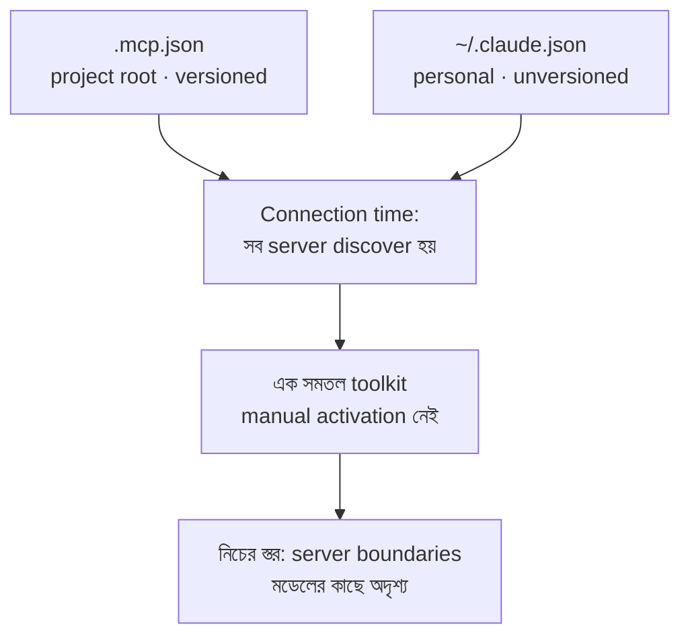

import ReadingProgress from '../../../../components/progress/ReadingProgress.astro';
import MarkComplete from '../../../../components/progress/MarkComplete.astro';
import KeywordTable from '../../../../components/content/KeywordTable.astro';
import ExamTrap from '../../../../components/content/ExamTrap.astro';
import BuildExercise from '../../../../components/content/BuildExercise.astro';
import Attribution from '../../../../components/content/Attribution.astro';

<ReadingProgress />

<div class="lesson-meta">
	<span class="lesson-badge">Domain 2</span>
	<span class="lesson-task">Task 2.4 · ওয়েট ১৮%</span>
	<span class="lesson-source">মূল ইংরেজি: MCP Server Integration</span>
</div>

## এই লেসনে যা জানতে হবে

MCP (Model Context Protocol) server Claude-এর সামর্থ্য বাড়ায় — database, API, development tool, issue tracker-এর সাথে জুড়ে দেয়। ঠিকভাবে কনফিগার করলে টিম একটা ধারাবাহিক toolset পায়; ভুল করলে configuration chaos।

## Scoping Hierarchy

MCP server কনফিগ দুই স্তরে থাকে, আর এদের গুলিয়ে ফেলাই বেশিরভাগ setup সমস্যার শুরু।

**Project-level: `.mcp.json`** — project repository-র root-এ থাকে। Version-controlled। যে-ই repository clone বা pull করে, সেই টিম-সদস্যই এটি পায়। পুরো টিমের দরকারি server এখানে — Jira integration, GitHub tool, internal API connector।

```json
{
  "mcpServers": {
    "github": {
      "type": "http",
      "url": "https://api.githubcopilot.com/mcp/"
    },
    "atlassian": {
      "type": "http",
      "url": "https://mcp.atlassian.com/v1/mcp/authv2"
    },
    "filesystem": {
      "command": "npx",
      "args": ["-y", "@modelcontextprotocol/server-filesystem", "${WORKSPACE_ROOT:-.}"]
    }
  }
}
```

দুই রকম entry shape খেয়াল করুন। Remote server-এ `"type": "http"` আর একটি `url` থাকে। Local server-এ `command` ও `args` থাকে, আর stdio-র উপর কথা বলে। `url` আছে কিন্তু `type` নেই — এটি configuration error: Claude Code সেটিকে stdio server ভেবে skip করে এবং type যোগ করতে বলে। GitHub আর Atlassian এখন official remote server দেয়, তাই দুটোর কোনোটিই npx লাইন নয়।

**User-level: `~/.claude.json`** — user-এর home directory-তে থাকে। ব্যক্তিগত। Version-control-এ **নেই**। টিমের সাথে শেয়ার হয় **না**। Experimental server, personal integration, বা টিমকে প্রস্তাব করার আগে পরীক্ষা করা server এখানে।

**Current state:** পরীক্ষার গাইড v1.0 দুই স্তরের কথা বলে — project আর user; পরীক্ষায় এটিই প্রত্যাশিত উত্তর। ১৪ আগস্ট ২০২৬-এ MCP ডকুমেন্টেশন তিনটি scope দেখায় — local (ডিফল্ট), project আর user — `-s` / `--scope` দিয়ে বাছা হয়, আর `~/.claude.json`-এ local ও user দুটোর entryই থাকে। পরীক্ষায় দুই স্তরের project-vs-user ভাগ দিয়েই উত্তর দিন।

**মূল নীতি:** সব configured server-এর (project-level ও user-level) সব টুল connection-এর সময়েই discover হয় এবং একসাথে পাওয়া যায়। কোনো manual activation ধাপ নেই — server configured ও reachable হলে তার টুল এজেন্টের toolkit-এ হাজির।



## Environment Variable Expansion

`.mcp.json` `${VARIABLE_NAME}` syntax দিয়ে environment variable expand করতে পারে। এভাবেই credential version control-এর বাইরে রেখে server configuration টিমের সাথে শেয়ার করা যায়।

```json
{
  "env": {
    "GITHUB_TOKEN": "${GITHUB_TOKEN}",
    "DATABASE_URL": "${DATABASE_URL}"
  }
}
```

প্রতিটি ডেভেলপার স্থানীয়ভাবে নিজের token সেট করে (shell profile, `.env` ফাইল বা secrets manager-এ)। `.mcp.json` variable-এর নাম উল্লেখ করে, মান নয়। ফলে:

- Configuration ফাইল version control-এ commit করা নিরাপদ
- প্রত্যেকে নিজের credential দিয়ে authenticate করে
- Token rotation-এ config ফাইল বদলাতে হয় না
- Repository history-তে কোনো secret ফাঁস হয় না

আরও একটি রূপ জানা দরকার: `${VAR:-default}` — VAR সেট থাকলে তার মান, না থাকলে `default` ব্যবহার করে। Machine-specific path-এ এটি ব্যবহার করুন, যেখানে যুক্তিসঙ্গত fallback আছে — উপরের `${WORKSPACE_ROOT:-.}` যেমন। ১৪ আগস্ট ২০২৬-এর অবস্থা: default ছাড়া unset variable বাকি configuration লোড হওয়া থামায় **না**; Claude Code warning দিয়ে এগিয়ে যায়। তাই missing token জোরে ব্যর্থ হবে বলে ভরসা করবেন না।

## MCP Resources

MCP resource টুল কল ছাড়াই এজেন্টের সামনে কনটেন্ট ক্যাটালগ আনে। কোন ডেটা আছে তা জানতে exploratory টুল না ডেকে, এজেন্ট তথ্যটি আগেই পায়।

এটিই পরীক্ষার গাইডের কাঠামো এবং keyed উত্তর। MCP specification (সেপ্টেম্বর ২০২৬) থেকে একটি সূক্ষ্মতা: resource **application-controlled**। Server সেগুলো তালিকাভুক্ত করে, কিন্তু ক্লায়েন্ট ঠিক করে কখন একটি resource মডেলের কনটেক্সটে জুড়বে — অর্থাৎ host সামনে আনলেই এজেন্ট resource দেখে। Claude Code এটি করে `@server:resource` mention আর একটি resource-listing টুলের মাধ্যমে।

Resource হিসেবে যা প্রকাশ করা যায়:

- **Issue summary** — Jira-র বর্তমান issue-এর তালিকা, শিরোনাম ও status-সহ
- **Documentation hierarchy** — internal doc-এর table of contents
- **Database schema** — table-এর নাম, column টাইপ ও সম্পর্ক

লাভ হলো কম নষ্ট কল। Resource ছাড়া এজেন্ট হয়তো `list_tables` ডাকে, তারপর প্রতিটি table-এ `describe_table` — শুধু দিক ঠিক করার জন্য টুল কল পুড়িয়ে ফেলে। Database schema resource থাকলে সে সাথে সাথেই জানে।

**Resource দেখায় কোন ডেটা আছে। Tool দিয়ে তা নিয়ে কাজ করা যায়।**

## Build বনাম Use-এর সিদ্ধান্ত

পরীক্ষাতেও, বাস্তব কাজেও এই সিদ্ধান্ত বারবার আসে। টিমকে একটি external system-এর সাথে জুড়তে হবে: custom MCP server বানাবেন, নাকি বিদ্যমান community server ব্যবহার করবেন?

**স্ট্যান্ডার্ড ইন্টিগ্রেশনে community server ব্যবহার করুন:**

- Jira, GitHub, Slack, Linear, Notion — এদের প্রতিটির রক্ষণাবেক্ষণকৃত community MCP server আছে
- এরা স্ট্যান্ডার্ড use case সামলায়, কমিউনিটি-টেস্টেড, আর আপডেট পায়
- ব্যবহার করলে development সময় ও maintenance বোঝা বাঁচে

**Custom server বানান কেবল তখনই:**

- টিমের এমন নির্দিষ্ট workflow যা community server সামলাতে পারে না
- Tool স্তরে নিজস্ব business logic ঢোকাতে হবে
- Proprietary internal system-এর সাথে integration দরকার, যার কোনো community server নেই

পরীক্ষা ধারাবাহিকভাবে pragmatic পছন্দের পক্ষে। স্ট্যান্ডার্ড ইন্টিগ্রেশন জড়িত থাকলে **"আগে community server যাচাই করুন"** সবসময় সঠিক। **"Custom বানান"** কেবল তখনই সঠিক, যখন পরিস্থিতিতে স্পষ্টভাবে team-specific চাহিদার কথা থাকে যা community server মেটাতে পারে না।

## MCP টুল বর্ণনা সমৃদ্ধ করা

এখানে একটি সূক্ষ্ম ফাঁদ: MCP টুলের বর্ণনা সংক্ষিপ্ত হলে এজেন্ট হয়তো built-in টুল (যেমন Grep) পছন্দ করে ফেলে, যদিও MCP টুলটি বেশি সক্ষম। কারণ সহজ — built-in টুল সম্পর্কে মডেলের কনটেক্সট ভালো: তাদের বর্ণনা সমৃদ্ধ ও বিস্তারিত।

Fix: MCP টুলের বর্ণনা সমৃদ্ধ করুন — capability ও output বিস্তারিত ব্যাখ্যা করুন। সংক্ষিপ্তটির বদলে:

```text
search_codebase: "Searches code"
```

লিখুন:

```text
search_codebase: "Performs semantic code search across the
entire repository using AST-aware indexing. Returns matching
functions, classes, and methods with full context including
file path, line numbers, and surrounding code. More accurate
than text-based grep for finding code by intent rather than
exact string match. Use this instead of Grep when searching
for code by what it does rather than what it contains."
```

সমৃদ্ধ বর্ণনা মডেলকে যথেষ্ট কনটেক্সট দেয়, যাতে MCP টুলটি সত্যিই বেশি সক্ষম হলে সে সেটিই বেছে নেয়।

<ExamTrap label="পরীক্ষার ফাঁদ: চারটি বারবার আসা ভুল">
	<p>
		(১) Jira-র মতো স্ট্যান্ডার্ড ইন্টিগ্রেশনে custom MCP server বানানো — আগে community server যাচাই করুন। (২) Team-wide server কনফিগ <code>~/.claude.json</code>-এ রাখা — সেটি ব্যক্তিগত, version-controlled নয়; টিমের server <code>.mcp.json</code>-এ। (৩) Credential সরাসরি <code>.mcp.json</code>-এ commit করা — <code>$&#123;GITHUB_TOKEN&#125;</code> syntax ব্যবহার করুন। (৪) MCP টুলের বর্ণনা সংক্ষিপ্ত রেখে built-in টুল পছন্দ হওয়ার দোষ দেওয়া — বর্ণনা সমৃদ্ধ করলেই প্রতিযোগিতা করে।
	</p>
</ExamTrap>

<KeywordTable keywords={frontmatter.keywords} />

<ExamTrap label="অনুশীলন: Jira ইন্টিগ্রেশনের প্রথম ধাপ">
	<p>
		একটি টিম Claude Code workflow-এ issue tracking-এর জন্য Jira-র সাথে জুড়তে চায়। একজন ডেভেলপার custom MCP server বানানোর প্রস্তাব দিল। সঠিক প্রথম ধাপ কী?
	</p>
	<details>
		<summary>উত্তর দেখুন</summary>

		**সঠিক উত্তর:** Jira-র বিদ্যমান community MCP server যাচাই করা, আর team-specific workflow সামলাতে না পারলে তবেই custom বানানো।

		**কেন বাকিগুলো ভুল:**

		- *<code>~/.claude.json</code>-এ Jira যোগ করা* — এতে প্রত্যেকে আলাদা কনফিগ করবে; টিম-ব্যাপী জিনিস project-level <code>.mcp.json</code>-এ বসে।
		- *Bash থেকে সরাসরি Jira REST API ডাকা* — MCP integration-এর সুবিধা হারায়, রক্ষণাবেক্ষণ ভার বাড়ে।
		- *দরকারি endpoint গুলো নকল করা custom server বানানো* — স্ট্যান্ডার্ড ইন্টিগ্রেশনে এটি অকারণ পরিশ্রম।

	</details>
</ExamTrap>

<BuildExercise
	title="Scoping ও environment variable সহ MCP server কনফিগার করুন"
	difficulty="Intermediate"
	time="৩০ মিনিট"
	objectives={[
		'Team-wide MCP server .mcp.json-এ কনফিগার করা',
		'Credential version control-এর বাইরে রাখতে environment variable expansion ব্যবহার',
		'Project-level ও user-level scoping-এর পার্থক্য ধরা',
		'MCP resource দিয়ে exploratory টুল কল কমানো',
		'Built-in টুলের সাথে প্রতিযোগিতার জন্য MCP টুল বর্ণনা সমৃদ্ধ করা',
	]}
	steps={[
		{
			title: 'Project root-এ একটি .mcp.json বানিয়ে একটি official MCP server (যেমন GitHub remote endpoint) কনফিগার করুন।',
			why: 'Project-level .mcp.json version-controlled এবং যে-ই repo clone করে সে-ই পায়; টিমের server এখানেই বসে।',
			expect:
				'Root-এ .mcp.json; mcpServers object-এ অন্তত একটি entry। Remote হলে "type": "http" ও url; local হলে command ও args।',
		},
		{
			title: 'Authentication credential-এর জন্য ${GITHUB_TOKEN} environment variable expansion ব্যবহার করুন।',
			why: '.mcp.json-এ credential সরাসরি commit করা নিরাপত্তা ঝুঁকি; expansion ফাইলে নাম রাখে, মান নয়।',
			expect:
				'Headers-এ ${GITHUB_TOKEN} আছে (আসল token নয়); git diff-এ কোনো secret নেই; প্রত্যেকে নিজের token স্থানীয়ভাবে সেট করে।',
		},
		{
			title: 'একটি personal বা experimental MCP server ~/.claude.json-এ যোগ করুন।',
			why: 'User-level কনফিগ ব্যক্তিগত, শেয়ার হয় না; পরীক্ষা scoping hierarchy ধরে।',
			expect: '~/.claude.json-এ mcpServers entry; ফাইলটি project repository-তে নেই, version control-এও নয়।',
		},
		{
			title: 'একটি content catalogue (documentation hierarchy বা database schema) MCP resource হিসেবে প্রকাশ করুন।',
			why: 'Resource ছাড়া এজেন্ট list_tables তারপর প্রতিটি টেবিলে describe_table ডেকে টুল কল নষ্ট করে।',
			expect:
				'Structured data প্রকাশ করা resource (যেমন db://schema/main) — name, description ও mimeType সহ।',
		},
		{
			title:
				'আপনার MCP server-এর টুল বর্ণনা সমৃদ্ধ করুন, যাতে এজেন্ট built-in টুলের দিকে ঝুঁকে না পড়ে।',
			why: 'সমৃদ্ধ built-in বর্ণনার সামনে সংক্ষিপ্ত MCP বর্ণনা হেরে যায়; বিস্তারিত বর্ণনাই প্রতিযোগিতা করে।',
			expect:
				'৩-৫ বাক্যের বর্ণনা — কী করে, কী ফেরায়, কখন ব্যবহার করবেন, আর built-in বিকল্পের সাথে তুলনা।',
		},
	]}
/>

## সূত্র

<ul>
	{frontmatter.sources.map((source) => (
		<li>
			<a href={source.href} target="_blank" rel="noopener noreferrer">
				{source.label}
			</a>
			{source.note ? ` — ${source.note}` : ''}
		</li>
	))}
</ul>

<Attribution sourceUrl={frontmatter.sourceUrl} updated={frontmatter.updated} />

<MarkComplete lessonId="2-4" />
