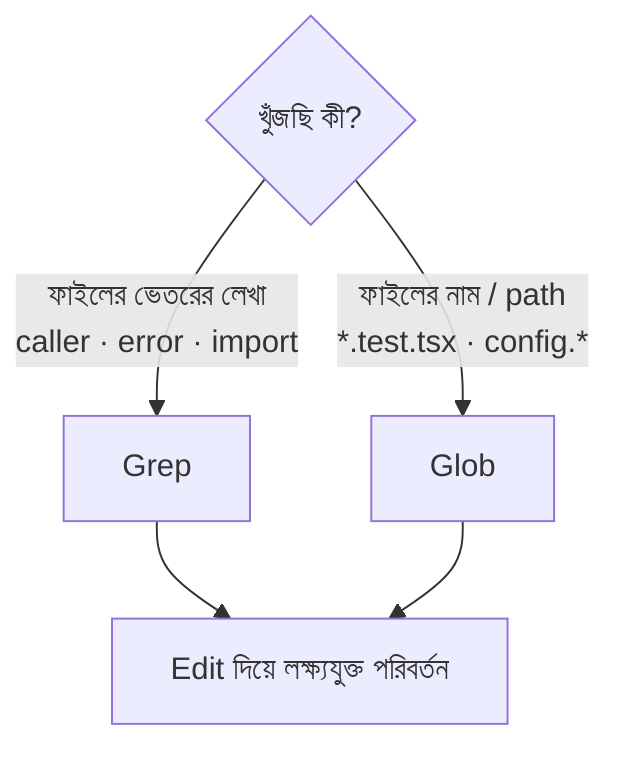

import ReadingProgress from '../../../../components/progress/ReadingProgress.astro';
import MarkComplete from '../../../../components/progress/MarkComplete.astro';
import KeywordTable from '../../../../components/content/KeywordTable.astro';
import ExamTrap from '../../../../components/content/ExamTrap.astro';
import BuildExercise from '../../../../components/content/BuildExercise.astro';
import Attribution from '../../../../components/content/Attribution.astro';

<ReadingProgress />

<div class="lesson-meta">
	<span class="lesson-badge">Domain 2</span>
	<span class="lesson-task">Task 2.5 · ওয়েট ১৮%</span>
	<span class="lesson-source">মূল ইংরেজি: Built-in Tools</span>
</div>

## এই লেসনে যা জানতে হবে

Claude Code কোডবেস নিয়ে কাজ করার জন্য ছয়টি built-in টুল দেয়: **Read, Write, Edit, Bash, Grep, Glob**। প্রতিটির নির্দিষ্ট কাজ আছে, আর ভুল টুল বাছলে সময় নষ্ট হয়, context token নষ্ট হয়, বা দুটোই। পরীক্ষা ঠিক করে এমন পরিস্থিতি সাজায় যেখানে এই টুল গুলিয়ে ফেললে উত্তর ভুল হয়।

## Grep বনাম Glob: মূল পার্থক্য

এই টাস্ক স্টেটমেন্টের সবচেয়ে জরুরি পার্থক্য এটিই। ভুল করলে নম্বর যায়।

**Grep ফাইলের ভেতরের কনটেন্টে প্যাটার্ন খোঁজে।**

Grep ব্যবহার করুন যখন ফাইলের ভেতরে লেখা খুঁজতে হয়। Function caller, error message, import statement, variable assignment — ফাইলে কী আছে তা খুঁজতে Grep-ই টুল।

```text
// processLegacyOrder() কোথায় কোথায় ডাকা হয়
Grep: "processLegacyOrder"

// "timeout" আছে এমন error message
Grep: "timeout"

// নির্দিষ্ট module import করে এমন ফাইল
Grep: "import.*from 'utils/auth'"
```

**Glob নাম, extension বা directory pattern দিয়ে ফাইলের path মেলায়।**

Glob ব্যবহার করুন যখন ফাইলের নাম, extension বা directory structure দিয়ে খুঁজতে হয়। Test ফাইল, configuration ফাইল, নির্দিষ্ট directory-র সব TypeScript ফাইল — path অনুযায়ী খুঁজতে Glob-ই টুল।

```text
// সব test ফাইল
Glob: "**/*.test.tsx"

// সব configuration ফাইল
Glob: "**/config.*"

// domains directory-র সব MDX ফাইল
Glob: "content/domains/**/*.mdx"
```

এক বাক্যে পার্থক্য: **Grep খোঁজে ফাইলের ভেতরে কী আছে। Glob খোঁজে ফাইলকে তার নাম দিয়ে।**

পরীক্ষা এমন পরিস্থিতি দেয় যেখানে ডেভেলপার ভুল টুল ব্যবহার করে। Function caller খুঁজতে Glob দিলে ব্যর্থ — Glob path মেলায়, content নয়। Test ফাইল খুঁজতে Grep দিলে কারিগরি দিক থেকে কাজ হতে পারে, কিন্তু সেটি ভুল টুল, আর পরীক্ষা সঠিকটিই চায়।



## Read, Write ও Edit

এই তিনটি টুল ফাইল-অপারেশন সামলায়, প্রতিটি আলাদা প্রয়োজনে সেরা।

**Edit** unique text matching দিয়ে লক্ষ্যযুক্ত পরিবর্তন করে। কোন টেক্সট খুঁজে বের করতে হবে আর তার বদলে কী বসবে, তা বলতে হয়। দ্রুত ও নিখুঁত, কারণ এটি কেবল নির্দিষ্ট টেক্সটেই হাত দেয়।

```text
Edit:
  old_string: "function processOrder(id: string)"
  new_string: "function processOrder(id: string, validate: boolean = true)"
```

**Edit কখন ব্যর্থ হয়:** Edit-এর unique text matching দরকার। বলা টেক্সট ফাইলে একাধিক জায়গায় থাকলে Edit বুঝতে পারে না কোনটি চাইছেন, তাই ব্যর্থ হয়। এটি নিরাপত্তা-ব্যবস্থা, bug নয় — আপনি যেখানে হাত দিতে চাননি সেখানে বদল আটকে দেয়।

**Edit unique anchor না পেলে — পরীক্ষার উত্তর:** গাইড একটি fallback-এর নাম দেয় — **Read + Write**। পূর্ণ ফাইল পড়ুন, তারপর সম্পূর্ণ সংশোধিত সংস্করণ Write দিয়ে ফেরত লিখুন। এটি সবসময় কাজ করে, কারণ Edit-কে আর অনুমান করতে হয় না। তবে এক লাইনের পরিবর্তনের জন্যও একটি ফাইলের সমান token খরচ করে — তাই এটি fallback, ডিফল্ট নয়।

**Edit unique anchor না পেলে — বর্তমান Claude Code:** Edit টুলের ডক এখন আগে সস্তা পথ দেখায় — `old_string`-এ আরও আশপাশের কনটেক্সট জুড়ে দিয়ে একটিমাত্র স্থানে পৌঁছান, বা সব occurrence সত্যিই বদলাতে চাইলে `replace_all: true` সেট করুন। দুটোই Edit-এই রাখে আর প্রায় কোনো বাড়তি কনটেক্সট খরচ করে না। বাস্তব কাজে Read + Write-এ যাওয়ার আগে এটিই করুন।

বাস্তব কাজের ক্রম:

- সম্ভাব্য unique সবচেয়ে ছোট anchor দিয়ে Edit চেষ্টা করুন।
- Non-unique match হলে `old_string` প্রশস্ত করুন যতক্ষণ এক স্থানে মেলে, বা সব occurrence বদলাতে চাইলে `replace_all: true`।
- এর কোনোটিতেই লক্ষ্য নির্দিষ্ট করা না গেলে Read + Write-এ নামুন।

পরীক্ষার ক্রম দুই ধাপের: আগে Edit, ব্যর্থ হলে Read + Write। দুটি ক্রম প্রথম ধাপে একমত। প্রতিটি পরিবর্তনে Read + Write-কে ডিফল্ট বানাবেন না — পরীক্ষা এটি শাস্তি দেয়, কারণ context token পুড়ে যায়।

**Current state:** পরীক্ষার গাইড v1.0 Read + Write-কে documented fallback হিসেবে ধরে ("Using Read to load full file contents followed by Write when Edit cannot find unique anchor text")। ১৪ আগস্ট ২০২৬-এ Edit টুলের reference non-unique match-এ `old_string` প্রশস্ত করা বা `replace_all: true`-কে আচরণ হিসেবে লেখে। পরীক্ষায় উত্তর দিন Read + Write। বাস্তব কাজে আগে anchor প্রশস্ত করুন — সস্তা, আর উপরের practice তখনও খাটে।

## ধাপে ধাপে কোডবেস বোঝা

কোডবেস কীভাবে ঘাঁটবেন সেটা কোন টুল ব্যবহার করলেন তার মতোই জরুরি। একটি সঠিক পথ আছে, একটি ভুল।

**ভুল: সব ফাইল আগেই Read করা।** কী দরকার তা জানার আগেই প্রতিটি ফাইল কনটেক্সটে তোলা context-budget-এর খুনি। ২০০ ফাইলের কোডবেস পুরোটা পড়লে গোটা context window গিলে ফেলে — বেশিরভাগই এমন ফাইলে, যেগুলোর কাজের সাথে সম্পর্কই নেই। অন্য কোনো exploration ভুল এর চেয়ে বেশি খরচ করে না।

**সঠিক: incremental discovery।** সংকীর্ণভাবে শুরু করুন, দরকার হলেই বাড়ান।

- **Grep দিয়ে entry point খুঁজুন।** Function-এর নাম, class-এর নাম বা error message দিয়ে তদন্তের নোঙর খুঁজুন। কোন ফাইল প্রাসঙ্গিক তা এতেই বোঝা যায়।
- **Read দিয়ে import অনুসরণ করে flow ট্রেস করুন।** কোন ফাইলগুলো গুরুত্বপূর্ণ জানলে সেগুলো পড়ুন, আর import statement ধরে সম্পর্কিত ফাইল খুঁজুন।
- **আবার Grep দিয়ে usage ট্রেস করুন।** পড়া ফাইলগুলো অন্য নামে function টি প্রকাশ করতে পারে: একটি wrapper (ভেতরে processOrder() ডাকা submitOrder()) বা re-export করা barrel file (`export { processOrder as submitOrder }`)। নতুন নামের caller-রা মূলটির নাম কখনো লেখে না, তাই প্রথম Grep তাদের দেখেনি। প্রতিটি নতুন নামে গোটা কোডবেসে Grep করে consumer-এর পূর্ণ তালিকা আনুন।
- **কেবল দরকারটা Read করুন।** প্রতিটি ফাইল পড়ার যৌক্তিকতা আগের ধাপে পাওয়া তথ্য থেকে আসা উচিত।

এটাই সর্বনিম্ন কনটেক্সটে সর্বোচ্চ বোঝাপড়া — কোডবেস ক্রমশ ম্যাপ করা, token খরচ কেবল প্রাসঙ্গিক ফাইলে।

## Wrapper Module জুড়ে Function Usage ট্রেস করা

কোডবেসে একটি চেনা নকশা: function এক module-এ define, wrapper দিয়ে re-export, আর consumer-রা wrapper-এর নাম দিয়েই ব্যবহার করে। মূল নামে সরল Grep করলে wrapper হয়ে import করা প্রতিটি consumer মিস হয়।

সঠিক পদ্ধতি:

- Function definition খুঁজতে Grep করুন — কোথায় define হয়েছে।
- Defining ফাইলটি Read করে export করা নাম চিনুন।
- প্রতিটি exported নামে গোটা কোডবেসে Grep করুন — সব consumer পাবেন।
- Function যদি একটি barrel file (যেমন index.ts) দিয়ে re-export হয়, তবে barrel-এর module নামে Grep করে তাদের খুঁজুন যারা সেখান থেকে import করে।

নির্দিষ্ট করে: `processOrder` define করা `orders.ts`-এ। Barrel `utils/index.ts` এটি `submitOrder` নামে re-export করে, আর তার পাঁচটি consumer-এর তিনটি `utils` থেকে `submitOrder` import করে। `processOrder`-এ Grep definition, barrel-এর লাইন আর মূল নাম import করা দুটি consumer পায় — বাকি তিনটিকে পারে না, কারণ তাদের ফাইলে `processOrder` শব্দটিই নেই। Barrel পড়ে নাম বদল চোখে পড়লে `submitOrder`-এ Grep করলেই তারা ধরা পড়ে।

এই বহু-ধাপের ট্রেস এক Grep-এ মিস হওয়া indirect consumer ধরে।

## Deprecation সিনারিও

পরীক্ষার প্রস্তুতিতে এটি বারবার আসে: এমন প্রতিটি ফাইল খুঁজুন যারা একটি deprecated function কল করে **এবং** যে test ফাইলগুলো সেটি চালায়। সঠিক ক্রম:

- Function-এর নামে **Grep** — যে ফাইলের কনটেন্টে function-এর উল্লেখ আছে সব পাবেন, সরাসরি import করা test-সহ (content search)।
- প্রতিটি caller-এর sibling test ফাইলের জন্য **Glob** — naming convention-এ জোড়া মেলে, যেমন `OrderProcessor.ts` → `OrderProcessor.test.tsx`, এমনকি test যখন source module হয়ে function-টি পরোক্ষভাবে চালায় (path matching)।
- Wrapper নামে **আবার Grep** — কোনো caller function-টি wrapper দিয়ে প্রকাশ করলে (যেমন `applyLegacyOrder` ভেতরে `processLegacyOrder` কল করে), wrapper-এর নামে Grep করে তার মধ্য দিয়ে transitive coverage করা test খুঁজুন।

ধরুন, Grep দেখাল `OrderProcessor.ts` ও `RefundHandler.ts` deprecated function কল করে। `**/OrderProcessor.test.*` আর `**/RefundHandler.test.*` দিয়ে Glob করে sibling test ফাইল আনুন, যদিও সেই test-এ `processLegacyOrder` নাম নেই। আর কোনো source ফাইল function-টি নতুন নামে মুড়ে থাকলে wrapper-এ Grep করে বাকি test ধরে ফেলুন।

এটি **Grep, তারপর Glob, তারপর আবার Grep** — সরাসরি উল্লেখে content search, পাশের test-এ path matching, আর পরোক্ষ coverage-এ content search। Glob দিয়ে শুরু নয়।

<ExamTrap label="পরীক্ষার ফাঁদ: চারটি বারবার আসা ভুল">
	<p>
		(১) Function caller খুঁজতে Glob — Glob path মেলে, content নয়। (২) Extension বা naming pattern দিয়ে ফাইল খুঁজতে Grep — সেটি Glob-এর কাজ। (৩) কী প্রাসঙ্গিক তা জানার আগেই সব source ফাইল Read করা। (৪) প্রতি পরিবর্তনে Read + Write ডিফল্ট করা — Edit আগে চেষ্টা করুন; Read + Write কেবল unique anchor না পেলে।
	</p>
</ExamTrap>

<ExamTrap label="পরীক্ষার ফাঁদ: non-unique match-এ কী উত্তর দেবেন">
	<p>
		"Edit non-unique match রিপোর্ট করলে কী করবেন?" — এখানে বর্তমান Claude Code বলে <code>old_string</code> প্রশস্ত করুন বা <code>replace_all</code> সেট করুন, যা বাস্তব কাজে সস্তা। কিন্তু পরীক্ষার গাইড একমাত্র fallback হিসেবে Read + Write-এর নাম দেয়, আর প্রতিটি keyed উত্তর গাইড অনুসরণ করে: পূর্ণ ফাইল পড়ুন, তারপর সম্পূর্ণ সংশোধিত সংস্করণ Write করুন।
	</p>
</ExamTrap>

<KeywordTable keywords={frontmatter.keywords} />

<ExamTrap label="অনুশীলন: সঠিক টুল-ক্রম">
	<p>
		একজন ডেভেলপারকে deprecated function <code>processLegacyOrder()</code> কল করা সব ফাইল এবং সেই caller-দের সব test ফাইল খুঁজতে হবে। কোন টুল-ক্রমটি সঠিক?
	</p>
	<details>
		<summary>উত্তর দেখুন</summary>

		**সঠিক উত্তর:** `processLegacyOrder`-এ Grep করে caller খুঁজুন (সরাসরি import করা test-ও এতে ধরা পড়ে), তারপর প্রতিটি caller-এর sibling test ফাইলে (যেমন `**/OrderProcessor.test.*`) Glob করুন — যাতে source module হয়ে function চালানো test-ও মেলে, যদিও সেখানে নামটি লেখা নেই।

		**কেন বাকিগুলো ভুল:**

		- *Bash-এ find + xargs grep* — এক pipeline-এ কাজ হতে পারে, কিন্তু built-in টুল-নির্বাচনের প্রশ্ন এটি উত্তর দেয় না।
		- *Glob দিয়ে caller খোঁজা* — Glob path মেলায়, content নয়; function কলের উল্লেখ খুঁজতেই পারে না।
		- *সব ফাইল Read করা* — সম্পূর্ণ দৃশ্যমানতা দেয়, কিন্তু context window গিলে ফেলে; incremental discovery-র বিপরীত।

	</details>
</ExamTrap>

## প্র্যাকটিস সিনারিও (নিজে উত্তর ভাবুন, তারপর খুলুন)

> একজন ডেভেলপারের এমন সব ফাইল খুঁজতে হবে যারা deprecated ফাংশন `processLegacyOrder()` কল করে, আর সেই কলারদের test ফাইলও খুঁজতে হবে। সঠিক টুল-ক্রম কোনটি?

<details>
	<summary>উত্তর দেখুন</summary>

	**সঠিক উত্তর:** আগে `processLegacyOrder` দিয়ে Grep করে কলার খোঁজা — এতে ফাংশনটি import করা test ফাইলও ধরা পড়ে — তারপর প্রতিটি কলারের পাশের test ফাইল Glob করা।

	**কেন বাকিগুলো ভুল:**

	- *Bash-এ find আর xargs grep দিয়ে দুটো ধাপ এক pipeline-এ* — ফাইলের ভেতরে কী লেখা আছে তা খুঁজতে Grep-ই সঠিক টুল; built-in টুল ছেড়ে shell-এ গেলে context-budget আর স্কোপিং দুটোই হাতছাড়া।
	- *আগে Glob দিয়ে `**/*processLegacyOrder*` খোঁজা* — Glob ফাইলের নাম মেলায়, ফাইলের ভেতরের কল নয়। এভাবে কলারই ধরা পড়ে না।
	- *সব source ফাইল Read করে হাতে খোঁজা* — প্রতিটি ফাইল পড়া context-budget-এর সবচেয়ে বড় অপচয়।

</details>

<BuildExercise
	title="Built-in টুল দিয়ে deprecated function ট্রেস ও refactor করুন"
	difficulty="Intermediate"
	time="৩০ মিনিট"
	objectives={[
		'Content search-এ Grep, path matching-এ Glob — সঠিক ক্রমে প্রয়োগ',
		'সব ফাইল আগেই না পড়ে incremental discovery করা',
		'Edit-কে প্রাথমিক modification টুল ধরা, anchor প্রশস্ত করা',
		'Wrapper ও barrel file জুড়ে function usage ট্রেস করা',
		'Grep-then-Glob প্যাটার্নে caller ও তাদের test খুঁজে বের করা',
	]}
	steps={[
		{
			title: 'Grep দিয়ে কোডবেস জুড়ে processLegacyOrder-এর সব caller খুঁজুন।',
			why: 'Grep ফাইলের কনটেন্ট খোঁজে — function caller খুঁজতে এটিই সঠিক টুল; Glob এখানে ব্যর্থ হয়।',
			expect: 'Call site সহ ফাইলের তালিকা, line number ও মেলা লাইন — যেমন src/OrderProcessor.ts:42: await processLegacyOrder(orderId)।',
		},
		{
			title: 'Caller ফাইলের নাম অনুযায়ী test ফাইল খুঁজতে Glob ব্যবহার করুন (যেমন **/*.test.tsx)।',
			why: 'Glob naming pattern দিয়ে path মেলায় — extension বা convention-এ test ফাইল খুঁজতে এটিই সঠিক।',
			expect: 'প্রতিটি caller-এর জন্য প্রাসঙ্গিক test ফাইলের তালিকা, এমনকি test-এ function-এর নাম না থাকলেও।',
		},
		{
			title: 'Defining ফাইল ও barrel file Read করে function অন্য নামে export হয়েছে কি না দেখুন; নতুন নামে Grep করুন।',
			why: 'Wrapper বা re-export হলে নতুন নামের caller-রা মূল নাম কখনো লেখে না; দ্বিতীয় Grep তাদের ধরে।',
			expect: 'Wrapper বা barrel হয়ে function ব্যবহার করা বাড়তি consumer-দের তালিকা।',
		},
		{
			title: 'একটি caller ফাইলে Edit দিয়ে deprecated call সরিয়ে নতুন function বসান।',
			why: 'Edit লক্ষ্যযুক্ত পরিবর্তনের ডিফল্ট; পূর্ণ ফাইল লেখার দরকার নেই।',
			expect: 'কেবল নির্দিষ্ট old_string বদলেছে; বাকি ফাইল অপরিবর্তিত।',
		},
		{
			title: 'ইচ্ছাকৃতভাবে একটি non-unique old_string দিয়ে Edit চালিয়ে দেখুন কী হয়, তারপর সস্তা পথে ঠিক করুন।',
			why: 'Non-unique match-এ Edit fail করা নিরাপত্তা-ব্যবস্থা; পরীক্ষা এখানে Read + Write চায়, বাস্তব কাজে anchor প্রশস্ত করা বা replace_all।',
			expect:
				'প্রথমে fail; প্রসঙ্গ বাড়িয়ে old_string প্রশস্ত করলে বা replace_all দিয়ে লক্ষ্য নির্দিষ্ট হয়; না হলে Read + Write fallback।',
		},
	]}
/>

## সূত্র

<ul>
	{frontmatter.sources.map((source) => (
		<li>
			<a href={source.href} target="_blank" rel="noopener noreferrer">
				{source.label}
			</a>
			{source.note ? ` — ${source.note}` : ''}
		</li>
	))}
</ul>

<Attribution sourceUrl={frontmatter.sourceUrl} updated={frontmatter.updated} />

<MarkComplete lessonId="2-5" />
