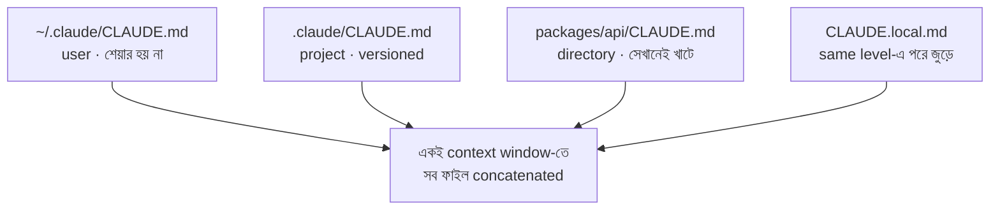

import ReadingProgress from '../../../../components/progress/ReadingProgress.astro';
import MarkComplete from '../../../../components/progress/MarkComplete.astro';
import KeywordTable from '../../../../components/content/KeywordTable.astro';
import ExamTrap from '../../../../components/content/ExamTrap.astro';
import BuildExercise from '../../../../components/content/BuildExercise.astro';
import Attribution from '../../../../components/content/Attribution.astro';

<ReadingProgress />

<div class="lesson-meta">
	<span class="lesson-badge">Domain 3</span>
	<span class="lesson-task">Task 3.1 · ওয়েট ২০%</span>
	<span class="lesson-source">মূল ইংরেজি: CLAUDE.md Hierarchy, Scoping, and Modular Organisation</span>
</div>

## এই লেসনে যা জানতে হবে

Claude Code তিন স্তরের CLAUDE.md ফাইল থেকে configuration পড়ে। কোনটি কোথায় খাটে — আর কোথায় ভুল স্তর ব্যবহার হয়েছে — তা পরীক্ষায় বারবার আসে।

## তিন স্তরের হায়ারার্কি

**User-level: `~/.claude/CLAUDE.md`** — এটি কেবল আপনার জন্য। Home directory-তে থাকে, কোনো repository-র ভেতরে নয়, তাই version-controlled নয় আর git দিয়ে কখনো যায় না। নতুন টিম-সদস্য হিসাবে repo clone করলে এই নির্দেশ পাবেন না। এই স্তর কেবল ব্যক্তিগত পছন্দের জন্য রাখুন: verbosity সেটিং, পছন্দের output style, নিজের shortcut।

**Project-level: `.claude/CLAUDE.md` বা root `CLAUDE.md`** — এটি প্রজেক্টের সবার জন্য। Repository-তে থাকে, version-controlled, তাই যে-ই clone বা pull করে সে-ই নির্দেশ স্বয়ংক্রিয়ভাবে পায়। Team-wide standard এখানেই: naming convention, error handling pattern, testing requirement, architecture সিদ্ধান্ত, code review checklist।

`.claude/CLAUDE.md` (`.claude` directory-র ভেতরে) আর repository root-এর `CLAUDE.md` — দুটোই বৈধ project-level অবস্থান। পরীক্ষা দুই পথের যেকোনোটিই দিতে পারে।

**Directory-level: subdirectory-র CLAUDE.md** — যেখানে কাজ করছেন, কেবল সেখানেই খাটে। Project root থেকে আলাদা package-specific convention-এর জন্য ব্যবহার করুন। যেমন `/packages/api/CLAUDE.md`-এ REST convention রাখা যায়, যা frontend package কখনো দরকার পড়ে না।



## Loading Order ও Conflict Handling

CLAUDE.md ফাইলগুলো কঠোর precedence-এর configuration নয়। Anthropic memory ডকুমেন্টেশন স্পষ্ট: **"All discovered files are concatenated into context rather than overriding each other."** প্রযোজ্য প্রতিটি ফাইল একই context window-তে load হয়; কোনোটি অন্যটিকে প্রতিস্থাপন করে না।

ডকুমেন্টেড load order আছে, precedence chain নয়:

- ফাইলগুলো প্রশস্ত scope থেকে সংকীর্ণে সাজানো। Project instruction, user instruction-এর পরে context-এ আসে। Directory tree-তে "content is ordered from the filesystem root down to your working directory" — অর্থাৎ "instructions closer to where you launched Claude are read last"।
- একটি directory-র ভেতরে `CLAUDE.local.md`, `CLAUDE.md`-এর পরে জুড়ে যায়, তাই সেই স্তরে আপনার ব্যক্তিগত নোটই Claude সবার শেষে পড়ে।

এতে কোনো winner-take-all hierarchy হয় না। ডকুমেন্টেশন নির্দ্বিধায় বলে: **"if two rules contradict each other, Claude may pick one arbitrarily."** CLAUDE.md user message হিসেবে যায় — system prompt-এর অংশ হিসেবে নয় — আর Anthropic বলে **"there's no guarantee of strict compliance."** CLAUDE.md-কে এমন guidance ভাবুন যা মডেল সাধারণত মানে, কিন্তু deterministic override-যুক্ত configuration স্তর নয়।

ব্যবহারিক পরিণতি: কোনো নিয়ম প্রতিবার খাটতেই হবে — আটকে দেওয়া টুল, বাধ্যতামূলক formatter, permission policy — তবে CLAUDE.md scoping-এর উপর ভরসা করবেন না। সেটি `settings.json`-এ লিখুন (ক্লায়েন্ট Claude যা ভাবুক না কেন, এটি এনফোর্স করে) বা hook-এ (নির্দিষ্ট lifecycle event-এ চলে)। Anthropic ডকুমেন্টেশন সরাসরি বলছে: **"Settings rules are enforced by the client regardless of what Claude decides to do. CLAUDE.md instructions shape Claude's behavior but are not a hard enforcement layer."**

## CLAUDE.md-কে settings.json-এর সাথে গুলিয়ে ফেলবেন না

`settings.json`-এ কঠোর precedence chain আছে — **managed policy > local > project > user**, managed সবসময় জেতে। CLAUDE.md-এ তা নেই — ফাইল concatenated হয়, সংঘর্ষে সমাধান ইচ্ছামতো হতে পারে। পরীক্ষায় যদি জিজ্ঞেস করে "সংঘর্ষে কোন CLAUDE.md জেতে?", ডকুমেন্টেশনের সৎ উত্তর: **কোনোটিই গ্যারান্টিযুক্ত নয় — নিয়মটি settings.json বা hook-এ সরান।** "More specific scope wins" বা "user-level project-level-কে override করে" — এমন distractor-এ সাবধান; দুটিই এমন paraphrases যা official docs কখনো বলে না।

## @ path import দিয়ে Modular Organisation

কয়েকশো লাইন পার হলে একটি CLAUDE.md রাখা-বজায় রাখার কষ্ট হয়ে ওঠে। `@` syntax দিয়ে এটিকে কয়েকটি ফাইলে ভাগ করে মূলটি থেকে reference করা যায়। Directive হলো শুধু `@` আর তারপর একটি path। **`@import` keyword বলে কিছু নেই**, যদিও অনলাইনে অর্ধেক ডকুমেন্ট এভাবে লেখে।

```markdown
# .claude/CLAUDE.md
Coding standards:
@./standards/naming-conventions.md
@./standards/error-handling.md
@./standards/testing-requirements.md
```

প্রতিটি `@<path>` লাইন load-এর সময় সেই ফাইলকে CLAUDE.md-এ inline করে। Per-package CLAUDE.md ফাইল কেবল নিজের প্রযোজ্য standard import করে। API package API convention আনে, frontend component rule আনে। Duplication নেই।

ডকুমেন্টেশন একটি কথা চুপচাপ এড়িয়ে যায়: **imports eager-ভাবে load হয়।** Claude আপনার CLAUDE.md পড়ার মুহূর্তেই referenced ফাইলটি inline হয়ে যায়, ঠিক যেন আপনি পেস্ট করে দিয়েছেন। তাই ৬০০ লাইনের CLAUDE.md-কে ছয়টি ১০০ লাইনের import-এ ভাগ করলে source-এ কাজ করা সহজ হয়, কিন্তু Claude যে context দেখে তার আকার একই থাকে। Per-session context ছোট করতে চাইলে টুলটি হলো `.claude/rules/` আর তার path-scoped frontmatter (বিস্তারিত Task Statement 3.3-এ)। সেগুলো কেবল মেলে এমন path-এ কাজ করার সময় load হয়।

## CLAUDE.local.md — শুধু স্থানীয় Override

`CLAUDE.local.md` হায়ারার্কির যেকোনো স্তরে CLAUDE.md-এর পাশে থাকে আর একইভাবে load হয়, তিনটি ছোট পার্থক্য নিয়ে:

- **Loading order:** একই স্তরে `CLAUDE.local.md`, `CLAUDE.md`-এর পরে জুড়ে যায়, তাই আপনার ব্যক্তিগত নোট সেখানে সবার শেষে পড়া হয়। এটি load order, precedence নয়: শেষে পড়লেই সংঘর্ষ জিতে যায় না।
- **Convention অনুযায়ী gitignored:** `.local` suffix বোঝায় ফাইলটি commit করতে চান না। বেশিরভাগ টিম `CLAUDE.local.md`-কে `.gitignore`-এ রাখে, যাতে ব্যক্তিগত tweak ব্যক্তিগতই থাকে।
- **উদ্দেশ্য:** শেয়ার্ড CLAUDE.md টিমের নিয়ম। পাশের CLAUDE.local.md এই repo-র জন্য আপনার নিজের খুঁত: পছন্দের scratchpad path, বারবার পেস্ট করা একটা verbose ব্যাখ্যা, পরের সপ্তাহে মুছে ফেলা temporary debugging নোট।

`CLAUDE.local.md`-কে `~/.claude/CLAUDE.md`-এর project-scoped রূপ ভাবুন: একই ধারণা, সংকীর্ণ scope। টিমের নিয়ম প্রকাশ করতে এটি ব্যবহারের ইচ্ছে জাগলে, সেই নিয়ম CLAUDE.md-এ যাওয়া উচিত।

## .claude/rules/ ডিরেক্টরি

একটি বড় CLAUDE.md-এর বিকল্প হিসেবে `.claude/rules/` directory-তে বিষয়ভিত্তিক rule ফাইল রাখা যায়:

- `testing.md` — test naming, assertion pattern, fixture ব্যবহার
- `api-conventions.md` — endpoint naming, request/response schema
- `deployment.md` — deployment checklist, environment configuration

প্রতিটি ফাইলে ঐচ্ছিকভাবে YAML frontmatter দিয়ে path scoping যোগ করা যায় (বিস্তারিত Task Statement 3.3-এ)। Frontmatter না থাকলে rule ফাইল সব সেশনে load হয়।

## কী Load হয়েছে তা ডায়াগনোজ করা: /memory ও /context

সেশন থেকে সেশনে বা ডেভেলপারের মধ্যে আচরণ সরে গেলে দেখতে হয়, এই সেশন আসলে কোন memory ফাইল নিয়েছে। একজন টিমমেটের জন্য Claude Code টিমের convention মানে আর অন্যজনের জন্য না মানলে উত্তর এখানেই।

বর্তমান Claude Code-এ কাজটি দুটি কমান্ডে ভাগ: `/memory` আপনার CLAUDE.md, CLAUDE.local.md ও auto-memory অবস্থান তালিকাভুক্ত করে এবং যেকোনোটি editor-এ খোলে। `/context` দেখায় এই সেশনে আসলে কী load হয়েছে — **Memory files** শিরোনামের নিচে — তাই ফাইল live কি না নিশ্চিত করতে `/context` চালিয়ে সেই তালিকা পড়ুন। ডকুমেন্টেশন স্পষ্ট: "check the list under Memory files to verify your CLAUDE.md and CLAUDE.local.md files loaded" (Claude Code memory docs, verified August 2026)।

**পরীক্ষায় উত্তর `/memory`:** পরীক্ষার গাইড (v1.0) এই ভাগের আগের সময়ের, আর `/memory`-কেই দেখানো ফাইলের কমান্ড ধরে। Keyed উত্তর `/memory` দিন; বাস্তবে কীবোর্ডে `/context` চালান।

<ExamTrap label="পরীক্ষার ফাঁদ: ডায়াগনস্টিক কমান্ড লোড করে না">
	<p>
		দুটির কোনোটিই কিছু load করে না। তারা দেখায় কোন ফাইল ইতিমধ্যে load হয়েছে — configuration তার স্তর ও অবস্থান অনুযায়ী স্বয়ংক্রিয়ভাবে load হয়। ডায়াগনোজের জন্য ব্যবহার করুন, activate করার জন্য নয়। পরীক্ষা ঠিক এই অংশটিই ধরে, আর `/memory` ও `/context` দুটোর ক্ষেত্রেই খাটে।
	</p>
</ExamTrap>

## Compaction-এর পর কী টেকে

`/compact` দীর্ঘ সেশন সারসংক্ষেপ করলে project-root CLAUDE.md অটুট ফেরে। কারণ এটি কোনো বিশেষ জায়গায় বসে আছে নয় — compaction-এর পর Claude এটি ডিস্ক থেকে আবার পড়ে re-inject করে, আর আপনার নির্দেশ শুরু থেকেই conversation history-র অংশ ছিল না, তাই সারসংক্ষেপকারীর চাপার মতো কিছুই ছিল না।

দুটি জিনিস স্বয়ংক্রিয়ভাবে ফেরে না: subdirectory-র nested CLAUDE.md, আর `paths:` frontmatter থাকা `.claude/rules/` ফাইল। দুটিই on-demand load হয়, তাই compaction শেষ হওয়ার সাথে সাথেই নয়, বরং Claude পরের বার মেলে এমন ফাইল পড়লে ফেরে। `/compact`-এর পর নির্দেশ হারিয়ে গেছে মনে হলে সাধারণত এটিই কারণ। আরেকটি সম্ভাবনা — কেবল কথোপকথনে থাকা নির্দেশ, যা compaction সংক্ষেপ করতে স্বাধীন।

## মূল পরীক্ষার দৃশ্য: নতুন টিম-সদস্য নির্দেশ পাচ্ছে না

Task Statement 3.1-এর সবচেয়ে প্রিয় ফাঁদ এটি। সাধারণত এমন চলে:

Developer A মাসের পর মাস টিমে। Claude Code টিমের সব convention নিখুঁতভাবে মানে — API naming, test structure, error handling। Developer B টিমে যোগ দিল, repository clone করল, আর Claude Code অসঙ্গত ফল দিচ্ছে, convention উপেক্ষা করছে।

মূল কারণ সবসময় একই: convention গুলো Developer A-র user-level config-এ (`~/.claude/CLAUDE.md`) রাখা, project-level config-এ (`.claude/CLAUDE.md` বা root CLAUDE.md) নয়। User-level config git দিয়ে শেয়ার হয় না। Developer B নির্দেশ কখনো পায়নি।

Fix: নির্দেশ user-level থেকে project-level configuration-এ সরান। এটা এক নজরে ধরতে হবে। "New team member" আর "inconsistent behaviour" একসাথে দেখলেই configuration কোথায় থাকে তা যাচাই করুন।

<ExamTrap label="পরীক্ষার ফাঁদ: বাকি দুটি ডিস্ট্র্যাক্টর">
	<p>
		(১) <code>/memory</code> চালালেই configuration load হবে ভাবা — এটি কেবল ডায়াগনস্টিক। (২) বহু directory জুড়ে খাটবে এমন convention-এর জন্য directory-level CLAUDE.md-কে সেরা ভাবা — directory-level কেবল এক directory-তে খাটে; ছড়ানো test ফাইলের মতো ক্ষেত্রে <code>.claude/rules/</code>-এ glob pattern-যুক্ত path-specific rule ব্যবহার করুন।
	</p>
</ExamTrap>

<KeywordTable keywords={frontmatter.keywords} />

<ExamTrap label="অনুশীলন: অসঙ্গত আচরণের মূল কারণ">
	<p>
		Developer A-র Claude Code টিমের API naming convention নিখুঁতভাবে মানে। গত সপ্তাহে যোগ দেওয়া Developer B অসঙ্গত naming পাচ্ছে। দুজনে একই repo, একই branch-এ কাজ করে। সবচেয়ে সম্ভাব্য মূল কারণ কী?
	</p>
	<details>
		<summary>উত্তর দেখুন</summary>

		**সঠিক উত্তর:** API naming convention গুলো Developer A-র user-level `CLAUDE.md`-এ (`~/.claude/CLAUDE.md`) রাখা, project-level configuration-এ নয়।

		**কেন বাকিগুলো ভুল:**

		- *MCP server ইনস্টল হয়নি* — convention MCP server থেকে আসে না; CLAUDE.md ফাইল থেকে আসে।
		- *`.claude/rules/` ফাইল স্থানীয় setup-এ সমর্থিত নয়* — rules ফাইল টিম-সদস্যদের মধ্যে ভিন্নভাবে সমর্থিত হয় না।
		- *Developer B `/memory` চালায়নি* — `/memory` কেবল দেখায়; configuration তার স্তর অনুযায়ী নিজেই load হয়।

	</details>
</ExamTrap>

## প্র্যাকটিস সিনারিও (নিজে উত্তর ভাবুন, তারপর খুলুন)

> ডেভেলপার A-র Claude Code টিমের API naming convention নিখুঁতভাবে মানে। গত সপ্তাহে যোগ দেওয়া ডেভেলপার B একই রিপো ও একই ব্রাঞ্চে কাজ করেও অসঙ্গত নাম পাচ্ছেন। সবচেয়ে সম্ভাব্য মূল কারণ কোনটি?

<details>
	<summary>উত্তর দেখুন</summary>

	**সঠিক উত্তর:** Naming convention-গুলো ডেভেলপার A-র user-level CLAUDE.md-এ (`~/.claude/CLAUDE.md`) রাখা, project-level কনফিগে নয়।

	**কেন বাকিগুলো ভুল:**

	- *B naming rule দেওয়া MCP server ইনস্টল করেননি* — এখানে সমস্যা কনফিগারেশনের স্তরে, টুলে নয়। সংকেতটাই বলে দেয় নিয়ম কেবল একজনের মেশিনে খাটছে।
	- *নিয়ম `.claude/rules/`-এ আছে কিন্তু B-র সেটআপ সেটি সাপোর্ট করে না* — `.claude/rules/` সবার জন্য একই রিপো থেকে লোড হয়; কারো সেটআপে আলাদা করে সাপোর্ট করা লাগে না।
	- *B `/memory` চালাননি, তাই project instruction কনটেক্সটে আসেনি* — CLAUDE.md লোড হতে `/memory` চালানো লাগে না। এটি কী লোড হয়েছে তা দেখার কমান্ড, শর্ত নয়।

</details>

<BuildExercise
	title="বহু-স্তরের CLAUDE.md কনফিগারেশন বানান"
	difficulty="Intermediate"
	time="৩০ মিনিট"
	objectives={[
		'User, project ও directory — তিন স্তরের CLAUDE.md-এর ভূমিকা জানা',
		'@ path import দিয়ে modular standard সাজানো',
		'বিষয়ভিত্তিক rule ফাইলে .claude/rules/ ব্যবহার',
		'/memory বা /context দিয়ে scoping সমস্যা ডায়াগনোজ করা',
		'নতুন টিম-সদস্য নির্দেশ না পাওয়ার মূল কারণ ধরা',
	]}
	steps={[
		{
			title:
				'Repo root-এ project-level .claude/CLAUDE.md বানান, যাতে naming convention, error handling pattern আর code review checklist থাকে।',
			why: 'শেয়ারড convention এখানেই বসে; পরীক্ষা এই সবচেয়ে সাধারণ ভুল-বিন্যাস ধরে।',
			expect: 'Root-এ .claude/CLAUDE.md; অন্তত তিনটি section; /context-এ Memory files-এর নিচে দেখা যায়।',
		},
		{
			title:
				'/packages/api/ subdirectory-তে API-নির্দিষ্ট convention (REST endpoint naming, request/response schema) নিয়ে directory-level CLAUDE.md বানান।',
			why: 'Directory-level configuration কেবল সেই directory-তে খাটে, গোটা প্রজেক্টে নয়।',
			expect: '/packages/api/-তে কাজ করার সময় project-level ও directory-level — দুটিই Memory files-এ দেখা যায়।',
		},
		{
			title:
				'.claude/rules/testing.md বানান — test naming pattern, assertion style, fixture ব্যবহার সহ।',
			why: '.claude/rules/ বিষয়ভিত্তিক rule রাখে, ঐচ্ছিক path scoping frontmatter দিয়ে; 3.3-এর সাথে জুড়ে পড়ে।',
			expect: 'অন্তত তিনটি test convention সহ testing.md; /context-এ Memory files-এর নিচে তালিকাভুক্ত।',
		},
		{
			title: 'Project-level CLAUDE.md-এ @./standards/naming.md আকারে একটি @ path import যোগ করুন।',
			why: '@ import modular organisation দেয়; @import keyword নেই, আর import eager load হয়।',
			expect:
				'@ দিয়ে শুরু হওয়া লাইন; referenced ফাইল আছে; /context-এ import করা কনটেন্ট inline load হওয়ার প্রমাণ।',
		},
		{
			title: 'বিভিন্ন directory-তে /context চালিয়ে নিশ্চিত করুন সঠিক ফাইল load হয়েছে।',
			why: 'কমান্ড কোনো কিছু load করে না, কেবল দেখায় — configuration অবস্থান অনুযায়ী নিজেই load হয়।',
			expect:
				'Root-এ project-level CLAUDE.md ও rules; /packages/api/-তে তার সাথে directory-level CLAUDE.md; import করা কনটেন্ট project-level কনফিগের অংশ।',
		},
		{
			title:
				'একটি convention project-level থেকে user-level (~/.claude/CLAUDE.md)-এ সরিয়ে দেখুন ভিন্ন user সেশনে সেটি আসে না — scoping সীমানা নিশ্চিত করুন।',
			why: 'এটি পরীক্ষার প্রিয় ফাঁদ: user-level config-এ থাকা convention clone করা নতুন টিম-সদস্য পায় না।',
			expect:
				'আপনার /context-এ দেখা যায়, কিন্তু পরিষ্কার clone বা ভিন্ন user সেশনে সেই convention নেই — সীমানা প্রমাণিত।',
		},
	]}
/>

## সূত্র

<ul>
	{frontmatter.sources.map((source) => (
		<li>
			<a href={source.href} target="_blank" rel="noopener noreferrer">
				{source.label}
			</a>
			{source.note ? ` — ${source.note}` : ''}
		</li>
	))}
</ul>

<Attribution sourceUrl={frontmatter.sourceUrl} updated={frontmatter.updated} />

<MarkComplete lessonId="3-1" />
