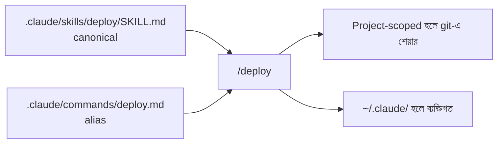

import ReadingProgress from '../../../../components/progress/ReadingProgress.astro';
import MarkComplete from '../../../../components/progress/MarkComplete.astro';
import KeywordTable from '../../../../components/content/KeywordTable.astro';
import ExamTrap from '../../../../components/content/ExamTrap.astro';
import BuildExercise from '../../../../components/content/BuildExercise.astro';
import Attribution from '../../../../components/content/Attribution.astro';

<ReadingProgress />

<div class="lesson-meta">
	<span class="lesson-badge">Domain 3</span>
	<span class="lesson-task">Task 3.2 · ওয়েট ২০%</span>
	<span class="lesson-source">মূল ইংরেজি: Custom Slash Commands and Skills</span>
</div>

## এই লেসনে যা জানতে হবে

কাস্টম command আর skill এখন একটি একীভূত সিস্টেমে মিলে গেছে — **Skills system**। `.claude/skills/` আর `.claude/commands/` — দুই জায়গাই একই রকম `/command` বানায়, কিন্তু ফাইল-গঠন আলাদা। Skill হলো একটি directory যাতে `SKILL.md` থাকে (`.claude/skills/deploy/SKILL.md`); command হলো flat Markdown ফাইল (`.claude/commands/deploy.md`)। `.claude/skills/`-এর ভেতরে সরাসরি রাখা flat ফাইল কোনো command বানায় না। `.claude/skills/` canonical অবস্থান; `.claude/commands/` backward compatibility-র জন্য এখনও চলে।

## একীভূত Skills System

দুই path একই ফল দেয় — একটি `/command` যা ডেভেলপাররা চালাতে পারে:

- `.claude/commands/deploy.md` → `/deploy` বানায় — flat ফাইল, ফাইলের নামই command নাম
- `.claude/skills/deploy/SKILL.md` → `/deploy`-ও বানায় — প্রতি skill একটি directory, command-এর নামে, ভেতরে বাধ্যতামূলক entrypoint `SKILL.md`

Skills path যেসব বাড়তি সুবিধা দেয়, যেগুলো commands alias-এ নেই: `SKILL.md`-এর পাশে supporting-files directory, স্বয়ংক্রিয় discovery যাতে উদ্দেশ্য মিললে Claude নিজেই skill load করতে পারে, আর একই নামের skill ও command থাকলে precedence (skill জেতে)। দুই path একই YAML frontmatter সমর্থন করে — `context: fork`, `allowed-tools`, `argument-hint` — আর দুটোই একই `/command` বানায়, তাই বিদ্যমান `.claude/commands/` ফাইল অপরিবর্তিত চলতে থাকে।



## দুই Scoping স্তর

**Project-scoped (git-এ শেয়ার):** Repository-র ভেতরে `.claude/skills/` (canonical) বা `.claude/commands/` (alias)-এ skill রাখুন। দুটোই version-controlled, git-এ শেয়ার হয়। যে-ই clone বা pull করে সে-ই command স্বয়ংক্রিয়ভাবে পায়। Team-wide workflow-এ ব্যবহার করুন: `/review`, `/deploy-check`, `/lint`, `/migration-guide`।

```markdown
<!-- .claude/commands/review.md — creates /review -->
Review the staged changes against our team checklist:
1. Check error handling patterns
2. Verify test coverage for new functions
3. Confirm API naming conventions
4. Flag any hardcoded credentials or secrets
```

**User-scoped (ব্যক্তিগত):** `~/.claude/skills/` (canonical) বা `~/.claude/commands/` (alias)-এ রাখুন। ব্যক্তিগত, version-controlled নয়, শেয়ার হয় না। নিজের productivity workflow-এ ব্যবহার করুন, যা অন্য টিম-সদস্যের দরকার নেই।

**Key Concept:** Scoping প্যাটার্ন Claude Code জুড়ে এক — **project-level (`.claude/`) git-এ শেয়ার হয়; user-level (`~/.claude/`) ব্যক্তিগত।** এটি CLAUDE.md, commands/skills আর rules-এ খাটে। Domain 3 জুড়ে এই প্যাটার্ন মুখস্থ করুন। দুটো project-scoped path-ই একই command বানায়; `.claude/skills/` canonical ও বেশি-feature-যুক্ত। তবে ফাইল-আকার মিলিয়ে রাখুন: skill directory, ভেতরে `SKILL.md`; command flat `.md`।

## Skills Frontmatter: ঐচ্ছিক Configuration

`.claude/skills/`-এর `SKILL.md` ফাইলে ঐচ্ছিক YAML frontmatter চলে। এটি `.claude/commands/` ফাইলেও কাজ করে, তবে configured skill-এর canonical জায়গা `.claude/skills/`। Skill হলো on-demand ডাকা টাস্ক-নির্দিষ্ট workflow — CLAUDE.md-এর মতো নিজে থেকে load হয় না।

তিনটি গুরুত্বপূর্ণ frontmatter option:

### `context: fork`

Skill-কে আলাদা sub-agent context-এ চালায়। সব verbose output fork-এ আটকে থাকে, মূল কথোপকথন পরিষ্কার থাকে। অপরিহার্য যখন:

- Codebase analysis (অনেক ফাইল-তালিকা ও code excerpt বানায়)
- Brainstorming (অনেক বিকল্প ও মূল্যায়ন বানায়)
- এমন যেকোনো কাজ যা noisy, exploratory output দেয়

`context: fork` না দিলে skill-এর output মূল কথোপকথনে ঢোকে ও context window token খায়। Verbose skill-এ এতে পরের উত্তরের গুণমান পড়ে।

Frontmatter ফাইলটির শুরুতে বসে। `/analyse-feature` নামে ডাকা skill-টির ফাইল `.claude/skills/analyse-feature/SKILL.md`-এ থাকে:

```yaml
---
description: "Analyse a feature area of the codebase and report structure, patterns and risks"
context: fork
allowed-tools:
  - Read
  - Grep
  - Glob
argument-hint: "Provide a feature description or area of the codebase to analyse"
---
```

`description` লাইনটি পরীক্ষার সেই তিনটির একটি নয়। বাস্তব skill-এ অবশ্য এটি বাদ দিলে Claude-এর কাছে আপনার অনুরোধ মেলানোর মতো কিছু থাকে না, তাই skill কেবল আপনি নিজে `/analyse-feature` টাইপ করলেই চলে।

### `allowed-tools`

তালিকাভুক্ত টুল **pre-approve** করে, যাতে skill সক্রিয় থাকার সময় Claude permission prompt ছাড়াই সেগুলো ব্যবহার করতে পারে। এটি কোন টুল পাওয়া যাবে তা সীমিত করে না: বাকি প্রতিটি টুল তখনও ডাকা যায়, আর তালিকার বাইরের সবকিছুতে আপনার সাধারণ permission সেটিং খাটে। বিশ্বস্ত workflow-এ প্রতি কলে থামে-থামে জিজ্ঞেস করা বন্ধ করতেই এটি।

```yaml
---
allowed-tools:
  - Read
  - Grep
  - Glob
---
```

**Current state:** পরীক্ষার গাইড (v1.0) `allowed-tools`-কে skill-এর টুল access সীমিত করা হিসেবে বর্ণনা করে, আর সেটিই keyed উত্তর: কেউ জিজ্ঞেস করলে বলুন "restricts"। উপরের pre-approval আচরণ বর্তমান Claude Code (সেপ্টেম্বর ২০২৬) আসলে করে। Skill চলাকালে Claude-এর pool থেকে টুল সরাতে চাইলে — যেটি আসল security boundary — সেগুলো `disallowed-tools`-এ লিখুন, বা permission settings-এ deny rule যোগ করুন।

### `argument-hint`

Autocomplete-এ দেখানো সংকেত, যা বোঝায় skill কী argument চায়। ইনপুট স্পষ্ট করে ডেভেলপার-অভিজ্ঞতা ভালো করে, ব্যবহারকারীকে মনে রাখতে হয় না। এটি একটি label, interactive prompt নয়: argument ছাড়া skill ডাকলে থেমে সেগুলো চায় না।

```yaml
---
argument-hint: "Specify the module path to analyse (e.g., src/api/auth)"
---
```

**Current state:** পরীক্ষার গাইড v1.0 `argument-hint`-কে বলে — skill argument ছাড়া ডাকলে বাধ্যতামূলক প্যারামিটার চেয়ে থামে; এটিই প্রত্যাশিত উত্তর। ১৪ আগস্ট ২০২৬-এ skills frontmatter reference এটি সংজ্ঞায়িত করে "Hint shown during autocomplete to indicate expected arguments" হিসেবে।

### Current state: সবচেয়ে বেশি কাজ করে `description`

গাইড (v1.0) যে তিনটি ফিল্ডের নাম দেয়, সেগুলোই পরীক্ষায় keyed। Live ফিল্ড-তালিকা অনেক বড়, আর প্রথম যেটি দরকার সেটি গাইডের তালিকায়ই নেই: **`description`**। Claude এটি পড়ে ঠিক করে skill আপনার এইমাত্র করা অনুরোধে খাটে কি না, তাই কাজের description ছাড়া skill কেবল `/name` টাইপ করলেই চলে। ডক এটি Recommended, required নয়: না দিলে Claude Code skill body-র প্রথম paragraph পড়ে, যা সাধারণত নিজে লেখা summary-র চেয়ে খারাপ। আরও live: `disallowed-tools`, `disable-model-invocation`, `model`, `effort` ও `when_to_use` (Claude Code skills docs, verified August 2026)।

## Skills বনাম CLAUDE.md: জরুরি পার্থক্য

এই পার্থক্য পরীক্ষায় সরাসরি ধরা হয়:

- **Skills = on-demand, টাস্ক-নির্দিষ্ট workflow।** তাদের description সবসময় context-এ থাকে, যাতে Claude জানে এরা আছে; কিন্তু পূর্ণ skill body কেবল invocation-এ load হয়। Invocation হয় explicit (`/skill-name`) নয়তো automatic: Claude এমন skill বেছে নেয় যার description ব্যবহারকারীর উদ্দেশ্যের সাথে মেলে, বা `paths` frontmatter থাকা skill যখন মেলে এমন ফাইলে কাজ হচ্ছে। `disable-model-invocation: true` থাকা skill-এ explicit invocation বাধ্যতামূলক।
- **CLAUDE.md = always-loaded, সর্বজনীন standard।** প্রতি সেশনে স্বয়ংক্রিয়ভাবে প্রয়োগ হয়, invocation ধাপ নেই।

নিয়ম: **টাস্ক-নির্দিষ্ট পদ্ধতি CLAUDE.md-এ রাখবেন না। আর skill-এ always-on reference material রাখবেন না।**

প্রতিটি code-generation কাজে খাটতে হবে এমন API naming convention CLAUDE.md-এ (বা `.claude/rules/`-এ) যায়। ডেভেলপার মাঝেমধ্যে চালানো বহু-ধাপের codebase analysis workflow যায় skill-এ। নির্দিষ্ট ফাইল-ধরনে (যেমন test ফাইল) খাটা convention-এর জন্য path-scoped `.claude/rules/` সবচেয়ে ভালো, কারণ মেলে এমন ফাইলের সাথে তারা always-on context হিসেবে load হয়।

## ব্যক্তিগত Skill Customisation

`~/.claude/skills/` (বা `~/.claude/commands/`)-এ আলাদা নামে নিজের সংস্করণ বানান, যাতে টিমমেটদের প্রভাব না পড়ে। টিমের standard `/analyse` থাকলে আপনি আরও verbose সংস্করণ চাইলে নিজের নামে বানান (যেমন `/deep-analyse`)। আপনার ব্যক্তিগত skill টিমের সংস্করণ override বা conflict করে না।

## কাস্টম Command কোথায় রাখবেন: দ্রুত রেফারেন্স

| প্রয়োজন | Canonical location | এটিও চলে | Scoping |
| --- | --- | --- | --- |
| Team-wide command | `.claude/skills/<name>/SKILL.md` | `.claude/commands/<name>.md` | Project (git-এ শেয়ার) |
| Frontmatter-সহ team command | `.claude/skills/<name>/SKILL.md` | `.claude/commands/<name>.md` | Project (git-এ শেয়ার) |
| ব্যক্তিগত command | `~/.claude/skills/<name>/SKILL.md` | `~/.claude/commands/<name>.md` | User (শেয়ার হয় না) |
| সর্বজনীন standard | `.claude/CLAUDE.md` বা root `CLAUDE.md` | — | Project (always loaded) |
| ব্যক্তিগত পছন্দ | `~/.claude/CLAUDE.md` | — | User (শেয়ার হয় না) |

<ExamTrap label="পরীক্ষার ফাঁদ: চারটি বারবার আসা ভুল">
	<p>
		(১) <code>.claude/skills/</code>-এ সরাসরি flat <code>review.md</code> রেখে <code>/review</code> আশা করা — skill directory (<code>.claude/skills/review/SKILL.md</code>) লাগে; loose ফাইল নেওয়া হয় না। (২) Team-shared command user-scoped path-এ রাখা — সেটি ব্যক্তিগত, version-controlled নয়। (৩) Skills-কে CLAUDE.md-এর মতো always-on ভাবা। (৪) Verbose skill-এ <code>context: fork</code> না দেওয়া, ফলে exploratory output মূল কনটেক্সট নোংরা করে।
	</p>
</ExamTrap>

<KeywordTable keywords={frontmatter.keywords} />

<ExamTrap label="অনুশীলন: কোথায় কোনটি">
	<p>
		একটি টিম চায় <code>/review</code> command repository clone করা সবার জন্য থাকুক। একজন ডেভেলপার আবার ব্যক্তিগত <code>/brainstorm</code> skill চায়, যা verbose codebase analysis output দেবে, মূল কথোপকথন নোংরা না করে। কোনটি কোথায় বানানো উচিত, আর skill-টির কী configuration লাগবে?
	</p>
	<details>
		<summary>উত্তর দেখুন</summary>

		**সঠিক উত্তর:** `/review` `.claude/commands/`-এ (বা `.claude/skills/review/SKILL.md`-এ) team sharing-এর জন্য; `/brainstorm` `~/.claude/skills/brainstorm/SKILL.md`-এ `context: fork` frontmatter সহ।

		**কেন বাকিগুলো ভুল:**

		- *দুটোই `~/.claude/commands/`-এ, README-তে কপি করার নির্দেশ* — user-scoped path git-এ শেয়ার হয় না; README নির্দেশ manual কাজ ও drift ডাকে।
		- *দুটোই `.claude/commands/`-এ* — ব্যক্তিগত brainstorm অন্য সবার কনটেক্সটে ঢুকে পড়ে।
		- *`/review` CLAUDE.md-এ আর `/brainstorm` `.claude/skills/`-এ শুধু allowed-tools দিয়ে* — টাস্ক-নির্দিষ্ট পদ্ধতি CLAUDE.md-এ রাখা ভুল, আর fork ছাড়া verbose output মূল কনটেক্সট নষ্ট করে।

	</details>
</ExamTrap>

<BuildExercise
	title="কাস্টম Command ও Skills বানান"
	difficulty="Intermediate"
	time="৩০ মিনিট"
	objectives={[
		'Project-scoped ও user-scoped command location আলাদা করা',
		'SKILL.md frontmatter-এ context: fork, allowed-tools, argument-hint বসানো',
		'Convention বনাম workflow — কখন skill, কখন CLAUDE.md',
		'context: fork দিয়ে verbose output মূল কথোপকথন থেকে আলাদা রাখা',
	]}
	steps={[
		{
			title: 'Team code review checklist নিয়ে .claude/commands/review.md-এ project-scoped /review command বানান।',
			why: 'Project-scoped command git-এ শেয়ার হয়, তাই clone করলেই সবাই পায়।',
			expect: 'Repository-তে .claude/commands/review.md; /review চালালে checklist চলে; যেকোনো clone-এ command দেখা যায়।',
		},
		{
			title: '~/.claude/skills/brainstorm/SKILL.md-এ ব্যক্তিগত /brainstorm skill বানান, frontmatter-এ context: fork সহ।',
			why: 'context: fork verbose output মূল কথোপকথন থেকে আলাদা রাখে; নইলে context window ভরে যায়।',
			expect: 'SKILL.md-এ YAML frontmatter-এ context: fork; skill কেবল আপনার সেশনে পাওয়া যায়, শেয়ার হয় না।',
		},
		{
			title: 'brainstorm skill-এ allowed-tools যোগ করে Read, Grep, Glob-এ সীমিত করুন।',
			why: 'গাইড allowed-tools-কে টুল access সীমিত করা বলে; read-only analysis skill কখনো Write বা Bash ব্যবহার করবে না।',
			expect:
				'Frontmatter-এ allowed-tools তালিকা: Read, Grep, Glob। গাইড-মডেলে Write/Bash চলবে না; বর্তমান Claude Code-এ তিনটি টুল prompt ছাড়া চলে।',
		},
		{
			title: 'brainstorm skill-এ argument-hint যোগ করুন: "Provide a feature description or codebase area to explore"।',
			why: 'argument-hint autocomplete-এ skill কী argument চায় তা দেখায় — পরীক্ষার তিনটি ফিল্ডের একটি।',
			expect: 'Prompt-এ /brainstorm টাইপ করলে autocomplete-এ hint লেখা দেখা যায়।',
		},
		{
			title: 'যাচাই করুন /review সব project user-এর জন্য আসে আর /brainstorm কেবল আপনার জন্য।',
			why: '.claude/ project-scoped ও git-এ শেয়ারড; ~/.claude/ user-scoped ও ব্যক্তিগত — এই সীমানা পরীক্ষা বারবার ধরে।',
			expect: 'যেকোনো clone-এ /review চলে; পরিষ্কার clone বা সহকর্মীর কাছে /brainstorm নেই।',
		},
		{
			title: 'brainstorm skill চালিয়ে দেখুন verbose output মূল কথোপকথনে আসে না।',
			why: 'context: fork skill-কে আলাদা sub-agent-এ চালায়; মূল কথোপকথন কেবল summary পায়।',
			expect: 'মূল কথোপকথনে সংক্ষিপ্ত summary; ফাইল-তালিকা, code excerpt ও analysis নোট মূল history-তে দেখা যায় না।',
		},
	]}
/>

## সূত্র

<ul>
	{frontmatter.sources.map((source) => (
		<li>
			<a href={source.href} target="_blank" rel="noopener noreferrer">
				{source.label}
			</a>
			{source.note ? ` — ${source.note}` : ''}
		</li>
	))}
</ul>

<Attribution sourceUrl={frontmatter.sourceUrl} updated={frontmatter.updated} />

<MarkComplete lessonId="3-2" />
