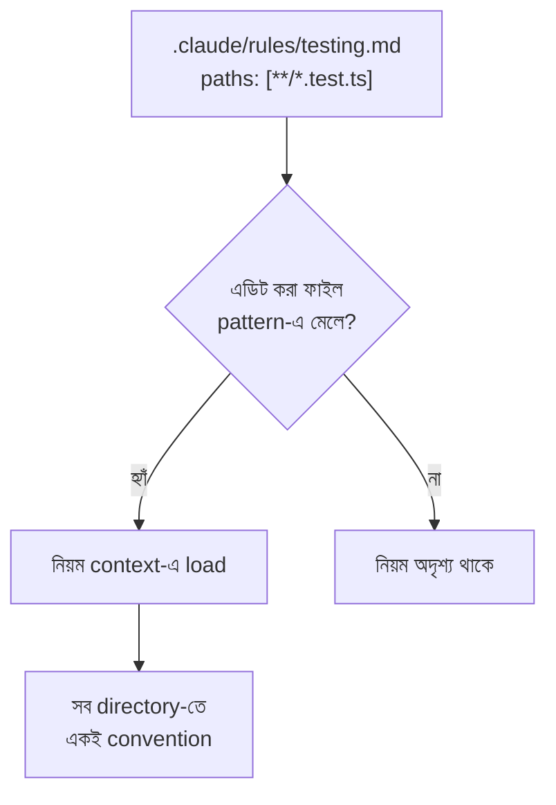

import ReadingProgress from '../../../../components/progress/ReadingProgress.astro';
import MarkComplete from '../../../../components/progress/MarkComplete.astro';
import KeywordTable from '../../../../components/content/KeywordTable.astro';
import ExamTrap from '../../../../components/content/ExamTrap.astro';
import BuildExercise from '../../../../components/content/BuildExercise.astro';
import Attribution from '../../../../components/content/Attribution.astro';

<ReadingProgress />

<div class="lesson-meta">
	<span class="lesson-badge">Domain 3</span>
	<span class="lesson-task">Task 3.3 · ওয়েট ২০%</span>
	<span class="lesson-source">মূল ইংরেজি: Path-Specific Rules for Conditional Convention Loading</span>
</div>

## এই লেসনে যা জানতে হবে

Path-specific rule কোন ফাইল এডিট করছেন তার উপর নির্ভর করে শর্তসাপেক্ষে convention প্রয়োগ করে। এটি এমন সমস্যার সমাধান, যা root CLAUDE.md বা directory-level CLAUDE.md কোনোটিই ভালোভাবে সামলায় না: **এক ধরনের ফাইল যেটি বহু directory-তে ছড়ানো।**

## Path-Specific Rules কীভাবে কাজ করে

Rule ফাইল `.claude/rules/` directory-তে থাকে। প্রতিটি ফাইলে YAML frontmatter থাকে, আর তার `paths` ফিল্ডে glob pattern দেওয়া হয়। ভেতরের নিয়ম কেবল তখনই load হয়, যখন আপনি সেই প্যাটার্নে মেলে এমন ফাইল এডিট করছেন।

```yaml
---
paths: ["terraform/**/*"]
---
# Terraform Conventions
- Use snake_case for all resource names
- Tag every resource with environment and team labels
- Never hardcode AMI IDs — use data sources
- All modules must have a variables.tf, outputs.tf, and README.md
```

`terraform/**/*`-এ মেলে এমন ফাইল এডিট করলেই নিয়মগুলো নিজে থেকে load হয়। React component বা API handler এডিট করলে হয় না। প্রাসঙ্গিক হওয়ার আগ পর্যন্ত নিয়মগুলো অদৃশ্য থাকে।

## Glob Pattern গোটা কোডবেসে মেলে

এখানেই এদের আসল দাম। `**/*.test.tsx` জাতীয় glob গোটা কোডবেসের প্রতিটি test ফাইল ধরে, যেখানেই থাকুক। একটি চেনা প্রজেক্ট কাঠামো:

```text
src/
  components/
    Button.tsx
    Button.test.tsx
  api/
    auth.ts
    auth.test.ts
  utils/
    format.ts
    format.test.ts
  pages/
    dashboard/
      Dashboard.tsx
      Dashboard.test.tsx
```

Test ফাইলগুলো তাদের source ফাইলের পাশে বসে, চারটি directory জুড়ে। `paths: ["**/*.test.tsx", "**/*.test.ts"]` দেওয়া path-specific rule একই test convention প্রতিটিতে স্বয়ংক্রিয়ভাবে খাটায়।



## Directory-level CLAUDE.md কেন নয়?

Directory-level CLAUDE.md কেবল সেই একটি directory-র ফাইলে খাটে। ৫০+ directory-তে ছড়ানো test ফাইল ঢাকতে হলে প্রতিটি directory-তে একটি করে CLAUDE.md ফেলতে হবে। তার মানে:

- একই convention-এর ৫০+ কপি
- test-যুক্ত প্রতিটি নতুন directory-তে নতুন কপি দরকার
- একটু বদলাতে হলেই ৫০+ ফাইল আপডেট
- কিছু কপি পিছিয়ে পড়ে অনিবার্য drift

Glob pattern-যুক্ত path-specific rule এটি পুরোপুরি দূর করে। একটি ফাইল, একটি প্যাটার্ন, সর্বজনীন coverage।

## Root CLAUDE.md কেন নয়?

Root CLAUDE.md যে সেশনেই load হয়, কোন ফাইল এডিট করছেন তা নির্বিশেষে। Terraform convention root CLAUDE.md-এ রাখলে React component এডিট করার সময়ও সেগুলো token খায়। Test convention সেখানে রাখলে API handler লেখার সময়ও সেগুলো load হয়।

**Key Concept:** Path-scoped rule root CLAUDE.md-এর চেয়ে বেশি token-সাশ্রয়ী, কারণ কেবল মেলে এমন ফাইল এডিট করলেই load হয়। এতে অপ্রাসঙ্গিক কনটেক্সট কমে আর মডেল বর্তমান কাজে যে নিয়মগুলো আসলেই খাটে সেগুলোতেই মনোযোগ দেয়। বহু convention-শ্রেণির বড় প্রজেক্টে এই লাভ উল্লেখযোগ্য।

## বাস্তব Rule File-এর উদাহরণ

**গোটা কোডবেসে test convention:**

```yaml
---
paths: ["**/*.test.ts", "**/*.test.tsx", "**/*.spec.ts", "**/*.spec.tsx"]
---
# Test Conventions
- Use describe/it blocks with descriptive names that read as sentences
- Each test file must have at least one happy path and one error case
- Use factory functions for test data, not inline object literals
- Mock external services at the module boundary, not individual functions
- Assert behaviour, not implementation details
```

**যেকোনো route handler-এর জন্য API convention:**

```yaml
---
paths: ["src/api/**/*", "**/routes/**/*", "**/*.controller.ts"]
---
# API Conventions
- All endpoints return { data, error, metadata } response shape
- Use Zod schemas for request validation at the handler boundary
- Log request ID on every error response
- Rate limiting configuration must be explicit, not inherited from defaults
```

**Infrastructure-as-code convention:**

```yaml
---
paths: ["terraform/**/*", "**/*.tf", "infrastructure/**/*"]
---
# Infrastructure Conventions
- State files must reference remote backends, never local
- Use workspaces for environment separation
- Every module must be versioned with a CHANGELOG
```

## কখন কোন পদ্ধতি

| পরিস্থিতি | সেরা পদ্ধতি |
| --- | --- |
| সব কোডে খাটা সর্বজনীন team standard | Root CLAUDE.md |
| এক নির্দিষ্ট package directory-র convention | Directory-level CLAUDE.md |
| বহু directory-তে ছড়ানো ফাইল-ধরনের convention | Glob pattern-যুক্ত path-specific rule |
| On-demand ডাকা টাস্ক-নির্দিষ্ট workflow | `.claude/skills/`-এর skill |

পরীক্ষা প্রায়ই source ফাইলের পাশে ছড়ানো test ফাইলের পরিস্থিতি দেয়। উত্তর সবসময় glob pattern-যুক্ত path-specific rule।

<ExamTrap label="পরীক্ষার ফাঁদ: তিনটি বারবার আসা ভুল">
	<p>
		(১) Cross-directory convention-এ directory-level CLAUDE.md বাছা — প্রতি directory-তে কপি লাগে, রক্ষণাবেক্ষণের ভার বিশাল। (২) ফাইল-ধরন-নির্দিষ্ট convention root CLAUDE.md-এ রাখা — প্রতি সেশনে token খায়। (৩) Automatic convention প্রয়োগে path-specific rule আর skill গুলিয়ে ফেলা — rule background guidance হিসেবে load হয়ে প্রতিটি edit গড়ে; skill on-demand টাস্ক-ওয়ার্কফ্লো। Always-on convention চাইলে উত্তর rules।
	</p>
</ExamTrap>

<KeywordTable keywords={frontmatter.keywords} />

<ExamTrap label="অনুশীলন: সবচেয়ে রক্ষণাবেক্ষণযোগ্য পথ">
	<p>
		একটি কোডবেসে ৫০+ directory জুড়ে test ফাইল source ফাইলের পাশে বসে (যেমন <code>Button.test.tsx</code>, <code>Button.tsx</code>-এর পাশে)। টিম চায় সব test একই convention মানুক, অবস্থান যাই হোক। সবচেয়ে রক্ষণাবেক্ষণযোগ্য পদ্ধতি কোনটি?
	</p>
	<details>
		<summary>উত্তর দেখুন</summary>

		**সঠিক উত্তর:** `.claude/rules/`-এ একটি rule ফাইল বানান, YAML frontmatter-এ `paths: ["**/*.test.tsx", "**/*.test.ts"]` দিয়ে, যাতে repo-র test convention থাকে।

		**কেন বাকিগুলো ভুল:**

		- *সব test convention root CLAUDE.md-এ* — প্রতি সেশনে load হয়, এমনকি test নয় এমন কাজেও; token নষ্ট।
		- *প্রতিটি directory-তে আলাদা CLAUDE.md* — ৫০+ কপি, drift নিশ্চিত, রক্ষণাবেক্ষণ দুঃস্বপ্ন।
		- *একটি skill বানিয়ে test লেখার আগে ডাকতে বলা* — skill on-demand; convention স্বয়ংক্রিয়ভাবে প্রতিটি edit গড়ে না।

	</details>
</ExamTrap>

<BuildExercise
	title="Glob Pattern দিয়ে Path-Specific Rules কনফিগার করুন"
	difficulty="Intermediate"
	time="৩০ মিনিট"
	objectives={[
		'শর্তসাপেক্ষ rule loading-এর জন্য glob pattern-যুক্ত YAML frontmatter লেখা',
		'Path-specific rule বনাম directory-level CLAUDE.md — কখন কোনটি',
		'/context দিয়ে শর্তসাপেক্ষ loading যাচাই করা',
		'প্রাসঙ্গিক শুধু rule load করে token খরচ কমানো',
	]}
	steps={[
		{
			title:
				'.claude/rules/testing.md বানান — frontmatter paths: ["**/*.test.ts", "**/*.test.tsx", "**/*.spec.ts"] সহ, আর naming/assertion/mocking নিয়ে test convention।',
			why: 'বহু directory-তে ছড়ানো ফাইল-ধরনের convention-এ glob pattern-যুক্ত path-specific rule-ই সঠিক উত্তর।',
			expect: 'testing.md-এ paths array সহ YAML frontmatter; অন্তত তিনটি test convention।',
		},
		{
			title:
				'.claude/rules/api-conventions.md বানান — paths: ["src/api/**/*", "**/routes/**/*"] আর response shape, validation, error handling নিয়ে API convention।',
			why: 'API convention আলাদা rule-এ থাকলে কেবল API ফাইল এডিট করার সময় load হয়।',
			expect: 'api-conventions.md-এ API directory লক্ষ্য করা paths frontmatter; অন্তত তিনটি API convention।',
		},
		{
			title: '.claude/rules/terraform.md বানান — paths: ["terraform/**/*", "**/*.tf"] আর infrastructure convention।',
			why: 'Application code এডিট করার সময় infrastructure convention সম্পূর্ণ অপ্রাসঙ্গিক; token খরচ করা উচিত নয়।',
			expect: 'terraform.md-এ Terraform ফাইল মেলানো paths frontmatter; infrastructure-নির্দিষ্ট নিয়ম।',
		},
		{
			title: 'একটি test ফাইল এডিট করে /context দিয়ে যাচাই করুন testing rule load হয়েছে, API ও Terraform rule হয়নি।',
			why: 'এটি শর্তসাপেক্ষ loading-এর প্রমাণ; পরীক্ষা ধরে rule কেবল মেলে এমন ফাইলেই load হয়।',
			expect: '.test.ts এডিটে /context-এ testing.md আছে; api-conventions.md ও terraform.md নেই।',
		},
		{
			title: 'একটি API handler এডিট করে যাচাই করুন API rule load হয়েছে, বাকিগুলো নয়।',
			why: 'পরিপূরক যাচাই: প্রসঙ্গ বদলালেই load হওয়া rule বদলায়।',
			expect: 'src/api/-তে এডিটে /context-এ api-conventions.md আছে; testing ও terraform নেই।',
		},
		{
			title: 'সব convention root CLAUDE.md-এ রাখা বনাম path-specific rule-এ ভাগ করার token footprint তুলনা করুন।',
			why: 'Token efficiency এই টাস্কের মূল ধারণা; root CLAUDE.md সব নিয়ম প্রতি সেশনে load করে।',
			expect:
				'Root CLAUDE.md-এ সাধারণ utility এডিটেও সব convention load; path-specific rule-এ কেবল প্রাসঙ্গিক উপসেট, token সংখ্যা মাপার মতো কম।',
		},
	]}
/>

## সূত্র

<ul>
	{frontmatter.sources.map((source) => (
		<li>
			<a href={source.href} target="_blank" rel="noopener noreferrer">
				{source.label}
			</a>
			{source.note ? ` — ${source.note}` : ''}
		</li>
	))}
</ul>

<Attribution sourceUrl={frontmatter.sourceUrl} updated={frontmatter.updated} />

<MarkComplete lessonId="3-3" />
