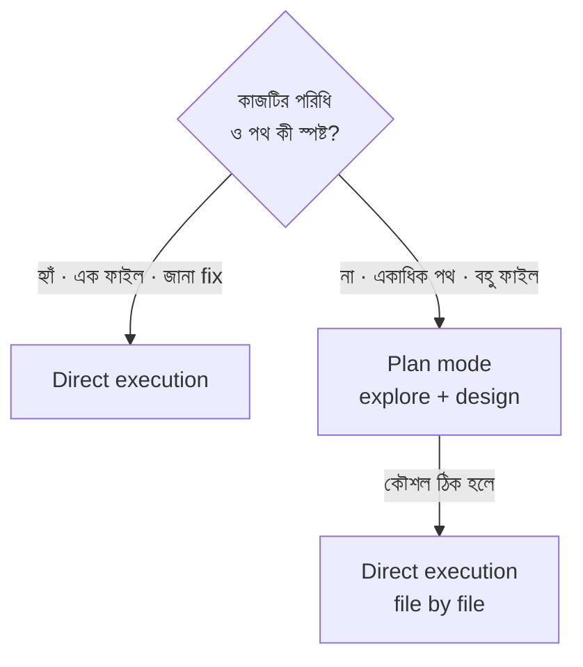

import ReadingProgress from '../../../../components/progress/ReadingProgress.astro';
import MarkComplete from '../../../../components/progress/MarkComplete.astro';
import KeywordTable from '../../../../components/content/KeywordTable.astro';
import ExamTrap from '../../../../components/content/ExamTrap.astro';
import BuildExercise from '../../../../components/content/BuildExercise.astro';
import Attribution from '../../../../components/content/Attribution.astro';

<ReadingProgress />

	Domain 3
	Task 3.4 · ওয়েট ২০%
	মূল ইংরেজি: Plan Mode vs Direct Execution

## এই লেসনে যা জানতে হবে

Claude Code দুই প্রধান মোডে চলে: **plan mode** আর **direct execution**। পরীক্ষা দেখে আপনি প্রদত্ত কাজের জন্য সঠিকটি বাছতে পারেন কি না। এটি রুচির প্রশ্ন নয় — কখন কোনটি খাটে, তার স্পষ্ট মাপকাঠি আছে।

## Plan Mode: কখন ব্যবহার করবেন

Plan mode জটিল কাজের জন্য, যেখানে কোডবেস ঘেঁটে, একাধিক পথ মূল্যায়ন করে, বদলানোর আগে কৌশল ঠিক করা দরকার। ব্যবহার করুন যখন:

- **বড় বদল জড়িত** — monolith-কে microservices-এ ভাঙা, module system পুনর্বিন্যাস, বা core abstraction refactor — সবেরই আগে বর্তমান গঠন বোঝা লাগে।
- **একাধিক বৈধ পথ আছে** — সমস্যার আলাদা সমাধান থাকলে (ভিন্ন infrastructure-দাবি করা integration architecture), প্রতিশ্রুতির আগে মূল্যায়ন দরকার।
- **Architectural সিদ্ধান্ত দরকার** — service boundary, module dependency, API contract — এই সিদ্ধান্তের পরিণতি দূর পর্যন্ত যায়। পরিকল্পনা দামি rework আটকায়।
- **একাধিক ফাইল বদলাতে হবে** — ৪৫+ ফাইলে হাত পড়া library migration-এ সামঞ্জস্যপূর্ণ কৌশল দরকার। পরিকল্পনা ছাড়া ফাইল জুড়ে অসমভাবে প্রয়োগের ঝুঁকি।
- **কোডবেস exploration দরকার** — কিছু বদলানোর আগে dependency বুঝতে, data flow ট্রেস করতে বা গঠন ম্যাপ করতে হবে।

Plan mode নিরাপদ অনুসন্ধান ও ডিজাইন চালু করে। Claude কোডবেস পড়ে, dependency বিশ্লেষণ করে, একটি পন্থা প্রস্তাব করে — এর কোনোটিতেই কোনো ফাইল বদলায় না।

## Direct Execution: কখন ব্যবহার করবেন

Direct execution ভালো-বোঝা, স্পষ্ট ও সীমিত scope-এর বদলের জন্য। ব্যবহার করুন যখন:

- **বদলটি ভালোভাবে সীমিত** — স্পষ্ট stack trace-সহ single-file bug fix। Date validation conditional যোগ করা। Configuration মান আপডেট।
- **সঠিক পন্থা আগেই জানা** — কী বদলাবে, কোথায়, কীভাবে — সব জানা। কোনো design সিদ্ধান্ত নেই।
- **Scope সীমিত** — এক function, এক ফাইল, এক স্পষ্ট পরিবর্তন।

Direct execution planning ধাপ বাদ দিয়ে সোজা পরিবর্তন করে। সরল, সু-নির্ধারিত কাজে পরিকল্পনা কিছুই যোগ করে না।

**মূল ধারণা:** সিদ্ধান্ত কঠিনতা নিয়ে নয়, **অস্পষ্টতা** নিয়ে। কঠিন কিন্তু সু-নির্ধারিত bug fix (স্পষ্ট stack trace, এক function, জানা কারণ) = direct execution। সহজ-শোনা feature অনুরোধ, যা তিনভাবে করা যায় আর একাধিক module-এ হাত দেয় = plan mode।

## Explore Subagent

Explore subagent verbose discovery output মূল কথোপকথন থেকে দূরে রাখে। বহু-পর্যায়ের কাজে কোডবেস ঘাঁটতে গেলে অনেক কিছু বেরিয়ে পড়ে: file listing, dependency graph, code excerpt, analysis নোট। এসব মূল কথোপকথনে ঢুকতে দিলে context window ভরে যায়, আর পরের উত্তরগুলোর গুণমান পড়ে।

Explore subagent:

- Exploration আলাদা জায়গায় চালায়
- প্রাপ্ত ফলের summary বানায়
- সেই summary মূল কথোপকথনে ফেরায়
- আসল implementation-এর কাজের জন্য মূল context window পরিষ্কার রাখে

এটি ব্যবহার করুন বহু-পর্যায়ের কাজে, যেখানে discovery ধাপ verbose কিন্তু implementation ধাপে সংহত কনটেক্সট দরকার।

## Hybrid পন্থা: আগে Plan, পরে Execute

অনুসন্ধানে plan mode আর implementation-এ direct execution — এই মিলন বাস্তবে সাধারণ এবং পরীক্ষায় ধরা হয়। প্যাটার্ন:

- **Plan phase:** Plan mode দিয়ে কোডবেস ঘাঁটুন, dependency বুঝুন, পথ মূল্যায়ন করুন, implementation কৌশল ঠিক করুন।
- **Execute phase:** Direct execution-এ গিয়ে কৌশলটি ফাইল-ধরে-ফাইল প্রয়োগ করুন — কৌশল আগেই ঠিক করা।

যেমন, এক logging library থেকে আরেকটিতে ৩০ ফাইল জুড়ে migration:

- **Plan:** পুরনো library import করা সব ফাইল চিহ্নিত করা, পুরনো-নতুন API-র পার্থক্য ম্যাপ করা, migration pattern ঠিক করা, edge case যাচাই।
- **Execute:** ঠিক করা প্যাটার্নটি প্রতিটি ফাইলে প্রয়োগ করা।

এটি **plan THEN direct, plan OR direct নয়।** পরীক্ষা এই প্যাটার্নটি ধরতে চায়।

## Decision Framework সারসংক্ষেপ

| কাজের বৈশিষ্ট্য | মোড |
| --- | --- |
| Architectural restructuring | Plan mode |
| Library migration (অনেক ফাইল) | Plan mode, তারপর direct execution |
| একাধিক বৈধ implementation পথ | Plan mode |
| কোডবেস exploration দরকার | Plan mode (Explore subagent সহ) |
| স্পষ্ট stack trace-সহ single-file bug fix | Direct execution |
| এক function-এ validation চেক যোগ | Direct execution |
| Configuration মান আপডেট | Direct execution |
| জানা fix, জানা অবস্থান, জানা পন্থা | Direct execution |

## আগেই জটিলতা চেনা

একটি চেনা পরীক্ষার ফাঁদ: direct execution দিয়ে শুরু করা, তারপর জটিলতা দেখা দিলে plan mode-এ যাওয়া। চাহিদাপত্রেই যখন জটিলতার কথা আছে (যেমন "restructure the monolith into microservices"), তখনই সোজা plan mode-এ যান। জটিলতা পরে আবির্ভূত হবে না — সেটি কাজের বর্ণনাতেই হাজির। আকস্মিক কিছুর অপেক্ষা করা ভুল পথ।

<ExamTrap label="পরীক্ষার ফাঁদ: চারটি বারবার আসা ভুল">
	

		(১) বহু-ফাইল architectural বদলে direct execution ডিফল্ট করা — dependency দেরিতে ধরা পড়লে দামি rework। (২) স্পষ্ট stack trace-সহ single-file bug fix-এ plan mode — অপ্রয়োজনীয় overhead। (৩) Plan-then-execute hybrid না চেনা — library migration-এ কৌশল আগে ঠিক করে তারপর প্রয়োগ। (৪) জটিলতা দেখা দিলে তবেই plan mode-এ যাওয়া — পরিস্থিতি আগেই বলা থাকলে শুরু থেকেই plan mode।
	

</ExamTrap>

<KeywordTable keywords={frontmatter.keywords} />

<ExamTrap label="অনুশীলন: তিনটি কাজের সঠিক মোড">
	

		আপনার টিম তিনটি কাজের মুখে: (১) monolith-কে microservices-এ restructure করা, (২) স্পষ্ট stack trace-সহ এক function-এর null pointer exception fix করা, (৩) ৩০ ফাইল জুড়ে এক logging library থেকে আরেকটিতে migrate করা। প্রতিটির জন্য কোন মোড?
	

	

		
উত্তর দেখুন

		**সঠিক উত্তর:** (১) ও (৩)-এ plan mode, আর (২)-তে direct execution।

		**কেন বাকিগুলো ভুল:**

		- *(B) তিনটিতেই plan mode* — single-function fix পুরোপুরি স্পষ্ট; পরিকল্পনা নিছক overhead।
		- *(C) তিনটিতেই direct execution* — architectural restructuring ও ৩০-ফাইল migration-এ strategy ছাড়া inconsistency ও rework।
		- *(D) কেবল (১)-এ plan mode* — (৩) multi-file migration-ও plan করে তারপর execute করা উচিত।

	

</ExamTrap>

## প্র্যাকটিস সিনারিও (নিজে উত্তর ভাবুন, তারপর খুলুন)

> আপনার টিমের সামনে তিনটি কাজ: (১) monolith-কে microservices-এ ভাঙা, (২) স্পষ্ট stack trace-সহ একটি ফাংশনের null pointer exception ঠিক করা, (৩) ৩০টি ফাইল জুড়ে একটি logging library থেকে অন্যটিতে যাওয়া। কোনটির জন্য কোন মোড?

	
উত্তর দেখুন

	**সঠিক উত্তর:** (১) ও (৩)-এর জন্য plan mode, (২)-এর জন্য direct execution।

	**কেন বাকিগুলো ভুল:**

	- *তিনটির জন্যই plan mode* — (২) কঠিন কিন্তু দ্ব্যর্থহীন। স্পষ্ট fix-এ পরিকল্পনা বাড়তি খরচ, সিদ্ধান্ত নয়।
	- *তিনটির জন্যই direct execution* — (১)-এ একাধিক বৈধ আর্কিটেকচার, আর (৩) ৩০ ফাইলে ছড়ানো; পরিকল্পনা ছাড়া inconsistency-র ঝুঁকি।
	- *কেবল (১)-এর জন্য plan mode* — (৩)-এর মতো ৩০-ফাইল migration-ও একাধিক পথ আর ব্যাপক পরিবর্তনের কাজ, তাই সেখানেও plan দরকার।

<BuildExercise
	title="Plan Mode বনাম Direct Execution সিদ্ধান্ত-নেওয়ার অভ্যাস"
	difficulty="Advanced"
	time="৪৫ মিনিট"
	objectives={[
		'অস্পষ্টতার ভিত্তিতে plan mode বনাম direct execution ঠিক করা',
		'বহু-ফাইল migration-এ plan-then-execute hybrid অনুসরণ করা',
		'Verbose discovery output আলাদা রাখতে Explore subagent ব্যবহার',
		'জটিলতা আগেই চেনা, আবির্ভাবের জন্য অপেক্ষা না করা',
	]}
	steps={[
		{
			title:
				'কোডবেসে একটি জটিল বহু-ফাইল কাজ (refactor, migration বা restructuring) খুঁজে plan mode-এ dependency ঘেঁটে পন্থা ঠিক করুন।',
			why: 'একাধিক বৈধ পথ, architectural সিদ্ধান্ত বা বহু-ফাইল বদলে plan mode দরকার; চাহিদায় জটিলতা থাকলে শুরু থেকেই।',
			expect:
				'Claude কোনো ফাইল না বদলে ঘাঁটে; module-এর dependency, মূল্যায়নসহ কয়েকটি পথ, আর সুপারিশকৃত কৌশল দেয়।',
		},
		{
			title: 'একটি সরল single-file bug খুঁজে direct execution-এ fix করুন, planning-এর বদলে লাভ লক্ষ্য করুন।',
			why: 'সমস্যা, অবস্থান ও সমাধান স্পষ্ট হলে over-plan করা উচিত নয়; সিদ্ধান্ত অস্পষ্টতার, কঠিনতার নয়।',
			expect: 'পরিকল্পনা ছাড়া সাথে সাথে fix; পরিবর্তন এক ফাইল/function-এ সীমিত; prompt থেকে fix-এর সময় লক্ষণীয়ভাবে কম।',
		},
		{
			title: 'Hybrid পন্থা নিন: বহু-ফাইল library migration-এর কৌশল plan mode-এ ঠিক করে তারপর direct execution-এ প্রয়োগ করুন।',
			why: 'Plan-then-execute পরীক্ষায় ধরা হয়; plan কৌশল দেয়, direct execution তা সামঞ্জস্যপূর্ণভাবে খাটায়।',
			expect:
				'Phase 1: পুরনো library import করা ফাইল, API পার্থক্য ও migration pattern চিহ্নিত। Phase 2: প্যাটার্নটি ফাইল-ধরে-ফাইল সামঞ্জস্যপূর্ণভাবে প্রয়োগ।',
		},
		{
			title: 'একটি verbose codebase discovery কাজে Explore subagent ব্যবহার করে দেখুন মূল কথোপকথনের কনটেক্সট পরিষ্কার থাকে কি না।',
			why: 'Explore subagent verbose discovery আলাদা রাখে; নইলে context window ভরে পরের উত্তর খারাপ হয়।',
			expect: 'Subagent সংক্ষিপ্ত summary ফেরায়; পূর্ণ verbose output (file listing, dependency graph, excerpt) মূল কথোপকথনে দেখা যায় না।',
		},
		{
			title: 'লিখিত decision framework বানান: plan mode বনাম direct execution-এর মাপকাঠি, প্রতিটির উদাহরণসহ।',
			why: 'মাপকাঠি আত্মস্থ করা পরীক্ষার জন্য জরুরি; ambiguity বনাম difficulty-র পার্থক্য স্পষ্ট থাকা দরকার।',
			expect: 'Plan mode-এর অন্তত চারটি ও direct execution-এর তিনটি মাপকাঠি, প্রতিটির বাস্তব উদাহরণ, আর অস্পষ্টতা-বনাম-কঠিনতা স্পষ্ট উল্লেখ।',
		},
	]}
/>

## সূত্র

<ul>
	{frontmatter.sources.map((source) => (
		<li>
			<a href={source.href} target="_blank" rel="noopener noreferrer">
				{source.label}
			</a>
			{source.note ? ` — ${source.note}` : ''}
		</li>
	))}
</ul>

<Attribution sourceUrl={frontmatter.sourceUrl} updated={frontmatter.updated} />

<MarkComplete lessonId="3-4" />
