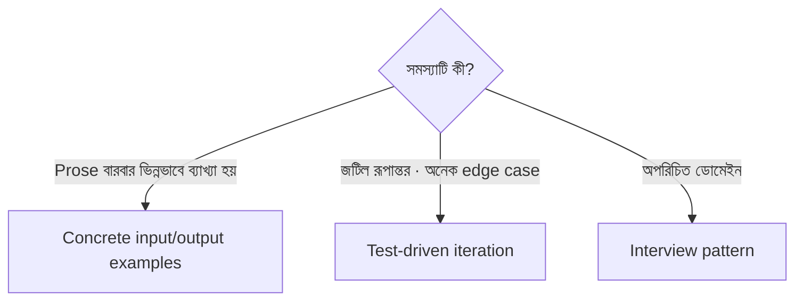

import ReadingProgress from '../../../../components/progress/ReadingProgress.astro';
import MarkComplete from '../../../../components/progress/MarkComplete.astro';
import KeywordTable from '../../../../components/content/KeywordTable.astro';
import ExamTrap from '../../../../components/content/ExamTrap.astro';
import BuildExercise from '../../../../components/content/BuildExercise.astro';
import Attribution from '../../../../components/content/Attribution.astro';

<ReadingProgress />

<div class="lesson-meta">
	<span class="lesson-badge">Domain 3</span>
	<span class="lesson-task">Task 3.5 · ওয়েট ২০%</span>
	<span class="lesson-source">মূল ইংরেজি: Iterative Refinement Techniques</span>
</div>

## এই লেসনে যা জানতে হবে

Claude Code নিয়ে কাজ করা ইটারেটিভ। প্রথম output-ই সাধারণত শেষ output নয়। পরীক্ষা দেখে আপনি Claude Code-কে সঠিক ফলের দিকে চালানোর নির্দিষ্ট কৌশল জানেন কি না — আর কোন পরিস্থিতিতে কোনটি আগে ধরবেন।

## Technique Hierarchy

সব রিফাইনমেন্ট কৌশল সমান নয়। স্পষ্ট একটি ক্রম আছে:

### ১. Concrete input/output examples — অসঙ্গত ব্যাখ্যায় সবচেয়ে কার্যকর

Prose-এ কোনো code transformation বর্ণনা করলে Claude Code যদি প্রতিবার আলাদাভাবে ব্যাখ্যা করে, তার fix আরও prose নয়। Fix হলো **concrete example**।

২-৩টি উদাহরণ দিন, যেখানে ঠিক ইনপুট আর ঠিক প্রত্যাশিত output দেখানো থাকবে:

```text
Input:
getUserData(userId: string): Promise<UserData>
Expected output:
getUserData(userId: string): Promise<Result<UserData, ApiError>>
```

```text
Input:
fetchOrders(customerId: string): Promise<Order[]>
Expected output:
fetchOrders(customerId: string): Promise<Result<Order[], ApiError>>
```

মডেল এই উদাহরণ থেকে যেকোনো prose বর্ণনার চেয়ে বেশি নির্ভরযোগ্যভাবে প্যাটার্ন আঁকে। দুই-তিনটি concrete উদাহরণ প্যাটার্ন স্থির করে, আর মডেল তা নতুন কেসে খাটায়। **ব্যাখ্যা অসঙ্গত হলে প্রথম যে কৌশলে হাত দেবেন, এটিই।**

### ২. Test-driven iteration — জটিল রূপান্তরে সবচেয়ে কার্যকর

আগে test লিখুন। test case দিয়ে প্রত্যাশিত আচরণ ঠিক করুন:

- Happy path (স্বাভাবিক প্রত্যাশিত রূপান্তর)
- Edge case (null মান, খালি ইনপুট, সীমার মান)
- Performance requirement (প্রয়োজ্য হলে)

তারপর test failure গুলো Claude Code-কে দেখান। Failure নির্দিষ্ট, দ্ব্যর্থতাহীন feedback দেয় — "Expected X, got Y" বললে ব্যাখ্যার অবকাশই থাকে না।

```text
FAIL: testMigrationHandlesNullValues
Expected: null preserved in output JSON
Actual: null replaced with empty string ""
```

এই failure বার্তাই Claude Code-কে ঠিক কী ঠিক করতে হবে তা বলে দেয়। কোনো prose ব্যাখ্যা লাগে না।

### ৩. Interview pattern — অপরিচিত ডোমেইনে সবচেয়ে কার্যকর

যে ডোমেইনে আপনার দক্ষতা নেই, সেখানে implement করার আগে Claude-কে প্রশ্ন করতে দিন। এতে এমন বিবেচনা সামনে আসে যা আপনি নাহলে মিস করতেন।

সমাধান চাপিয়ে না দিয়ে:

```text
"Build me a caching layer for the API"
```

Interview pattern ব্যবহার করুন:

```text
"I need a caching layer for the API. Before implementing, ask me
questions about the requirements, edge cases, and constraints I
should consider."
```

Claude হয়তো cache invalidation strategy, TTL policy, consistency requirement আর failure mode নিয়ে প্রশ্ন করবে — যে বিবেচনাগুলো একজন বিশেষজ্ঞ জানতেন, কিন্তু আপনি হয়তো এড়িয়ে যেতেন।

**Key Concept:** Interview pattern অপরিচিত ডোমেইনের জন্য, যেখানে ডেভেলপার গুরুত্বপূর্ণ বিবেচনা মিস করতে পারেন। Concrete example সেই ক্ষেত্রে, যখন ডেভেলপার ঠিক রূপান্তরটি জানেন কিন্তু মডেল অসঙ্গতভাবে ব্যাখ্যা করে। দুটো গুলিয়ে ফেলবেন না — এরা আলাদা সমস্যার সমাধান।



## Batch বনাম Sequential Feedback

Feedback কীভাবে দেবেন সেটিও জরুরি। নিয়ম:

**Fixes পরস্পরকে প্রভাবিত করলে এক মেসেজে (batch):** যদি error handling pattern বদলালে logging format আর response structure-ও প্রভাবিত হয়, তিনটি feedback এক মেসেজে দিন। মডেলের একসাথে সব পরস্পর-জড়ানো শর্ত দেখতে দরকার, তবেই সামঞ্জস্যপূর্ণ fix বানায়।

```text
Three changes needed (they interact with each other):
1. Error responses must include an error code field
2. Logging must include the error code in structured format
3. The client SDK type definitions must reflect the new error code field
```

**Issues স্বাধীন হলে sequential:** Naming convention-এর সমস্যা আর indentation-এর সমস্যা যদি একটিকে অন্যটি প্রভাবিত না করে, এক এক করে ঠিক করুন। স্বাধীন সমস্যা batch করলে কোন feedback কোডের কোন অংশে খাটে তা নিয়ে মডেল বিভ্রান্ত হতে পারে।

```text
First iteration: "Fix the function naming — use camelCase throughout"
[Wait for result]
Second iteration: "Now update the indentation to use 2 spaces"
```

## বাস্তবে Example-ভিত্তিক Communication

Prose বর্ণনা অসঙ্গত ফল দিলে example-এ যাওয়ার স্পষ্ট ধাপ:

- **অসঙ্গতি লক্ষ্য করুন:** আপনি রূপান্তর বর্ণনা করছেন, Claude Code প্রতিবার ভিন্নভাবে করছে।
- **Example-এ যান:** ২-৩টি concrete before/after জোড়া দিন, যেখানে ঠিক রূপান্তরটি দেখানো আছে।
- **সাধারণীকরণ যাচাই করুন:** নতুন একটি কেসে পরীক্ষা করে দেখুন মডেল প্যাটার্নটি ঠিকভাবে খাটায় কি না।
- **প্রয়োজন হলে edge case example যোগ করুন:** Standard কেস সামলায় কিন্তু edge case মিস করলে, ঠিক সেই edge case-এর উদাহরণ দিন।

বিষয়টি আরও উদাহরণ ঢালা নয়। Standard কেস আর একটি গুরুত্বপূর্ণ edge case ঢাকা ২-৩টি ভালো বাছাই যথেষ্ট। মডেল প্যাটার্ন সাধারণীকরণ করে; প্রতিটি সম্ভাব্য কেস হাতে ধরিয়ে দিতে হয় না।

## কোন কৌশল কখন

| পরিস্থিতি | কৌশল |
| --- | --- |
| Prose বর্ণনা প্রতিবার ভিন্নভাবে ব্যাখ্যা হয় | Concrete input/output examples |
| অনেক edge case-সহ জটিল রূপান্তর | Test-driven iteration |
| অপরিচিত ডোমেইনে কাজ | Interview pattern |
| একাধিক সমস্যা পরস্পরকে প্রভাবিত করে | Batch feedback (এক মেসেজ) |
| একাধিক স্বাধীন সমস্যা | Sequential feedback |

<ExamTrap label="পরীক্ষার ফাঁদ: তিনটি বারবার আসা ভুল">
	<p>
		(১) মডেল অসঙ্গতভাবে ব্যাখ্যা করলে prose আরও নিখুঁত করা — সূক্ষ্ম prose-ও ব্যাখ্যার উপর নির্ভর করে; উত্তর সবসময় আগে examples, ভালো prose নয়। (২) Batch বনাম sequence না চেনা — issues জড়ানো হলে এক মেসেজে, স্বাধীন হলে ক্রমে। (৩) Interview pattern আর examples গুলিয়ে ফেলা — যেখানে জ্ঞান কম সেখানে interview, আর যেখানে ঠিক রূপান্তর জানেন কিন্তু মডেল ভুল করে সেখানে examples।
	</p>
</ExamTrap>

<KeywordTable keywords={frontmatter.keywords} />

<ExamTrap label="অনুশীলন: প্রথমে কোন কৌশল">
	<p>
		একজন ডেভেলপার prose-এ একটি code transformation বর্ণনা করেন। Claude Code প্রতিবার ভিন্নভাবে ব্যাখ্যা করে, ফলে ফল অসঙ্গত। ডেভেলপারের প্রথমে কোন কৌশল চেষ্টা করা উচিত?
	</p>
	<details>
		<summary>উত্তর দেখুন</summary>

		**সঠিক উত্তর:** ২-৩টি concrete input/output example দেওয়া, যেখানে ঠিক before ও after transformation দেখানো আছে।

		**কেন বাকিগুলো ভুল:**

		- *সুসংগত test suite লিখে failure শেয়ার করা* — জটিল রূপান্তরে চমৎকার, কিন্তু এখানে সমস্যা ব্যাখ্যার অসঙ্গতি; examples আগে।
		- *Interview pattern* — অপরিচিত ডোমেইনের জন্য; এখানে ডেভেলপার ঠিক রূপান্তরটিই জানেন।
		- *আরও নিখুঁত prose লেখা* — নিখুঁত prose-ও ব্যাখ্যার উপর নির্ভর করে; অসঙ্গতি দূর হয় না।

	</details>
</ExamTrap>

## প্র্যাকটিস সিনারিও (নিজে উত্তর ভাবুন, তারপর খুলুন)

> একজন ডেভেলপার prose-এ একটি code transformation বর্ণনা করেন। Claude Code প্রতিবারই ভিন্নভাবে বুঝে অসঙ্গত ফল দেয়। প্রথমে কোন কৌশলটি চেষ্টা করা উচিত?

<details>
	<summary>উত্তর দেখুন</summary>

	**সঠিক উত্তর:** হুবহু আগে-পরে দেখিয়ে ২-৩টি নির্দিষ্ট input/output উদাহরণ দেওয়া।

	**কেন বাকিগুলো ভুল:**

	- *Comprehensive test suite লিখে ব্যর্থতা শেয়ার করে iterate করা* — জটিল রূপান্তরে এটি সেরা, কিন্তু অসঙ্গত ব্যাখ্যায় উদাহরণই প্রথম কৌশল।
	- *Interview pattern-এ Claude-কে প্রশ্ন করতে দেওয়া* — অপরিচিত ডোমেইনে এটিই দরকার; এখানে সমস্যা ডোমেইনের অজানা নয়, ভাষার অস্পষ্টতা।
	- *Prose আরও স্পষ্ট ভাষায় আবার লেখা* — আরও prose দ্ব্যর্থতা কমায় না; উদাহরণই রেফারেন্স বানায়।

</details>

<BuildExercise
	title="ইটারেটিভ রিফাইনমেন্ট কৌশল অভ্যাস করুন"
	difficulty="Intermediate"
	time="৩০ মিনিট"
	objectives={[
		'অসঙ্গত ব্যাখ্যায় prose-র বদলে concrete examples ব্যবহার',
		'Test failure দিয়ে দ্ব্যর্থতাহীন feedback দেওয়া',
		'অপরিচিত ডোমেইনে interview pattern প্রয়োগ',
		'Issue-এর আন্তঃনির্ভরতা দেখে batch বনাম sequential ঠিক করা',
	]}
	steps={[
		{
			title: 'একটি code transformation prose-এ বর্ণনা করে তিনবার চালান, প্রতিবার ব্যাখ্যা কেমন বদলায় লক্ষ্য করুন।',
			why: 'Prose ব্যাখ্যার উপর নির্ভর করে, আর ব্যাখ্যা রান-ভেদে বদলায় — এই অসঙ্গতিই examples-এর প্রয়োজন বুঝিয়ে দেয়।',
			expect: 'একই prose-এ তিনটি ভিন্ন output — naming, edge case handling বা গঠনে পার্থক্য।',
		},
		{
			title: 'একই transformation-এর ২-৩টি concrete input/output example দিয়ে তিনবার চালিয়ে সামঞ্জস্য তুলনা করুন।',
			why: 'Concrete examples অসঙ্গত ব্যাখ্যার documented প্রথম কৌশল; মডেল উদাহরণ থেকেই নির্ভরযোগ্যভাবে প্যাটার্ন আঁকে।',
			expect: 'তিনটি output পরস্পর সামঞ্জস্যপূর্ণ ও example-এর প্যাটার্ন মেনে; আগের ভিন্নতা প্রায় মুছে যায়।',
		},
		{
			title:
				'একটি function-এর জন্য happy path, edge case ও error case-সহ test suite লিখে test failure Claude Code-কে দেখান।',
			why: 'Test-driven iteration জটিল রূপান্তরে সেরা; "Expected X, got Y" ব্যাখ্যার অবকাশ রাখে না।',
			expect: 'Failure শেয়ার করার পর নির্দিষ্ট assertion-গুলো ঠিক হয়; প্রতিটি ইটারেশনে ব্যর্থ test কমে।',
		},
		{
			title:
				'আপনার দক্ষতার বাইরের একটি কাজে interview pattern ব্যবহার করুন — implement করার আগে Claude-কে প্রশ্ন করতে বলুন।',
			why: 'Interview pattern অপরিচিত ডোমেইনে হারানো requirement সামনে আনে; exam-এ examples কৌশল থেকে আলাদা করে চেনা লাগে।',
			expect: 'Claude আপনার এড়িয়ে যাওয়া ৫-১০টি লক্ষ্যযুক্ত প্রশ্ন করে — requirement, edge case, constraint নিয়ে।',
		},
		{
			title: 'তিনটি পরস্পর-নির্ভর issue এক মেসেজে দিয়ে fix সামঞ্জস্যপূর্ণ হয় কি না দেখুন।',
			why: 'Issue জড়ানো হলে একসাথে দিলে মডেল সব constraint একবারে দেখে; ক্রমে করলে এক fix অন্যটির সাথে সংঘর্ষে যায়।',
			expect: 'Error response shape, logging format ও type definition — তিনটিই মিলে এক সামঞ্জস্যপূর্ণ fix।',
		},
	]}
/>

## সূত্র

<ul>
	{frontmatter.sources.map((source) => (
		<li>
			<a href={source.href} target="_blank" rel="noopener noreferrer">
				{source.label}
			</a>
			{source.note ? ` — ${source.note}` : ''}
		</li>
	))}
</ul>

<Attribution sourceUrl={frontmatter.sourceUrl} updated={frontmatter.updated} />

<MarkComplete lessonId="3-5" />
