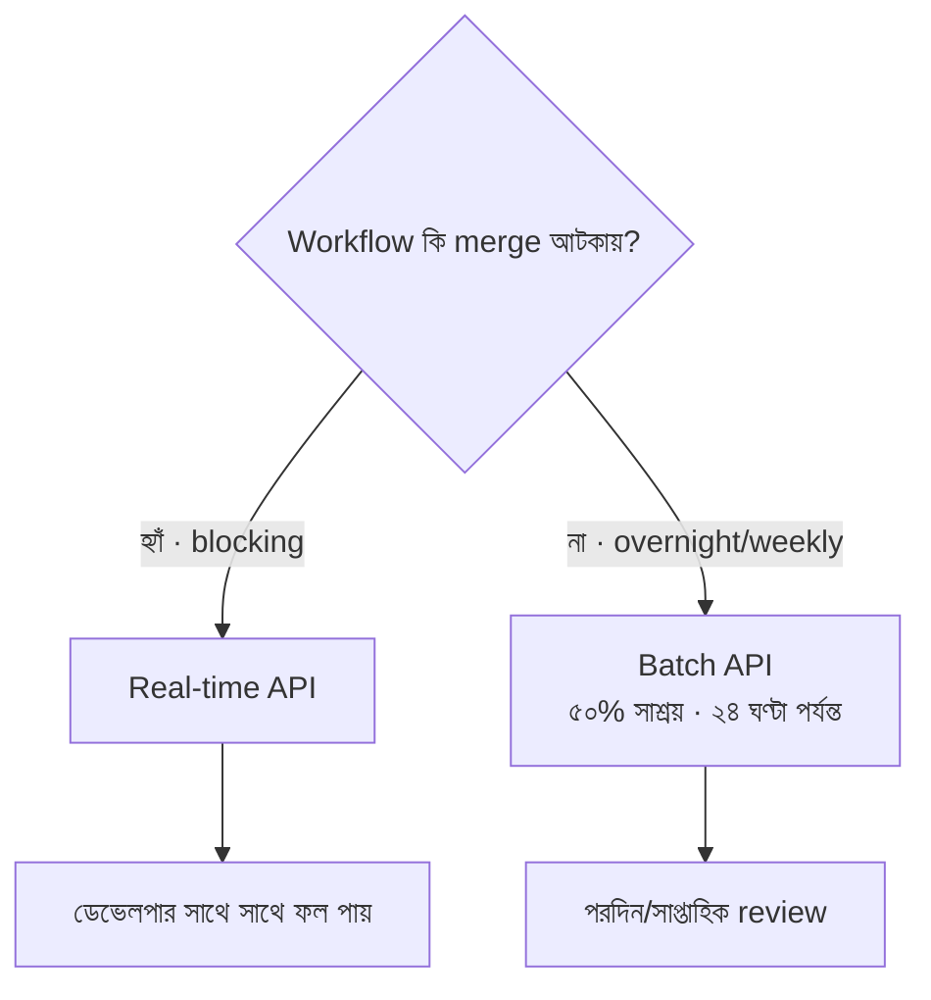

import ReadingProgress from '../../../../components/progress/ReadingProgress.astro';
import MarkComplete from '../../../../components/progress/MarkComplete.astro';
import KeywordTable from '../../../../components/content/KeywordTable.astro';
import ExamTrap from '../../../../components/content/ExamTrap.astro';
import BuildExercise from '../../../../components/content/BuildExercise.astro';
import Attribution from '../../../../components/content/Attribution.astro';

<ReadingProgress />

<div class="lesson-meta">
	<span class="lesson-badge">Domain 3</span>
	<span class="lesson-task">Task 3.6 · ওয়েট ২০%</span>
	<span class="lesson-source">মূল ইংরেজি: CI/CD Integration</span>
</div>

## এই লেসনে যা জানতে হবে

CI/CD pipeline-এ Claude Code বসালে সে আর ইন্টারঅ্যাকটিভ ডেভেলপার-টুল থাকে না — হয়ে ওঠে স্বয়ংক্রিয় review ও generation engine। এই টাস্ক স্টেটমেন্টে পরীক্ষা পাঁচটি ধারণা ধরে, আর **`-p` flag** সবচেয়ে সরাসরি পরীক্ষিত বিষয় (নমুনা প্রশ্ন-সেটে প্রশ্ন ১০)।

## `-p` Flag: নন-ইন্টারঅ্যাকটিভ মোড

Claude Code ডিফল্টে ইন্টারঅ্যাকটিভ: কীবোর্ড ইনপুট চায় আর কথোপকথনমূলক ইন্টারফেস দেখায়। CI pipeline-এ কীবোর্ড নেই। `-p` ছাড়া job চিরকাল ঝুলে থাকে, এমন ইনপুটের অপেক্ষায় যা কখনো আসে না।

```bash
# ভুল — CI-তে ঝুলে থাকে
claude "Analyse this pull request for security issues"

# সঠিক — নন-ইন্টারঅ্যাকটিভভাবে চলে
claude -p "Analyse this pull request for security issues"
```

`-p` flag (আবার `--print`) Claude Code-কে print mode-এ নেয়: prompt প্রসেস করে, ফল stdout-এ লেখে, তারপর বেরিয়ে যায়। ইন্টারঅ্যাকটিভ ইনপুট লাগে না।

এটি নিছক মুখস্থের বিষয়। পরীক্ষা ঝুলে পড়া CI job, Claude-এর ইনপুট-অপেক্ষার লগ দেখিয়ে fix বাছতে বলে। উত্তর `-p` flag। `CLAUDE_HEADLESS=true` নয় (অস্তিত্ব নেই)। `--batch` নয় (অস্তিত্ব নেই)। `/dev/null` থেকে stdin redirect নয় (Claude Code-এর interactive mode-এর আসল সমস্যা মেটায় না)।

**Key Concept:** `-p` flag Domain 3-এর সবচেয়ে সরাসরি পরীক্ষিত তথ্য; official sample question-এ এটি প্রশ্ন ১০। CI pipeline ঝুলছে আর লগে Claude ইনপুটের অপেক্ষা করছে — এমন দেখলেই উত্তর `-p`।

## CI-র জন্য Structured Output

CI-তে Claude Code-এর output machine-parseable হতে হবে। সেখানে মানুষ পড়ছে না। Automated system এটি প্রসেস করে inline PR comment দেয়, dashboard হালনাগাদ করে, বা downstream workflow চালু করে।

দুটি flag একসাথে কাজ করে:

- **`--output-format json`** — মানব-পাঠ্য টেক্সটের বদলে রানকে JSON envelope-এ মুড়ায় (result text, session ID, cost ও usage metadata)।
- **`--json-schema`** — এজেন্টের চূড়ান্ত output JSON Schema-র সাথে যাচাই করে (কেবল print mode)।

```bash
claude -p \
  --output-format json \
  --json-schema '{"type":"object","properties":{"findings":{"type":"array","items":{"type":"object","properties":{"file":{"type":"string"},"line":{"type":"integer"},"severity":{"type":"string"},"message":{"type":"string"}}}}}}' \
  "Review this PR for security issues"
```

Schema-মেনে চলা ডেটা envelope-এর `structured_output` ফিল্ডে নামে — `jq '.structured_output'` দিয়ে আনুন, top level থেকে নয়। এতে automated system যাচাই করা finding পায় যা সে:

- Programmatically parse করতে পারে
- ঠিক file ও line-এ inline PR comment হিসেবে দিতে পারে
- Severity অনুযায়ী আলাদা notification channel-এ পাঠাতে পারে
- Review-রান জুড়ে ট্র্যাক করতে পারে

## Session Context Isolation

যে সেশন কোড লিখল, সেই সেশনই নিজের বদল review করতে কম কার্যকর। এটি তত্ত্বীয় দুশ্চিন্তা নয় — মাপা যায় এমন প্রভাব।

**নিজের review দুর্বল কেন:** সেশনে কোড বানানোর সময় Claude reasoning context গড়ে তোলে: কেন এই পথ বাছল, কী tradeoff ভাবল, কী বিকল্প বাতিল করল। একই সেশনে সেই কোড review করতে বললে সে এসব ধরে রাখে। যে সিদ্ধান্ত সে নিজেই যুক্তি দিয়ে জায়েজ করেছে, সেটি প্রশ্ন করা তার কম সম্ভব হয়।

**Fix: independent review instance।** Review-এর জন্য আলাদা Claude Code invocation ব্যবহার করুন — যার generation session-এর reasoning context-এ প্রবেশ নেই। স্বতন্ত্র reviewer কোডটি নিজের গুণে বিচার করে, আগের জায়েজের পক্ষপাত ছাড়া।

```bash
# ধাপ ১: কোড বানানো (session A)
claude -p "Implement the authentication middleware"

# ধাপ ২: কোড review (session B — স্বতন্ত্র, shared context নেই)
claude -p "Review the authentication middleware for security issues, error handling gaps, and edge cases"
```

এই ধারণা Domain 4 (multi-instance review architecture) আর Domain 5 (context management)-এর সাথে জুড়ে যায়। পরীক্ষা এটি CI/CD পরিস্থিতিতে বিশেষভাবে ধরে।

## Incremental Review Context

Automated review প্রতি push-এ চলে। আগের review-এর কনটেক্সট ছাড়া প্রতিটি রান পুরো PR শুরু থেকে বিশ্লেষণ করে, তাই একই finding বারবার তৈরি করে। সত্যিই সারানো সমস্যা নিজে থেকেই বাদ পড়ে, কারণ বদলানো কোড আর সেটি ট্রিগার করে না। যেগুলো বারবার ফিরে আসে সেগুলো সেই সমস্যা যা ডেভেলপার দেখেছে আর সচেতনভাবে বদলায়নি; কনটেক্সটহীন re-scan সেগুলোকে নতুন সমস্যা থেকে আলাদা করতে পারে না, তাই প্রতি push-এ আবার flag করে।

**Fix:** আগের review-এর finding কনটেক্সটে দিন, আর Claude-কে নির্দেশ দিন কেবল নতুন বা এখনও অমীমাংসিত সমস্যা জানাতে।

```bash
claude -p \
  --output-format json \
  "Review this PR. Here are the findings from the previous review:
${PREVIOUS_FINDINGS}
Report ONLY:
1. New issues not in the previous findings
2. Issues from the previous findings that are still present
Do NOT re-report previous findings the developer has already reviewed and chosen not to act on."
```

একই comment বারবার আসলে ডেভেলপারের আস্থা পড়ে। প্রতি push-এ একই পাঁচটি comment এলে, ডেভেলপার ঠিক করুক বা না করুক, তারা comment পড়া বন্ধ করে দেয়। Incremental review context signal-to-noise অনুপাত বাঁচায়।

## CI-তে CLAUDE.md

CI-তে চলার সময় Claude Code ঠিক ইন্টারঅ্যাকটিভ মোডের মতোই প্রজেক্টের CLAUDE.md পড়ে। তাই প্রজেক্ট-নির্দিষ্ট কনটেক্সট CI-চালিত রানে দিতে CLAUDE.md-ই পথ:

- Testing standard: কী ভালো test, কোন pattern মানতে হবে, কী এড়াতে হবে
- Available fixture: কোন test fixture আছে, কীভাবে ব্যবহার করবেন, তাতে কী ডেটা
- Review criteria: কোনটি critical finding আর কোনটি ছোট style সমস্যা
- Existing test coverage: কী আগেই ঢাকা, যাতে duplicate test প্রস্তাব না হয়

CLAUDE.md-এ এই কনটেক্সট না থাকলে CI-চালিত test generation কম-মূল্যের boilerplate বানায়। থাকলে বানানো test টিমের pattern মানে আর সত্যিকারের coverage যোগ করে।

```text
# .claude/CLAUDE.md — CI-relevant section
## Testing Standards
- Tests must use the factory pattern from test/factories/ for data creation
- Integration tests connect to the test database via test/setup/db.ts
- Do not test private implementation details — test public API contracts
- Coverage target: 80% branch coverage for new code
- Available fixtures: test/fixtures/users.json, test/fixtures/orders.json
```

## CLI Flags Reference

`-p` flag সবচেয়ে সরাসরি পরীক্ষিত, তবে headless রানের আকার দেওয়া flag-গুলোও পরীক্ষা চায়: output কীভাবে ফরম্যাট হবে, কোন system prompt ব্যবহার হবে, permission ও টুল কীভাবে scope হবে। এগুলো `claude -p`-এর সাথে CI-তে আর ইন্টারঅ্যাকটিভ `claude` কমান্ডেও খাটে।

**System prompt flag:** Claude Code চারটি flag দেয়, আর পরীক্ষা append-versus-replace পার্থক্য ধরে।

| Flag | প্রভাব |
| --- | --- |
| `--system-prompt "<text>"` | সম্পূর্ণ ডিফল্ট system prompt প্রতিস্থাপন করে |
| `--system-prompt-file <path>` | ডিফল্ট prompt-কে ফাইলের কনটেন্ট দিয়ে প্রতিস্থাপন করে |
| `--append-system-prompt "<text>"` | ডিফল্ট prompt-এ লেখা যোগ করে |
| `--append-system-prompt-file <path>` | ডিফল্ট prompt-এ ফাইলের কনটেন্ট যোগ করে |

Claude coding assistant থাকুক, আর আপনার বাড়তি নিয়মও মানুক — তখন append করুন। Append ডিফল্ট টুল-নির্দেশ, safety instruction আর coding convention ধরে রাখে, তাই কেবল যা আলাদা তাই দিতে হয়। Replace করুন যখন identity বা permission model Claude Code-এর থেকে আলাদা — যেমন এমন pipeline-এ non-coding এজেন্ট, যা কোনো মানুষ দেখে না। Replace পুরো ডিফল্ট prompt ফেলে দেয়, তাই কাজটির জন্য যা দরকার সব আপনার দায়।

**Headless output ও limit (print mode):**

| Flag | প্রভাব |
| --- | --- |
| `--output-format text\|json\|stream-json` | `-p`-এর output আকার; json ও stream-json machine-parseable |
| `--input-format text\|stream-json` | `-p`-এর input আকার |
| `--json-schema '<schema>'` | `-p`-এর schema-যাচাইকৃত output; `--output-format json`-এর সাথে envelope-এর `structured_output`-এ নামে |
| `--max-turns <n>` | Agentic turn-এর সংখ্যা সীমিত করে, তারপর বেরিয়ে যায় |

**Permission, টুল ও কনটেক্সট:**

| Flag | প্রভাব |
| --- | --- |
| `--permission-mode <mode>` | default, acceptEdits, plan, auto, dontAsk, bypassPermissions বা manual দিয়ে শুরু (manual হলো default-এর alias, v2.1.200+) |
| `--allowedTools "<rules>"` | Permission prompt ছাড়া চলা টুল, যেমন `"Bash(git diff *)" "Read"` |
| `--disallowedTools "<rules>"` | Deny rule; খালি টুল-নাম কনটেক্সট থেকেই টুল সরিয়ে দেয় |
| `--tools "Bash,Edit,Read"` | কোন built-in টুল আদৌ পাওয়া যাবে তা সীমিত করে |
| `--add-dir <path>` | Claude যে directory পড়তে ও এডিট করতে পারবে তা যোগ করে (ফাইল access দেয়, configuration discovery নয়) |
| `--model <alias\|name>` | সেশনের model ঠিক করে (sonnet, opus বা পূর্ণ model নাম) |

**Session ও start-up:** `-c` / `--continue` বর্তমান directory-র সর্বশেষ কথোপকথন আবার শুরু করে, আর `-r` / `--resume <id|name>` নির্দিষ্ট সেশন আবার শুরু করে। `--bare` হলো minimal mode: hooks, skills, plugins, MCP server, auto memory আর CLAUDE.md-এর auto-discovery বাদ দেয়, যাতে scripted call দ্রুত শুরু হয় — Claude-এর হাতে থাকে কেবল Bash আর file read/edit টুল। দ্রুত, পূর্বানুমেয় scripted রান চাইলে আর project configuration না লাগলে `--bare` ব্যবহার করুন।

## Duplicate এড়াতে Existing Test দেওয়া

CI-তে test generation চালানোর সময় বিদ্যমান test ফাইল কনটেক্সটে দিন। না দিলে Claude Code এমন test প্রস্তাব করতে পারে যা আগেই আছে, ডেভেলপারের review সময় নষ্ট করে। বিদ্যমান test দেওয়া থাকলে Claude coverage gap খুঁজে বের করে, একই scenario নকল না করে।

## CI Workflow-এ Batch API বনাম Real-Time

Message Batches API ৫০% খরচ বাঁচায়, কিন্তু প্রসেসিং সময় ২৪ ঘণ্টা পর্যন্ত আর কোনো গ্যারান্টিকৃত latency SLA নেই। এতে স্পষ্ট সিদ্ধান্ত-সীমানা তৈরি হয়:

| Workflow-এর ধরন | API পছন্দ | কারণ |
| --- | --- | --- |
| Pre-merge check (blocking) | Real-time (synchronous) | ডেভেলপাররা ফলের অপেক্ষায় থাকেন |
| Overnight technical debt report | Batch API | সময়-সংবেদনশীল নয়, ৫০% সাশ্রয় |
| Weekly code audit | Batch API | নির্ধারিত সময়ে চলে, latency সহনীয় |
| Nightly test generation | Batch API | রাতভর চলে, পরদিন সকালে দেখা হয় |

Pre-merge check হলো blocking workflow। Check শেষ না হলে ডেভেলপার merge করতে পারেন না। Batch API এখানে অনুপযুক্ত, কারণ এটি latency-র গ্যারান্টি দেয় না। পরীক্ষা এই পার্থক্য সরাসরি ধরে (Sample Question 11)।



<ExamTrap label="পরীক্ষার ফাঁদ: চারটি বারবার আসা ভুল">
	<p>
		(১) CI ঝুলছে ইন্টারঅ্যাকটিভ ইনপুটের অপেক্ষায় — fix <code>-p</code> (<code>--print</code>); <code>CLAUDE_HEADLESS=true</code> বা <code>--batch</code>-এর অস্তিত্ব নেই। (২) একই সেশনে self-review-কে independent review-এর সমান ভাবা — reasoning context পক্ষপাত তৈরি করে। (৩) Pre-merge check-এ Batch API — ২৪ ঘণ্টা পর্যন্ত সময়, blocking workflow-এ অনুপযুক্ত। (৪) আগের finding কনটেক্সটে না দেওয়া — প্রতি রানে duplicate comment, ডেভেলপারের আস্থা পড়ে।
	</p>
</ExamTrap>

<KeywordTable keywords={frontmatter.keywords} />

<ExamTrap label="অনুশীলন: ঝুলে থাকা CI job">
	<p>
		একটি CI pipeline script prompt-সহ <code>claude</code> চালায়, কিন্তু job অনির্দিষ্টকাল ঝুলে থাকে। লগ দেখাচ্ছে Claude Code ইন্টারঅ্যাকটিভ ইনপুটের অপেক্ষা করছে। সঠিক fix কী?
	</p>
	<details>
		<summary>উত্তর দেখুন</summary>

		**সঠিক উত্তর:** `-p` flag যোগ করা, যাতে Claude Code নন-ইন্টারঅ্যাকটিভ print mode-এ চলে।

		**কেন বাকিগুলো ভুল:**

		- *`CLAUDE_HEADLESS=true` environment variable* — এমন variable নেই।
		- *`--batch` flag* — এমন flag নেই; Batch API আলাদা API স্তরের বিষয়।
		- *`/dev/null` থেকে stdin redirect* — interactive mode-এর আসল সমস্যা মেটায় না।

	</details>
</ExamTrap>

<BuildExercise
	title="Claude Code দিয়ে CI/CD pipeline সাজান"
	difficulty="Advanced"
	time="৪৫ মিনিট"
	objectives={[
		'নন-ইন্টারঅ্যাকটিভ PR analysis-এর জন্য -p flag ব্যবহার',
		'file, line, severity, message-সহ structured JSON finding বানানো',
		'Generation ও independent review-এর জন্য আলাদা invocation রাখা',
		'Incremental review context দিয়ে duplicate comment আটকানো',
		'Blocking বনাম non-blocking workflow-এ real-time ও Batch API বাছা',
	]}
	steps={[
		{
			title: 'একটি CI script লিখুন যা নন-ইন্টারঅ্যাকটিভ PR বিশ্লেষণে claude -p চালায়।',
			why: 'Domain 3-এর সবচেয়ে সরাসরি পরীক্ষিত তথ্য; -p ছাড়া job ইনপুটের অপেক্ষায় ঝুলে থাকে।',
			expect: 'GitHub Actions YAML বা সমতুল্য CI script-এ claude -p দিয়ে review prompt; job না ঝুলে শেষ হয়; output stdout-এ ধরা পড়ে।',
		},
		{
			title: '--output-format json আর --json-schema যোগ করে file, line, severity, message ফিল্ডসহ structured finding বানান।',
			why: 'CI output machine-parseable হতে হবে; inline PR comment, severity filter ও cross-run tracking-এ structured JSON লাগে।',
			expect:
				'Output একটি JSON envelope, যার structured_output ফিল্ড schema মেনে; jq .structured_output দিয়ে হুবহু ডেটা বেরোয়।',
		},
		{
			title: 'Pipeline-কে JSON output parse করে ঠিক file ও line-এ inline PR comment দিতে সাজান।',
			why: 'নির্দিষ্ট file ও line-এর inline comment কার্যকর feedback দেয়; PR-স্তরের সাধারণ comment উপেক্ষিত হয়।',
			expect: 'প্রতিটি finding ঠিক file ও line-এ inline comment হিসেবে, severity দৃশ্যমান।',
		},
		{
			title: 'CLAUDE.md-এ testing standard, available fixture ও review criteria নিয়ে CI-সংশ্লিষ্ট section যোগ করুন।',
			why: 'CI-তেও Claude Code CLAUDE.md পড়ে; প্রজেক্ট-কনটেক্সট না থাকলে test generation কম-মূল্যের boilerplate বানায়।',
			expect: 'CLAUDE.md-এ স্পষ্ট CI section; CI-চালিত run documented factory ও fixture ব্যবহার করে test বানায়।',
		},
		{
			title: 'দুটি আলাদা invocation রাখুন — একটি code generation, আরেকটি স্বতন্ত্র review (shared session context নেই)।',
			why: 'কোড বানানো সেশন reasoning context ধরে রাখে, যা নিজের সিদ্ধান্ত প্রশ্ন করা কমায়; স্বতন্ত্র review ভালো।',
			expect: 'CI script-এ দুটি পৃথক claude -p invocation; review invocation স্বাধীনভাবে বিশ্লেষণ করে।',
		},
		{
			title: 'Incremental review চালু করুন: আগের finding সংরক্ষণ করে পরের রানে কনটেক্সটে দিন, আর শুধু নতুন/অমীমাংসিত সমস্যা জানাতে বলুন।',
			why: 'কনটেক্সটহীন রান প্রতি push-এ duplicate comment দেয়, যা ডেভেলপারের আস্থা নষ্ট করে।',
			expect: 'প্রথম রান finding সংরক্ষণ করে (JSON artifact/ফাইল); পরের রান কেবল নতুন বা অমীমাংসিত সমস্যা দেয়; সারানো সমস্যা আর ফেরে না।',
		},
	]}
/>

## সূত্র

<ul>
	{frontmatter.sources.map((source) => (
		<li>
			<a href={source.href} target="_blank" rel="noopener noreferrer">
				{source.label}
			</a>
			{source.note ? ` — ${source.note}` : ''}
		</li>
	))}
</ul>

<Attribution sourceUrl={frontmatter.sourceUrl} updated={frontmatter.updated} />

<MarkComplete lessonId="3-6" />
