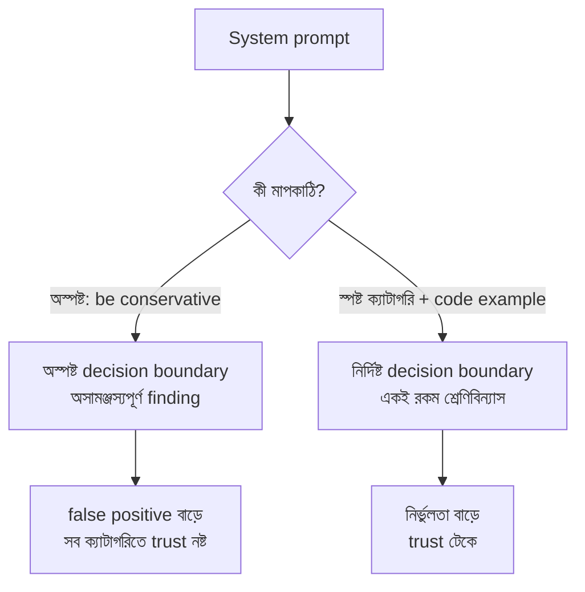

import ReadingProgress from '../../../../components/progress/ReadingProgress.astro';
import MarkComplete from '../../../../components/progress/MarkComplete.astro';
import KeywordTable from '../../../../components/content/KeywordTable.astro';
import ExamTrap from '../../../../components/content/ExamTrap.astro';
import BuildExercise from '../../../../components/content/BuildExercise.astro';
import Attribution from '../../../../components/content/Attribution.astro';

<ReadingProgress />

<div class="lesson-meta">
	<span class="lesson-badge">Domain 4</span>
	<span class="lesson-task">Task 4.1 · ওয়েট ২০%</span>
	<span class="lesson-source">মূল ইংরেজি: System Prompts with Explicit Criteria</span>
</div>

## এই লেসনে যা জানতে হবে

প্রোডাকশন প্রম্পট ইঞ্জিনিয়ারিংয়ের সবচেয়ে বড় ভুল — অস্পষ্ট নির্দেশের উপর ভরসা। প্রোডাকশনের সিস্টেম প্রম্পটে model-কে বলতে হয় ঠিক কী ধরবে আর কী ধরবে না। এখানে মডেলের "রুচি" নয়, স্পষ্ট **decision boundary** লাগে।

## কেন অস্পষ্ট নির্দেশ ব্যর্থ

"Be conservative." "Only report high-confidence findings." "Use your best judgement."

এই তিনটিই পরীক্ষায় ডিস্ট্র্যাক্টর হিসেবে আসে, কারণ এগুলো যুক্তিসঙ্গত শোনায় কিন্তু মডেলকে কোনো কার্যকর মাপকাঠি দেয় না। "Conservative"-এর অর্থ প্রসঙ্গভেদে বদলায়, আর "high-confidence" একটি subjective threshold, যা মডেল নিজে ঠিকভাবে মাপতে পারে না।

ভুল বনাম সঠিক প্রম্পট — CI/CD code review pipeline-এর উদাহরণে:

```
# ভুল: কোনো মাপকাঠি নেই
Review this code. Be conservative. Only report high-confidence findings.

# সঠিক: স্পষ্ট ক্যাটাগরি
Flag comments only when claimed behaviour contradicts actual code behaviour.
Report bugs and security vulnerabilities.
Skip minor style preferences and local patterns.
```

দ্বিতীয় প্রম্পটে দুটি জিনিস স্পষ্ট: কোনটি জানাতে হবে (bug, security vulnerability), কোনটি বাদ দিতে হবে (style preference, local pattern), আর comment কখন ধরতে হবে (যাচাই করা behaviour বনাম আসল behaviour)। প্রথম প্রম্পটে একটি মাপকাঠিও নেই।

## False Positive Trust Problem

একটি ক্যাটাগরির উচ্চ false positive হার পুরো সিস্টেমের উপর আস্থা নষ্ট করে। পরীক্ষা এই ধারণার উপর জোর দেয়।

ভাবুন, "documentation mismatch" finding-গুলোর ৪০% ভুল। ডেভেলপাররা তখন "security vulnerability" finding-ও পড়া বন্ধ করে দেবে — যদিও সেগুলো ৯৮% নির্ভুল চলে। Trust ক্যাটাগরি-নির্দিষ্ট নয়; একটি ক্যাটাগরির ত্রুটি সবার নাম কেনে।

সমাধান প্রথমে উল্টো শোনায়: যে ক্যাটাগরির false positive বেশি, তার prompt ঠিক করার সময় সেটি **সাময়িকভাবে বন্ধ** রাখুন। যে ক্যাটাগরিগুলো ভালো চলছে, সেগুলোর উপর আস্থা সঙ্গে সঙ্গে ফেরে। তারপর ভাঙা ক্যাটাগরিটি ঠিক করে, প্রমাণ পেলেই আবার চালু করুন।

এটি ক্যাটাগরিটি বাদ দেওয়া নয় — বরং ক্যাটাগরির পূর্ণতা নয়, পুরো সিস্টেমের আস্থাকে অগ্রাধিকার দেওয়া।

## বাস্তব Code Example দিয়ে Severity ঠিক করা

Severity স্তর বর্ণনার বদলে বাস্তব code example দিয়ে ঠিক করতে হয়।

```
# গদ্য বর্ণনা (যথেষ্ট নয়)
Critical: Issues that could cause system failures or data loss
Minor: Issues that affect code readability but not functionality

# Code example (সঠিক)
Critical — Unsanitised user input in SQL query:
query = f"SELECT * FROM users WHERE id = {user_input}"

Minor — Inconsistent variable naming:
userName vs user_name in the same module
```

গদ্য বর্ণনা মডেলের উপর ব্যাখ্যার ভার ছাড়ে — "could cause system failures" আসলে কী বোঝায়? Code example সেই অস্পষ্টতা একেবারে তুলে দেয়। প্রতিটি স্তরের বাস্তব pattern চোখে দেখলে মডেল প্রতিটি invocation-এ একই রকম শ্রেণিবিন্যাস করে।



## কেন Confidence-Based Filtering ব্যর্থ

"Only report high-confidence findings" পরীক্ষায় প্রায়ই লোভনীয় উত্তর হিসেবে আসে। মনে হয় ভালো ইঞ্জিনিয়ারিং: confidence দিয়ে ছেঁকে কেবল জোরালো সংকেত রাখা। কিন্তু LLM-এর নিজের জানানো confidence খারাপভাবে calibrated।

মডেল প্রায়ই ভুল finding নিয়ে নিশ্চিত থাকে, আর সঠিক finding নিয়ে দ্বিধায় থাকে। Confidence score **routing**-এ কাজে লাগে — কম-confidence finding মানব review-তে পাঠানো (Task Statement 4.6) — কিন্তু কী finding বৈধ, তা নির্ধারণের মাপকাঠি সে নয়।

ক্রমটি এই: **আগে explicit criteria, পরে confidence-based routing।** প্রথম ধাপ কখনো বাদ দেবেন না।

## পরীক্ষার ফাঁদ

<ExamTrap>
	<p>
		<strong>"be conservative" বা "only report high-confidence findings"-কে বৈধ prompt improvement ভাবা</strong> — অস্পষ্ট নির্দেশ নির্ভুলতা বাড়ায় না। কোনটি ধরবে আর কোনটি বাদ দেবে, তা স্পষ্ট ক্যাটাগরিতে বলাই সঠিক পথ।
	</p>
</ExamTrap>

<ExamTrap>
	<p>
		<strong>Confidence threshold দিয়ে false positive সমস্যা মিটবে ধরে নেওয়া</strong> — LLM self-reported confidence দুর্বলভাবে calibrated। Concrete code example-সহ explicit criteria বেশি কার্যকর; confidence routing কেবল criteria ঠিক করার পরে।
	</p>
</ExamTrap>

<ExamTrap>
	<p>
		<strong>উচ্চ false-positive ক্যাটাগরি চালু রেখে তার prompt ঠিক করা</strong> — এক ক্যাটাগরির ভুল সব ক্যাটাগরির trust নষ্ট করে।prompt ঠিক করার সময় ক্যাটাগরিটি সাময়িকভাবে বন্ধ রাখলে পুরো সিস্টেমের আস্থা ফেরে।
	</p>
</ExamTrap>

<KeywordTable keywords={frontmatter.keywords} />

## প্র্যাকটিস সিনারিও (নিজে উত্তর ভাবুন, তারপর খুলুন)

> আপনার CI/CD code review pipeline-এ "documentation mismatch" finding-এর false positive হার ৪০%, ফলে ডেভেলপাররা নির্ভুল security finding-সহ সব review ক্যাটাগরি উপেক্ষা করছেন। সবচেয়ে কার্যকর সমাধান কোনটি?

<details>
	<summary>উত্তর দেখুন</summary>

	**সঠিক উত্তর:** documentation mismatch ক্যাটাগরিটি সাময়িকভাবে বন্ধ রাখুন, আর explicit criteria ও code example দিয়ে তার prompt ঠিক করুন।

	**কেন বাকিগুলো ভুল:**

	- *Temperature বাড়িয়ে ভিন্নতর review run বানানো* — অস্থিরতা বাড়ে, নির্ভুলতা নয়; এবং root cause (দুর্বল criteria) থেকে যায়।
	- *দ্বিতীয় model pass দিয়ে যাচাই না হওয়া documentation finding বাদ দেওয়া* — বাড়তি খরচ ও latency, আর দুর্বল prompt-এর সমস্যা ঢেকে রাখে। তবে Task 4.6-এর confidence routing ধারণার সঙ্গে এটির মিল আছে, তাই বিভ্রান্তিকর।
	- *"only report high-confidence documentation issues" যোগ করা* — মডেলের self-reported confidence দুর্বলভাবে calibrated; এতে false positive সমস্যা মেটে না।

</details>

<BuildExercise
	title="স্পষ্ট ক্রাইটেরিয়াসহ Code Review প্রম্পট বানান"
	difficulty="Advanced"
	time="৪৫ মিনিট"
	objectives={[
		'কেন vague instruction (be conservative, high-confidence only) প্রোডাকশনে ব্যর্থ',
		'কী ধরবে আর কী বাদ দেবে তা explicit categorical criteria দিয়ে লেখা',
		'গদ্য বর্ণনার বদলে বাস্তব code example দিয়ে severity স্তর ঠিক করা',
		'False positive হার মেপে trust recovery কৌশল প্রয়োগ করা',
		'ক্রম মনে রাখা: আগে explicit criteria, পরে confidence-based routing',
	]}
	steps={[
		{
			title: 'Vague নির্দেশসহ (be conservative, only flag important issues) একটি system prompt লিখে জ্ঞাত bug, security issue ও style nitpick-সহ ৫টি code snippet-এ পরীক্ষা করুন।',
			why: 'Vague নির্দেশ দিয়ে baseline নিলে পরীক্ষায় ধরা false positive সমস্যাটি চোখে পড়ে; "be conservative" মডেলকে কার্যকর boundary দেয় না, তার প্রমাণ লাগে।',
			expect: '৫টি snippet-এ অসম ফল: কোনো style nitpick critical হিসেবে ধরা পড়ে, কোনো আসল bug বাদ পড়ে বা minor হয়, আর একই snippet দুবার চালালে ফল বদলায়।',
		},
		{
			title: 'Prompt নতুন করে লিখুন explicit categorical criteria দিয়ে — কোনটি জানাবে (bug, security vulnerability) আর কোনটি বাদ দেবে (style preference, local pattern), তা স্পষ্ট করুন।',
			why: 'Explicit categorical criteria-ই পরীক্ষায় সঠিক পথ; নির্দিষ্ট ক্যাটাগরি false positive-এর কারণ অস্পষ্টতা দূর করে।',
			expect: 'নতুন prompt-এ স্পষ্ট ক্যাটাগরি: bug ও security vulnerability জানাও, style preference ও local pattern বাদ দাও, comment তখনই ধরো যখন বলা behaviour আর আসল behaviour মেলে না।',
		},
		{
			title: 'Critical, major, minor প্রতিটি severity স্তরের জন্য গদ্য বর্ণনার বদলে বাস্তব code example যোগ করুন।',
			why: 'পরীক্ষায় ধরা হয় code example গদ্য বর্ণনার চেয়ে ভালো; "could cause system failures" ব্যাখ্যা দাবি করে, code example অস্পষ্টতা তোলে।',
			expect: 'প্রতিটি severity স্তরে অন্তত একটি code snippet, যেখানে স্তরটির সংজ্ঞা দেওয়া pattern দেখানো আছে — বর্ণনা নয়।',
		},
		{
			title: 'একই test set-এ দুই সংস্করণের false positive হার মিলিয়ে দেখুন এবং কোনটি বেশি সামঞ্জস্যপূর্ণ ফল দেয় তা লিখে রাখুন।',
			why: 'উন্নতির পরিমাপ explicit criteria পদ্ধতির যথার্থতা প্রমাণ করে, আর পরীক্ষায় প্রত্যাশিত মূল্যায়ন দক্ষতা গড়ে তোলে।',
			expect: 'Explicit criteria সংস্করণে স্পষ্টভাবে কম false positive। Vague prompt ৩০–৫০% অসামঞ্জস্য দেয়, explicit criteria ১৫%-এর নিচে; বারবার চালালেও ফল স্থির।',
		},
		{
			title: '২৫%-এর বেশি false positive হার আছে এমন ক্যাটাগরি সাময়িকভাবে বন্ধ করুন, আর আবার চালু করার আগে দরকারি criteria সংশোধন লিখে রাখুন।',
			why: 'Trust recovery কৌশল মূল পরীক্ষা-ধারণা: এক ক্যাটাগরির উচ্চ false positive সব ক্যাটাগরির trust নষ্ট করে; সাময়িক বন্ধ রাখলে পুরো সিস্টেমের আস্থা ফেরে।',
			expect: 'কোন ক্যাটাগরি ২৫% সীমা ছাড়িয়েছে, কী সংশোধন দরকার (যেমন edge case-এর code example), আর লক্ষ্য false positive হারসহ পুনঃচালুর পরিকল্পনা — সব লেখা একটি নথি।',
		},
	]}
/>

## সূত্র

<ul>
	{frontmatter.sources.map((source) => (
		<li>
			<a href={source.href} target="_blank" rel="noopener noreferrer">
				{source.label}
			</a>
			{source.note ? ` — ${source.note}` : ''}
		</li>
	))}
</ul>

<Attribution sourceUrl={frontmatter.sourceUrl} updated={frontmatter.updated} />

<MarkComplete lessonId="4-1" />
