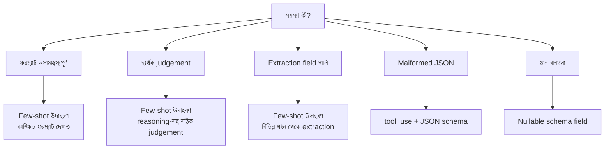

import ReadingProgress from '../../../../components/progress/ReadingProgress.astro';
import MarkComplete from '../../../../components/progress/MarkComplete.astro';
import KeywordTable from '../../../../components/content/KeywordTable.astro';
import ExamTrap from '../../../../components/content/ExamTrap.astro';
import BuildExercise from '../../../../components/content/BuildExercise.astro';
import Attribution from '../../../../components/content/Attribution.astro';

<ReadingProgress />

<div class="lesson-meta">
	<span class="lesson-badge">Domain 4</span>
	<span class="lesson-task">Task 4.2 · ওয়েট ২০%</span>
	<span class="lesson-source">মূল ইংরেজি: Few-Shot Prompting</span>
</div>

## এই লেসনে যা জানতে হবে

Claude থেকে সামঞ্জস্যপূর্ণ, সঠিক ফরম্যাটের আউটপুট পেতে সবচেয়ে কার্যকর কৌশল **few-shot example**। আরও নির্দেশ নয়, confidence threshold নয়, temperature বদল নয়। আউটপুট অসামঞ্জস্যপূর্ণ হলে সবার আগে few-shot উদাহরণের কথা ভাবুন।

এটি সরাসরি পরীক্ষার নীতি। পরীক্ষা এমন পরিস্থিতি দেয় যেখানে বিস্তারিত নির্দেশ দিয়েও ফল অসামঞ্জস্যপূর্ণ; তারপর জিজ্ঞেস করে — "আরও নির্দেশ যোগ করবেন" নাকি "few-shot উদাহরণ যোগ করবেন"? সঠিক উত্তর প্রায় সবসময় দ্বিতীয়টি।

## কখন Few-Shot উদাহরণ লাগে

তিনটি নির্দিষ্ট সংকেত:

- **শুধু বিস্তারিত নির্দেশে ফরম্যাট অসামঞ্জস্যপূর্ণ** — আউটপুট ফরম্যাট স্পষ্ট করে লিখেছেন, তবু প্রতিবার গঠন বদলায়: কখনো bullet list, কখনো table, কখনো গদ্য। আরও নির্দেশে ঠিকবে না; কাঙ্ক্ষিত ফরম্যাট দেখানো উদাহরণেই ঠিকবে।
- **দ্ব্যর্থক কেসে judgement অসামঞ্জস্যপূর্ণ** — code review টুল এক ফাইলে variable shadowing-কে "critical", আরেকটিতে "minor" বলছে। Tool selection agent ফ্রেজিং বদলালেই "check my order"-কে ভিন্ন টুলে পাঠাচ্ছে। এসব কেসে সঠিক judgement ও তার reasoning দেখানো উদাহরণ দরকার।
- **Extraction-এ খালি field, যদিও তথ্য আছে** — তথ্য ডকুমেন্টে আছে, কিন্তু অপ্রত্যাশিত গঠনে: গদ্যের ভেতরে লুকানো, বা একাধিক paragraph জুড়ে ছড়ানো। বিভিন্ন গঠন থেকে সঠিক extraction দেখানো উদাহরণ সমস্যা মেটায়।

## কার্যকর উদাহরণ কীভাবে বানাবেন

নিয়মগুলো কড়া:

- **২–৪টি লক্ষ্যভিত্তিক উদাহরণ দিন।** দুইয়ের কম হলে প্যাটার্ন দাঁড়ায় না; চারটির বেশি হলে সমান সুফল ছাড়াই টোকেন নষ্ট। সমস্যা যে নির্দিষ্ট দ্ব্যর্থক পরিস্থিতিতে হচ্ছে, উদাহরণ সেদিকেই তাক করুন।
- **প্রতিটি উদাহরণে reasoning থাকতে হবে।** কেবল input-output জোড়া নয়; সম্ভাব্য বিকল্পের বদলে কেন সেই একটি সিদ্ধান্ত নেওয়া হলো, তা দেখান। এতে মডেল নতুন pattern-এ judgement সাধারণীকরণ করতে শেখে, কেবল উদাহরণের কেস মেলায় না।

```
Example: Tool selection for "check my order #12345"
Input: "check my order #12345"
Selected tool: lookup_order
Reasoning: The user provides an order number (#12345), indicating
they want order-specific information. Even though this could be
interpreted as a general customer query, the specific order
identifier makes lookup_order the correct choice over get_customer.
```

Reasoning না থাকলে মডেল শেখে শুধু "order number থাকলে lookup_order" — হুবহু মিল। Reasoning থাকলে শেখে সাধারণ নীতি: নির্দিষ্ট identifier থাকলে নির্দিষ্ট lookup টুলে যাবে।

- **ব্যর্থ পরিস্থিতি কভার করুন।** Extraction টেবিলে চলে কিন্তু narrative text-এ ফেলে; উদাহরণে narrative text থেকে সঠিক extraction দেখান। Code review variable shadowing-এ অসামঞ্জস্যপূর্ণ; ভিন্ন severity স্তরে shadowing-এর উদাহরণ reasoning-সহ দেখান।

## Hallucination কমার পার্শ্বফল

Few-shot উদাহরণের আরেক উপকার — extraction কাজে তথ্য বানানো (hallucination) কমে। মডেল বিভিন্ন গঠন থেকে সঠিক extraction দেখে — inline citation বনাম bibliography, গদ্য বর্ণনা বনাম structured table, header বনাম গায়ে-লেখা তথ্য — তখন নতুন গঠনেও তথ্য বানানো ছাড়াই সামলাতে শেখে।

অসামঞ্জস্যপূর্ণ ফরম্যাটের ডকুমেন্টে এটিই সবচেয়ে জরুরি। একটি আর্থিক প্রতিবেদন এক পাতায় টেবিলে খরচ দেয়, পরের পাতায় paragraph-এ লুকায়। উদাহরণ না থাকলে মডেল টেবিল ঠিক করে, কিন্তু narrative অংশে খালি field ফেরায় — বা তার চেয়েও খারাপ, মান বানিয়ে দেয়। দুটো গঠনই দেখালে extraction-এর গুণ বাড়ে।

## False Positive কমাতেও Few-Shot

Code review ও analysis-এ few-shot উদাহরণের দ্বৈত কাজ: কী ধরতে হবে আর কী এড়াতে হবে, দুটোই দেখানো। গ্রহণযোগ্য pattern আর আসল সমস্যার মধ্যে পার্থক্য দেখানো উদাহরণ false positive কমায়, আবার আসল সমস্যা ধরাও টেকে।

```
Example: Variable shadowing assessment
Code: function process(items) {
  const result = items.map(item => {
    const result = transform(item); // shadows outer 'result'
    return result;
  });
  return result;
}
Severity: minor
Reasoning: The inner 'result' shadows the outer variable but
within a limited scope (arrow function). The code is still readable
and the shadow does not cause a bug. This is a style preference,
not a defect. Flag as minor only if style consistency is in scope.
```

এই উদাহরণটি মডেলকে আসল bug আর নিরীহ pattern আলাদা করতে শেখায়; false positive কমে, আবার সত্যিকারের সমস্যাযুক্ত shadowing ধরার ক্ষমতাও টেকে।

## সঠিক কৌশল বাছা

| সমস্যা | সঠিক কৌশল |
| --- | --- |
| আউটপুট ফরম্যাট অসামঞ্জস্যপূর্ণ | Few-shot উদাহরণ |
| Malformed JSON আউটপুট | JSON schema-সহ `tool_use` |
| অনুপস্থিত field-এর জন্য বানানো মান | Optional/nullable schema field |
| ভুল tool selection | আগে ভালো tool description, তারপর few-shot |
| Narrative text-এ তথ্য মিস | Narrative extraction দেখানো few-shot উদাহরণ |
| Extraction-এর যোগফল মোটের সঙ্গে মেলে না | Validation-retry loop |



## পরীক্ষার ফাঁদ

<ExamTrap>
	<p>
		<strong>আউটপুট ফরম্যাট অসামঞ্জস্যপূর্ণ হলে "আরও বিস্তারিত নির্দেশ যোগ করা" বাছা</strong> — বিস্তারিত নির্দেশ আগেই আছে, তবু ফল অসামঞ্জস্যপূর্ণ হলে আরও নির্দেশে ঠিকবে না। কাঙ্ক্ষিত ফরম্যাট দেখানো few-shot উদাহরণ বেশি কার্যকর।
	</p>
</ExamTrap>

<ExamTrap>
	<p>
		<strong>Few-shot উদাহরণ কেবল হুবহু pattern-matching শেখায় ভাবা</strong> — উদাহরণে সিদ্ধান্তের reasoning থাকলে মডেল নতুন pattern-এ সাধারণীকরণ করতে শেখে; নীতি শেখে, কেবল কেস নয়।
	</p>
</ExamTrap>

<ExamTrap>
	<p>
		<strong>অসামঞ্জস্যপূর্ণ judgement ঠিক করতে confidence threshold ব্যবহার</strong> — Confidence খারাপভাবে calibrated আর মূল কারণ স্পর্শও করে না। দ্ব্যর্থক কেসে সঠিক judgement-এর few-shot উদাহরণ সরাসরি সামঞ্জস্য শেখায়।
	</p>
</ExamTrap>

<KeywordTable keywords={frontmatter.keywords} />

## প্র্যাকটিস সিনারিও (নিজে উত্তর ভাবুন, তারপর খুলুন)

> আপনার extraction pipeline structured table থেকে সঠিকভাবে research data বের করে, কিন্তু একই তথ্য narrative paragraph-এ থাকলে খালি field ফেরায়। বিস্তারিত নির্দেশে প্রয়োজনীয় সব field ও তাদের ফরম্যাট আগেই লেখা আছে। প্রথমে কী চেষ্টা করবেন?

<details>
	<summary>উত্তর দেখুন</summary>

	**সঠিক উত্তর:** Structured table ও narrative paragraph — দুটোতেই সঠিক extraction দেখানো few-shot উদাহরণ যোগ করুন।

	**কেন বাকিগুলো ভুল:**

	- *Narrative text আগে structured table-এ বদলে নেওয়ার pre-processing ধাপ* — ভারী, ভঙ্গুর, আর সব গঠন সামলায় না; সমস্যার মূল (গঠন-ভেদে extraction শেখা) এড়িয়ে যায়।
	- *আরও বড় context window* — সমস্যা তথ্যের অভাব নয়, গঠন-ভেদে extraction-এর দুর্বলতা; বড় window তাতে সাহায্য করে না।
	- *খালি field আবার extract করার post-processing retry* — একই দুর্বল prompt আবার চালায়; structured retry নয়, সঠিক উদাহরণ দরকার।

</details>

<BuildExercise
	title="Few-Shot সমৃদ্ধ Extraction প্রম্পট বানান"
	difficulty="Advanced"
	time="৪৫ মিনিট"
	objectives={[
		'Few-shot উদাহরণ দরকার হওয়ার তিনটি সংকেত চেনা',
		'Input-output নয়, reasoning-সহ উদাহরণ বানানো',
		'ব্যর্থ পরিস্থিতি কভার করা ২–৪টি লক্ষ্যভিত্তিক উদাহরণ দেওয়া',
		'Few-shot বনাম schema পরিবর্তন বনাম validation loop — সঠিক কৌশল বাছা',
		'Empty field হার ও ফরম্যাট সামঞ্জস্যের উপর few-shot-এর প্রভাব মাপা',
	]}
	steps={[
		{
			title: 'বিস্তারিত নির্দেশ আছে কিন্তু উদাহরণ নেই — এমন একটি extraction prompt বানিয়ে টেবিল, narrative paragraph ও মিশ্র গঠনের ১০টি ডকুমেন্টে চালান।',
			why: 'উদাহরণ ছাড়া baseline নিলে পরীক্ষায় ধরা সামঞ্জস্য-সমস্যাটি স্পষ্ট হয়; বিস্তারিত নির্দেশ একাই গঠন-ভেদে অসামঞ্জস্যপূর্ণ ফল দেয়।',
			expect: '১০টি ডকুমেন্টে ফল অসামঞ্জস্যপূর্ণ: টেবিল থেকে field ঠিক আসে, narrative paragraph থেকে খালি বা ভুল; run-ভেদে ফরম্যাট বদলায়; edge case-এ আচরণ অসম।',
		},
		{
			title: 'কোন গঠনে কোন field নিয়মিত খালি বা অসামঞ্জস্যপূর্ণ, তা লিখে রাখুন।',
			why: 'নির্দিষ্ট ব্যর্থ pattern চিনলে few-shot উদাহরণে ঠিক সেটিই দেখানো যায়; পরীক্ষা সমাধানের আগে রোগনির্ণয় আশা করে।',
			expect: 'কোন ডকুমেন্ট-ধরনের কোন field ফেল করে, তার ছক বা লগ। সাধারণ ছবি: টেবিলে তারিখ ঠিক, narrative-এ মিস; কথায় লেখা অঙ্ক অসামঞ্জস্যপূর্ণ; paragraph-এ লুকানো line item খালি।',
		},
		{
			title: 'ব্যর্থ pattern লক্ষ্য করে ৩টি few-shot উদাহরণ বানান — প্রতিটিতে extraction কেন এভাবে করা হলো তার reasoning থাকবে।',
			why: 'Reasoning-সহ উদাহরণ মডেলকে নতুন pattern-এ সাধারণীকরণ শেখায়, কেবল উপরের কেস মেলায় না; পরীক্ষায় ধরা হয় reasoning-সহ উদাহরণই ভালো ফল দেয়।',
			expect: 'তিনটি উদাহরণ, প্রতিটিতে ভিন্ন ডকুমেন্ট গঠন (টেবিল, narrative, মিশ্র), সঠিক extraction এবং তথ্য কীভাবে খুঁজে পাওয়া গেল ও কেন সেই সিদ্ধান্ত — তা ব্যাখ্যা করা reasoning অংশ।',
		},
		{
			title: 'একই ১০টি ডকুমেন্টে few-shot সমৃদ্ধ prompt চালিয়ে মিলিয়ে দেখুন — খালি field হার, ফরম্যাট সামঞ্জস্য ও extraction নির্ভুলতা।',
			why: 'উন্নতির পরিমাপ দেখায় consistency সমস্যায় few-shot-ই প্রথম-পছন্দের কৌশল; পরীক্ষা এই শ্রেণির সমস্যায় it বেশি কার্যকর বলে ধরে নেয়।',
			expect: 'খালি field স্পষ্টভাবে কমে (বিশেষত narrative ডকুমেন্টে), ডকুমেন্ট-ধরনে ফরম্যাট সামঞ্জস্য বাড়ে, সার্বিক নির্ভুলতা বাড়ে; আগে যেখানে ব্যর্থ ছিল সেখানেই উন্নতি সবচেয়ে বেশি।',
		},
		{
			title: 'কোন গঠন few-shot-এ সবচেয়ে লাভবান আর কোনটিতে schema পরিবর্তনের মতো অন্য কৌশল লাগে, তা লিখে রাখুন।',
			why: 'পরীক্ষা সমস্যার সঙ্গে কৌশল মেলাতে বলে: consistency ও গঠন-বৈচিত্র্য few-shot-এ ঠিক হয়, malformed JSON-এ `tool_use`, বানানো মান ঠেকাতে nullable schema, যোগফলের গরমিলে validation loop।',
			expect: 'সিদ্ধান্ত-ম্যাট্রিক্স: কোন সমস্যায় few-shot লাভ করল আর কোনটি এখনো অন্য হস্তক্ষেপ চায়। Narrative extraction ও ফরম্যাট সামঞ্জস্য উন্নত হবে; অনুপস্থিত তথ্য বানানোর সমস্যা কমবে না, সেখানে schema পরিবর্তন দরকার।',
		},
	]}
/>

## সূত্র

<ul>
	{frontmatter.sources.map((source) => (
		<li>
			<a href={source.href} target="_blank" rel="noopener noreferrer">
				{source.label}
			</a>
			{source.note ? ` — ${source.note}` : ''}
		</li>
	))}
</ul>

<Attribution sourceUrl={frontmatter.sourceUrl} updated={frontmatter.updated} />

<MarkComplete lessonId="4-2" />
