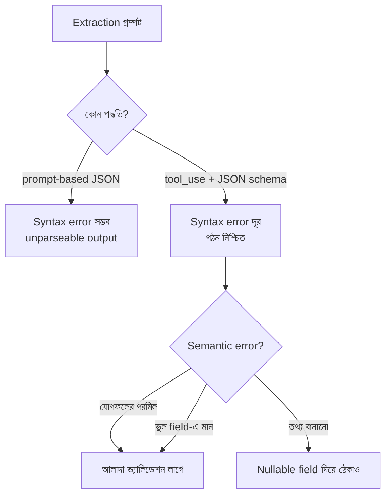

import ReadingProgress from '../../../../components/progress/ReadingProgress.astro';
import MarkComplete from '../../../../components/progress/MarkComplete.astro';
import KeywordTable from '../../../../components/content/KeywordTable.astro';
import ExamTrap from '../../../../components/content/ExamTrap.astro';
import BuildExercise from '../../../../components/content/BuildExercise.astro';
import Attribution from '../../../../components/content/Attribution.astro';

<ReadingProgress />

<div class="lesson-meta">
	<span class="lesson-badge">Domain 4</span>
	<span class="lesson-task">Task 4.3 · ওয়েট ২০%</span>
	<span class="lesson-source">মূল ইংরেজি: Structured Output with Tool Use</span>
</div>

## এই লেসনে যা জানতে হবে

Claude থেকে schema-মেনে চলা নিশ্চিত structured output চাইলে **নির্ভরতার ক্রম** মুখস্থ রাখুন:

1. **JSON schema-সহ `tool_use`** — JSON syntax error সম্পূর্ণ দূর করে।
2. **Prompt-based JSON** — মডেল malformed JSON বানাতে পারে।

পরীক্ষা এই ক্রমের উপরেই দাঁড়ায়। Tool use-এ টুলের JSON schema Claude-এর ফেরত ডেটার আকার বেঁধে দেয়; বন্ধনী হারানো, trailing comma বা unquoted key-র মতো syntax সমস্যা আর হয় না। আর `tool_choice` প্যারামিটারটিই মডেলকে tool call করতে বাধ্য করে। Prompt-based extraction (টেক্সট উত্তরে JSON লিখতে বলা) কোনো গঠন-নিশ্চয়তা দেয় না; production-এ মাঝেমধ্যেই unparseable আউটপুট দেবে।

## tool_choice-এর তিন মোড

`tool_choice` প্যারামিটার ঠিক করে মডেল tool call করবে কি না, আর কীভাবে করবে। পরীক্ষার জন্য তিনটি মোড চিনে রাখুন:

- **`"auto"` (ডিফল্ট):** মডেল নিজে সিদ্ধান্ত নেয় tool call করবে, নাকি টেক্সটে উত্তর দেবে। Extraction টুলের বদলে সে conversationally টেক্সটও ফেরাতে পারে। মডেলের সত্যিই কথোপকথনের স্বাধীনতা দরকার হলে এটি ব্যবহার করুন।
- **`"any"`:** মডেলকে tool call করতেই হবে, তবে কোন টুল তা সে বাছে। একাধিক extraction schema থাকলে (যেমন `extract_invoice`, `extract_receipt`, `extract_contract`) আর ডকুমেন্টের ধরন অজানা হলে এটি ব্যবহার করুন। নিশ্চিত structured output, টুল বাছার স্বাধীনতাও আছে।
- **`{"type": "tool", "name": "extract_metadata"}`:** মডেলকে হুবহু নির্দিষ্ট tool call করতে বাধ্য করে। বাধ্যতামূলক প্রথম ধাপ নিশ্চিত করতে ব্যবহার করুন — যেমন enrichment ধাপের আগে metadata extraction চালানো।

```typescript
// ডকুমেন্টের ধরন অজানা, কিন্তু structured output নিশ্চিত দরকার
const response = await client.messages.create({
  model: "claude-sonnet-5",
  max_tokens: 4096,
  tool_choice: { type: "any" },
  tools: [extractInvoiceTool, extractReceiptTool, extractContractTool],
  messages: [{ role: "user", content: documentText }]
});

// নির্দিষ্ট extraction ধাপ বাধ্য করা
const response = await client.messages.create({
  model: "claude-sonnet-5",
  max_tokens: 4096,
  tool_choice: { type: "tool", name: "extract_metadata" },
  tools: [extractMetadataTool],
  messages: [{ role: "user", content: documentText }]
});
```

`extract_metadata` এখানে আপনার নিজের বানানো টুল; নাম যা খুশি হতে পারে। `tool_choice` প্রতি request-এ কাজ করে, পুরো conversation জুড়ে নয়। বাধ্য করা কলটি ফেরার পর পরের request-এ `auto` দিন (বা প্যারামিটার বাদ দিন), নইলে মডেল আবার একই tool call করতে বাধ্য হবে — লুপ।

## tool_use যা ঠেকায় না

এখানেই পরীক্ষা চতুর হয়। JSON schema-সহ `tool_use` syntax error দূর করে, কিন্তু **semantic error** দূর করে না:

- **যোগফলের গরমিল** — line item-গুলোর যোগফল বলা মোটের সঙ্গে মেলে না।
- **ভুল field-এ মান** — মান ভুল field-এ বসে (দুটোই string হলে amount field-এ তারিখ বসে যাওয়া)।
- **Fabrication** — উৎস ডকুমেন্টে তথ্য নেই, তবু মডেল required field-এর জন্য মান বানিয়ে দেয়।

Schema গঠনের জামিন, সঠিকতার জামিন নয়। Semantic validation-এর জন্য বাড়তি লজিক লাগে (Task Statement 4.4)।



## প্রোডাকশনের জন্য Schema ডিজাইন

ভালো schema ডিজাইন গোটা শ্রেণির ভুল গঠন-স্তরেই ঠেকিয়ে দেয়:

**Optional/nullable field** — উৎস ডকুমেন্টে কোনো তথ্য না থাকতে পারলে field-টি optional বা nullable করুন। Fabrication ঠেকানোর প্রধান অস্ত্র এটিই। Field required থাকলে উৎসে কিছু না থাকলেও মডেল মান বানাতে চাপে; nullable হলে সৎভাবে `null` ফেরাতে পারে।

```json
{
  "type": "object",
  "properties": {
    "invoice_number": { "type": "string" },
    "vendor_name": { "type": "string" },
    "payment_terms": { "type": ["string", "null"] },
    "purchase_order": { "type": ["string", "null"] }
  },
  "required": ["invoice_number", "vendor_name"]
}
```

**"unclear" enum মান** — উৎস সত্যিই অস্পষ্ট হলে enum field-এ আলাদা `unclear` অপশন দিন। Evidence দ্ব্যর্থক থাকলেও মডেল জোর করে শ্রেণিবিন্যাস করবে না।

**"other" + detail string** — ক্যাটাগরি বাড়ানোর সুযোগ রাখতে `other` enum মানের সঙ্গে freeform detail string field রাখুন। আগে থেকে ঠিক করা ক্যাটাগরিতে না পড়া edge case এভাবে ধরা পড়ে।

```json
{
  "category": {
    "type": "string",
    "enum": ["invoice", "receipt", "contract", "unclear", "other"]
  },
  "category_detail": {
    "type": ["string", "null"],
    "description": "Freeform detail when category is 'other'"
  }
}
```

**Format normalisation rule** — Schema-র পাশাপাশি প্রম্পটে ফরম্যাট-নিয়ম দিন। Schema গঠন বাধে, প্রম্পট ফরম্যাটের সামঞ্জস্য বাধে — যেমন "All dates in ISO 8601 format", "All currency amounts as decimal numbers without currency symbols"।

## পরীক্ষার ফাঁদ

<ExamTrap>
	<p>
		<strong>JSON schema-সহ tool_use সব extraction ভুল ঠেকায় ভাবা</strong> — tool_use কেবল JSON syntax error ঠেকায়। যোগফলের গরমিল, ভুল field-এ মান, অনুপস্থিত তথ্যের বদলে বানানো মান — এসব semantic error এখনো হয়, আলাদা ভ্যালিডেশন লাগে।
	</p>
</ExamTrap>

<ExamTrap>
	<p>
		<strong>tool_choice <code>"auto"</code>-কে <code>"any"</code> ভেবে ফেলা</strong> — <code>auto</code> টুল না কল করে টেক্সট ফেরানোর স্বাধীনতা দেয়, তাই structured output-এর নিশ্চয়তা নেই। <code>any</code> tool call নিশ্চিত করে, তবে কোন টুল তা মডেল বাছে। ডকুমেন্টের ধরন অজানা কিন্তু নিশ্চিত structured output চাইলে <code>any</code>।
	</p>
</ExamTrap>

<ExamTrap>
	<p>
		<strong>ডেটার পূর্ণতার জন্য সব schema field required করা</strong> — Required field উৎসে তথ্য না থাকলে মডেলকে মান বানাতে চাপ দেয়। Optional/nullable field সৎভাবে <code>null</code> ফেরাতে দেয়, যা বিশ্বাসযোগ্য দেখতে বানানো মানের চেয়ে সবসময় ভালো।
	</p>
</ExamTrap>

<KeywordTable keywords={frontmatter.keywords} />

## প্র্যাকটিস সিনারিও (নিজে উত্তর ভাবুন, তারপর খুলুন)

> আপনার extraction সিস্টেম strict JSON schema-সহ tool_use ব্যবহার করে, যেখানে সব field required। পরীক্ষকেরা জানাচ্ছেন, যে ডকুমেন্টে তথ্য নেই সেখানে মডেল বিশ্বাসযোগ্য দেখতে তারিখ ও আর্থিক অঙ্ক বানিয়ে দিচ্ছে। সেরা সমাধান কোনটি?

<details>
	<summary>উত্তর দেখুন</summary>

	**সঠিক উত্তর:** উৎস ডকুমেন্টে তথ্য না থাকতে পারে এমন field-গুলো optional বা nullable করুন।

	**কেন বাকিগুলো ভুল:**

	- *tool_use ছেড়ে prompt-based JSON-এ যাওয়া* — গঠনের নিশ্চয়তা কমে, fabrication-এর সমস্যা তো থাকেই; নির্ভরতার ক্রম উল্টো দিকে।
	- *"কোনো মান বানাবে না" বলে প্রম্পটে নির্দেশ যোগ* — required field মডেলকে মান বানাতে চাপ দিতে থাকে, তাই কেবল নির্দেশে সমস্যা মেটে না; গঠনগত nullable field-ই আসল সমাধান।
	- *Extraction-পরবর্তী ভ্যালিডেশন ধাপ দিয়ে উৎসের সঙ্গে মিলিয়ে দেখা* — কাজে লাগে, কিন্তু এখানে মূল প্রতিরোধ নয়; nullable field-ই fabrication ঠেকানোর root-cause সমাধান, validation পরের স্তর।

</details>

<BuildExercise
	title="JSON Schema দিয়ে Structured Extraction টুল বানান"
	difficulty="Advanced"
	time="৪৫ মিনিট"
	objectives={[
		'অনুপস্থিত তথ্যের fabrication ঠেকাতে optional/nullable field সমৃদ্ধ JSON schema ডিজাইন',
		'tool_choice-এর তিন মোড (auto, any, forced) ও কখন কোনটি',
		'tool_use syntax error ঠেকায় কিন্তু semantic error নয় — পার্থক্য চেনা',
		'Schema প্যাটার্ন প্রয়োগ: unclear enum, other + detail string, format normalisation',
	]}
	steps={[
		{
			title: 'একটি extraction টুল define করুন JSON schema-সহ: ৩টি required field, ৩টি optional/nullable field, unclear ও other সহ একটি enum, আর other ক্যাটাগরির জন্য একটি detail string field।',
			why: 'Schema ডিজাইন সরাসরি fabrication ঠেকায়। তথ্য না থাকলে required field মডেলকে মান বানাতে চাপ দেয়; optional/nullable field সৎ null ফেরাতে দেয়।',
			expect: 'বৈধ JSON schema, যার required তালিকায় কেবল ৩টি সবসময়-উপস্থিত field; optional field-এ nullable type; enum-এ standard ক্যাটাগরির পাশে unclear ও other।',
		},
		{
			title: 'tool_choice auto দিয়ে পরীক্ষা করে দেখুন কোথায় মডেল টুল না কল করে টেক্সট ফেরায়।',
			why: 'পরীক্ষা auto, any আর forced-এর পার্থক্য ধরে। Auto মডেলকে কথোপকথনে উত্তর দিতে দেয়, তাই structured output নিশ্চিত নয়; এই failure mode নিজে দেখা দরকার।',
			expect: 'অন্তত একটি রেসপন্সে মডেল extraction টুল না ডেকে ডকুমেন্টের বিষয় গদ্যে বর্ণনা করে। এতেই বোঝা যায়, নিশ্চিত structured output দরকার হলে auto অনুপযুক্ত।',
		},
		{
			title: 'tool_choice any-তে বদলে যাচাই করুন মডেল সর্বদা tool call-ের মাধ্যমে structured output দেয়।',
			why: 'tool_choice any tool call নিশ্চিত করে, আর কোন টুল তা মডেলকে বাছতে দেয়। ডকুমেন্টের ধরন অজানা কিন্তু structured output নিশ্চিত চাইলে এটিই সঠিক সেটিং।',
			expect: 'প্রতিটি রেসপন্সে stop_reason = tool_use, এবং schema-মেনে বৈধ structured output-সহ tool call। কেবল টেক্সটে কোনো উত্তর নেই।',
		},
		{
			title: 'tool_choice {type: tool, name: extract_metadata} দিয়ে নির্দিষ্ট টুল বাধ্য করে দেখুন বাধ্যতামূলক extraction ধাপ চলে কি না।',
			why: 'Forced tool selection মডেলের সিদ্ধান্ত নির্বিশেষে বাধ্যতামূলক প্রথম ধাপ চালায়; metadata extraction-এর মতো ক্ষেত্রে পরীক্ষায় এটি ধরা হয়।',
			expect: 'রেসপন্স সবসময় হুবহু নির্দিষ্ট টুলটি কল করে, যদিও ডকুমেন্টের বিষয়বস্তু অন্য টুল যোগ্য মনে হতে পারে। টুল বাছার স্বাধীনতা শূন্য।',
		},
		{
			title: '৫টি ডকুমেন্ট (৩টি পূর্ণ তথ্যসহ, ২টিতে field অনুপস্থিত) প্রসেস করে দেখুন nullable field বানানো মানের বদলে null ফেরায় কি না।',
			why: 'এটিই schema ডিজাইনের সবচেয়ে জরুরি নীতি যাচাই করে: optional/nullable field fabrication ঠেকায়।',
			expect: '৩টি পূর্ণ ডকুমেন্টে সব field সঠিক মানে ভরে; ২টিতে অনুপস্থিত তথ্যের nullable field null ফেরায়, বানানো তারিখ/অঙ্ক/identifier নয়।',
		},
	]}
/>

## সূত্র

<ul>
	{frontmatter.sources.map((source) => (
		<li>
			<a href={source.href} target="_blank" rel="noopener noreferrer">
				{source.label}
			</a>
			{source.note ? ` — ${source.note}` : ''}
		</li>
	))}
</ul>

<Attribution sourceUrl={frontmatter.sourceUrl} updated={frontmatter.updated} />

<MarkComplete lessonId="4-3" />
