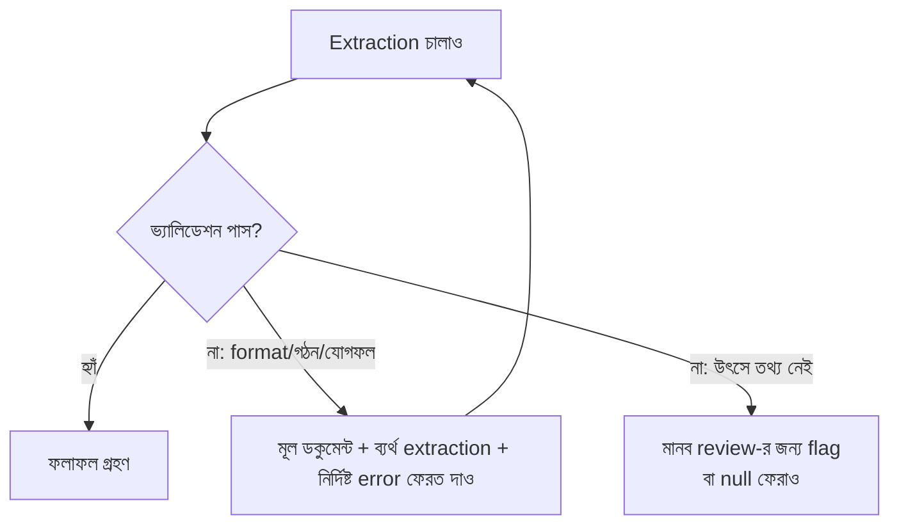

import ReadingProgress from '../../../../components/progress/ReadingProgress.astro';
import MarkComplete from '../../../../components/progress/MarkComplete.astro';
import KeywordTable from '../../../../components/content/KeywordTable.astro';
import ExamTrap from '../../../../components/content/ExamTrap.astro';
import BuildExercise from '../../../../components/content/BuildExercise.astro';
import Attribution from '../../../../components/content/Attribution.astro';

<ReadingProgress />

<div class="lesson-meta">
	<span class="lesson-badge">Domain 4</span>
	<span class="lesson-task">Task 4.4 · ওয়েট ২০%</span>
	<span class="lesson-source">মূল ইংরেজি: Validation, Retry, and Feedback Loops</span>
</div>

## এই লেসনে যা জানতে হবে

Production extraction সিস্টেম ব্যর্থ হয়। ডকুমেন্ট আসে অপ্রত্যাশিত ফরম্যাটে, সংখ্যার যোগ মেলে না, আর মান ভুল field-এ গিয়ে বসে। প্রশ্নটি "ব্যর্থতা হয় কি না" নয় — "ব্যর্থতা ঘটলে সিস্টেম কীভাবে সাড়া দেয়"। Validation-retry প্যাটার্ন সেই ব্যর্থতাকে স্বয়ং-সংশোধনকারী flow-তে বদলায়।

## Error Feedback-সহ রিট্রাই

সঠিক রিট্রাই প্যাটার্ন মডেলকে তিনটি তথ্য ফেরত পাঠায়:

- **মূল ডকুমেন্ট** — যাতে মডেল আবার উৎস দেখতে পারে।
- **ব্যর্থ extraction** — যাতে মডেল নিজে কী বানিয়েছিল দেখতে পারে।
- **নির্দিষ্ট ভ্যালিডেশন error** — যাতে মডেল হুবহু জানে কোথায় ভুল হয়েছে।

```typescript
// error feedback-সহ রিট্রাই
const retryMessages = [
  {
    role: "user",
    content: `Original document:\n${originalDocument}\n\n` +
      `Your extraction:\n${JSON.stringify(failedExtraction)}\n\n` +
      `Validation error: Line items sum to £450 but stated_total is £500. ` +
      `Please re-extract, ensuring all line items are captured.`
  }
];
```

এটি naive রিট্রাইকে অনেক পিছনে ফেলে। নির্দিষ্ট error ছাড়া মডেলের হাতে সংশোধনের কোনো দিশা থাকে না, আর সাধারণত একই ভুল আবার করে। Error থাকলে মডেল লক্ষ্যভিত্তিক সংশোধন করতে পারে: বাদ পড়া line item আবার খোঁজা, field মেলানো, মোট আবার হিসাব করা।

## রিট্রাইর কার্যকারিতার সীমা

এই টাস্ক স্টেটমেন্টে পরীক্ষা এই ধারণাটিই সবচেয়ে জোর দিয়ে ধরে। রিট্রাইর স্পষ্ট সীমা আছে:

**রিট্রাই কাজ করে যখন:**

- Format mismatch (ভুল তারিখ ফরম্যাট, অসামঞ্জস্যপূর্ণ currency notation)
- Structural output error (ভুল field-এ মান, ভুল nesting)
- Misplaced value (ডকুমেন্টে তথ্য আছে, কিন্তু ভুল field-এ নেমেছে)
- Mathematical error (মডেল একটি line item ছাড়িয়ে গেছে, তাই মোট মিলছে না)

**রিট্রাই কাজ করে না যখন:**

- উৎস ডকুমেন্টে তথ্যটি আদৌ নেই
- তথ্য কেবল বাইরের এমন এক ডকুমেন্টে আছে, যা মডেলকে দেওয়া হয়নি
- Field পূরণে এমন জ্ঞান দরকার, যা মডেলের নেই

পরীক্ষা দুটো পরিস্থিতিই দেয়, আর আশা করে আপনি ঠিক করবেন কোনটি সারানো সম্ভব। ডকুমেন্টে সত্যিই department name না থাকলে হাজার রিট্রাইয়েও সঠিক মান আসবে না। তখন extraction-টি মানব review-র জন্য flag করুন, বা schema অনুমতি দিলে `null` ফেরান।

## Self-Correction Flow ডিজাইন

কেবল বাইরের ভ্যালিডেশন লজিকের উপর নির্ভর না করে extraction schema-তেই self-correction বসানো যায়:

**`calculated_total` বনাম `stated_total`** — Line item-গুলো থেকে মডেলের হিসাব করা যোগফল, আর ডকুমেন্টে লেখা মোট, দুটোই extract করুন। এরা অমিল হলে বাইরের লজিক ছাড়াই স্বয়ংক্রিয় discrepancy ধরা পড়ে।

```json
{
  "line_items": [
    { "description": "Widget A", "amount": 150.00 },
    { "description": "Widget B", "amount": 300.00 }
  ],
  "calculated_total": 450.00,
  "stated_total": 500.00,
  "total_discrepancy": true
}
```

**`conflict_detected` boolean** — উৎস ডকুমেন্টে পরস্পরবিরোধী তথ্য থাকলে boolean field দিয়ে চিহ্নিত করুন। যেমন এক অংশে "payment due: 30 days", অন্য অংশে "payment terms: net 60" — মডেল দুটোই extract করে `conflict_detected: true` দেবে, চুপচাপ একটি বেছে নেবে না।

**`detected_pattern` field** — Code review ও analysis pipeline-এর structured finding-এ `detected_pattern` যোগ করুন। কোন নির্দিষ্ট code construct প্রতিটি finding ট্রিগার করল, তা এতে লিপিবদ্ধ হয়।

```json
{
  "finding": "Potential SQL injection vulnerability",
  "severity": "critical",
  "detected_pattern": "string concatenation in SQL query",
  "file": "user_service.py",
  "line": 42
}
```

ডেভেলপাররা finding খারিজ করলে `detected_pattern` অনুযায়ী খারিজের ধরন বিশ্লেষণ করা যায়। "variable shadowing in nested scope" pattern-এর finding ডেভেলপাররা ধারাবাহিকভাবে খারিজ করলে বোঝা যায়, ওই pattern-এর prompt ভালো করা দরকার। এভাবে একটি পদ্ধতিগত উন্নতি-লুপ তৈরি হয়: extract করুন, validate করুন, খারিজের ডেটা জমা করুন, prompt ঠিক করুন, আবার চালান।



## Schema Syntax Error বনাম Semantic Validation Error

পরীক্ষা দুই শ্রেণির error আলাদা করে:

- **Schema syntax error** — malformed JSON, required field অনুপস্থিত, ভুল data type। JSON schema-সহ `tool_use` এগুলো সম্পূর্ণ দূর করে (Task Statement 4.3)।
- **Semantic validation error** — JSON গঠন ঠিক, কিন্তু মান ভুল। Line item-এর যোগফল মেলে না, তারিখের ক্রম উল্টো, মান ভুল field-এ। এগুলো schema-র বাইরে ভ্যালিডেশন লজিক দাবি করে, আর রিট্রাই লুপের মূল কাজ এখানেই।

দুই টাস্ক স্টেটমেন্টের এই মিল ইচ্ছাকৃত: পরীক্ষা দেখে আপনি বোঝেন কি না যে `tool_use` প্রথম শ্রেণি মেটায়, দ্বিতীয়টি নয়।

## ভ্যালিডেশন স্তর হিসেবে Pydantic

পরীক্ষার গাইড এই টাস্ক স্টেটমেন্টের hands-on exercise-এ JSON Schema-র পাশে Pydantic-এর নাম ধরে: "when Pydantic or JSON schema validation fails, send a follow-up request including the document, the failed extraction, and the specific validation error." Python pipeline-এ Pydantic-ই "validation failed"-কে সেই নির্দিষ্ট, field-ভিত্তিক error message-এ বদলায়, যা রিট্রাই লুপের দরকার।

Pydantic model একসঙ্গে দুটি কাজ করে। Parsing গঠন বাধে — type, required field, enum। Validator semantics বাধে — যে নিয়ম JSON schema-তে লেখা যায় না, যেমন cross-field arithmetic বা তারিখের ক্রম। দুই ধরনের ব্যর্থতাই একটি `ValidationError`-এ দেখা যায়, আর machine-readable error field ও ভাঙা নিয়মের নাম দেয়:

```python
import json
from pydantic import BaseModel, ValidationError, model_validator

class LineItem(BaseModel):
    description: str
    amount: float

class Invoice(BaseModel):
    line_items: list[LineItem]
    stated_total: float

    @model_validator(mode="after")
    def totals_must_match(self):
        calculated = round(sum(i.amount for i in self.line_items), 2)
        if abs(calculated - self.stated_total) > 0.01:
            raise ValueError(
                f"line items sum to {calculated} but stated_total is {self.stated_total}"
            )
        return self

try:
    invoice = Invoice.model_validate(tool_input)  # response-এর tool_use input
except ValidationError as e:
    errors = "\n".join(
        f"{'.'.join(map(str, err['loc'])) or 'invoice'}: {err['msg']}" for err in e.errors()
    )
    retry_message = (
        f"Original document:\n{original_document}\n\n"
        f"Your extraction:\n{json.dumps(tool_input)}\n\n"
        f"Validation errors:\n{errors}\n\n"
        f"Please re-extract, fixing the identified errors."
    )
```

`except` শাখাটিই এই লেসনের শুরুর retry-with-error-feedback প্যাটার্ন — Pydantic কেবল তৃতীয় উপাদানটি (নির্দিষ্ট error) এমন ফরম্যাটে দেয়, যা সোজা প্রম্পটে বসানো যায়। রিট্রাইর সীমা এখানেও অপরিবর্তিত: উৎস ডকুমেন্টে তথ্য না থাকায় validator ফেল করলে সেটি রিট্রাই নয়, মানব review।

## পরীক্ষার ফাঁদ

<ExamTrap>
	<p>
		<strong>Extraction ব্যর্থ হলে রিট্রাই সবসময় কাজ করে ধরে নেওয়া</strong> — রিট্রাই format mismatch, structural error ও misplaced value সারায়; উৎসে সত্যিই না-থাকা তথ্য বানাতে পারে না। পরীক্ষা সারানো-যায় আর সারানো-যায়-না — দুটোই দেয়।
	</p>
</ExamTrap>

<ExamTrap>
	<p>
		<strong>নির্দিষ্ট ভ্যালিডেশন error না দিয়ে রিট্রাই চালানো</strong> — Error feedback ছাড়া naive রিট্রাই একই ভুল আবার করে। মডেলকে হুবহু দেখাতে হয় কী ভুল (যেমন "line items sum to £450 but stated total is £500"), তবেই লক্ষ্যভিত্তিক সংশোধন সম্ভব।
	</p>
</ExamTrap>

<ExamTrap>
	<p>
		<strong>Semantic check ছাড়া কেবল schema validation-এ ভরসা</strong> — Schema validation (tool_use-এর মাধ্যমে) syntax error ধরে; ভুল যোগফল, ভুল field-এ মান, বানানো ডেটার জন্য ভ্যালিডেশন লজিক ও রিট্রাই লুপ লাগে।
	</p>
</ExamTrap>

<ExamTrap>
	<p>
		<strong>tool_use JSON schema বাধলে Pydantic বাহুল্য ভাবা</strong> — Schema cross-field semantic নিয়ম লিখতে পারে না — যোগফল মেলানো, তারিখের ক্রম বজায় রাখা। Pydantic validator সেই নিয়ম লিখে field-ভিত্তিক নির্দিষ্ট error দেয়, যা রিট্রাই লুপ মডেলকে ফেরত দেয়।
	</p>
</ExamTrap>

<KeywordTable keywords={frontmatter.keywords} />

## প্র্যাকটিস সিনারিও (নিজে উত্তর ভাবুন, তারপর খুলুন)

> আপনার extraction pipeline যাচাই করে line item-এর অঙ্কগুলোর যোগফল ডকুমেন্টে লেখা মোটের সঙ্গে মেলে কি না। ডকুমেন্ট A-তে হিসাব করা যোগফল £450, কিন্তু লেখা মোট £500। ডকুমেন্ট B-তে উৎস টেক্সটে 'department' field একেবারেই নেই। সঠিক রিট্রাই কৌশল কোনটি?

<details>
	<summary>উত্তর দেখুন</summary>

	**সঠিক উত্তর:** ডকুমেন্ট A যোগফলের discrepancy error দিয়ে রিট্রাই করুন; ডকুমেন্ট B মানব review-র জন্য flag করুন, কারণ তথ্যটি উৎসে নেই।

	**কেন বাকিগুলো ভুল:**

	- *দুটোই ভ্যালিডেশন error দিয়ে রিট্রাই করা* — A-এর যোগফল সারানো সম্ভব, কিন্তু B-এর অনুপস্থিত তথ্য কোনো রিট্রাইতে আসবে না।
	- *দুটোই রিট্রাই বাদ দিয়ে সব মানব review-তে পাঠানো* — A সারানো-যায় এমন ভুল, নিরর্থক মানুষকে বোঝা চাপানো।
	- *একই prompt দিয়ে দুটোই আবার চালানো* — নির্দিষ্ট error ছাড়া naive রিট্রাই; A-তেও হুবহু ভুল ফেরার সম্ভাবনা।

</details>

<BuildExercise
	title="ডকুমেন্ট Extraction-এর জন্য Validation-Retry লুপ বানান"
	difficulty="Advanced"
	time="৬০ মিনিট"
	objectives={[
		'Retry-with-error-feedback প্যাটার্ন প্রয়োগ: মূল ডকুমেন্ট + ব্যর্থ extraction + নির্দিষ্ট ভ্যালিডেশন error',
		'সারানো-যায় এমন error (format, গঠন, গণিত) আর না-সারানো error (তথ্য অনুপস্থিত) আলাদা করা',
		'calculated_total বনাম stated_total ও conflict_detected boolean দিয়ে self-correction schema ডিজাইন',
		'detected_pattern field ও খারিজ-ট্র্যাকিং দিয়ে পদ্ধতিগত উন্নতি-লুপ বানানো',
		'Schema syntax error (tool_use দিয়ে দূর) আর semantic validation error (রিট্রাই দরকার) — সীমারেখা বোঝা',
	]}
	steps={[
		{
			title: 'একটি extraction টুল define করুন: calculated_total ও stated_total field, একটি conflict_detected boolean, আর প্রতিটি finding-এ detected_pattern field।',
			why: 'calculated_total বনাম stated_total-এর মতো self-correction field বাইরের লজিক ছাড়াই discrepancy ধরে; conflict_detected ও detected_pattern পদ্ধতিগত prompt উন্নতির ভিত্তি গড়ে।',
			expect: 'JSON schema-তে আলাদা calculated_total ও stated_total number field, একটি total_discrepancy boolean, একটি conflict_detected boolean, আর line_items array-র প্রতিটি finding-এ একটি detected_pattern string field।',
		},
		{
			title: 'ভ্যালিডেশন লজিক লিখুন: field পূর্ণতা, সংখ্যার সামঞ্জস্য (যোগফল লেখা মোটের সঙ্গে মেলে), enum বৈধতা এবং তারিখের ক্রম যাচাই করুন।',
			why: 'Semantic validation tool_use যা পারে না, তা ধরে; পরীক্ষা schema syntax error (tool_use দূর করে) আর semantic error (ভুল যোগফল, ভুল field-এ মান) আলাদা করে দেখে।',
			expect: 'একটি ভ্যালিডেশন ফাংশন, যা নির্দিষ্ট, কার্যকর error message-এর array ফেরায়; প্রতিটি error বলে কী আশা করা হয়েছিল আর কী পাওয়া গেছে — কেবল "validation failed" নয়।',
		},
		{
			title: 'রিট্রাই লুপ বানান: ভ্যালিডেশন ফেল করলে মূল ডকুমেন্ট, ব্যর্থ extraction আর নির্দিষ্ট ভ্যালিডেশন error নিয়ে পরের message গড়ুন।',
			why: 'Error feedback-সহ রিট্রাই naive রিট্রাইয়ের চেয়ে অনেক ভালো; error না থাকলে মডেলের দিশা থাকে না, আর সাধারণত একই ভুল ফেরে।',
			expect: 'রিট্রাই message-এ তিনটি উপাদানই: মূল ডকুমেন্ট টেক্সট, ব্যর্থ extraction-এর JSON, আর নির্দিষ্ট ভ্যালিডেশন error string। রিট্রাইতে মডেল সংশোধিত extraction দেয়।',
		},
		{
			title: '৫টি ডকুমেন্টে পরীক্ষা করুন: ২টিতে সারানো-যায় এমন error (ভুল field-এ মান, ভুল মোট), ৩টিতে না-সারানো error (তথ্য অনুপস্থিত) — দেখুন লুপ কেবল সারানো-যায় কেসে রিট্রাই করে।',
			why: 'রিট্রাইর কার্যকারিতার সীমা এই টাস্ক স্টেটমেন্টে সবচেয়ে জোর দিয়ে পরীক্ষিত; রিট্রাই উৎসে না-থাকা তথ্য বানাতে পারে না।',
			expect: '২টি সারানো-যায় ডকুমেন্ট ১–২ রিট্রাইয়ের পর সঠিক মোট বা field অবস্থানে সফল হয়; ৩টিতে অনুপস্থিত তথ্য শনাক্ত করে রিট্রাই না করে মানব review-র জন্য flag করা হয়।',
		},
		{
			title: 'প্রতিটি finding-এর detected_pattern ডেটা লগ করে কোন pattern সবচেয়ে বেশি খারিজ হয় তা বিশ্লেষণ করুন, আর prompt সংশোধনের অগ্রাধিকার ঠিক করুন।',
			why: 'detected_pattern field পদ্ধতিগত উন্নতি-লুপ তৈরি করে; নির্দিষ্ট pattern-এর finding নিয়মিত খারিজ হলে ওই pattern-এর prompt ভালো করা দরকার।',
			expect: 'প্রতিটি detected_pattern, তার frequency, খারিজের হার আর prompt সংশোধনের অগ্রাধিকারভিত্তিক তালিকা সম্বলিত লগ বা টেবিল; বেশি খারিজ-হারের pattern শীর্ষে।',
		},
	]}
/>

## সূত্র

<ul>
	{frontmatter.sources.map((source) => (
		<li>
			<a href={source.href} target="_blank" rel="noopener noreferrer">
				{source.label}
			</a>
			{source.note ? ` — ${source.note}` : ''}
		</li>
	))}
</ul>

<Attribution sourceUrl={frontmatter.sourceUrl} updated={frontmatter.updated} />

<MarkComplete lessonId="4-4" />
