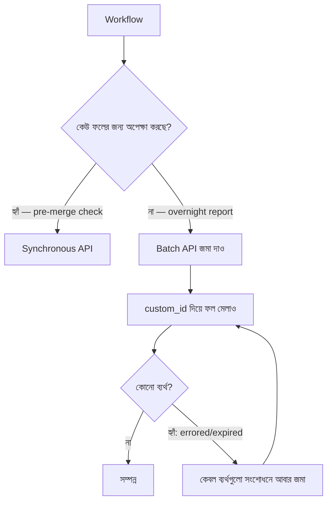

import ReadingProgress from '../../../../components/progress/ReadingProgress.astro';
import MarkComplete from '../../../../components/progress/MarkComplete.astro';
import KeywordTable from '../../../../components/content/KeywordTable.astro';
import ExamTrap from '../../../../components/content/ExamTrap.astro';
import BuildExercise from '../../../../components/content/BuildExercise.astro';
import Attribution from '../../../../components/content/Attribution.astro';

<ReadingProgress />

<div class="lesson-meta">
	<span class="lesson-badge">Domain 4</span>
	<span class="lesson-task">Task 4.5 · ওয়েট ২০%</span>
	<span class="lesson-source">মূল ইংরেজি: Batch Processing Strategies</span>
</div>

## এই লেসনে যা জানতে হবে

Message Batches API একটি cost optimisation হাতিয়ার, যার কড়া সীমা আছে — আর পরীক্ষা সরাসরি সেই সীমাগুলো ধরে। কখন এটি ব্যবহার করবেন, আর কখন করবেন না — এই টাস্ক স্টেটমেন্টের মূল কথা সেটাই।

## Message Batches API: তথ্য

সীমাগুলো অনড়; ডিজাইন করতে হবে সেগুলোকে মাথায় রেখে:

- **৫০% খরচ সাশ্রয়** — synchronous API কলের তুলনায়।
- **সর্বোচ্চ ২৪ ঘণ্টার প্রসেসিং window** — ফল কয়েক মিনিটেই আসতে পারে, আবার ২৪ ঘণ্টা লাগতে পারে।
- **কোনো latency SLA নেই** — নির্দিষ্ট সময়ের মধ্যে ফল আসবে বলে ভরসা করা যায় না।
- **একটি batch request-এ multi-turn tool calling নেই** — মডেল mid-request টুল চালিয়ে ফল নিয়ে কাজ চালিয়ে যেতে পারে না।
- **`custom_id` field** — request-response জোড়া মেলানোর জন্য প্রতিটি request-এ অনন্য identifier।

## মেলানোর নিয়ম

এই টাস্ক স্টেটমেন্টের সবচেয়ে বেশি পরীক্ষিত ধারণা:

- **Synchronous API:** যেখানে কেউ বা কিছু ফলের জন্য অপেক্ষা করছে — CI/CD-র pre-merge check, real-time code review feedback, ডেভেলপারের আটকে থাকা যেকোনো workflow।
- **Batch API:** যেখানে latency সওয়া যায়, ফল পরে খাওয়া হয় — overnight technical debt report, সাপ্তাহিক code audit summary, রাতের test generation, batch document extraction।

পরীক্ষায় (sample question 11) এমন পরিস্থিতি আসে যেখানে ম্যানেজার খরচ বাঁচাতে সব কিছু batch-এ নেওয়ার প্রস্তাব দেন। সঠিক উত্তর: blocking workflow synchronous রাখুন, কেবল latency-tolerant workflow batch-এ নিন।

```typescript
// Synchronous — ডেভেলপার এটির জন্য অপেক্ষা করছেন
const preMergeReview = await client.messages.create({
  model: "claude-sonnet-5",
  max_tokens: 4096,
  messages: [{ role: "user", content: prDiffContent }]
});

// Batch — ফল আগামীকাল সকালে খাওয়া হবে
const batchRequest = await client.messages.batches.create({
  requests: technicalDebtDocuments.map((doc, i) => ({
    custom_id: `debt-report-${i}`,
    params: {
      model: "claude-sonnet-5",
      max_tokens: 4096,
      messages: [{ role: "user", content: doc }]
    }
  }))
});
```

## SLA হিসাব

Batch schedule ডিজাইনে ২৪ ঘণ্টার সর্বোচ্চ প্রসেসিং window মাথায় রাখতেই হবে। যদি প্রতিষ্ঠানের একটি রিপোর্টের জন্য ৩০ ঘণ্টার SLA লাগে:

- ২৪ ঘণ্টা **সর্বোচ্চ window, delivery guarantee নয়**। তার মধ্যে শেষ না হলে batch `expired` হয়ে ফেরে; তাই schedule-টি এই worst case ধরে করুন, আর `expired` batch-কে আবার জমা দেওয়ার মতো ব্যর্থতা ধরুন।
- ৩০ ঘণ্টার SLA − ২৪ ঘণ্টার worst case = **৬ ঘণ্টা buffer** — request জমানো, input যাচাই করা বা operational দেরি সামলানোর জন্য।
- সেই buffer window-এ **প্রতি ৪ ঘণ্টায় batch জমা দিন**, যাতে সবসময় একটি fresh batch উড়ছে। ৬ ঘণ্টার cadence-এ কোনো মার্জিনই থাকে না।

পরীক্ষায় scheduling প্রশ্ন আসতে পারে, যেখানে SLA থেকে পিছনে হিসাব করে জমা দেওয়ার ছন্দ বের করতে হয়।

## Batch Failure Handling

Batch-এর সব ডকুমেন্ট সফল হয় না। সঠিক failure handling-এ তিনটি ধাপ:

1. **`custom_id` দিয়ে ব্যর্থগুলো চিহ্নিত করুন।** প্রতিটি request-এর অনন্য identifier থেকে batch result parse করে কোন `custom_id` ব্যর্থ হয়েছে বের করুন।
2. **কেবল ব্যর্থগুলো সংশোধন করে আবার জমা দিন।** পুরো batch আবার জমা দেবেন না। সাধারণ সংশোধন:
   - context limit ছাড়ানো বড় ডকুমেন্ট chunk-এ ভাগ করা
   - অদ্ভুত গঠনের ডকুমেন্টের জন্য extraction prompt সরল করা
   - গঠন-বৈচিত্র্যে ব্যর্থ ডকুমেন্টের জন্য format-specific few-shot উদাহরণ যোগ করা
3. **Batch চালানোর আগেই sample set-এ prompt ঠিক করুন।** এটিই proactive ধাপ, যা first-pass success বাড়ায় আর resubmission খরচ কমায়। পুরো batch চালানোর আগে প্রতিনিধিত্বমূলক sample-এ (৫–১০টি ডকুমেন্ট, ফরম্যাট ও edge case-এর বিস্তার ধরে) প্রম্পট পরীক্ষা করুন।

```typescript
// ফল পড়ার আগে batch শেষ হওয়া পর্যন্ত poll করুন
let batch = await client.messages.batches.retrieve(batchId);
while (batch.processing_status !== "ended") {
  await new Promise(r => setTimeout(r, 60_000));
  batch = await client.messages.batches.retrieve(batchId);
}

// results() একটি JSONL async iterable ফেরায়, array নয় — জমা করে নিন।
// expired-কেও ব্যর্থতা ধরুন: সময় ছাড়ানো batch এভাবেই ফেরে।
const failedIds: string[] = [];
for await (const result of client.messages.batches.results(batchId)) {
  if (result.result.type === "errored" || result.result.type === "expired") {
    failedIds.push(result.custom_id);
  }
}

// কেবল ব্যর্থগুলো সংশোধন করে আবার জমা দিন
const retryRequests = failedIds.map(id => {
  const originalDoc = documentsById[id];
  return {
    custom_id: `${id}-retry-1`,
    params: {
      model: "claude-sonnet-5",
      max_tokens: 8192, // বড় ডকুমেন্টের জন্য বাড়ানো
      messages: [{
        role: "user",
        content: chunkIfNeeded(originalDoc)
      }]
    }
  };
});
```

## Multi-Turn Tool Calling-এর সীমা

Batch API একটি request-এর ভেতরে multi-turn tool calling সমর্থন করে না। অর্থাৎ আপনি করতে পারবেন না:

- টুল define করে মডেলকে mid-request সেটি কল করানো
- Tool result প্রসেস করে একই batch item-এর ভেতরে কথোপকথন চালিয়ে যাওয়া
- একটি batch request-এ agentic loop চালানো

Workflow-এ mid-processing টুল চলানো দরকার হলে synchronous API ব্যবহার করতেই হবে। এই সীমাটি সরাসরি পরীক্ষার বিষয় — batch workflow-এ প্রসেসিংয়ের মাঝে বাইরের টুল কল দরকার হলে সেই ধাপের সঠিক উত্তর synchronous API।

## Batch জমার আগে Prompt Optimisation

সবচেয়ে খরচ-সাশ্রয়ী batch কৌশল হলো বড় ভলিউম জমা দেওয়ার আগে prompt refinement-এ সময় ঢালা:

- **Sample set test:** Batch-এ থাকা ফরম্যাট, edge case ও ডকুমেন্ট-ধরনের বিস্তার ধরে ৫–১০টি প্রতিনিধিত্বমূলক ডকুমেন্ট নিন।
- **Sample-এ iterate করুন:** Extraction prompt ঠিক করুন, few-shot উদাহরণ যোগ করুন, schema ডিজাইন বদলান — যতক্ষণ না sample-এ উচ্চ নির্ভুলতা আসে।
- **পুরো batch জমা দিন:** ঠিক করা প্রম্পটে first-pass success হার অনেক বাড়ে।
- **ব্যর্থতা সামলান:** কেবল ব্যর্থ ডকুমেন্ট লক্ষ্যভিত্তিক সংশোধনে আবার জমা দিন।

এই workflow মোট খরচ কমায়। ১,০০০ ডকুমেন্টে ৯০% first-pass success মানে কেবল ১০০ রিট্রাই। ৬০% first-pass মানে ৪০০ রিট্রাই — resubmission খরচ চার গুণ, তার উপর সেই রিট্রাইগুলোর batch প্রসেসিং খরচ।



## পরীক্ষার ফাঁদ

<ExamTrap>
	<p>
		<strong>খরচ বাঁচাতে সব workflow batch-এ নিয়ে যাওয়া</strong> — ডেভেলপাররা যেখানে ফলের জন্য অপেক্ষা করে (pre-merge check, real-time review), সেই blocking workflow synchronous থাকতেই হবে। Batch API-তে কোনো latency SLA নেই, ২৪ ঘণ্টা পর্যন্ত লাগতে পারে; কেবল latency-tolerant workflow batch-এ যাবে।
	</p>
</ExamTrap>

<ExamTrap>
	<p>
		<strong>ফল সাধারণত দ্রুত আসে বলে batch দ্রুত আসবে ধরে নেওয়া</strong> — Batch API-তে কোনো latency SLA নেই। ফল অনেক সময় ২৪ ঘণ্টার কমে আসে, কিন্তু blocking workflow সেই best-case সময় ধরে ডিজাইন করা যায় না; ২৪ ঘণ্টার সর্বোচ্চটাই ধরুন।
	</p>
</ExamTrap>

<ExamTrap>
	<p>
		<strong>Multi-turn tool calling দরকার এমন workflow-এ batch API ব্যবহার</strong> — Batch API একটি request-এর ভেতরে multi-turn tool calling সমর্থন করে না। প্রসেসিংয়ের মাঝে টুল চালিয়ে ফল ব্যবহার করতে হলে synchronous API লাগবে।
	</p>
</ExamTrap>

<KeywordTable keywords={frontmatter.keywords} />

## প্র্যাকটিস সিনারিও (নিজে উত্তর ভাবুন, তারপর খুলুন)

> আপনার দল API খরচ কমাতে চায়। দুই workflow: (১) বাধ্যতামূলক pre-merge check, যা ডেভেলপার merge করার আগে শেষ হতেই হবে; (২) রাতভর তৈরি হওয়া technical debt report, যা পরদিন সকালে দেখা হবে। ম্যানেজার ৫০% সাশ্রয়ের জন্য দুটোই Message Batches API-তে নেওয়ার প্রস্তাব দিচ্ছেন। আপনি কীভাবে বিচার করবেন?

<details>
	<summary>উত্তর দেখুন</summary>

	**সঠিক উত্তর:** Technical debt report কেবল batch-এ নিন; pre-merge check real-time (synchronous) রাখুন।

	**কেন বাকিগুলো ভুল:**

	- *দুটোই batch-এ, সময় বেশি লাগলে real-time fallback* — fallback জটিলতা বাড়ায়, আর blocking কাজ batch-এর ২৪ ঘণ্টার অনিশ্চয়তার উপর ছাড়া যায় না।
	- *ফল ordering সমস্যা এড়াতে দুটোই real-time রাখা* — Latency-tolerant কাজেও অকারণে খরচ বাড়ে; problem statement-এ ordering সমস্যা নেই।
	- *দুটোই batch-এ, status polling দিয়ে অগ্রগতি* — Polling blocking সমস্যা মেটায় না; ডেভেলপার তবু ২৪ ঘণ্টা পর্যন্ত আটকে থাকতে পারে।

</details>

<BuildExercise
	title="Batch প্রসেসিং স্ট্র্যাটেজি ডিজাইন করুন"
	difficulty="Advanced"
	time="৪৫ মিনিট"
	objectives={[
		'Latency-চাহিদা দেখে workflow-কে blocking (synchronous) বা latency-tolerant (batch-eligible) ভাগ করা',
		'custom_id field দিয়ে Message Batches API-তে request-response মেলানো',
		'কেবল ব্যর্থ ডকুমেন্ট লক্ষ্যভিত্তিক সংশোধনে আবার জমা দেওয়ার failure handling',
		'২৪ ঘণ্টার window ধরে SLA অনুযায়ী জমা দেওয়ার ছন্দ হিসাব করা',
		'পুরো batch-এর আগে sample set-এ prompt refinement প্রয়োগ করা',
	]}
	steps={[
		{
			title: 'একটি কল্পিত প্রতিষ্ঠানের ৫টি workflow তালিকাভুক্ত করে প্রতিটি blocking (synchronous) বা latency-tolerant (batch-eligible) হিসেবে কারণসহ ভাগ করুন।',
			why: 'Synchronous বনাম batch-এর মেলানোর নিয়ম এই টাস্ক স্টেটমেন্টে সবচেয়ে বেশি পরীক্ষিত; ম্যানেজারের "সব batch-এ" প্রস্তাবে কোন workflow ২৪ ঘণ্টা সইতে পারে না, তা ধরতে হয়।',
			expect: '৫টি workflow-এর টেবিল, প্রতিটির স্পষ্ট শ্রেণি ও কারণ। Blocking workflow-এ কেউ বা কিছু ফলের জন্য অপেক্ষা করে; batch-eligible workflow ফল পরে খায়, real-time নির্ভরতা নেই।',
		},
		{
			title: '২০টি ডকুমেন্টের একটি batch submission Message Batches API ফরম্যাটে define করুন, প্রতিটিতে অনন্য custom_id field।',
			why: 'custom_id-ই batch ফলে request-response জোড়া মেলানোর উপায়। অনন্য identifier ছাড়া কোন ডকুমেন্ট সফল বা ব্যর্থ, তা জানা যায় না; failure handling অসম্ভব হয়ে পড়ে।',
			expect: '২০টি entry-র বৈধ batch request object, প্রতিটিতে অনন্য custom_id, model, max_tokens আর ডকুমেন্টসহ messages array।',
		},
		{
			title: 'Failure handling লিখুন: batch result parse করুন, custom_id দিয়ে ব্যর্থ শনাক্ত করুন, আর বাড়ানো max_tokens-সহ কেবল ব্যর্থ ডকুমেন্ট নিয়ে retry batch বানান।',
			why: 'কেবল ব্যর্থগুলো লক্ষ্যভিত্তিক সংশোধনে আবার জমা দেওয়াই সঠিক batch failure প্যাটার্ন; পুরো batch আবার দিলে সফল ডকুমেন্টেও খরচ নষ্ট হয়।',
			expect: 'একটি failure handler, যা error status দেখে ফল ছেঁকে ব্যর্থগুলোর custom_id বের করে, মূল ডকুমেন্ট খুঁজে এনে বাড়ানো max_tokens বা chunked content-সহ retry batch বানায়।',
		},
		{
			title: '২৪ ঘণ্টার সর্বোচ্চ window ধরে ৩০ ঘণ্টার SLA নিশ্চিত করতে দরকারি batch submission frequency হিসাব করুন।',
			why: '২৪ ঘণ্টার window নিয়ে SLA হিসাব সরাসরি পরীক্ষার বিষয়; SLA deadline থেকে পিছনে হিসাব করে সর্বোচ্চ প্রসেসিং সময় আর নিরাপত্তা মার্জিন ধরতে হয়।',
			expect: 'হিসাব: ৩০ ঘণ্টার SLA − ২৪ ঘণ্টার সর্বোচ্চ window = ৬ ঘণ্টা buffer। শেষ নিরাপদ জমা deadline-এর ২৪ ঘণ্টা আগে, আর প্রতি ৪ ঘণ্টায় batch, যাতে সবসময় একটি fresh batch চলে।',
		},
		{
			title: '৫টি ডকুমেন্টের sample set বানিয়ে পুরো ২০ ডকুমেন্টের batch জমার আগে extraction prompt ধাপে ধাপে ঠিক করুন।',
			why: 'Batch জমার আগে sample set-এ prompt refinement সবচেয়ে খরচ-সাশ্রয়ী কৌশল: ৯০% first-pass মানে ২০-তে ২ রিট্রাই, ৬০% হলে ৮ রিট্রাই — চার গুণ resubmission খরচ।',
			expect: 'ডকুমেন্ট-ধরন ও edge case-এর বিস্তার ধরা sample set, ২–৩ ধাপে প্রম্পট সংশোধনে sample-এ নির্ভুলতা বৃদ্ধি, তারপর পুরো batch-এ উচ্চ first-pass success হার।',
		},
	]}
/>

## সূত্র

<ul>
	{frontmatter.sources.map((source) => (
		<li>
			<a href={source.href} target="_blank" rel="noopener noreferrer">
				{source.label}
			</a>
			{source.note ? ` — ${source.note}` : ''}
		</li>
	))}
</ul>

<Attribution sourceUrl={frontmatter.sourceUrl} updated={frontmatter.updated} />

<MarkComplete lessonId="4-5" />
