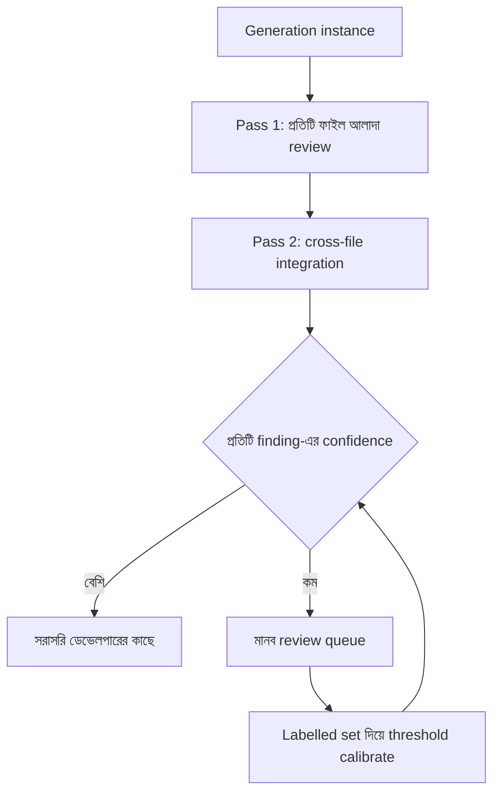

import ReadingProgress from '../../../../components/progress/ReadingProgress.astro';
import MarkComplete from '../../../../components/progress/MarkComplete.astro';
import KeywordTable from '../../../../components/content/KeywordTable.astro';
import ExamTrap from '../../../../components/content/ExamTrap.astro';
import BuildExercise from '../../../../components/content/BuildExercise.astro';
import Attribution from '../../../../components/content/Attribution.astro';

<ReadingProgress />

<div class="lesson-meta">
	<span class="lesson-badge">Domain 4</span>
	<span class="lesson-task">Task 4.6 · ওয়েট ২০%</span>
	<span class="lesson-source">মূল ইংরেজি: Multi-Instance and Multi-Pass Review</span>
</div>

## এই লেসনে যা জানতে হবে

Claude নিজের আউটপুট review করলে সে পিছিয়ে থেকে শুরু করে: যে reasoning দিয়ে আউটপুটটি বানিয়েছে, সেটি তখনো তার কাছে থাকে। কেন কোন সিদ্ধান্ত নিয়েছিল মডেলের মনে আছে, তাই সেই সিদ্ধান্ত প্রশ্ন করার সম্ভাবনা কমে। এটি bug নয় — একই সেশনে self-review এভাবেই কাজ করে। কাজ হলো এর চারপাশ ঘিরে ডিজাইন করা।

## Self-Review-র সীমা

একই কথোপকথনে নিজের আউটপুট review করা মডেল আগের reasoning chain ধরে রাখে। কেন ওই পথ বেছেছিল, কেন ওই severity দিয়েছিল, কেন ওই মান নিয়েছিল — সে আগেই "জানে"। Review করতে বলা হলে সে সিদ্ধান্ত নিশ্চিত করার দিকেই ঝোঁক, প্রশ্ন করার নয়।

**Independent instance** — আগের reasoning context ছাড়া আলাদা Claude invocation — আউটপুটের কাছে সম্পূর্ণ নতুন চোখে যায়। যে কোড, finding বা extraction সামনে আছে, কেবল তা দেখে বিচার করে; "আমি এটা বেছেছিলাম কারণ..." — সেই পক্ষপাত নেই। তাই independent review subtle সমস্যা ধরতে অনেক ভালো।

পরীক্ষা এটি সরাসরি ধরে। Review-র গুণ বাড়ানোর অপশন এলে সঠিক উত্তর — **আলাদা model instance**; একই সেশনে "please review carefully" লেখা নয়, generation সেশনের ভেতরে extended thinking ভরসা করাও নয়।

```typescript
// অ্যান্টি-প্যাটার্ন: একই সেশনে self-review
const generation = await client.messages.create({
  messages: [
    { role: "user", content: "Write a function to process orders" },
    { role: "assistant", content: generatedCode },
    { role: "user", content: "Now review your code for bugs" }
    // মডেল নিজের reasoning ধরে রাখে — নিজের ভুল ধরার সম্ভাবনা কম
  ]
});

// সঠিক: independent review instance
const review = await client.messages.create({
  messages: [
    {
      role: "user",
      content: `Review this code for bugs, security issues, and edge cases:\n\n${generatedCode}`
    }
    // Fresh instance — আগের reasoning context নেই
  ]
});
```

## Multi-Pass Review আর্কিটেকচার

বড় review (বহু-ফাইল PR, জটিল extraction pipeline, বিস্তৃত code audit) এক পাসে চালালে **attention dilution**-এ ভোগে। উপসর্গগুলো নির্দিষ্ট ও সহজে চেনা:

- কিছু ফাইলে বিস্তারিত feedback, আবার কিছু ফাইলে উপরি মন্তব্য
- Review-র মাঝখানে থাকা স্পষ্ট bug বাদ পড়া
- পরস্পরবিরোধী finding — একই pattern এক ফাইলে সমস্যা, আরেক ফাইলে অনুমোদিত

সমাধান — review-কে focused পাসে ভাগ করা:

- **Pass 1: Per-file local analysis।** প্রতিটি ফাইল আলাদাভাবে focused review prompt দিয়ে বিশ্লেষণ করুন। এতে সব ফাইলে সমান গভীরতা আসে; প্রতিটি invocation কেবল একটি ফাইল দেখে, তাই পূর্ণ মনোযোগ পায়।
- **Pass 2: Cross-file integration।** Per-file analysis শেষে আলাদা পাসে সব finding একসঙ্গে নিয়ে cross-file সমস্যা যাচাই করুন: module-এর মধ্যে data flow, service জুড়ে API ব্যবহার, dependency conflict, আর per-file finding-গুলোর নিজেদের মাঝে বিরোধ।

```typescript
// Pass 1: per-file analysis
const perFileFindings = await Promise.all(
  files.map(file =>
    client.messages.create({
      messages: [{
        role: "user",
        content: `Review this file for local issues (bugs, security, logic errors):\n\n${file.content}`
      }]
    })
  )
);

// Pass 2: cross-file integration
const integrationReview = await client.messages.create({
  messages: [{
    role: "user",
    content: `Given these per-file findings, identify cross-file issues:\n` +
      `- Data flow inconsistencies between modules\n` +
      `- Contradictory patterns flagged in different files\n` +
      `- API contract violations across service boundaries\n\n` +
      `Findings:\n${JSON.stringify(perFileFindings)}`
  }]
});
```

এই আর্কিটেকচার attention dilution-এর তিনটি উপসর্গই সরাসরি মেটায়: per-file পাস গভীরতার সামঞ্জস্য আনে; integration পাস কোনো single-file review-তে ধরা পড়ত না এমন cross-file সমস্যা ধরে; আর বিভাজন একই আউটপুটে পরস্পরবিরোধী finding আসা ঠেকায়।



## কেন বড় Context Window এটা সারায় না

পরীক্ষায় একটি নির্দিষ্ট ডিস্ট্র্যাক্টর আছে: "বড় context window-সহ উচ্চতর model-এ যাও।" যুক্তিসঙ্গত শোনায় — ১৪টি ফাইল একসঙ্গে সামলাতে না পারলে বেশি জায়গা দাও। কিন্তু সমস্যা context-এর আকার নয়, মনোযোগের গুণ। বড় window মডেলকে ফাইলগুলোতে অসম মনোযোগ ছড়ানোর থেকে থামায় না। কেবল focused per-file পাসই সামঞ্জস্যপূর্ণ গভীরতা দেয়।

## Confidence-Based Routing

যে finding নিয়ে অনিশ্চয়তা আছে, সেগুলোতে মডেল নিজের confidence জানাতে পারে। এতে একটি routing কৌশল খোলে:

- **উচ্চ confidence finding:** সরাসরি ডেভেলপারের কাছে।
- **নিম্ন confidence finding:** যাচাইয়ের জন্য মানব review-তে।
- **Threshold calibration:** কোন confidence score আসল নির্ভুলতার সঙ্গে মেলে, তা labelled validation set দিয়ে ঠিক করুন।

```json
{
  "finding": "Potential race condition in order processing",
  "severity": "major",
  "confidence": 0.65,
  "reasoning": "The lock acquisition pattern appears correct but the unlock timing depends on an async callback whose ordering I cannot fully verify.",
  "route": "human_review"
}
```

Confidence score নিজে-reported নির্ভুলতা নয় — মডেলের নিজের নিশ্চয়তার পাঠ। এটি calibrate করতে labelled উদাহরণ (যেখানে উত্তর আগেই জানা) সিস্টেমে চালিয়ে দেখুন, জানানো confidence আসল নির্ভুলতার সঙ্গে কত মেলে। সেই ডেটা থেকে routing threshold ঠিক করুন।

পরীক্ষা দুটোকে আলাদা করে: **কাঁচা confidence score** (uncalibrated, automated সিদ্ধান্তে অনির্ভরযোগ্য) আর **calibrated confidence threshold** (labelled set-এ যাচাই করা, routing-এ উপযুক্ত)। Uncalibrated confidence দিয়ে automated সিদ্ধান্ত নেওয়াই অ্যান্টি-প্যাটার্ন।

## সব একসঙ্গে

Production review আর্কিটেকচারে তিনটি ধারণাই মেলে:

- **Generation:** প্রথম instance কোড, extraction বা analysis বানায়।
- **Per-file review:** independent instance প্রতিটি আউটপুট একক আলাদা review করে।
- **Integration review:** আলাদা instance একক-জুড়ে সামঞ্জস্য যাচাই করে।
- **Confidence routing:** কম-confidence finding মানব review-তে যায়।
- **Calibration loop:** Labelled validation set নিরন্তর threshold ঠিক করে।

এই আর্কিটেকচার single-pass review-র চেয়ে খরচ বেশি। কিন্তু review-র গুণ যখন সরাসরি production reliability-তে প্রভাব ফেলে — CI/CD pipeline, আর্থিক extraction, compliance analysis, কিংবা যে সিস্টেমে সমস্যা বাদ পড়লে পরিণতি থাকে — তখন এই খরচ সার্থক।

## পরীক্ষার ফাঁদ

<ExamTrap>
	<p>
		<strong>একই সেশনে self-review-কে বৈধ review কৌশল বাছা</strong> — মডেল generation-এর reasoning context ধরে রাখে, তাই নিজের সিদ্ধান্ত প্রশ্ন করার সম্ভাবনা কমে। আগের context ছাড়া independent instance subtle সমস্যা ধরতে অনেক বেশি কার্যকর।
	</p>
</ExamTrap>

<ExamTrap>
	<p>
		<strong>বড় multi-file review এক পাসে চালানো</strong> — Attention dilution-এর কারণে এক পাসে গভীরতা অসম হয়, bug বাদ পড়ে, পরস্পরবিরোধী finding আসে। Per-file local পাস আর cross-file integration পাসে ভাগ করুন।
	</p>
</ExamTrap>

<ExamTrap>
	<p>
		<strong>Attention dilution ঠিক করতে বড় context window-সহ model-এ যাওয়া</strong> — বড় window মনোযোগের গুণের সমস্যা মেটায় না; মডেল বেশি টেক্সট ধরতে পারে, তবু ফাইলে মনোযোগ অসম থাকে। Focused per-file পাসই সঠিক প্রতিকার।
	</p>
</ExamTrap>

<ExamTrap>
	<p>
		<strong>Uncalibrated confidence score দিয়ে automated review routing</strong> — কাঁচা self-reported confidence খারাপভাবে calibrated। Routing সিদ্ধান্তে ভরসা করার আগে labelled validation set দিয়ে threshold calibrate করুন।
	</p>
</ExamTrap>

<KeywordTable keywords={frontmatter.keywords} />

## প্র্যাকটিস সিনারিও (নিজে উত্তর ভাবুন, তারপর খুলুন)

> ১৪টি ফাইল বদলানো একটি pull request-এর review অসামঞ্জস্যপূর্ণ: কিছু ফাইলে বিস্তারিত feedback, কিছুতে উপরি; স্পষ্ট bug বাদ পড়ছে; একই pattern এক ফাইলে সমস্যা আরেক ফাইলে অনুমোদিত। Review-টি কীভাবে নতুন করে সাজাবেন?

<details>
	<summary>উত্তর দেখুন</summary>

	**সঠিক উত্তর:** Per-file local analysis পাসে ভাগ করে গভীরতার সামঞ্জস্য আনুন, তারপর data flow-এর জন্য আলাদা cross-file integration পাস চালান।

	**কেন বাকিগুলো ভুল:**

	- *বড় context window-সহ উচ্চতর model-এ যাওয়া* — সমস্যা context আকার নয়, attention quality; বড় window অসম মনোযোগ ঠেকায় না।
	- *পুরো PR-এ তিনটি independent পাস, অন্তত দুইটিতে মিললেই flag* — বাড়তি খরচ, আর per-file গভীরতার সমস্যা অপরিবর্তিত; cross-file data flow-ও এতে ধরা পড়ে না।
	- *ডেভেলপারকে ৩–৪ ফাইলে ভাগ করে জমা দিতে বলা* — সমস্যাটিকে মডেলের বদলে মানুষের ঘাড়ে চাপায়; আর PR-এর cross-file মিথস্ক্রিয়া হারায়।

</details>

<BuildExercise
	title="Multi-Pass Code Review সিস্টেম বানান"
	difficulty="Advanced"
	time="৬০ মিনিট"
	objectives={[
		'একই সেশনে self-review-র সীমা বোঝা আর independent review-র সুবিধা',
		'Per-file local analysis ও cross-file integration সহ multi-pass আর্কিটেকচার ডিজাইন',
		'বড় multi-file review-তে attention dilution চিহ্নিত করে মেটানো',
		'Labelled validation set থেকে calibrate করা threshold দিয়ে confidence routing',
		'কাঁচা confidence বনাম calibrated threshold — automated routing-এর জন্য উপযুক্ত পার্থক্য',
	]}
	steps={[
		{
			title: 'একটি single-pass review prompt বানিয়ে ১০ ফাইলের mock PR-এ চালান — অসম গভীরতা, বাদ পড়া সমস্যা ও পরস্পরবিরোধী finding লিপিবদ্ধ করুন।',
			why: 'Single-pass baseline attention dilution-এর তিনটি উপসর্গ চোখে আনে: ফাইল-ভেদে গভীরতার হেরফের, মাঝের ফাইলে bug বাদ, একই pattern নিয়ে বিরোধী মন্তব্য।',
			expect: 'কিছু ফাইলে (সাধারণত প্রথম ও শেষ) বিস্তারিত feedback, কিছুতে উপরি; মাঝের ফাইলে অন্তত একটি স্পষ্ট bug বাদ; একই code pattern এক ফাইলে সমস্যা আরেক ফাইলে অনুমোদিত।',
		},
		{
			title: 'Per-file local analysis যোগ করুন: প্রতিটি ফাইলে focused review prompt দিয়ে শুধু সেই ফাইলের bug, security issue ও logic error যাচাই করুন।',
			why: 'Per-file analysis প্রতিটি ফাইলে সমান focused মনোযোগ নিশ্চিত করে; প্রতিটি invocation এক ফাইল দেখে, তাই single-pass-এর attention dilution থাকে না।',
			expect: '১০টি ফাইলেই সামঞ্জস্যপূর্ণ গভীরতার review। Single-pass-এ বাদ পড়া bug, বিশেষত মাঝের ফাইলগুলোর, এখন ধরা পড়ে; প্রতিটি review focused ও পূর্ণাঙ্গ।',
		},
		{
			title: 'Cross-file integration পাস যোগ করুন: সব per-file finding একটি আলাদা prompt-এ দিয়ে data flow অসঙ্গতি, ফাইল-জুড়ে বিরোধী finding আর API contract ভঙ্গ যাচাই করান।',
			why: 'Per-file analysis local সমস্যা ধরে, কিন্তু cross-file বিষয় বাদ দেয়: module-এর মধ্যে data flow, API ব্যবহারের সামঞ্জস্য আর finding-দের পরস্পরবিরোধ।',
			expect: 'একটি synthesis আউটপুট, যেখানে এমন cross-file সমস্যা ওঠে যা কোনো single-file review ধরতে পারত না: বেমানান ফরম্যাটে module-জুড়ে ডেটা, বিরোধী per-file finding, service সীমানা ভাঙা API contract।',
		},
		{
			title: 'প্রতিটি finding-এ confidence score (0.0–1.0) যোগ করে routing চালু করুন: উচ্চ confidence সরাসরি ডেভেলপারের কাছে, নিম্ন confidence মানব review queue-তে।',
			why: 'Confidence-based routing সীমিত মানব review-র মনোযোগ সবচেয়ে দরকারি finding-এ পাঠায়; পরীক্ষা কাঁচা uncalibrated confidence আর labelled set-এ যাচাই করা threshold আলাদা করে।',
			expect: 'প্রতিটি finding-এ confidence score, তার কারণ আর routing সিদ্ধান্ত (direct_report বা human_review)। Threshold স্পষ্ট finding আর অনিশ্চিত finding আলাদা করে।',
		},
		{
			title: 'আলাদা Claude instance (fresh session, আগের context নেই) দিয়ে তৈরি finding-গুলোর একটি উপসেট review করিয়ে মূল confidence score-এর সঙ্গে মিলিয়ে threshold calibrate করুন।',
			why: 'Independent review instance "আমি এটা বেছেছিলাম কারণ" পক্ষপাত ছাড়া আউটপুট দেখে; এভাবে জানানো confidence আর independent যাচাই তুলনা করাই পরীক্ষায় ধরা সঠিক calibration পদ্ধতি।',
			expect: 'জানানো confidence score আর independent যাচাইয়ের সম্পর্ক দেখানো একটি calibration ডেটাসেট। কিছু উচ্চ-confidence finding উল্টে যেতে পারে, যা calibration ঘাটতি দেখায় আর routing threshold সমন্বয়ের দিশা দেয়।',
		},
	]}
/>

## সূত্র

<ul>
	{frontmatter.sources.map((source) => (
		<li>
			<a href={source.href} target="_blank" rel="noopener noreferrer">
				{source.label}
			</a>
			{source.note ? ` — ${source.note}` : ''}
		</li>
	))}
</ul>

<Attribution sourceUrl={frontmatter.sourceUrl} updated={frontmatter.updated} />

<MarkComplete lessonId="4-6" />
