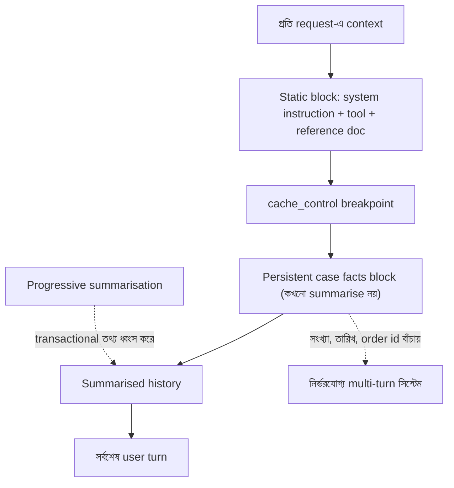

import ReadingProgress from '../../../../components/progress/ReadingProgress.astro';
import MarkComplete from '../../../../components/progress/MarkComplete.astro';
import KeywordTable from '../../../../components/content/KeywordTable.astro';
import ExamTrap from '../../../../components/content/ExamTrap.astro';
import BuildExercise from '../../../../components/content/BuildExercise.astro';
import Attribution from '../../../../components/content/Attribution.astro';

<ReadingProgress />

<div class="lesson-meta">
	<span class="lesson-badge">Domain 5</span>
	<span class="lesson-task">Task 5.1 · ওয়েট ১৫%</span>
	<span class="lesson-source">মূল ইংরেজি: Context Window Management</span>
</div>

## এই লেসনে যা জানতে হবে

নির্ভরযোগ্য Claude-ভিত্তিক সিস্টেমের ভিত্তি context window ম্যানেজমেন্ট। প্রতিটি multi-turn কথোপকথন, প্রতিটি multi-agent pipeline, প্রতিটি দীর্ঘ ডকুমেন্ট extraction — সবই নির্ভর করে আপনি context window-তে কী ঢুকতে দিচ্ছেন তার উপর। ভুল করলে ব্যর্থতা হাতে-গোনা: support agent refund-এর অঙ্ক ভুলে যায়, research pipeline citation হারায়, extraction সিস্টেম গুরুত্বপূর্ণ field-এ নির্ভুলতা হারায়।

## Progressive Summarisation-এর ফাঁদ

কথোপকথন দীর্ঘ হলে একটি সাধারণ কৌশল — আগের turn সারসংক্ষেপ করে টোকেন খালি করা। এটিই ফাঁদ। Progressive summarisation ধারাবাহিকভাবে customer-facing ও data-processing সিস্টেমের সবচেয়ে জরুরি তথ্য ধ্বংস করে: সংখ্যা, তারিখ, শতাংশ আর গ্রাহকের বলা প্রত্যাশা।

```text
Turn 3: "I'd like a refund of $247.83 for order #8891 placed on March 3rd"
```

Summarisation-এর পর:

```text
Summary: "Customer wants a refund for a recent order"
```

অঙ্ক, order number আর তারিখ — refund প্রসেস করতে agent-এর যে তিনটি তথ্য দরকার — সব গায়েব। এটি বিরল ঘটনা নয়; transactional data-তে summarisation ডিফল্টভাবেই এটাই করে।

**সমাধান: persistent case facts block।** লেনদেন-তথ্য (amount, date, order number, status) বের করে একটি structured block-এ রাখুন, যা প্রতিটি prompt-এ থাকে — summarised history-র বাইরে। এই block কখনো summarise হয় না; কথোপকথন history-র যা-ই হোক, প্রতিটি turn-এ টিকে থাকে।

```json
{
  "caseFactsBlock": {
    "customerId": "C-4421",
    "issues": [
      {
        "orderId": "#8891",
        "orderDate": "2024-03-03",
        "refundAmount": "$247.83",
        "status": "pending_refund",
        "itemDescription": "Wireless headphones — defective"
      }
    ]
  }
}
```

এক কথোপকথনে গ্রাহক কয়েকটি সমস্যা তুললে প্রতিটির structured issue ডেটা আলাদা context স্তরে বের করে রাখুন। প্রতি issue-এর নিজের entry থাকবে — order ID, amount, status-সহ। Summarisation-এর সময় issue-গুলো একে অন্যের সঙ্গে মিশে যাওয়া এতে আটকায়।

## "Lost in the Middle" প্রভাব

দীর্ঘ ইনপুটের শুরু ও শেষের তথ্য মডেল নির্ভরযোগ্যভাবে পড়ে। মাঝখানে চাপা finding বাদ পড়তে পারে বা কম গুরুত্ব পায়। Large language model-এ এটি সুপরিচিত ঘটনা, আর aggregated input কীভাবে সাজাবেন তা সরাসরি এর উপর নির্ভর করে।

প্রতিকার গঠনগত, prompt-based নয়। Aggregated input-এর **শুরুতে** key findings summary রাখুন। বিস্তারিত ফল স্পষ্ট section header দিয়ে সাজান। তিনটি research subagent-এর আউটপুট synthesis agent-কে দিলে শুরু করুন "Key Findings Summary" অংশ দিয়ে, তারপর স্পষ্ট section সীমানাসহ বিস্তারিত ফল দিন।

```text
## Key Findings Summary
- Source A: 12% market growth in renewable sector (2023)
- Source B: Patent filings increased 34% year-on-year
- Source C: Regulatory framework delayed until Q3 2025

## Detailed Findings
### Source A: Market Analysis Report
[Full details here...]
### Source B: Patent Database Analysis
[Full details here...]
### Source C: Regulatory Review
[Full details here...]
```

## Tool Result Trimming

Tool result কনটেক্সট বাজেটের নীরব ঘাতক। একটি order lookup ৪০+ field ফেরাতে পারে: internal audit timestamp, warehouse code, shipping carrier ID, fulfilment centre identifier — গ্রাহকের refund অনুরোধের সঙ্গে সম্পর্কহীন আরও ডজনখানেক field। আপনার দরকার ৫টি। বাকি ৩৫টি প্রতিটি পরের turn-এ টোকেন খায়, কারণ কথোপকথন history বাড়তেই থাকে।

Verbose tool output history-তে জমা হওয়ার আগেই কেবল দরকারি field-এ ছেঁটে নিন। না ছাঁটলে multi-turn সিস্টেম ধীরে ধীরে বাসি tool output-এ ডুবে যায়। এটি ঐচ্ছিক সুবিধা নয়।

```python
def trim_order_result(raw_result, relevant_fields=None):
    if relevant_fields is None:
        relevant_fields = [
            "order_id", "order_date", "total_amount",
            "return_eligible", "item_description"
        ]
    return {k: v for k, v in raw_result.items() if k in relevant_fields}
```

এই ছাঁটাই হওয়া উচিত `PostToolUse` hook-এ, বা টুলের implementation-এই, তথ্য কথোপকথন history-তে ঢোকার আগে। Verbose ডেটা একবার কনটেক্সটে ঢুকলে প্রতিটি পরের turn-এ সেটি থেকে যায়।

## পূর্ণ Conversation History

Claude API **stateless**। প্রতিটি request-এ পূর্ণ কথোপকথন history থাকতে হবে। আগের message বাদ দিলে মডেল conversational coherence হারায়। Server-এ session state নেই, তাই মডেলের কথোপকথন বুঝে চলার যা যা দরকার, প্রতিটি turn-এ তা বহন করতে হয়।

এতে কনটেক্সট সীমার সঙ্গে টানাপোড়েন: coherence-এর জন্য পূর্ণ history লাগে, কিন্তু history প্রতি turn-এ বাড়ে। Persistent case facts block এই টানাপোড়েন মেটায় — জরুরি তথ্য summarise-যোগ্য narrative থেকে আলাদা করে রাখে, ফলে কথোপকথনের ধারা সারসংক্ষেপ করা যায়, অথচ প্রতিটি লেনদেন-বিস্তারিত অটুট থাকে।

## Upstream এজেন্ট অপটিমাইজেশন

Multi-agent সিস্টেমে upstream agent প্রায়ই verbose reasoning chain ও কাঁচা কনটেন্ট ফেরায়, যা downstream agent-এর দরকার নেই। একটি research subagent তার পূর্ণ চিন্তার ধারা synthesis agent-কে পাঠালে, সীমিত কনটেক্সট বাজেটের synthesis agent এমন reasoning-এ টোকেন নষ্ট করে যা সে ব্যবহারই করতে পারে না।

Upstream agent-কে verbose কনটেন্ট ও reasoning chain-এর বদলে **structured data** ফেরাতে বদলান — মূল তথ্য, citation, relevance score। নির্ভুল downstream synthesis-এর জন্য subagent-দের structured output-এ metadata (তারিখ, সোর্সের অবস্থান, পদ্ধতিগত প্রসঙ্গ) রাখতে বলুন।

```json
{
  "findings": [
    {
      "claim": "Renewable energy investment grew 12% in 2023",
      "source": "IEA World Energy Report 2024",
      "sourceUrl": "https://example.com/report",
      "relevanceScore": 0.92,
      "publicationDate": "2024-01-15"
    }
  ]
}
```

এতে টোকেনই বাঁচে তা নয় — upstream agent-এর structured output থেকে downstream agent verbose গদ্য আবার parse না করেই finding প্রসেস করতে পারে।

## Prompt Caching

Prompt caching কনটেক্সট-অর্থনীতির অন্য অর্ধ। মডেল যা দেখে তা ছাঁটাই করার বদলে, যে অংশ বদলায় না তা আবার প্রসেস করার খরচ বাঁচান। `cache_control` breakpoint দিয়ে স্থির prefix চিহ্নিত করলে API সেই প্রসেস করা prefix সংরক্ষণ করে, পরের request-এ পুনর্ব্যবহার করে, আর cached টোকেনের জন্য input খরচের একটি ভগ্নাংশ নেয়।

Caching প্রম্পটের শুরু থেকে prefix-by-prefix মেলে, তাই বিন্যাসই ঠিক করে hit পাবেন কি না। যে কনটেন্ট স্থির থাকে তা আগে রাখুন: system instruction, tool definition, দীর্ঘ reference document। স্থির block-এর শেষে `cache_control` breakpoint বসান। Volatile কনটেন্ট — ব্যবহারকারীর সর্বশেষ message ও প্রতি request-এ যা বদলায় — breakpoint-এর পরে রাখুন।

স্থির block-টি top-level `system` প্যারামিটারে থাকা উচিত, `messages`-এ নয়। Messages API-তে input message-এর জন্য "system" role নেই — `messages` কেবল "user" ও "assistant" turn নেয়।

```python
response = client.messages.create(
    model="claude-sonnet-5",
    max_tokens=4096,
    system=[
        {"type": "text", "text": LONG_STATIC_INSTRUCTIONS},
        {"type": "text", "text": REFERENCE_DOC,
         "cache_control": {"type": "ephemeral"}},
    ],
    messages=[
        {"role": "user", "content": dynamic_user_message},
    ],
)
```

ক্রম ভুল হলে সুবিধা একেবারে হাতছাড়া। Static block-এর আগে dynamic কনটেন্ট বসলে প্রতি request-এ prefix বদলায়, কিছুই মেলে না, প্রতিটি কলে পূর্ণ দাম। Ephemeral breakpoint শেষ ব্যবহারের পর প্রায় পাঁচ মিনিট টেকে; `{"type": "ephemeral", "ttl": "1h"}` breakpoint এক ঘণ্টা টেকে, তবে write খরচ বেশি। একটি request-এ সর্বোচ্চ চারটি breakpoint থাকতে পারে।

> **পরীক্ষার সীমা:** গাইডের out-of-scope তালিকায় "prompt caching implementation details (beyond knowing it exists)" আছে — তাই caching-এর অস্তিত্ব ও উদ্দেশ্যের বাইরে কিছু পরীক্ষায় আসে না। উপরের কারিগরি অংশ বাস্তব কাজের জন্য, পরীক্ষার জন্য নয়।



## পরীক্ষার ফাঁদ

<ExamTrap>
	<p>
		<strong>Transactional data-র জন্য progressive summarisation নিরাপদ ভাবা</strong> — Summarisation ধারাবাহিকভাবে সংখ্যা, তারিখ ও নির্দিষ্ট identifier ধ্বংস করে। Persistent case facts block এই তথ্য summarised history-র বাইরে রাখে।
	</p>
</ExamTrap>

<ExamTrap>
	<p>
		<strong>"lost in the middle" সমস্যা মডেলকে "সব কিছুতে মনোযোগ দাও" বললেই মিটবে ধরে নেওয়া</strong> — প্রতিকার গঠনগত: মূল finding ইনপুটের শুরুতে রাখুন আর স্পষ্ট section header ব্যবহার করুন। Position effect-এর জন্য prompt-based স্মারক অনির্ভরযোগ্য।
	</p>
</ExamTrap>

<ExamTrap>
	<p>
		<strong>"মডেল পরে দরকারে লাগতে পারে" বলে পূর্ণ tool result কনটেক্সটে রাখা</strong> — ৪০+ field-এর অছাঁটা tool result পরের turn-গুলোতে টোকেন বাজেট শেষ করে দেয়। Result history-তে ঢোকার আগেই দরকারি field-এ ছাঁটুন।
	</p>
</ExamTrap>

<ExamTrap>
	<p>
		<strong>Conversation history পরিণতি ছাড়াই বাছাই করে truncate করা যায় ভাবা</strong> — API stateless; প্রতিটি request-এ পূর্ণ history দরকার। Selective truncation coherence ভাঙে। Truncation-এর বদলে case facts block ও summarisation ব্যবহার করুন।
	</p>
</ExamTrap>

<KeywordTable keywords={frontmatter.keywords} />

## প্র্যাকটিস সিনারিও (নিজে উত্তর ভাবুন, তারপর খুলুন)

> একটি customer support agent multi-issue সেশন সামলায়। কয়েক turn পর agent নির্দিষ্ট $247.83 (order #8891) refund অনুরোধের বদলে বলে "your recent refund request"। Context length সামলাতে turn-গুলোর মাঝে history summarise করা হচ্ছে। সবচেয়ে কার্যকর সমাধান কোনটি?

<details>
	<summary>উত্তর দেখুন</summary>

	**সঠিক উত্তর:** লেনদেন-তথ্য (amount, date, order number) বের করে persistent case facts block-এ রাখুন, যা summarised history-র বাইরে প্রতিটি prompt-এ থাকে।

	**কেন বাকিগুলো ভুল:**

	- *Summarise করার সময় সব সংখ্যা হুবহু রাখতে মডেলকে নির্দেশ দেওয়া* — নির্ভরযোগ্য নয়; summarisation-এর চাপে নির্দেশ মানা যায় না, আর তারিখ/order id-ও বাদ পড়ে।
	- *পূর্ণ history বাইরের ডেটাবেসে রেখে দরকারে turn আনা* — জটিল, latency বাড়ায়, আর কোন খুঁটিনাটি দরকার হবে তা আগেই জানা যায় না।
	- *Context window বড় করে summarisation এড়ানো* — সমস্যা স্থগিত হয়, মেটে না; কথোপকথন আরও লম্বা হলে ফিরে আসে।

</details>

<BuildExercise
	title="Persistent Case Facts Context Manager বানান"
	difficulty="Advanced"
	time="৪৫ মিনিট"
	objectives={[
		'Progressive summarisation থেকে লেনদেন-তথ্য বাঁচাতে persistent case facts block প্রয়োগ',
		'কনটেক্সটে জমা হওয়ার আগে verbose tool result ছেঁটে দরকারি field রাখা',
		'Lost-in-the-middle প্রতিরোধে aggregated input-এর শুরুতে key finding রাখা',
		'Claude API stateless — প্রতিটি request-এ পূর্ণ history লাগে, তা বোঝা',
		'Tool result থেকে লেনদেন-তথ্য (amount, date, order id, status) বের করা case facts extractor',
	]}
	steps={[
		{
			title: 'একটি case facts extractor বানান, যা কাঁচা tool output নিয়ে কেবল লেনদেন-তথ্যসহ structured object ফেরায়।',
			why: 'Persistent case facts block context management-এর সবচেয়ে জরুরি প্যাটার্ন; কখনো summarise না করা এই block progressive summarisation-এর ফাঁদ থেকে গুরুত্বপূর্ণ সংখ্যা ও identifier বাঁচায়।',
			expect: 'একটি ফাংশন, যা কাঁচা tool output নিয়ে কেবল customer ID, order number, amount, date ও status সহ structured object দেয়; লেনদেন-বহির্ভূত narrative বাদ পড়ে।',
		},
		{
			title: 'এমন persistent case facts block বানান, যা summarised history-র বাইরে প্রতিটি prompt-এ সবার আগে যোগ হয়।',
			why: 'Case facts block history-তে যা-ই ঘটুক প্রতিটি turn-এ টিকতে হয়; summarised অংশের বাইরে থাকলে আগের turn সংক্ষিপ্ত হলেও amount, date, order number টেকে।',
			expect: 'একটি prompt-নির্মাণ ফাংশন, যা প্রতিটি message-এর শুরুতে case facts block, তারপর summarised history, তারপর চলতি turn দেয়; block স্পষ্ট section header দিয়ে আলাদা করা।',
		},
		{
			title: 'একটি tool result trimmer বানান, যা order lookup-এর ৪০+ field থেকে return-সংক্রান্ত ৫টি দরকারি field রাখে।',
			why: 'অছাঁটা tool result নীরবে context বাজেট খায়; ৪০+ field-এর lookup history বাড়ার সঙ্গে প্রতিটি পরের turn-এ টোকেন ফুঁকে দেয়।',
			expect: 'একটি trimming ফাংশন, যা কাঁচা tool result নিয়ে চলতি কাজে দরকারি field-গুলোই ফেরায়; ছাঁটা result মূলের চেয়ে ৮০–৯০% ছোট।',
		},
		{
			title: 'Summarisation ঘটে এমন multi-turn কথোপকথনে পরীক্ষা করুন — সব turn জুড়ে লেনদেন-তথ্য অটুট থাকে কি না।',
			why: 'Progressive summarisation নির্দিষ্ট amount ও date ধ্বংস করে, আর case facts block তার সমাধান — এটি পরীক্ষামূলকভাবে যাচাই করা দরকার।',
			expect: '৬–৮ turn-এর কথোপকথন, যেখানে ৪ নম্বর turn-এর পর summarisation হয়। তার পরেও agent case facts block থেকে হুবহু refund amount ($247.83), order number (#8891) ও তারিখ (March 3rd) বলে; block না থাকলে এসব হারিয়ে যেত।',
		},
		{
			title: 'Aggregated input-এর শুরুতে summary বসানোর লজিক যোগ করুন, যাতে lost-in-the-middle প্রভাব কমে।',
			why: 'মডেল দীর্ঘ ইনপুটের শুরু ও শেষ নির্ভরযোগ্যভাবে পড়ে, কিন্তু মাঝখানে চাপা finding বাদ পড়তে পারে; শুরুতে key finding বসানো এই সুপরিচিত ঘটনার গঠনগত প্রতিকার।',
			expect: 'একটি aggregation ফাংশন, যা মিলিত ইনপুটের শীর্ষে Key Findings Summary অংশ রাখে, তারপর স্পষ্ট section header-সহ বিস্তারিত ফল; key finding-গুলো বিস্তারিত কনটেন্ট থেকে নেওয়া সংক্ষিপ্ত bullet।',
		},
	]}
/>

## সূত্র

<ul>
	{frontmatter.sources.map((source) => (
		<li>
			<a href={source.href} target="_blank" rel="noopener noreferrer">
				{source.label}
			</a>
			{source.note ? ` — ${source.note}` : ''}
		</li>
	))}
</ul>

<Attribution sourceUrl={frontmatter.sourceUrl} updated={frontmatter.updated} />

<MarkComplete lessonId="5-1" />
