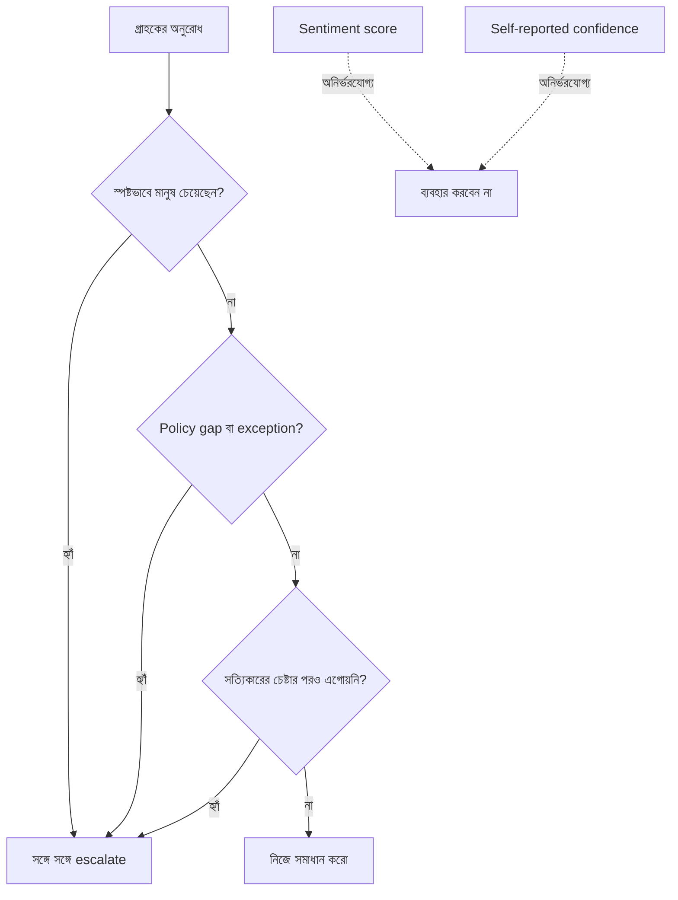

import ReadingProgress from '../../../../components/progress/ReadingProgress.astro';
import MarkComplete from '../../../../components/progress/MarkComplete.astro';
import KeywordTable from '../../../../components/content/KeywordTable.astro';
import ExamTrap from '../../../../components/content/ExamTrap.astro';
import BuildExercise from '../../../../components/content/BuildExercise.astro';
import Attribution from '../../../../components/content/Attribution.astro';

<ReadingProgress />

	Domain 5
	Task 5.2 · ওয়েট ১৫%
	মূল ইংরেজি: Escalation & Ambiguity Resolution

## এই লেসনে যা জানতে হবে

Escalation calibration customer support agent-এর অস্তিত্ব-নির্ধারক দক্ষতা। ভুল calibration first-contact resolution হার সরাসরি ধ্বংস করে। পরীক্ষা দেখে — কখন escalate করবেন, কখন নিজে সমাধান করবেন, আর কোন প্রস্তাবিত escalation trigger অনির্ভরযোগ্য।

## তিনটি বৈধ Escalation Trigger

Support agent-এর মানুষের কাছে escalate করার ঠিক তিনটি বৈধ কারণ:

1. **গ্রাহক স্পষ্টভাবে মানুষ চাইছেন।** গ্রাহক বললেন "I want to speak to a person" বা "Transfer me to a human agent" — সঙ্গে সঙ্গে মান্য করুন। আগে সমস্যা সমাধানের চেষ্টা করবেন না। "Let me see if I can help you with that first" বলবেন না। গ্রাহক স্পষ্ট অনুরোধ করেছেন; agent-কে কোনো দেরি ছাড়াই তা মানতে হবে।

   এটি ব্যতিক্রমহীন পরম নিয়ম। গ্রাহক যেই মুহূর্তে স্পষ্টভাবে মানুষ চাইলেন, সেই মুহূর্তেই escalation।

2. **Policy exception বা gap।** অনুরোধ লিখিত নীতির বাইরে পড়ে। যেমন গ্রাহক competitor price matching চাইছেন, কিন্তু নীতিতে কেবল নিজের সাইটের price adjustment আছে। Agent নিজে নীতি বানাতে পারে না — ব্যতিক্রম করা হবে কি না, তা মানুষের বিচার।

   Policy gap আর policy violation আলাদা। Violation-এর (যেমন return window-র বাইরে refund চাওয়া) লিখিত উত্তর আছে — "না"। Gap মানে নীতি ওই নির্দিষ্ট পরিস্থিতি নিয়ে নীরব। Gap-এ escalation লাগে, violation-এ নয়।

3. **অর্থবহ অগ্রগতি করতে অক্ষমতা।** Agent সমাধানের চেষ্টা করে এগোতে পারছে না। হয়তো টুল এমন error দিচ্ছে যা local retry logic সারাতে পারে না, বা গ্রাহকের অবস্থার জন্য এমন system access দরকার যা agent-এর নেই, বা সমস্যাটি এমন technical bug যাতে engineering হস্তক্ষেপ লাগে।

   এটি catch-all, তবে কেবল সত্যিকারের চেষ্টার পরেই। "I might not be able to handle this" যথেষ্ট নয় — agent-কে দেখাতে হবে সে চেষ্টা করেছে আর ব্যর্থ হয়েছে।

## দুটি অনির্ভরযোগ্য Trigger

পরীক্ষা সরাসরি দেখে আপনি এগুলো anti-pattern হিসেবে চিনতে পারেন কি না:

**Sentiment-based escalation।** ক্ষোভ ধরার (frustration detection) বা negative sentiment score দিয়ে escalate করা অনির্ভরযোগ্য, কারণ ক্ষোভ কেসের জটিলতার সঙ্গে সম্পর্কিত নয়। সরল দেরিতে-delivery-তে চটে থাকা গ্রাহক সহজে সারানো যায় (ক্ষমা, ক্ষতিপূরণ, আবার পাঠানো)। শান্ত, ভদ্র গ্রাহক competitor price matching চাইলে policy gap-এ মানুষের বিচার দরকার। Sentiment মাপে মানসিক অবস্থা, কেসের কাঠিন্য নয়।

**Self-reported confidence score।** মডেল নিজে ১–১০ confidence দেবে আর threshold-এর নিচে নামলে escalate হবে — এটি অনির্ভরযোগ্য, কারণ LLM-এর নিজের জানানো confidence খারাপভাবে calibrated। মডেল প্রায়ই কঠিন কেসে ভুলভাবে আত্মবিশ্বাসী (যা জানে না তা জানে না), আর সরল কেসে অকারণে দ্বিধায় থাকে (উত্তর স্পষ্ট হলেও ঢালু ভাষা লেখে)। পরীক্ষার পরিস্থিতিতে ঠিক এই ব্যর্থতা: agent সরল কেস escalate করে, অথচ জটিল কেস সামলাতে যায়।

## Frustration-এর সূক্ষ্ম পার্থক্য

পরীক্ষা গ্রাহকের ক্ষোভ নিয়ে একটি নির্দিষ্ট সূক্ষ্মতা ধরে:

- **সমস্যা সরল, গ্রাহক ক্ষুব্ধ:** ক্ষোভ স্বীকার করুন, সমাধান দিন। "I understand this is frustrating. I can process your replacement right now." — escalate করবেন না।
- **সাহায্যের প্রস্তাব দেওয়ার পরেও গ্রাহক মানুষ চাইছেন:** এখন escalate করুন। তাকে agent-সমাধান নেওয়ার সুযোগ দেওয়া হয়েছিল, তিনি ফিরিয়ে দিলেন।
- **গ্রাহক শুরুতেই স্পষ্ট বললেন "I want a human":** সঙ্গে সঙ্গে escalate। কোনো তদন্ত নয়, আগে সাহায্যের প্রস্তাব নয়।

পার্থক্যটি — "ক্ষুব্ধ গ্রাহক, সমস্যা সমাধানযোগ্য" (সমাধান করুন) বনাম "স্পষ্টভাবে মানুষ চাওয়া গ্রাহক" (সঙ্গে সঙ্গে escalate)। দুই পরিস্থিতি, দুই উত্তর।

## Ambiguous Customer Matching

কোনো search query-তে টুল একাধিক customer record ফেরালে (ধরুন নাম খুঁজতে তিনটি "John Smith" এল), agent-কে বাড়তি identifier চাইতে হবেঃ email address, phone number, order number, বা অস্পষ্টতা ভাঙার অন্য তথ্য।

Agent অবশ্যই করবে না:

- সবচেয়ে সাম্প্রতিক customer record বাছা
- সবচেয়ে সক্রিয় customer record বাছা
- কোনো heuristic-এ বাছা

ভুল গ্রাহক বাছলে privacy violation (একজনের ডেটা আরেকজনের সামনে) বা ভুল কাজ (ভুল অ্যাকাউন্টে refund) ঘটতে পারে। Ambiguous match-এর একমাত্র নিরাপদ উত্তর — স্পষ্ট করার জন্য প্রশ্ন করা।

## System Prompt-এ Explicit Escalation Criteria

Escalation calibrate করার সবচেয়ে কার্যকর উপায় — system prompt-এ few-shot উদাহরণসহ explicit escalation criteria যোগ করা। এই উদাহরণগুলো দেখাবে:

- কখন escalate (স্পষ্ট human request, policy gap, এগোতে না-পারা)
- কখন নিজে সমাধান (সরল কেস, ক্ষুব্ধ কিন্তু সমাধানযোগ্য)
- Escalation-এর হুবহু রূপ (customer ID, root cause, recommended action-সহ structured handoff)

Classifier model বা sentiment analysis-এর মতো অবকাঠামো যোগ করার আগে এটিই proportionate প্রথম পদক্ষেপ। Prompt optimisation সবসময় architectural পরিবর্তনের আগে আসা উচিত।

## পরীক্ষার ফাঁদ

<ExamTrap>
	

		<strong>Sentiment-based escalation যুক্তিসঙ্গত মনে হওয়া, অথচ মূলে অনির্ভরযোগ্য</strong> — ক্ষোভ কেসের জটিলতার সঙ্গে সম্পর্কহীন। সরল late-delivery-তে ক্ষুব্ধ গ্রাহক সহজে সারানো যায়; শান্ত গ্রাহকের policy gap-এ escalate দরকার।
	

</ExamTrap>

<ExamTrap>
	

		<strong>Self-reported confidence score-কে নির্ভরযোগ্য escalation সংকেত ভাবা</strong> — LLM-এর আত্মবিশ্বাস খারাপভাবে calibrated: কঠিন কেসে ভুল আত্মবিশ্বাস, সহজ কেসে অকারণ দ্বিধা। পরীক্ষা ঠিক এই ব্যর্থতাটিই ধরে।
	

</ExamTrap>

<ExamTrap>
	

		<strong>স্পষ্ট human request মানার আগে সমাধানের চেষ্টা করা</strong> — গ্রাহক "I want a human" বললেই সঙ্গে সঙ্গে escalate; কোনো তদন্ত নয়, "আগে আমি চেষ্টা করি" নয়। এটি পরম নিয়ম।
	

</ExamTrap>

<ExamTrap>
	

		<strong>Ambiguous customer match-এ সবচেয়ে সাম্প্রতিক বা সবচেয়ে সক্রিয় record বাছা</strong> — Heuristic বাছাই privacy violation ও ভুল কাজের ঝুঁকি আনে। একমাত্র নিরাপদ উত্তর — বাড়তি identifier চেয়ে স্পষ্টতা আনা।
	

</ExamTrap>

<KeywordTable keywords={frontmatter.keywords} />

## প্র্যাকটিস সিনারিও (নিজে উত্তর ভাবুন, তারপর খুলুন)

> একটি customer support agent-এর first-contact resolution মাত্র ৫৫%, লক্ষ্য ৮০%-এর অনেক নিচে। লগ বলছে, সরল damage replacement কেসগুলো escalate করছে, অথচ জটিল policy exception অনুরোধ নিজে সামলাতে যাচ্ছে। সবচেয়ে কার্যকর উন্নতি কোনটি?

	
উত্তর দেখুন

	**সঠিক উত্তর:** System prompt-এ few-shot উদাহরণসহ explicit escalation criteria যোগ করুন, যা দেখায় কখন escalate আর কখন নিজে সমাধান করতে হবে।

	**কেন বাকিগুলো ভুল:**

	- *ঐতিহাসিক ticket-এ প্রশিক্ষিত আলাদা classifier model* — architectural বদল, prompt optimisation-এর আগে দরকার নেই; proportionate প্রথম পদক্ষেপ নয়।
	- *Sentiment analysis দিয়ে frustration দেখে escalate* — অনির্ভরযোগ্য; ক্ষোভ কেসের জটিলতা মাপে না। সরল কেসে চটে থাকা গ্রাহক ভুলে escalate হবে।
	- *১–১০ self-reported confidence threshold* — LLM confidence খারাপভাবে calibrated; কঠিন কেসে আত্মবিশ্বাসী, সহজ কেসে দ্বিধায় — ঠিক এই ব্যর্থতাই এখানে দেখা যাচ্ছে।

<BuildExercise
	title="Escalation Decision Engine বানান"
	difficulty="Intermediate"
	time="৪০ মিনিট"
	objectives={[
		'তিনটি বৈধ escalation trigger প্রয়োগ: স্পষ্ট human request, policy exception/gap, এগোতে অক্ষমতা',
		'দুটি অনির্ভরযোগ্য trigger চেনা ও এড়ানো: sentiment ও self-reported confidence',
		'Frustration-এর সূক্ষ্মতা সামলানো: ক্ষুব্ধ কিন্তু সমাধানযোগ্য বনাম স্পষ্ট human request',
		'Ambiguous customer match-এ heuristic বাছার বদলে বাড়তি identifier চাওয়া',
		'Proportionate প্রথম পদক্ষেপ হিসেবে system prompt-এ few-shot সহ explicit escalation criteria যোগ করা',
	]}
	steps={[
		{
			title: 'System prompt বানান, যেখানে তিনটি বৈধ escalation trigger স্পষ্ট: স্পষ্ট human request, policy exception/gap, আর অগ্রগতিতে অক্ষমতা।',
			why: 'Classifier model বা sentiment analysis-এর মতো অবকাঠামোর আগে system prompt-এ explicit escalation criteria-ই proportionate প্রথম পদক্ষেপ; prompt optimisation সবার আগে।',
			expect: 'System prompt-এ তিনটি স্পষ্টভাবে define করা escalation trigger, প্রতিটির বর্ণনা ও decision rule; সঙ্গে দুটি anti-pattern (sentiment-based ও confidence-based escalation) এড়ানোর নির্দেশ।',
		},
		{
			title: 'Few-shot উদাহরণ যোগ করুন: স্পষ্ট human request-এ সঙ্গে সঙ্গে escalate, সরল সমস্যায় ক্ষুব্ধ গ্রাহকের নিজে সমাধান, আর policy gap-এ escalate।',
			why: 'কখন escalate আর কখন নিজে সমাধান তা দেখানো few-shot উদাহরণ অস্পষ্ট decision boundary সরাসরি মেটায়; দুর্বল first-contact resolution-এর পরীক্ষায় ধরা সঠিক উন্নতিও এটিই।',
			expect: 'System prompt-এ তিনটি উদাহরণ, প্রতিটিতে ভিন্ন পরিস্থিতি, সঠিক সিদ্ধান্ত ও reasoning। Frustrated-but-resolvable উদাহরণে agent ক্ষোভ স্বীকার করে সরাসরি সমাধান দেয়।',
		},
		{
			title: 'Ambiguous customer matching লজিক লিখুন, যা heuristic বাছার বদলে বাড়তি identifier (email, phone, order number) চায়।',
			why: 'সবচেয়ে সাম্প্রতিক বা সক্রিয় record বাছলে privacy violation ও ভুল কাজের ঝুঁকি; একাধিক match এলে নিরাপদ উত্তর কেবল স্পষ্ট করার প্রশ্ন।',
			expect: 'একটি matching ফাংশন, যা একাধিক record এলে কোনো heuristic না চালিয়ে সঙ্গে সঙ্গে disambiguation চায়; অনুরোধে নির্দিষ্ট identifier-ধরন উল্লেখ থাকে।',
		},
		{
			title: 'চারটি পরিস্থিতিতে পরীক্ষা করুন: সরল সমস্যায় ক্ষুব্ধ গ্রাহক, শান্ত গ্রাহকের policy exception, স্পষ্ট human request, আর ambiguous customer match।',
			why: 'এই চারটি পরীক্ষার সব গুরুত্বপূর্ণ decision boundary ঢাকে: frustration-এর সূক্ষ্মতা, policy gap বনাম violation, human request-এর পরম নিয়ম, আর privacy-safe disambiguation।',
			expect: 'চারটিতেই সঠিক আচরণ: ক্ষুব্ধ গ্রাহকের সমাধান, policy gap-এ escalation, স্পষ্ট human request-এ সঙ্গে সঙ্গে escalation (আগে তদন্ত নয়), আর ambiguous match-এ disambiguation প্রশ্ন।',
		},
		{
			title: 'যাচাই করুন agent স্পষ্ট human request মানার আগে কখনো তদন্ত করে না, আর ambiguous match-এ কখনো heuristic বাছাই করে না।',
			why: 'পরীক্ষা ব্যতিক্রম ছাড়া এই দুটি পরম নিয়ম ধরে; human request-এ আগে তদন্ত বা ambiguous match-এ heuristic বাছাই গুরুতর ব্যর্থতা।',
			expect: 'স্পষ্ট human request-এ প্রথম রেসপন্সেই escalation, শূন্য তদন্ত ধাপ; ambiguous match-এ রেসপন্স সবসময় বাড়তি identifier চায়, কোনো record বাছে না। বিভিন্ন ভাষ্য ও edge case-এও দুটি নিয়ম অটুট।',
		},
	]}
/>

## সূত্র

<ul>
	{frontmatter.sources.map((source) => (
		<li>
			<a href={source.href} target="_blank" rel="noopener noreferrer">
				{source.label}
			</a>
			{source.note ? ` — ${source.note}` : ''}
		</li>
	))}
</ul>

<Attribution sourceUrl={frontmatter.sourceUrl} updated={frontmatter.updated} />

<MarkComplete lessonId="5-2" />
