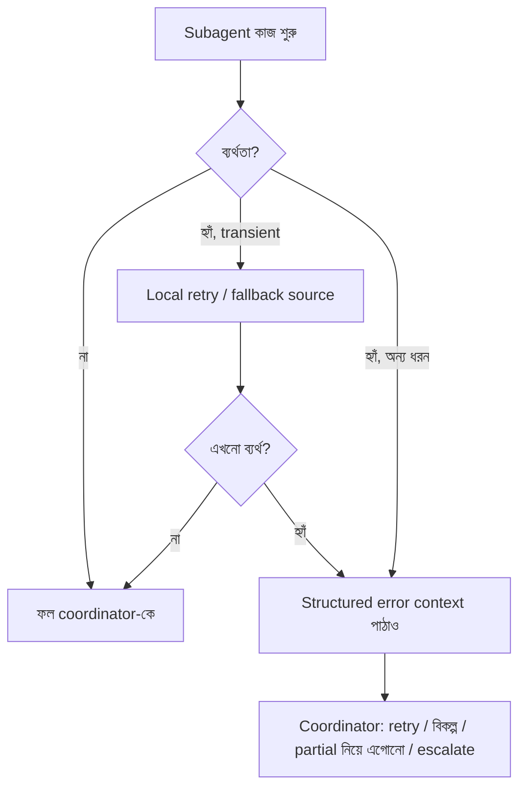

import ReadingProgress from '../../../../components/progress/ReadingProgress.astro';
import MarkComplete from '../../../../components/progress/MarkComplete.astro';
import KeywordTable from '../../../../components/content/KeywordTable.astro';
import ExamTrap from '../../../../components/content/ExamTrap.astro';
import BuildExercise from '../../../../components/content/BuildExercise.astro';
import Attribution from '../../../../components/content/Attribution.astro';

<ReadingProgress />

<div class="lesson-meta">
	<span class="lesson-badge">Domain 5</span>
	<span class="lesson-task">Task 5.3 · ওয়েট ১৫%</span>
	<span class="lesson-source">মূল ইংরেজি: Error Propagation in Multi-Agent Systems</span>
</div>

## এই লেসনে যা জানতে হবে

Error propagation ঠিক করে multi-agent সিস্টেম সুস্থভাবে সামলে উঠবে, নাকি চুপচাপ ব্যর্থ হবে। Subagent যখন ব্যর্থতা দেখে — timeout, permission error, invalid query — সেই ব্যর্থতার তথ্য coordinator-এর কাছে কীভাবে ফেরে, তা সিস্টেমের নির্ভরযোগ্যতা নির্ধারণ করে। পরীক্ষা দেখে: structured error context, দুটি গুরুতর anti-pattern, আর সেই পার্থক্য যা বেশিরভাগ ডেভেলপার ভুল করে — **access failure বনাম valid empty result**।

## Structured Error Context

Subagent ব্যর্থ হলে coordinator-কে এমন structured error context ফেরাতে হবে, যাতে সে বুদ্ধিমান পুনরুদ্ধার-সিদ্ধান্ত নিতে পারে। এই context-এ চারটি উপাদান লাগে:

1. **Failure type।** শ্রেণি বাছুন: **transient** (timeout, rate limit — retry-তে সফল হতে পারে), **validation** (খারাপ input — query ঠিক করুন), **business** (নিয়ম ভঙ্গ — escalate বা বিকল্প খুঁজুন), **permission** (অ্যাক্সেস নেই — authorization বদল ছাড়া retry করা যাবে না)।
2. **কী করতে চেয়েছিল।** নির্দিষ্ট query, ব্যবহৃত parameter আর লক্ষ্য সিস্টেম। "Searched academic database for 'renewable energy policy' with date range 2022-2024" কার্যকর; "Search failed" নয়।
3. **ব্যর্থতার আগে জমানো আংশিক ফল।** পাঁচটির মধ্যে তিনটি সোর্স পেয়ে timeout হলে সেই তিনটি তথ্য মূল্যবান। পুরো operation ব্যর্থ বলে ফেলে দেওয়া অপচয়।
4. **সম্ভাব্য বিকল্প পথ।** Subagent নিজের ক্ষেত্র জানে। Academic database ডাউন হলে অন্য database, বিস্তৃত search term, বা cached result-এর প্রস্তাব দিতে পারে। এই পরামর্শ coordinator-কে পুনরুদ্ধার কৌশল ঠিক করতে সাহায্য করে।

```json
{
  "status": "partial_failure",
  "failureType": "transient",
  "attemptedAction": {
    "tool": "search_academic_db",
    "query": "renewable energy policy",
    "dateRange": "2022-2024"
  },
  "partialResults": [
    {
      "title": "EU Renewable Energy Directive 2023",
      "source": "EUR-Lex",
      "retrieved": true
    }
  ],
  "alternativeApproaches": [
    "Retry with narrower date range (2023-2024)",
    "Search alternative database: government_publications",
    "Use cached results from previous research session"
  ]
}
```

এই গঠন coordinator-কে সিদ্ধান্তের সব উপকরণ দেয়: একই query retry, বিকল্প চেষ্টা, আংশিক ফল নিয়ে এগোনো, বা escalate।

## দুটি Anti-Pattern

পরীক্ষা এগুলো সরাসরি ধরে। দুটিই ভিন্নভাবে বিপর্যয়কর:

**Silent suppression:** result খালি রেখে success হিসেবে ফেরানো। এটিই সবচেয়ে খারাপ anti-pattern। Subagent timeout দেখে ফেরায় `{ "results": [], "status": "success" }`। Coordinator ভাবে search চলেছে কিন্তু কিছু মেলেনি। সে retry করবে না, বিকল্প চেষ্টা করবে না, আর এমন একটি synthesis বানাবে যেখানে পুরো একটি গবেষণা ক্ষেত্র চুপচাপ বাদ পড়ে। চূড়ান্ত আউটপুট সম্পূর্ণ দেখায়; আসলে গুরুত্বপূর্ণ অংশ নেই।

Silent suppression বিশেষভাবে বিপজ্জনক কারণ এটি অদৃশ্য। আউটপুট ঠিক দেখায় — কেবল শূন্যতা থাকে যা কেউ ধরতে পারে না। Customer support-এ এর অর্থ হতে পারে: order lookup সিস্টেম ডাউন থাকতে agent রিপোর্ট করে "no orders found", আর গ্রাহককে বলে তার কোনো অ্যাকাউন্ট নেই।

**Workflow termination:** একটি ব্যর্থতায় পুরো pipeline বন্ধ করে দেওয়া। একটি subagent timeout করল, আর পুরো research pipeline ভেঙে পড়ল। বাকি চারটি subagent সফলভাবে শেষ করেছে, কিন্তু তাদের ফল ফেলে দেওয়া হলো। এটি proportionate প্রতিক্রিয়া নয় — সম্পূর্ণ কাজ নষ্ট করে, আর পুনরুদ্ধারের পথই রাখে না।

সঠিক মধ্যবর্তী পথ **structured error propagation**: ব্যর্থ subagent কী ঘটল জানায়, coordinator ক্ষতির মাত্রা বিচার করে, আর সিস্টেম আংশিক ফল বা লক্ষ্যভিত্তিক পুনরুদ্ধার নিয়ে এগোয়।

## Access Failure বনাম Valid Empty Result

এই পার্থক্য জরুরি, আর পরীক্ষা সরাসরি ধরে:

- **Access failure:** টুল ডেটা-সোর্স পর্যন্ত পৌঁছাতেই পারেনি। Timeout, connection error, permission denial। Search চলে নি। একই বা বদলানো parameter নিয়ে retry বিবেচনা করুন।
- **Valid empty result:** টুল সোর্সে পৌঁছে query চালিয়েছে। কিছু মেলেনি। **এটিই উত্তর।** Retry লাগবে না, কারণ সিস্টেম ঠিকই চলেছিল — এই query-তে কোনো ফল নেই।

দুটোকে মিলিয়ে ফেললে দুই সমস্যা:

- Access failure-কে valid empty result ধরলে যেখানে retry দরকার সেখানে কখনো করবেন না।
- Valid empty result-কে access failure ধরলে এমন query বারবার চালিয়ে সময় নষ্ট করবেন, যা কখনো কিছু ফেরাবে না।

```python
# Access failure — retry বিবেচনা করুন
{
  "status": "error",
  "failureType": "transient",
  "message": "Connection timeout after 30s",
  "shouldRetry": True
}

# Valid empty result — retry লাগবে না
{
  "status": "success",
  "results": [],
  "message": "Query executed successfully. No matching records found.",
  "shouldRetry": False
}
```

## Coverage Annotation

Synthesis agent একাধিক subagent-এর finding মিলিয়ে আউটপুট বানালে কোন ক্ষেত্র ভালোভাবে সমর্থিত আর কোথায় শূন্যতা, তা উল্লেখ করা উচিত। Geothermal energy নিয়ে একটি subagent সোর্স আনতে ব্যর্থ হলে synthesis-এ লেখা উচিত:

> "Section on geothermal energy is limited due to unavailable journal access during research."

চুপচাপ বিষয়টি বাদ দেওয়ার চেয়ে এটি অনেক ভালো। Coverage annotation পড়ুয়াকে জানায় রিপোর্ট কী পুরোপুরি ঢাকে আর কোথায় জানা সীমাবদ্ধতা আছে। এটি না থাকলে synthesis-এর শূন্যতা দেখে মনে হয় বিষয়টি প্রাসঙ্গিক ছিলই না — অথচ আসলে সোর্স পাওয়া যায়নি।

## Transient ব্যর্থতায় Local Recovery

Subagent-এর উচিত transient ব্যর্থতা নিজে সামলানো — retry logic, fallback source, degraded response — তারপর error coordinator-এর কাছে পাঠানো। কেবল যে ব্যর্থতা subagent নিজে সারাতে পারে না, তা উপরে পাঠান। পাঠানোর সময় সবসময় কী করতে চেয়েছিল আর আংশিক ফল যা জুটেছে, তা যোগ করুন।

এতে coordinator-এর জটিলতা কমে। প্রতিটি subagent-এর প্রতিটি সম্ভাব্য transient ব্যর্থতার retry logic coordinator-কে সামলাতে হয় না। প্রতিটি subagent নিজের transient ব্যর্থতা সামলায়, আর কেবল স্থায়ী ব্যর্থতাই উপরে তোলে।



## পরীক্ষার ফাঁদ

<ExamTrap>
	<p>
		<strong>Timeout ধরে খালি result success হিসেবে ফেরানো</strong> — Silent suppression সব পুনরুদ্ধার আটকে দেয়। Coordinator ভাবে search সফল কিন্তু কিছু মেলেনি, তাই কখনো বিকল্প চেষ্টা করবে না। সবচেয়ে খারাপ anti-pattern।
	</p>
</ExamTrap>

<ExamTrap>
	<p>
		<strong>একটি subagent timeout করলেই পুরো research pipeline বন্ধ করা</strong> — Workflow termination অন্য subagent-দের সফল আংশিক ফল নষ্ট করে। Coordinator-এর উচিত ব্যর্থতা বিচার করে লক্ষ্যভিত্তিক পুনরুদ্ধারের সিদ্ধান্ত নেওয়া।
	</p>
</ExamTrap>

<ExamTrap>
	<p>
		<strong>Retry শেষে সাধারণ "search unavailable" status ফেরানো</strong> — Generic error coordinator-এর কাছ থেকে query, আংশিক ফল ও বিকল্প পথ লুকায়। Structured error context-informed পুনরুদ্ধার চালু করে; generic status তা আটকায়।
	</p>
</ExamTrap>

<ExamTrap>
	<p>
		<strong>Valid empty result দেখে ব্যর্থতা ভেবে আবার retry করা</strong> — Valid empty result মানে query সফলভাবে চলেছে কিন্তু কিছু মেলেনি। এটিই উত্তর। Retry করলে এমন query-তে সময় ও সম্পদ নষ্ট হয়, যা কখনো কিছু ফেরাবে না।
	</p>
</ExamTrap>

<KeywordTable keywords={frontmatter.keywords} />

## প্র্যাকটিস সিনারিও (নিজে উত্তর ভাবুন, তারপর খুলুন)

> একটি multi-agent research সিস্টেমের web search subagent জটিল বিষয় খুঁজতে গিয়ে timeout করল। এই ব্যর্থতার তথ্য coordinator-এর কাছে কীভাবে ফিরবে, তা আপনাকে ডিজাইন করতে হবে। কোন পথ সবচেয়ে ভালো বুদ্ধিমান পুনরুদ্ধার চালু করবে?

<details>
	<summary>উত্তর দেখুন</summary>

	**সঠিক উত্তর:** Failure type, চাওয়া query, আংশিক ফল আর সম্ভাব্য বিকল্প পথসহ structured error context ফেরান।

	**কেন বাকিগুলো ভুল:**

	- *Timeout ধরে খালি result success হিসেবে ফেরানো* — Silent suppression; coordinator কখনো retry বা বিকল্প চেষ্টা করবে না, আর পুরো একটি ক্ষেত্র চুপচাপ বাদ পড়বে।
	- *Timeout exception উপরে ছুড়ে পুরো workflow একবারে বন্ধ করা* — Workflow termination; অন্য subagent-এর কাজ নষ্ট, পুনরুদ্ধারের পথ নেই।
	- *Exponential backoff-এ retry, শেষে "search unavailable" status* — Local retry ভালো, কিন্তু শেষে generic status দিলে query-র অস্তিত্ব, আংশিক ফল ও বিকল্প পথ coordinator-এর কাছে অজানা থেকে যায়।

</details>

<BuildExercise
	title="Structured Error Propagation সিস্টেম বানান"
	difficulty="Advanced"
	time="৫০ মিনিট"
	objectives={[
		'চার উপাদানসহ structured error context ডিজাইন: failure type, attempted action, partial results, alternative approaches',
		'Access failure (timeout, connection error) আর valid empty result (query সফল, কিছু মেলেনি) আলাদা করা',
		'দুটি anti-pattern চেনা ও এড়ানো: silent suppression ও workflow termination',
		'Coordinator-এর কাছে পাঠানোর আগে transient ব্যর্থতায় local retry logic',
		'Synthesis আউটপুটে তথ্যের শূন্যতা স্বচ্ছ করতে coverage annotation যোগ করা',
	]}
	steps={[
		{
			title: 'একটি structured error schema define করুন: failureType (transient/validation/business/permission), attemptedAction (tool, query, parameters), partialResults (array), alternativeApproaches (suggested recovery)।',
			why: 'Structured error context coordinator-কে retry, বিকল্প, partial নিয়ে এগোনো, বা escalate — সব সিদ্ধান্তের উপকরণ দেয়; "search unavailable"-এর মতো generic message informed recovery আটকায়।',
			expect: 'একটি TypeScript interface বা JSON schema, যেখানে failureType চার শ্রেণির enum, attemptedAction-এ tool/query/parameters, partialResults একটি array, আর alternativeApproaches string array; প্রতিটি field-এর উদ্দেশ্য ব্যাখ্যা করা।',
		},
		{
			title: 'এমন একটি subagent বানান, যার error reporting access failure (timeout, connection error) আর valid empty result (query সফল, কিছু মেলেনি) আলাদা করে।',
			why: 'দুটোকে গুলিয়ে ফেলা গুরুতর ভুল, যা পরীক্ষা সরাসরি ধরে: access failure মানে query চলে নি, retry দরকার; valid empty result মানে query সফল, কিছু মেলেনি — এটিই উত্তর।',
			expect: 'একটি subagent ফাংশন, যা exception (timeout, connection error) ধরে access failure হিসেবে shouldRetry: true দেয়, আর ফল-শূন্য সফল query-কে success হিসেবে খালি array ও shouldRetry: false দেয়।',
		},
		{
			title: 'Subagent-এর ভেতরে transient ব্যর্থতার local retry logic (exponential backoff-এ ৩ বার) যোগ করুন, coordinator-এর কাছে পাঠানোর আগে।',
			why: 'Subagent নিজের transient ব্যর্থতা নিজে সামলালে coordinator-এর জটিলতা কমে; কেবল local retry-তেও টিকে যাওয়া স্থায়ী ব্যর্থতাই উপরে ওঠে।',
			expect: 'Exponential backoff-সহ (যেমন ১s, ২s, ৪s) একটি retry wrapper, যা operation ৩ বার চেষ্টা করে, তারপর structured error coordinator-এর কাছে পাঠায়; ব্যর্থতার আগের আংশিক ফল retry জুড়ে সংরক্ষিত থাকে।',
		},
		{
			title: 'একটি coordinator বানান, যা structured error পেয়ে সিদ্ধান্ত নেয়: বদলানো query-তে retry, বিকল্প পথ, নাকি আংশিক ফল নিয়ে এগোনো।',
			why: 'Coordinator-ই বুদ্ধিমান পুনরুদ্ধারের সিদ্ধান্তকারী; structured error context থাকলে সবকিছু এক নীতিতে না ফেলে informed সিদ্ধান্ত নেয় — silent suppression আর workflow termination-এর মাঝের সঠিক পথ।',
			expect: 'একটি coordinator ফাংশন, যা failure type দেখে, আংশিক ফল যাচাই করে, alternative approach বিচার করে উপযুক্ত পুনরুদ্ধার কৌশল বাছে; চার ধরনের ব্যর্থতা ভিন্নভাবে সামলায়, কখনো চুপচাপ গোপন করে না।',
		},
		{
			title: 'Synthesis আউটপুটে coverage annotation যোগ করুন — কোন finding ভালোভাবে সমর্থিত আর কোন ক্ষেত্রে সোর্স না-পাওয়ায় শূন্যতা।',
			why: 'Coverage annotation পড়ুয়াকে জানায় কোন অংশ পূর্ণ আর কোথায় জানা সীমাবদ্ধতা; না থাকলে শূন্যতা দেখে মনে হয় বিষয়টি প্রাসঙ্গিক ছিলই না, অথচ সোর্স পাওয়া যায়নি।',
			expect: 'Synthesis আউটপুটে একটি coverage অংশ, যেখানে প্রতিটি ক্ষেত্রের ডেটা-মান লেখা: well-supported, limited (কারণসহ), বা unavailable (কারণসহ)। ব্যর্থ subagent-এর ক্ষেত্র স্পষ্টভাবে উল্লিখিত, চুপচাপ বাদ নয়।',
		},
	]}
/>

## সূত্র

<ul>
	{frontmatter.sources.map((source) => (
		<li>
			<a href={source.href} target="_blank" rel="noopener noreferrer">
				{source.label}
			</a>
			{source.note ? ` — ${source.note}` : ''}
		</li>
	))}
</ul>

<Attribution sourceUrl={frontmatter.sourceUrl} updated={frontmatter.updated} />

<MarkComplete lessonId="5-3" />
