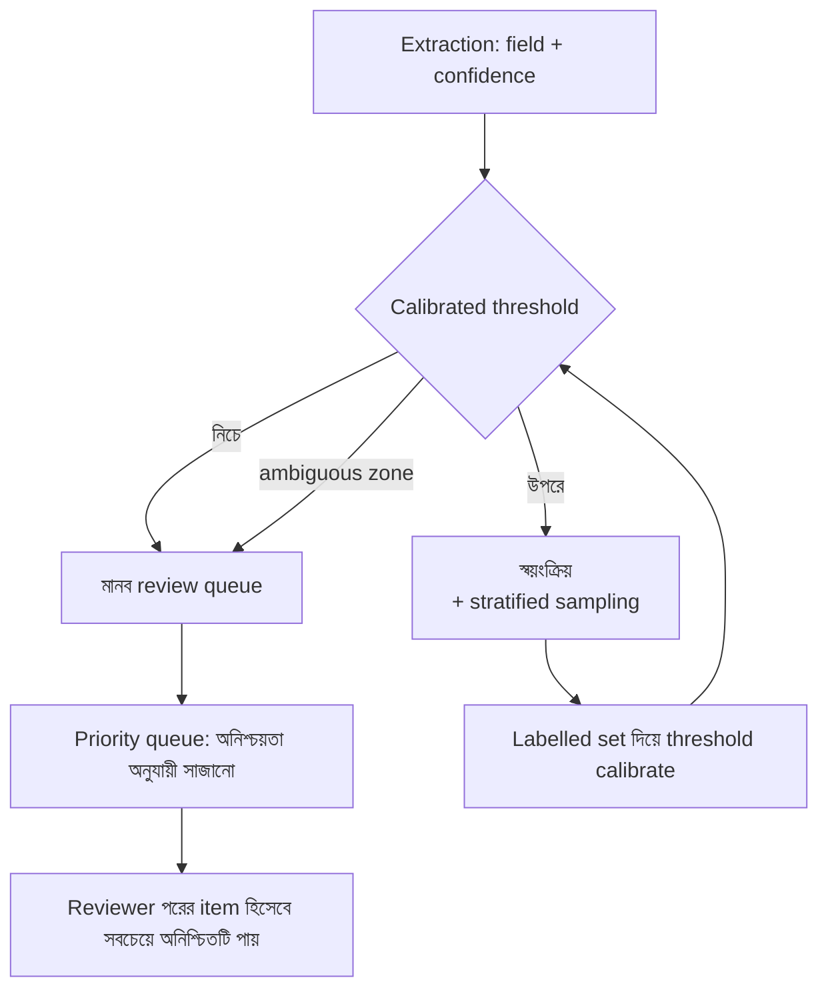

import ReadingProgress from '../../../../components/progress/ReadingProgress.astro';
import MarkComplete from '../../../../components/progress/MarkComplete.astro';
import KeywordTable from '../../../../components/content/KeywordTable.astro';
import ExamTrap from '../../../../components/content/ExamTrap.astro';
import BuildExercise from '../../../../components/content/BuildExercise.astro';
import Attribution from '../../../../components/content/Attribution.astro';

<ReadingProgress />

<div class="lesson-meta">
	<span class="lesson-badge">Domain 5</span>
	<span class="lesson-task">Task 5.5 · ওয়েট ১৫%</span>
	<span class="lesson-source">মূল ইংরেজি: Human Review & Confidence Calibration</span>
</div>

## এই লেসনে যা জানতে হবে

মানব review স্বয়ংক্রিয় extraction ও classification সিস্টেমের safety net। পরীক্ষা দেখে — কখন ও কীভাবে human reviewer কাজে লাগানো হয়। মূল চ্যালেঞ্জ human review লাগবে কি না তা নয়, বরং সীমিত reviewer ক্ষমতা কীভাবে ভাগ করলে accuracy সবচেয়ে বাড়ে আর খরচ কমে। এর জন্য দরকার confidence calibration, aggregate metric-এর ফাঁদ চেনা, আর stratified sampling কৌশল।

## Aggregate Metrics-এর ফাঁদ

Production extraction সিস্টেমে এটিই সবচেয়ে বিপজ্জনক ভ্রান্ত ধারণা। সিস্টেম জানায় সামগ্রিক accuracy ৯৭%। দল উৎসব করে। ব্যবস্থাপনা সব high-confidence extraction স্বয়ংক্রিয় করার অনুমোদন দেয়।

সমস্যা: সেই ৯৭% নির্দিষ্ট ডকুমেন্ট-ধরনে বিপর্যয়কর ব্যর্থতার হার লুকিয়ে রাখে। Standard invoice থেকে তারিখ তোলার accuracy ৯৯.৫%। কিন্তু হাতে লেখা receipt? ৬০%। দুর্বল OCR-এর scanned PDF? ৭২%। অ-মানক ফরম্যাটের আন্তর্জাতিক ডকুমেন্ট? ৪৫%।

Aggregate সেই segment-গুলো ঢেকে দেয়, যেখানে সিস্টেম সবচেয়ে খারাপ করে। আর সেই segment-গুলোতেই প্রায়ই ব্যবসায়িক ক্ষতি সবচেয়ে বেশি — মাঠকর্মীর হাতে লেখা receipt, নতুন সরবরাহকারীর আন্তর্জাতিক invoice, compliance audit-এর পুরনো scanned ডকুমেন্ট।

নিয়ম: automation-এর আগে **সবসময়** ডকুমেন্ট-ধরন **এবং** field segment ধরে accuracy যাচাই করুন। কেবল aggregate metric দেখে automation সিদ্ধান্ত নেবেন না।

| ডকুমেন্ট-ধরন | তারিখের accuracy | অঙ্কের accuracy | নামের accuracy |
| --- | --- | --- | --- |
| Standard invoice | ৯৯.৫% | ৯৮.২% | ৯৭.৮% |
| হাতে লেখা receipt | ৬০.১% | ৫৫.৩% | ৭১.২% |
| Scanned PDF | ৭২.৪% | ৬৯.৮% | ৮০.১% |
| আন্তর্জাতিক ফরম্যাট | ৪৫.২% | ৫২.১% | ৬৩.৪% |
| **Aggregate** | **৯৭.০%** | **৯৬.১%** | **৯৫.৮%** |

Aggregate দারুণ দেখায়, কারণ standard invoice-ই volume-এ প্রাধান্য পায়। কিন্তু তিনটি ডকুমেন্ট-ধরনের accuracy অগ্রহণযোগ্য, যা volume-weighted average-এ ঢাকা পড়ে।

## Stratified Random Sampling

ডকুমেন্ট-ধরন ও field ধরে যাচাই করার পরেও ধারাবাহিক verification দরকার। Stratified random sampling মানে প্রতিটি stratum (ডকুমেন্ট-ধরন, confidence band, field-ধরন) থেকে প্রতিনিধিত্বমূলক sample বেছে মানুষ দিয়ে যাচাই করানো।

মূল কথা: **উচ্চ-confidence extraction-ও sample করতে হবে**, কেবল নিম্ন-confidence নয়। নিম্ন-confidence item আগেই মানব review-তে যাচ্ছে; উচ্চ-confidence স্বয়ংক্রিয়। মডেলে এমন নতুন error pattern জন্মালে যা উচ্চ-confidence extraction-এ প্রভাব ফেলে, কেবল stratified sampling-ই তা ধরবে।

Stratified sampling-এর দুই কাজ:

- **ধারাবাহিক accuracy পরিমাপ** — প্রতিটি segment তার যাচাই করা accuracy হার ধরে রেখেছে কি না নিশ্চিত করা।
- **নতুন error pattern শনাক্ত** — প্রাথমিক validation set-এ না-থাকা নতুন failure mode খুঁজে বের করা।

Stratified sampling ছাড়া স্বয়ংক্রিয় extraction নিয়ে আপনি অন্ধভাবে চলছেন। নতুন ডকুমেন্ট ফরম্যাটে সিস্টেমে systematic error জন্মাতে পারে, আর downstream ব্যবসায়িক প্রক্রিয়া ভাঙার আগে আপনি তা জানবেন না।

## Field-Level Confidence ক্যালিব্রেশন

মডেল প্রতিটি field-এর জন্য confidence score দিতে পারে। Invoice extraction-এ সে জানাতে পারে:

```json
{
  "vendorName": {"value": "Acme Corp", "confidence": 0.98},
  "invoiceDate": {"value": "2024-03-15", "confidence": 0.95},
  "totalAmount": {"value": "$1,247.83", "confidence": 0.72},
  "lineItems": {"value": [...], "confidence": 0.61}
}
```

কিন্তু কাঁচা confidence score calibrated নয়। যে মডেল ০.৯৫ confidence জানায়, সে নির্দিষ্ট field-ধরনে আসলে ৮৮% সময় সঠিক হতে পারে, আবার অন্যত্র ৯৯%। Confidence score আপেক্ষিক, পরম নয়।

Calibration-এর জন্য **labelled validation set** (ground truth data) লাগে। সঠিক extraction জানা কিছু ডকুমেন্ট নিন, মডেল চালান, তার confidence score-এর সঙ্গে আসল accuracy মিলিয়ে একটি calibration curve বানান। এতে বোঝা যায়: "date field-এ যখন মডেল ০.৯০ confidence জানায়, আসলে ৯৪% সময় সঠিক; amount field-এ ০.৯০ মানে আসলে ৮২%।"

তারপর calibrated threshold routing চালায়:

- Calibrated threshold-এর উপরে থাকা field → স্বয়ংক্রিয় (stratified sampling-সহ)
- Threshold-এর নিচে → মানব review
- Ambiguous zone-এর field → অগ্রাধিকারভিত্তিক মানব review

## Reviewer Capacity Prioritisation

মানব reviewer ব্যয়বহুল ও সীমিত। পরীক্ষা দেখে — তাদের ক্ষমতা কার্যকরভাবে ভাগ করা যায় কি না।

সবচেয়ে অনিশ্চিত item আগে reviewer-দের কাছে পাঠান। অর্থাৎ:

- নিম্ন model confidence field
- দ্ব্যর্থক বা পরস্পরবিরোধী উৎস ডকুমেন্ট থেকে extraction
- ঐতিহাসিকভাবে দুর্বল accuracy-র ডকুমেন্ট-ধরন
- যে field-এ মডেল অনিশ্চয়তা জানায় (যেমন একাধিক সম্ভাব্য ব্যাখ্যা)

Reviewer ক্ষমতা সব extraction-এ সমানভাবে ছড়িয়ে দেবেন না। সমান ভাগে সময় নষ্ট হয় ভালোভাবে সামলানো উচ্চ-confidence item দেখতে, আর যে অনিশ্চিত item-গুলোর সত্যিই মানুষের বিচার দরকার সেগুলোর জন্য ক্ষমতা কম পড়ে।

Prioritisation **dynamic** হওয়া উচিত, static নয়। সিস্টেম ডকুমেন্ট প্রসেস করার সঙ্গে মানব review-র অপেক্ষায় থাকা item-এর queue অনিশ্চয়তা অনুযায়ী সাজানো থাকবে। একজন reviewer একটি item শেষ করলে তার queue-র পরের item হওয়া উচিত সবচেয়ে বেশি অনিশ্চিতটি, শুধু কালানুক্রমিক পরেরটি নয়।



## Automation-এর আগে Validation ক্রম

ক্রমটি গুরুত্বপূর্ণ:

1. ডকুমেন্ট-ধরন ও field segment ধরে accuracy মাপুন — aggregate নয়।
2. Labelled validation set দিয়ে confidence score calibrate করুন।
3. Automation বনাম মানব review-র জন্য calibrated threshold ঠিক করুন।
4. স্বয়ংক্রিয় extraction-এর ধারাবাহিক verification-এ stratified random sampling চালু করুন।
5. **এরপরই** যেসব segment ধারাবাহিক, যাচাই করা accuracy দেখায় সেসব segmentে মানব review কমান।

Aggregate metric দেখে সোজা ৫ নম্বর ধাপে লাফ দেওয়াই ফাঁদ। এই ক্রমের প্রতিটি ধাপ একটি নির্দিষ্ট failure mode ঠেকাতে আছে।

## পরীক্ষার ফাঁদ

<ExamTrap>
	<p>
		<strong>সব high-confidence extraction স্বয়ংক্রিয় করার যুক্তি হিসেবে aggregate accuracy (৯৭%) দেখানো</strong> — Aggregate metric ধরনভেদে কর্মদক্ষতা লুকায়; ৯৭% সামগ্রিক মানে নির্দিষ্ট ডকুমেন্ট-ধরনে ৪০% accuracy হতে পারে। Automation-এর আগে ধরন ও field ধরে যাচাই করুন।
	</p>
</ExamTrap>

<ExamTrap>
	<p>
		<strong>মানব review-র জন্য কেবল নিম্ন-confidence extraction sample করা</strong> — উচ্চ-confidence extraction স্বয়ংক্রিয়। নতুন error pattern সেগুলোতে প্রভাব ফেললে কেবল stratified random sampling-ই তা ধরবে।
	</p>
</ExamTrap>

<ExamTrap>
	<p>
		<strong>Calibration ছাড়াই কাঁচা model confidence score ব্যবহার</strong> — কাঁচা score calibrated নয়। Date field-এ ০.৯০ মানে ৯৪% আসল accuracy হওয়া সম্ভব, আবার amount field-এ ০.৯০ মানে মাত্র ৮২%। Labelled validation set দিয়ে calibrate করুন।
	</p>
</ExamTrap>

<ExamTrap>
	<p>
		<strong>Reviewer ক্ষমতা সব extraction-এ সমানভাবে ছড়ানো</strong> — সমান ভাগে উচ্চ-confidence item-এ সময় নষ্ট হয়; সীমিত ক্ষমতা সবচেয়ে অনিশ্চিত item-এ আগে খরচ করুন, যেখানে মানুষের বিচার সবচেয়ে বেশি কাজে লাগে।
	</p>
</ExamTrap>

<KeywordTable keywords={frontmatter.keywords} />

## প্র্যাকটিস সিনারিও (নিজে উত্তর ভাবুন, তারপর খুলুন)

> একটি structured data extraction সিস্টেম সব ডকুমেন্ট-ধরনে মিলিয়ে ৯৭% সামগ্রিক accuracy পায়। দল প্রস্তাব করছে, model confidence ৯৫%-এর বেশি হলে সব extraction স্বয়ংক্রিয় করে মানব review-র খরচ কমানো হবে। এই পদ্ধতির গুরুতর ঝুঁকি কী?

<details>
	<summary>উত্তর দেখুন</summary>

	**সঠিক উত্তর:** Aggregate accuracy নির্দিষ্ট ডকুমেন্ট-ধরন বা field-এ দুর্বল ফল লুকাতে পারে, আর confidence score ব্যবহারের আগে labelled validation set-এ calibrate করা দরকার।

	**কেন বাকিগুলো ভুল:**

	- *Confidence যাই হোক সব স্বয়ংক্রিয় extraction-এ মানব review লাগবে* — সীমিত reviewer ক্ষমতার অপচয়; উচ্চ-confidence, যাচাই করা segment-এ review কমানোই লক্ষ্য।
	- *৯৫% threshold খুব কম, ৯৯% করা উচিত* — আসল সমস্যা threshold-এর সংখ্যা নয়; calibration ছাড়া যেকোনো সংখ্যা মানে নির্বিচারে ধরে নেওয়া।
	- *সময়ের সঙ্গে model overconfident হবে, নিয়মিত retraining লাগবে* — ভুল কারণ নির্ণয়; মূল সমস্যা segment-ভিত্তিক validate না করা আর কাঁচা confidence।

</details>

<BuildExercise
	title="Confidence-Calibrated Review Router বানান"
	difficulty="Advanced"
	time="৫০ মিনিট"
	objectives={[
		'Aggregate metric-এর ফাঁদ চেনা: ৯৭% সামগ্রিক accuracy নির্দিষ্ট ডকুমেন্ট-ধরনে ৪০% ব্যর্থতা লুকাতে পারে',
		'ডকুমেন্ট-ধরন ও field segment ধরে ভাঙা accuracy ট্র্যাকিং',
		'Labelled validation set দিয়ে কাঁচা confidence score calibrate করে নির্ভরযোগ্য routing threshold বানানো',
		'উচ্চ-confidence extraction-সহ stratified random sampling ডিজাইন',
		'Dynamic queue ordering দিয়ে সীমিত reviewer ক্ষমতা সবচেয়ে অনিশ্চিত item-এ আগে খরচ',
	]}
	steps={[
		{
			title: 'একটি mock extraction সিস্টেম বানান, যা বিভিন্ন ডকুমেন্ট-ধরনে (invoice, receipt, scanned PDF, আন্তর্জাতিক ডকুমেন্ট) field-level confidence score দেয়।',
			why: 'Field-level confidence score বুদ্ধিমান review routing-এর ভিত্তি; পরীক্ষা ধরে কাঁচা model confidence calibrated নয়, ব্যবহারের আগে ground truth-সহ যাচাই দরকার।',
			expect: 'একটি extraction ফাংশন, যা প্রতিটি field-এর মান ও ০.০–১.০ confidence দেয়; অন্তত ৪টি ডকুমেন্ট-ধরনে চলে, আর ধরনভেদে confidence বিতরণ স্পষ্টভাবে আলাদা।',
		},
		{
			title: 'শুধু aggregate নয় — ডকুমেন্ট-ধরন ও field segment ধরে ভাঙা accuracy ট্র্যাকিং যোগ করুন।',
			why: 'Aggregate metric-এর ফাঁদ production extraction সিস্টেমে সবচেয়ে বিপজ্জনক ভ্রান্তি: standard invoice volume-এ প্রাধান্য পেলে ৯৭% সামগ্রিক accuracy নির্দিষ্ট ধরনে বিপর্যয় লুকায়।',
			expect: 'প্রতিটি ডকুমেন্ট-ধরন ও field-এর জোড়া আলাদা দেখানো accuracy টেবিল: standard invoice ৯৫%+, হাতে লেখা receipt ও আন্তর্জাতিক ডকুমেন্ট ৪০–৭০%, অথচ aggregate ৯০%+-এ দারুণ দেখায়।',
		},
		{
			title: 'একটি calibration module বানান, যা labelled validation set (ground truth) নিয়ে প্রতি field-ধরন ও ডকুমেন্ট-ধরনের জন্য calibrated threshold বের করে।',
			why: 'কাঁচা model confidence calibrated নয়: date field-এ ০.৯০ মানে আসলে ৯৪% সঠিক, কিন্তু amount field-এ ০.৯০ মানে ৮২%। Calibration ছাড়া confidence দিয়ে automated routing সিদ্ধান্ত নেওয়া যায় না।',
			expect: 'প্রতি field-ধরন ও ডকুমেন্ট-ধরনে একটি calibration curve, যা জানানো confidence সীমাকে আসল accuracy শতাংশে মেলায়; একই confidence score ভিন্ন field-ডকুমেন্ট জোড়ায় ভিন্ন অর্থ বহন করে।',
		},
		{
			title: 'Stratified random sampling যোগ করুন, যা উচ্চ-confidence extraction-ও ধারাবাহিক যাচাইয়ের জন্য সব ডকুমেন্ট-ধরন থেকে আনুপাতিকভাবে বাছে।',
			why: 'উচ্চ-confidence extraction স্বয়ংক্রিয়, review-হীন; নতুন error pattern সেগুলোতে জন্মালে কেবল stratified sampling তা ধরবে। শুধু নিম্ন-confidence দেখা মানে automated extraction-এর systematic error-এ অন্ধ থাকা।',
			expect: 'একটি sampling ফাংশন, যা প্রতিটি stratum (ডকুমেন্ট-ধরন ও confidence band) থেকে প্রতিনিধিত্বমূলক subset বাছে, উচ্চ-confidence automated extraction-ও ঢোকে, আর প্রতিটি stratum-এর volume অনুপাতে sample নেয়।',
		},
		{
			title: 'একটি review router বানান, যা সীমিত reviewer ক্ষমতা সবচেয়ে অনিশ্চিত item-এ আগে দেয় আর নতুন extraction এলে queue পুনর্বিন্যাস করে।',
			why: 'মানব reviewer ব্যয়বহুল ও সীমিত; সমানভাবে ছড়ালে উচ্চ-confidence item-এ সময় নষ্ট হয়, আর যেসব অনিশ্চিত item-এ মানুষের বিচার দরকার সেগুলোর ক্ষমতা কম পড়ে।',
			expect: 'একটি priority queue, যা অনিশ্চয়তা অনুযায়ী item সাজায় (সবচেয়ে কম confidence আগে), নতুন extraction এলে পুনর্বিন্যাস করে, আর প্রতিটি ফাঁকা reviewer-কে পরের সর্বোচ্চ-অনিশ্চয়তার item দেয়; কখনো কালানুক্রমে item দেয় না।',
		},
	]}
/>

## সূত্র

<ul>
	{frontmatter.sources.map((source) => (
		<li>
			<a href={source.href} target="_blank" rel="noopener noreferrer">
				{source.label}
			</a>
			{source.note ? ` — ${source.note}` : ''}
		</li>
	))}
</ul>

<Attribution sourceUrl={frontmatter.sourceUrl} updated={frontmatter.updated} />

<MarkComplete lessonId="5-5" />
