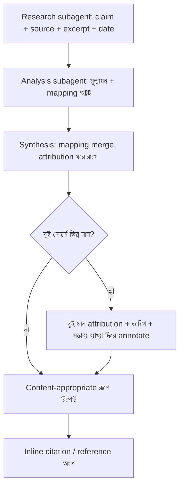

import ReadingProgress from '../../../../components/progress/ReadingProgress.astro';
import MarkComplete from '../../../../components/progress/MarkComplete.astro';
import KeywordTable from '../../../../components/content/KeywordTable.astro';
import ExamTrap from '../../../../components/content/ExamTrap.astro';
import BuildExercise from '../../../../components/content/BuildExercise.astro';
import Attribution from '../../../../components/content/Attribution.astro';

<ReadingProgress />

<div class="lesson-meta">
	<span class="lesson-badge">Domain 5</span>
	<span class="lesson-task">Task 5.6 · ওয়েট ১৫%</span>
	<span class="lesson-source">মূল ইংরেজি: Information Provenance & Multi-Source Synthesis</span>
</div>

## এই লেসনে যা জানতে হবে

Information provenance — প্রতিটি দাবি কোথা থেকে এসেছে আর তাতে কতটা আস্থা রাখা উচিত তা জানা — ঠিক করে research সিস্টেম বিশ্বাসযোগ্য আউটপুট দেবে, নাকি বিশ্বাসযোগ্য শোনা কল্পকাহিনি। পরীক্ষা দেখে — multi-agent synthesis pipeline-এ attribution কীভাবে টেকে (বা মরে), conflicting source কীভাবে সামলাতে হয়, আর temporal context কীভাবে মিথ্যা বিরোধ ঠেকায়।

## Structured Claim-Source Mapping

Multi-agent research সিস্টেমে প্রতিটি finding-কে নিজের provenance বহন করতে হবে। এটি ঐচ্ছিক metadata নয়; এটি গঠনগত জামিন, যাতে চূড়ান্ত আউটপুট নির্দিষ্ট সোর্স পর্যন্ত টেনে নেওয়া যায়। প্রতিটি finding-এ থাকতে হবে:

- **Claim:** যে নির্দিষ্ট দাবি করা হচ্ছে
- **Source URL:** তথ্যটি কোথায় পাওয়া গেছে
- **Document name:** সোর্স ডকুমেন্টের শিরোনাম
- **Relevant excerpt:** দাবিটিকে সমর্থন করে এমন নির্দিষ্ট অনুচ্ছেদ
- **Publication date:** সোর্স কখন প্রকাশিত, বা ডেটা কখন সংগ্রহ করা হয়েছে

```json
{
  "claim": "Global renewable energy investment reached $495 billion in 2023",
  "sourceUrl": "https://example.com/iea-report-2024",
  "documentName": "IEA World Energy Investment Report 2024",
  "relevantExcerpt": "Total investment in renewable energy technologies reached approximately $495 billion in calendar year 2023, representing a 17% increase over 2022.",
  "publicationDate": "2024-06-15"
}
```

মূল চ্যালেঞ্জ — **summarisation-এ attribution মরে যায়।** Synthesis agent একাধিক subagent-এর finding মেলালে স্বাভাবিকভাবেই সংক্ষেপ করে, নিজের ভাষায় লেখে। Claim-source mapping ধরে রাখার স্পষ্ট নির্দেশ না দিলে synthesis লেখে "Investment in renewable energy has grown significantly" — কোনো অঙ্ক নেই, সোর্স নেই, তারিখ নেই।

Downstream agent-কে synthesis জুড়ে claim-source mapping স্পষ্টভাবে ধরে রাখতে ও মেলাতে হবে। এর জন্য দরকার:

- Subagent-রা structured claim-source ফরম্যাটে finding দেবে।
- Synthesis agent-কে finding মেলানোর সময় এই mapping ধরে রাখতে বলা হবে।
- চূড়ান্ত আউটপুটে inline citation বা structured reference অংশ থাকবে, যা প্রতিটি claim-কে সোর্স পর্যন্ত টেনে নেয়।

## Conflict Handling

দুই বিশ্বাসযোগ্য সোর্স একই পরিমাপে ভিন্ন পরিসংখ্যান দিলে synthesis agent-এর সামনে গুরুত্বপূর্ণ সিদ্ধান্ত। ভুল পথ — যা পরীক্ষাও ধরে — ইচ্ছেমতো একটি মান বাছা।

উদাহরণ: Source A জানায় ১২% market growth। Source B জানায় ৮%। দুটোই বিশ্বাসযোগ্য প্রকাশনা।

**ভুল পথ:** সবচেয়ে সাম্প্রতিক সোর্স বাছা, বা মান দুটোর গড় করা, বা বেশি প্রামাণিক প্রকাশকের মান নেওয়া।

**সঠিক পথ:** দুই মানই পূর্ণ source attribution-সহ annotate করা। সিদ্ধান্ত পড়ুয়ার।

```markdown
Market growth estimates vary by source:
- **12% growth** — IEA World Energy Report (published June 2024, using 2023 calendar year data)
- **8% growth** — Bloomberg NEF Annual Review (published March 2024, using July 2022–June 2023 data)
The difference may reflect different reporting periods and methodological approaches.
```

এতে পূর্ণ ছবি টেকে। পড়ুয়া দুই মান দেখে, সোর্স বোঝে, আর নিজের প্রয়োজন অনুযায়ী কোনটি প্রাসঙ্গিক তা নিজে বিচার করে। ইচ্ছেমতো একটি মান বাছলে তথ্য ধ্বংস হয় আর মিথ্যা নিশ্চয়তা তৈরি হয়।

## Temporal Awareness

ভিন্ন publication তারিখ থেকেই ভিন্ন সংখ্যার ব্যাখ্যা মেলে। এটি বিরোধ নয়; temporal context — আর তা ধরে রাখতেই হবে।

দুটি সোর্স ভাবুন:

- Source A (প্রকাশ ২০২৩): ৮% growth জানায়
- Source B (প্রকাশ ২০২৪): ১২% growth জানায়

Publication date না থাকলে এরা বিরোধী দেখায়। তারিখ থাকলে এরা একটি কাহিনি বলে: মাপা সময়ে growth ৮% থেকে ১২%-এ ত্বরান্বিত হয়েছে। "বিরোধ" আসলে একটি প্রবণতা।

সব structured output-এ publication/data collection date রাখতে বলুন। এটি শুধু ফরমালিটি নয়; সঠিক ব্যাখ্যা সম্ভব করার উপাদান। Temporal context না থাকলে বৈধ trend-কে data quality সমস্যা ভেবে ভুল পড়া হয়, আর synthesis agent আসলে সামঞ্জস্যপূর্ণ finding-গুলো ভুলভাবে flag বা suppress করতে পারে।

Subagent-দের structured output-এ এই তারিখ দিতে হবে। Synthesis agent-কে merge করার সময় সেগুলো ধরে রাখতে হবে। আর চূড়ান্ত আউটপুটে ডেটার পাশেই তারিখ দেখাতে হবে।

## Content-Appropriate Rendering

বিভিন্ন ধরনের কনটেন্ট ভিন্ন উপস্থাপন দাবি করে। পরীক্ষা দেখে — synthesis-এ সব কিছু একই ফরম্যাটে চাপা উচিত নয়:

- **আর্থিক ডেটা → টেবিল।** সংখ্যা, তুলনা ও প্রবণতা টেবিলে সবচেয়ে স্পষ্ট। আর্থিক ডেটা গদ্যের অনুচ্ছেদে চাপ দিলে মান মেলানো ও pattern ধরা কঠিন হয়।
- **সংবাদ ও চলতি ঘটনা → গদ্য।** Narrative context, কারণ-ফল সম্পর্ক আর কালানুক্রমিক ঘটনা অনুচ্ছেদে স্বাভাবিকভাবে পড়া যায়।
- **প্রযুক্তিগত finding → structured list।** Architecture pattern, API specification ও configuration option স্পষ্ট শ্রেণিবিন্যাসসহ bullet বা numbered list-এ সবচেয়ে পরিষ্কার।

সব কনটেন্ট এক ফরম্যাটে চাপানো — সব table, বা সব গদ্য, বা সব list — পড়ার সহজতা ও বোঝাপড়া কমায়। Synthesis agent কনটেন্টের ধরন দেখে উপযুক্ত রূপ বাছবে।

| বছর | বিনিয়োগ ($B) | বৃদ্ধি (%) |
| --- | --- | --- |
| 2021 | 366 | 12% |
| 2022 | 423 | 16% |
| 2023 | 495 | 17% |

## Multi-Step Synthesis জুড়ে Attribution রক্ষা

Multi-agent pipeline-এ প্রতিটি ধাপে attribution টিকতে হবে:

- **Research subagent** claim-source mapping-সহ finding জমা করে।
- **Analysis subagent** finding বিচার করে মূল mapping ধরে রেখে মূল্যায়ন যোগ করে।
- **Synthesis subagent** একাধিক agent-এর finding মিলিয়ে mapping merge করে।
- **Report generation** inline citation-সহ চূড়ান্ত আউটপুট বানায়।

প্রতিটি ধাপে attribution হারানোর ঝুঁকি। সবচেয়ে সাধারণ ব্যর্থতার জায়গা ৩ নম্বর ধাপ, যেখানে synthesis agent source mapping সামনে না নিয়েই finding মিলিয়ে নিজের ভাষায় লেখে। Synthesis agent-এর prompt-এ স্পষ্টভাবে দাবি করতে হবে: তার আউটপুটের প্রতিটি claim নির্দিষ্ট সোর্স পর্যন্ত টেনে নেওয়া যায়।

রিপোর্টে আলাদা অংশ থাকা উচিত, যা সুপ্রতিষ্ঠিত finding আর বিতর্কিত finding আলাদা করে, আর মূল সোর্সের বর্ণনা ও পদ্ধতিগত প্রসঙ্গ ধরে রাখে। তিনটি স্বাধীন সোর্সে সমর্থিত finding আর একটি রিপোর্ট-ভিত্তিক finding এক নয় — গদ্যে দুটোকে সমান আত্মবিশ্বাসে দিলেও।

## বিরোধ অটুট রেখে Analysis শেষ করা

Document analysis-এ বিরোধপূর্ণ মান এলে analysis agent-কে বিরোধ অমীমাংসিত রেখে explicit annotation-সহ কাজ শেষ করতে হবে। সে বিরোধ মেটাবে না — সেই সিদ্ধান্ত coordinator বা পড়ুয়ার।

```json
{
  "field": "annualRevenue",
  "conflictDetected": true,
  "values": [
    {
      "value": "$4.2M",
      "source": "Annual Report 2023",
      "context": "Audited financial statements, fiscal year ending December 2023"
    },
    {
      "value": "$3.8M",
      "source": "SEC Filing Q4 2023",
      "context": "Preliminary unaudited figures, calendar year 2023"
    }
  ],
  "possibleExplanation": "Difference may reflect audited vs preliminary figures and fiscal vs calendar year reporting periods"
}
```

তারপর coordinator সিদ্ধান্ত নিতে পারে: দুই মানই দেখানো, আরও তদন্ত, নাকি মানব analyst-এর কাছে escalate।



## পরীক্ষার ফাঁদ

<ExamTrap>
	<p>
		<strong>দুই বিশ্বাসযোগ্য সোর্স বিরোধ করলে সবচেয়ে সাম্প্রতিক সোর্স বাছা</strong> — ইচ্ছেমতো একটি মান বাছলে তথ্য ধ্বংস হয়। দুই মানই source attribution ও publication date-সহ annotate করুন; সিদ্ধান্ত পড়ুয়ার।
	</p>
</ExamTrap>

<ExamTrap>
	<p>
		<strong>ভিন্ন সোর্সের ভিন্ন সংখ্যাকে বিরোধ ধরে নেওয়া</strong> — ভিন্ন publication বা data collection date প্রায়ই ভিন্ন সংখ্যার ব্যাখ্যা দেয়। Structured output-এ তারিখ রাখলে সঠিক temporal ব্যাখ্যা সম্ভব হয়।
	</p>
</ExamTrap>

<ExamTrap>
	<p>
		<strong>Synthesis agent-কে claim-source mapping না রেখে নিজের ভাষায় লিখতে দেওয়া</strong> — Summarisation-এ attribution মরে যায়। Synthesis agent-কে mapping স্পষ্টভাবে ধরে রাখতে ও মেলাতে হবে; না হলে আউটপুট ট্রেস-অযোগ্য হয়ে পড়ে।
	</p>
</ExamTrap>

<ExamTrap>
	<p>
		<strong>সব কনটেন্ট একই ফরম্যাটে (সব গদ্য, সব table, সব list) দেখানো</strong> — আর্থিক ডেটা table-এ, সংবাদ গদ্যে, প্রযুক্তিগত finding structured list-এ সবচেয়ে ভালো; এক ফরম্যাটে চাপালে পড়ার সহজতা ও বোঝাপড়া কমে।
	</p>
</ExamTrap>

<KeywordTable keywords={frontmatter.keywords} />

## প্র্যাকটিস সিনারিও (নিজে উত্তর ভাবুন, তারপর খুলুন)

> একটি multi-agent research সিস্টেম market trend নিয়ে synthesis রিপোর্ট বানায়। দুই বিশ্বাসযোগ্য সোর্স ভিন্ন growth হার জানায়: Source A ১২% (২০২৩ ডেটা) আর Source B ৮% (২০২৪ ডেটা)। Synthesis agent এখন সবচেয়ে সাম্প্রতিক মানটি বেছে নিচ্ছে। সঠিক পথ কী?

<details>
	<summary>উত্তর দেখুন</summary>

	**সঠিক উত্তর:** দুই মানই source attribution ও publication date-সহ annotate করুন, আর পার্থক্যের ব্যাখ্যা পড়ুয়ার উপর ছাড়ুন।

	**কেন বাকিগুলো ভুল:**

	- *বিরোধ flag করে রিপোর্টে কোনো মান না রেখে মানব researcher-এর কাছে escalate* — অকারণ বিলম্ব; দুই মান attribution-সহ দিলেই পড়ুয়া সিদ্ধান্ত নিতে পারে।
	- *দুই মানের গড় করে ১০% লেখা, variance নোটসহ* — কৃত্রিম মান বানায়, আর দুই সোর্সের পদ্ধতিগত পার্থক্য মুছে দেয়।
	- *সর্বদা সবচেয়ে সাম্প্রতিক সোর্স নেওয়া* — পরীক্ষায় ধরা ভুল পথ; ইচ্ছেমতো একটি মান নিলে তথ্য ধ্বংস হয়, আর temporal পার্থক্য অদৃশ্য হয়।

</details>

<BuildExercise
	title="Provenance-রক্ষাকারী Synthesis Pipeline বানান"
	difficulty="Advanced"
	time="৬০ মিনিট"
	objectives={[
		'Claim, sourceUrl, documentName, relevantExcerpt ও publicationDate সহ structured claim-source mapping ডিজাইন',
		'Multi-step synthesis pipeline জুড়ে summarisation-এ attribution না হারানো',
		'Conflicting source-এ ইচ্ছেমতো একটি না বেছে দুই মান annotate করা',
		'Temporal awareness (publication date) দিয়ে trend আর বিরোধ আলাদা করা',
		'Content-appropriate rendering: আর্থিক ডেটা table-এ, সংবাদ গদ্যে, প্রযুক্তিগত finding list-এ',
	]}
	steps={[
		{
			title: 'একটি structured claim-source mapping schema define করুন, যার পাঁচটি field: claim, sourceUrl, documentName, relevantExcerpt, publicationDate।',
			why: 'Multi-agent research সিস্টেমে প্রতিটি finding-কেই provenance বহন করতে হবে; structured mapping ছাড়া summarisation-এ attribution মরে যায় আর চূড়ান্ত আউটপুট যাচাই-অযোগ্য হয়ে পড়ে।',
			expect: 'একটি TypeScript interface বা JSON schema, যার পাঁচটি field-ই আছে: claim (দাবি), sourceUrl (কোথায় পাওয়া গেছে), documentName (শিরোনাম), relevantExcerpt (সমর্থক অনুচ্ছেদ), publicationDate (প্রকাশ বা ডেটা সংগ্রহের সময়); প্রতিটি field required, optional নয়।',
		},
		{
			title: 'দুটি research subagent বানান, যারা claim-source mapping schema-তে finding দেয়, publication date-সহ।',
			why: 'Subagent-কে শুরু থেকেই structured ফরম্যাটে দিতে হবে; unstructured গদ্য ফেরালে synthesis শুরুর আগেই attribution হারায়।',
			expect: 'দুটি subagent ফাংশন, প্রতিটি সব field ভরা ClaimSourceMapping array ফেরায়, publication date-সহ; প্রতিটি subagent একই বিষয়ের ভিন্ন দিক নিয়ে কাজ করে।',
		},
		{
			title: 'একটি synthesis agent বানান, যা দুই subagent-এর finding মেলায় অথচ merge প্রক্রিয়ায় সব claim-source mapping স্পষ্টভাবে ধরে রাখে।',
			why: 'তৃতীয় ধাপ (synthesis) attribution হারানোর সবচেয়ে সাধারণ জায়গা; synthesis agent স্বাভাবিকভাবে সংক্ষেপ করে mapping ধ্বংস করে, যদি স্পষ্ট নির্দেশ না থাকে।',
			expect: 'এমন synthesis আউটপুট যেখানে প্রতিটি claim তার সোর্স পর্যন্ত টেনে নেওয়া যায়; synthesis সম্পর্কিত finding মেলায়, কিন্তু inline citation বা reference অংশে প্রতিটি claim-এর মূল source URL, document name ও publication date থাকে।',
		},
		{
			title: 'Conflicting source-এ দুই মান পূর্ণ attribution ও সম্ভাব্য ব্যাখ্যাসহ annotate করুন, ইচ্ছেমতো একটি মান বাছবেন না।',
			why: 'দুই বিশ্বাসযোগ্য সোর্স ভিন্ন পরিসংখ্যান দিলে একটি বাছলে তথ্য ধ্বংস হয় ও মিথ্যা নিশ্চয়তা তৈরি হয়; সঠিক পথ দুই মান annotate করা।',
			expect: 'একটি conflict handling ফাংশন, যা একই দাবির ভিন্ন মান ধরে, দুটোই পূর্ণ attribution-সহ রাখে, আর temporal বা পদ্ধতিগত পার্থক্যের সম্ভাব্য ব্যাখ্যা যোগ করে; কখনো চুপচাপ একটি মান বাছে না।',
		},
		{
			title: 'চূড়ান্ত আউটপুটে content-appropriate rendering যোগ করুন: আর্থিক ডেটা table-এ, সংবাদ গদ্যে, প্রযুক্তিগত finding structured list-এ।',
			why: 'পরীক্ষা দেখে synthesis সব কনটেন্ট এক ফরম্যাটে চাপাবে না; আর্থিক ডেটা table-এ সবচেয়ে স্পষ্ট, সংবাদ গদ্যে স্বাভাবিক, আর প্রযুক্তিগত finding list-এ পরিষ্কার।',
			expect: 'একটি rendering ফাংশন, যা প্রতিটি অংশের কনটেন্ট-ধরন চিনে উপযুক্ত ফরম্যাট দেয়; আর্থিক ডেটা table-এ (বছর, মান ও সোর্স কলামসহ), সংবাদ গদ্যের অনুচ্ছেদে, প্রযুক্তিগত finding bullet list-এ।',
		},
	]}
/>

## সূত্র

<ul>
	{frontmatter.sources.map((source) => (
		<li>
			<a href={source.href} target="_blank" rel="noopener noreferrer">
				{source.label}
			</a>
			{source.note ? ` — ${source.note}` : ''}
		</li>
	))}
</ul>

<Attribution sourceUrl={frontmatter.sourceUrl} updated={frontmatter.updated} />

<MarkComplete lessonId="5-6" />
